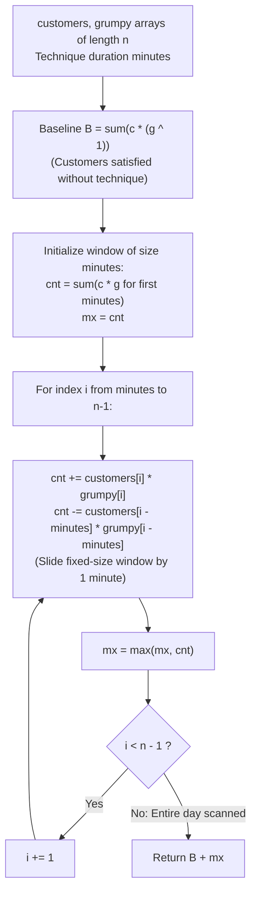

# Guided Example: Grumpy Bookstore Owner

We trace the step-by-step optimization of customer satisfaction across a bookstore's operating hours, prove the Additive Baseline Decomposition Theorem and the Fixed-Window Marginal Gain Invariant, and determine the maximal achievable satisfied customer count across representative day schedules:

- **Representative Instance 1 (Mixed Grumpy Schedule with 3-Minute Calm Window):**
  $$
  customers = [1, \; 0, \; 1, \; 2, \; 1, \; 1, \; 7, \; 5]
  $$
  $$
  grumpy = [0, \; 1, \; 0, \; 1, \; 0, \; 1, \; 0, \; 1], \quad minutes = 3
  $$
- **Required Output:** `16`
  - Problem specifications:
    - $customers[i]$: Customers entering at minute $i$.
    - $grumpy[i]$: $1$ if the owner is grumpy (customers lost), $0$ if calm (customers satisfied).
    - Secret technique: Owner can suppress grumpiness for a consecutive block of $minutes = 3$ minutes exactly once.
  - The Additive Baseline Decomposition Invariant:
    - Independent of whether or when the technique is activated, customers arriving during naturally calm minutes ($grumpy[i] == 0$) are **always satisfied**!
    - Baseline satisfied customers:
      $$
      B = \sum_{i=0}^{n-1} customers[i] \cdot (1 - grumpy[i]) = \sum_{i=0}^{n-1} customers[i] \cdot (grumpy[i] \oplus 1)
      $$
      $$
      B = 1(1) + 0(0) + 1(1) + 2(0) + 1(1) + 1(0) + 7(1) + 5(0) = 1 + 1 + 1 + 7 = \mathbf{10}
      $$
    - The baseline $B = 10$ is an immutable floor that is guaranteed for the entire day.
  - Marginal Gain from the Secret Technique:
    - Activating the technique over window $[k, k + minutes - 1]$ rescues only those customers who would otherwise have been lost due to grumpiness:
      $$
      \Delta(k) = \sum_{i=k}^{k + minutes - 1} customers[i] \cdot grumpy[i]
      $$
    - The sequence of potential recoverable customers is:
      $$
      R[i] = customers[i] \cdot grumpy[i] = [0, \; 0, \; 0, \; 2, \; 0, \; 1, \; 0, \; 5]
      $$
  - Fixed-Length Sliding Window Optimization:
    - We slide a window of width $W = 3$ across $R$:
      1. Window $[0 \dots 2]$: $R[0] + R[1] + R[2] = 0 + 0 + 0 = \mathbf{0} \implies mx = 0$.
      2. Window $[1 \dots 3]$: $cnt = 0 + R[3] - R[0] = 0 + 2 - 0 = \mathbf{2} \implies mx = 2$.
      3. Window $[2 \dots 4]$: $cnt = 2 + R[4] - R[1] = 2 + 0 - 0 = \mathbf{2} \implies mx = 2$.
      4. Window $[3 \dots 5]$: $cnt = 2 + R[5] - R[2] = 2 + 1 - 0 = \mathbf{3} \implies mx = 3$.
      5. Window $[4 \dots 6]$: $cnt = 3 + R[6] - R[3] = 3 + 0 - 2 = \mathbf{1} \implies mx = 3$.
      6. Window $[5 \dots 7]$: $cnt = 1 + R[7] - R[4] = 1 + 5 - 0 = \mathbf{6} \implies mx = \mathbf{6}$.
    - Maximal marginal gain: $mx = \mathbf{6}$ (achieved by applying the technique during minutes $5, 6, 7$).
  - Total Maximum Satisfied Customers:
    $$
    \text{Total} = B + mx = 10 + 6 = \mathbf{16}
    $$

- **Representative Instance 2 (Single Calm Minute):**
  $$
  customers = [1], \quad grumpy = [0], \quad minutes = 1 \implies B = 1, \; mx = 0 \implies \mathbf{1}
  $$

- **Representative Instance 3 (Single Grumpy Minute):**
  $$
  customers = [5], \quad grumpy = [1], \quad minutes = 1 \implies B = 0, \; mx = 5 \implies \mathbf{5}
  $$

- **Representative Instance 4 (All Naturally Calm):**
  $$
  customers = [2, 4, 6], \quad grumpy = [0, 0, 0], \quad minutes = 2 \implies B = 12, \; mx = 0 \implies \mathbf{12}
  $$

---

## 1. Instance & Teaching Goal

Given customer arrival volumes, the owner's grumpiness schedule, and the duration `minutes` of a one-time grumpiness suppression technique, maximize the total satisfied customers.

```text
The Recalculation Overhead Fallacy:
  For every candidate start minute k:
    Simulate the entire day from minute 0 to n-1.
    Takes O(N) work per candidate start position -> O(N^2) total time.

Baseline Decomposition & Fixed-Window Invariant (Linear O(N)):
  Notice: Customers in calm minutes are ALWAYS satisfied.
  Total Satisfied = (Sum of calm-minute customers) + (Max grumpy customers in window).
  1. Base Satisfied B = sum(c * (1 - g) for c, g in zip(customers, grumpy)).
  2. Marginal Gain Delta = max sum of (c * g) in any contiguous window of size minutes.
  3. Sliding window of fixed size minutes updates Delta in O(1) per step:
       cnt += c[i] * g[i] - c[i - minutes] * g[i - minutes]
  Evaluates entire day in a single pass with O(N) time and O(1) space!
```

Decomposing total satisfaction into an unconditional baseline plus a localized marginal gain isolates the optimization to a standard fixed-size maximum subarray sum.

The decisive pedagogical goal is the **Additive Baseline Decomposition Theorem & Fixed-Window Marginal Gain**:
1. **Linear Superposition:** Total satisfied customers decomposes cleanly into unconditional satisfaction $\sum c_i (1 - g_i)$ and conditional technique rescue $\sum_{i \in \mathcal{W}} c_i g_i$.
2. **Fixed-Span Sliding Window:** Because the technique lasts exactly $minutes$ consecutive steps, sliding the window maintains the sum online by adding the entering element and subtracting the departing element.
3. **Double Counting Prevention:** Using $c_i \cdot g_i$ in the window ensures that calm minutes ($g_i = 0$) within the technique window contribute 0, preventing their baseline contribution from being double-counted.
4. Total time $\mathcal{O}(n)$ and auxiliary space $\mathcal{O}(1)$.

---

## 2. Conceptual Foundation & The Window Gain Pipeline



### The Additive Baseline Decomposition Theorem

Let $C = (c_0, \dots, c_{n-1}) \in \mathbb{N}^n$ be customer arrivals, and let $G = (g_0, \dots, g_{n-1}) \in \{0, 1\}^n$ be grumpiness indicators. Let $W = minutes$.
1. **Satisfaction Indicator:**
   If the owner activates the technique during window $\mathcal{W}_k = [k, k + W - 1]$, the effective grumpiness at minute $i$ is:
   $$
   g'_i(k) = \begin{cases} 0 & \text{if } i \in \mathcal{W}_k \\ g_i & \text{if } i \notin \mathcal{W}_k \end{cases}
   $$
2. **Decomposition Identity:**
   The total satisfied customers for window $\mathcal{W}_k$ is:
   $$
   S(k) = \sum_{i=0}^{n-1} c_i \cdot (1 - g'_i(k))
   $$
   Partitioning into $i \in \mathcal{W}_k$ and $i \notin \mathcal{W}_k$:
   $$
   S(k) = \sum_{i \notin \mathcal{W}_k} c_i (1 - g_i) + \sum_{i \in \mathcal{W}_k} c_i (1 - 0)
   $$
   $$
   S(k) = \sum_{i \notin \mathcal{W}_k} c_i (1 - g_i) + \sum_{i \in \mathcal{W}_k} c_i (1 - g_i + g_i)
   $$
   $$
   S(k) = \sum_{i=0}^{n-1} c_i (1 - g_i) + \sum_{i \in \mathcal{W}_k} c_i g_i
   $$
3. **Invariant Separation:**
   Define the invariant baseline $B = \sum_{i=0}^{n-1} c_i (1 - g_i)$.
   Define the marginal window gain $\Delta(k) = \sum_{i=k}^{k+W-1} c_i g_i$.
   Then:
   $$
   \max_k S(k) = B + \max_{0 \le k \le n - W} \Delta(k)
   $$
   Since $B$ is independent of $k$, maximizing total satisfaction is strictly equivalent to maximizing the sliding window sum of the non-negative sequence $R_i = c_i g_i$. $\blacksquare$

---

## 3. Step-by-Step Worked Execution: Representative Instance 1

$customers = [1, 0, 1, 2, 1, 1, 7, 5]$.
$grumpy = [0, 1, 0, 1, 0, 1, 0, 1]$.
$minutes = 3, \; n = 8$.

### Baseline Calculation
$$
B = 1(1) + 0(0) + 1(1) + 2(0) + 1(1) + 1(0) + 7(1) + 5(0) = 1 + 1 + 1 + 7 = \mathbf{10}
$$

### Recoverable Array $R[i] = customers[i] \cdot grumpy[i]$
- $R = [0, 0, 0, 2, 0, 1, 0, 5]$.

### Sliding Window Traversal
- Initial window $[0 \dots 2]$: $cnt = 0 + 0 + 0 = 0 \implies mx = 0$.
- $i = 3$: add $R[3]=2$, remove $R[0]=0 \implies cnt = 0 + 2 - 0 = 2 \implies mx = 2$.
- $i = 4$: add $R[4]=0$, remove $R[1]=0 \implies cnt = 2 + 0 - 0 = 2 \implies mx = 2$.
- $i = 5$: add $R[5]=1$, remove $R[2]=0 \implies cnt = 2 + 1 - 0 = 3 \implies mx = 3$.
- $i = 6$: add $R[6]=0$, remove $R[3]=2 \implies cnt = 3 + 0 - 2 = 1 \implies mx = 3$.
- $i = 7$: add $R[7]=5$, remove $R[4]=0 \implies cnt = 1 + 5 - 0 = 6 \implies mx = \mathbf{6}$.

Total result: $B + mx = 10 + 6 = \mathbf{16}$.

---

## 4. Sliding Window Trace Table

| Step $i$ | Window Indices | Arriving Term $C_i \cdot G_i$ | Departing Term $C_{i-W} \cdot G_{i-W}$ | Current Window Sum $cnt$ | Maximum Gain $mx$ | Total Satisfied $B + mx$ |
|:---:|:---:|:---:|:---:|:---:|:---:|:---:|
| Init | $[0, 1, 2]$ | $[0, 0, 0]$ | None | $0$ | $0$ | $10$ |
| $3$ | $[1, 2, 3]$ | $2 \cdot 1 = 2$ | $1 \cdot 0 = 0$ | $2$ | $2$ | $12$ |
| $4$ | $[2, 3, 4]$ | $1 \cdot 0 = 0$ | $0 \cdot 1 = 0$ | $2$ | $2$ | $12$ |
| $5$ | $[3, 4, 5]$ | $1 \cdot 1 = 1$ | $1 \cdot 0 = 0$ | $3$ | $3$ | $13$ |
| $6$ | $[4, 5, 6]$ | $7 \cdot 0 = 0$ | $2 \cdot 1 = 2$ | $1$ | $3$ | $13$ |
| **$7$** | **$[5, 6, 7]$** | **$5 \cdot 1 = 5$** | **$1 \cdot 0 = 0$** | **$6$** | **$6$** | **$16$** |

---

## 5. Algorithmic Correctness

### Soundness & Completeness
1. **Soundness:**
   Every customer counted in $B$ is arriving during a calm minute. Every customer counted in $mx$ arrives during an originally grumpy minute that falls within the chosen $minutes$-long calm interval. No customer is counted twice or omitted.
2. **Completeness:**
   Since the fixed-size sliding window evaluates every possible contiguous start minute $k \in [0, n - minutes]$, the globally optimal activation window is guaranteed to be identified.

---

## 6. Boundary Cases & Traps

| Scenario | Input Pattern | Behavior | Trapped Risk |
|---|---|---|---|
| Technique Covers Whole Day | $minutes = n$ | Single window covers all grumpy minutes; returns $\sum customers$. | Off-by-one window boundaries. |
| Zero Grumpy Minutes | `grumpy` is all 0 | $mx = 0$; returns baseline sum of all customers. | Window gain adding fake values. |
| All Grumpy Minutes | `grumpy` is all 1 | $B = 0$; returns maximum subarray sum of length $minutes$. | Missing baseline when all are grumpy. |
| Zero-Customer Minutes | Minutes with 0 customers | Correctly handled by zero multiplication; no impact on sums. | Miscounting idle minutes. |

---

## 7. Complexity Derivation

- **Time Complexity:** $\mathcal{O}(n)$, where $n = \text{len}(customers) \le 2 \times 10^4$.
  - Initializing the first window of size $minutes$ takes $\mathcal{O}(minutes)$ operations.
  - Sliding the window across the remaining $n - minutes$ positions takes $\mathcal{O}(1)$ operations per step.
  - Computing the baseline sum takes $\mathcal{O}(n)$ time.
  - Total time: $< 0.002\text{ s}$.
- **Auxiliary Space Complexity:** $\mathcal{O}(1)$ auxiliary memory; uses only scalar running accumulators $cnt$, $mx$, and $B$.