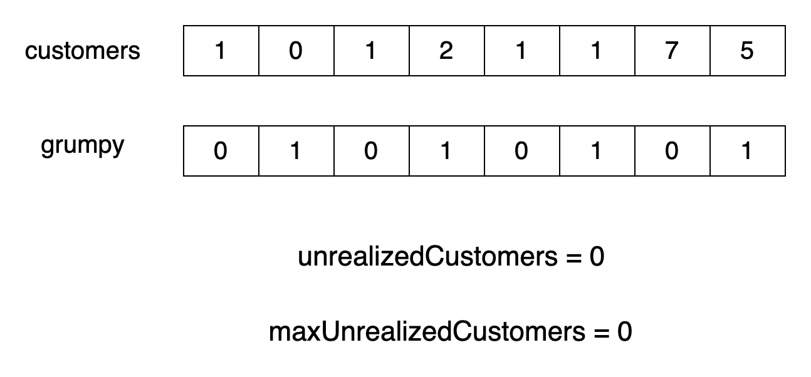
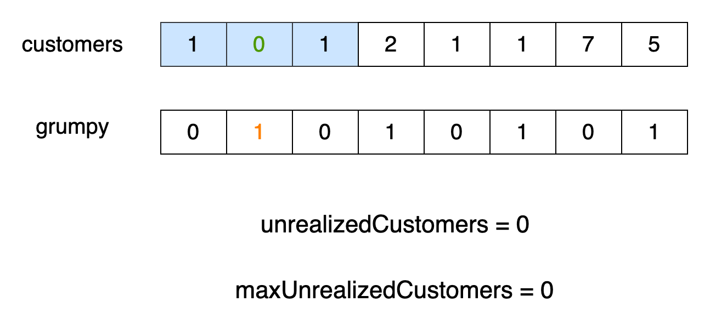
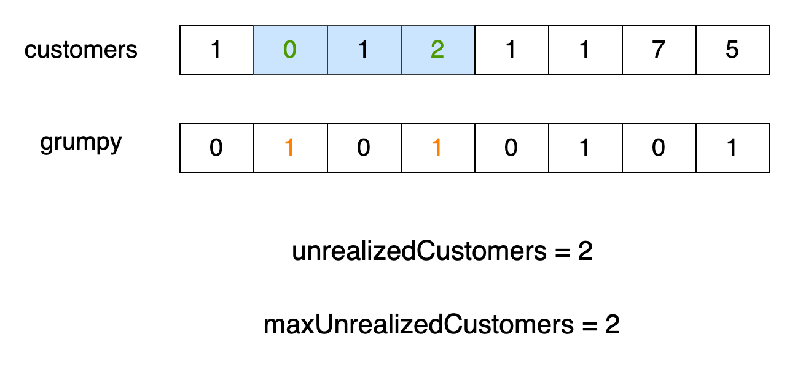
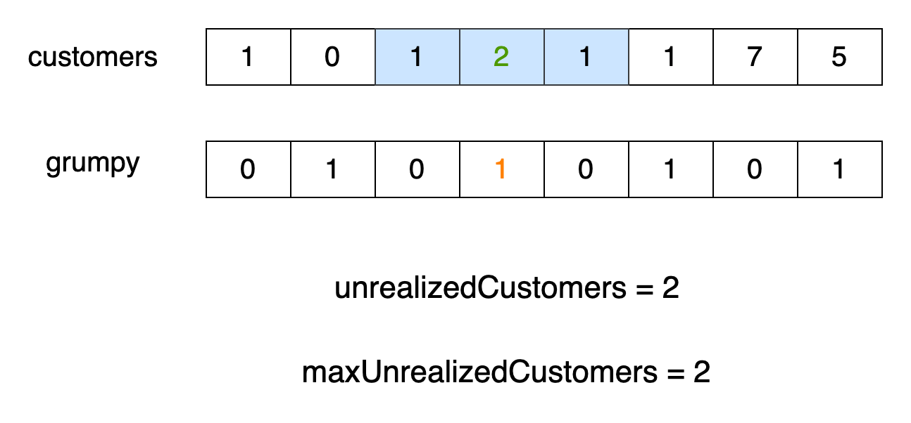
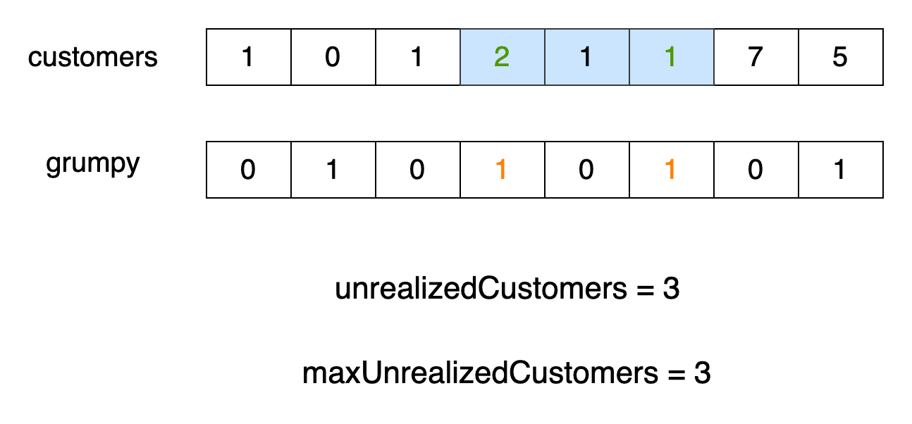
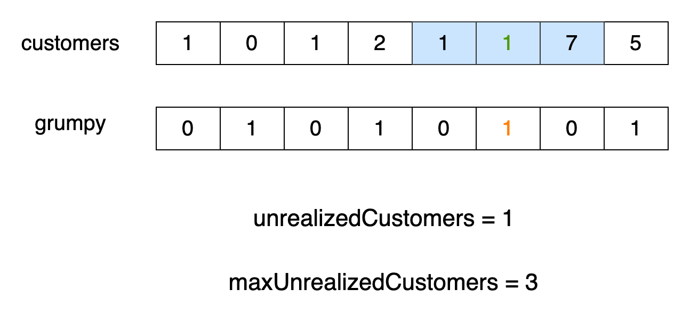
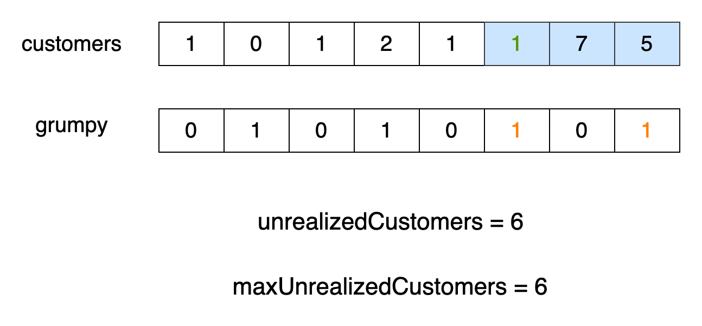

[TOC]

## Solution

---

### Overview

This problem is basically about a store owner who gets a little grumpy sometimes. Don't we all? We are in charge of helping as many customers as possible have a satisfying shopping experience.

Good news: we have all of the information needed in advance to plan the best possible schedule. The customers are scheduled to come at specific times, so we know exactly how many will be in the store at any given time. We also know all of the times of day that the bookstore owner is likely to be grumpy.

More good news: we also have **one** length of time we can prevent the manager from being grumpy during the day....maybe this is the length of time that he's drinking his coffee. Or, maybe we can think of it as when we can schedule an assistant to help with the customers.

Either way, we want to schedule this window during the time period that would save the largest number of customers from his grumpiness.

For example: Let's say we have a scenario where the bookstore owner has two grumpy minutes scheduled and we can cancel only of them. During one grumpy minute, the store has 7 customers, while during the other, it has 2. To maximize customer satisfaction, we want to counteract the grumpiness during the minute with 7 customers.

Now, how to do that?

---

### Approach 1: Sliding Window

#### Intuition

The key to solving this problem is to identify the optimal window of `minutes` during which the owner can convert grumpy minutes into non-grumpy minutes. This will maximize number of customers who will be satisfied.

How do we find this optimal window of `minutes`? One approach is to apply the window over the entire `customers` array and note the position at which the maximum number of customers could be converted from unsatisfied to satisfied. This technique is popularly called the fixed-size Sliding Window method, in which a window of fixed length moves across the array, and the impact of the window is noted at each step. This is an efficient method that maintains a window of elements and updates it incrementally as it slides, typically operating in linear time, $O(n)$.

The initial window will span from index `0` to index $minutes - 1$ in the `customers` array. This window will slide across the array until its right end reaches the last index. At each iteration, we will add the newly included customers who would have been unsatisfied due to the owner's grumpiness. Simultaneously, we will remove the customers who are no longer within the window's range. The maximum number of unsatisfied customers across all windows represents the maximum impact of the secret technique.

The algorithm is visualized in the slideshow below. The green elements in the `customers` array specify unsatisfied customers and the red elements in `grumpy` are the grumpy minutes in the window.















Finally, we can determine the maximum number of satisfied customers throughout the day by summing the customers who were initially satisfied and those who became satisfied due to the secret technique.

#### Algorithm

- Initialize variables:
  - `n` as the length of `customers` array.
  - `unrealizedCustomers` to store the number of unsatisfied customer for each window
- Calculate `unrealizedCustomers` for the initial window.
- Initialize `maxUnrealizedCustomers` with the initial window.
- Move the window over the `customers` array.
  - Add the current minute's customers if the owner is grumpy.
  - Remove the customers who entered `minutes` ago and are now out of the window's range.
  - Update `maxUnrealizedCustomers` to be the maximum value between the current `maxUnrealizedCustomers` and `unrealizedCustomers`.
- Initialize a variable `totalCustomers` to `maxUnrealizedCustomers`.
- Add all satisfied customers during the non-grumpy minutes.
- Return `totalCustomers`, which holds the total number of satisfied customers.

#### Implementation

```python
class Solution:
    def maxSatisfied(
        self, customers: List[int], grumpy: List[int], minutes: int
    ) -> int:
        n = len(customers)
        unrealized_customers = 0

        # Calculate initial number of unrealized customers in first 'minutes' window
        for i in range(minutes):
            unrealized_customers += customers[i] * grumpy[i]

        max_unrealized_customers = unrealized_customers

        # Slide the 'minutes' window across the rest of the customers array
        for i in range(minutes, n):
            # Add current minute's unsatisfied customers if the owner is grumpy
            # and remove the customers that are out of the current window
            unrealized_customers += customers[i] * grumpy[i]
            unrealized_customers -= customers[i - minutes] * grumpy[i - minutes]

            # Update the maximum unrealized customers
            max_unrealized_customers = max(
                max_unrealized_customers, unrealized_customers
            )

        # Start with maximum possible satisfied customers due to secret technique
        total_customers = max_unrealized_customers

        # Add the satisfied customers during non-grumpy minutes
        for i in range(n):
            total_customers += customers[i] * (1 - grumpy[i])

        # Return the maximum number of satisfied customers
        return total_customers
```

#### Complexity Analysis

Let $n$ be the length of the `customers` array.

- Time complexity: $O(n)$

    The algorithm loops over the entire length of `customers` twice, which takes $2 \cdot O(n)$ time. This can be simplified to a time complexity of $O(n)$.

- Space complexity: $O(1)$

    The algorithm does not use any additional data structures, so the space complexity remains $O(1)$.

---