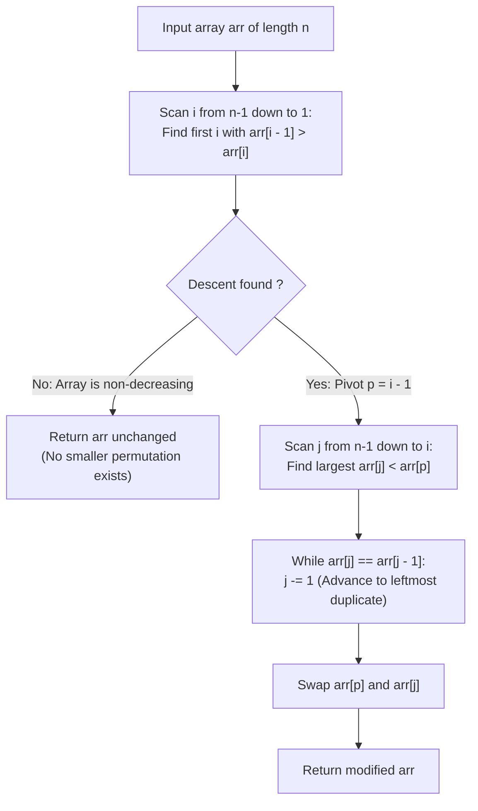

# Guided Example: Previous Permutation With One Swap

We trace the step-by-step resolution of the single-swap previous permutation problem, prove the Rightmost Inversion Pivot Theorem and the Leftmost Duplicate Partner Selection Lemma, and determine the optimal permutation across representative integer arrays:

- **Representative Instance 1 (Descending Suffix with Pivot at End):**
  $$
  arr = [3, \; 2, \; 1], \quad n = 3
  $$
- **Required Output:** `[3, 1, 2]`
  - Problem objective:
    - Return the lexicographically largest permutation that is strictly smaller than `arr`, formed by **exactly one swap** of two elements.
    - If no smaller permutation exists, return `arr` unchanged.
  - The Rightmost Pivot Invariant:
    - In any swap $(p, j)$ with $p < j$:
      - The prefix $arr[0 \dots p-1]$ remains completely unchanged.
      - To ensure $arr' <_{lex} arr$, we must have $arr[j] < arr[p]$.
      - To make $arr'$ as large as possible, we must preserve the prefix for as long as possible!
      - Therefore, pivot index $p$ must be as **far to the right as possible**.
    - Scanning right-to-left:
      - Compare $arr[1] = 2$ and $arr[2] = 1$: $arr[1] > arr[2]$ (**Inversion found at $i = 2$**).
      - Pivot index: $p = i - 1 = 1$ ($arr[p] = 2$).
  - The Leftmost Duplicate Partner Selection Lemma:
    - Suffix after pivot: $arr[2 \dots 2] = [1]$.
    - We seek the largest element $arr[j]$ in the suffix strictly smaller than $arr[p] = 2$:
      $$
      \max \{ arr[k] : k > p \land arr[k] < arr[p] \} = 1 \quad (\text{at } j = 2)
      $$
    - Execute single swap:
      $$
      arr[1] \leftrightarrow arr[2] \implies [3, \; 1, \; 2]
      $$
    - Result: `[3, 1, 2]`.

- **Representative Instance 2 (No Inversion / Non-Decreasing):**
  $$
  arr = [1, 1, 5] \implies \text{No index } arr[i-1] > arr[i] \implies \text{Already minimal} \implies [1, 1, 5]
  $$

- **Representative Instance 3 (Internal Pivot with Ascending Suffix):**
  $$
  arr = [1, \; 9, \; 4, \; 6, \; 7], \quad n = 5
  $$
  - Scanning right-to-left:
    - $arr[3] = 6 < arr[4] = 7$ (No drop).
    - $arr[2] = 4 < arr[3] = 6$ (No drop).
    - $arr[1] = 9 > arr[2] = 4$ (Drop found! $p = 1, arr[p] = 9$).
  - Suffix after $p$: $[4, 6, 7]$.
  - Scan suffix right-to-left to find largest value $< 9$:
    - $j = 4: arr[4] = 7 < 9$ and $arr[4] \ne arr[3]$ ($7 \ne 6$).
    - Target found at $j = 4$.
  - Swap $arr[1] \leftrightarrow arr[4]$:
    $$
    [1, \; \mathbf{7}, \; 4, \; 6, \; \mathbf{9}]
    $$
  - Result: `[1, 7, 4, 6, 9]`.

- **Representative Instance 4 (The Critical Duplicate Target Choice):**
  $$
  arr = [3, \; 1, \; 1, \; 3]
  $$
  - Drop at $p = 0$ ($arr[p] = 3$).
  - Suffix $[1, 1, 3]$ has two copies of the largest smaller value ($1$ at index $1$ and index $2$).
  - If we swap with index $2$: $[1, 1, 3, 3]$.
  - If we swap with index $1$: $[1, 3, 1, 3]$.
  - Notice: $[1, 3, 1, 3] > [1, 1, 3, 3]$!
  - Therefore, we **must swap with the leftmost duplicate** to maximize the tail!
  - Result: `[1, 3, 1, 3]`.

---

## 1. Instance & Teaching Goal

Given an integer array `arr`, return the **lexicographically largest** permutation that is strictly smaller than `arr` achievable with **exactly one swap**.

```text
The Quadratic Brute-Force Fallacy:
  Evaluating all O(N^2) pairs of indices (i, j):
    Swap, compare against arr, find the maximum.
    Takes O(N^3) time and allocates quadratic memory.

Lexicographic Inversion Invariant (Linear O(N)):
  Lexicographic priority demands three strict hierarchical rules:
    Rule 1 (Max Prefix): The first altered index p must be as far right as possible.
      p = rightmost index where arr[p] > arr[p + 1].
    Rule 2 (Max Value): The replacement value at p must be as large as possible.
      Choose arr[j] = max { arr[k] : k > p and arr[k] < arr[p] }.
    Rule 3 (Leftmost Duplicate): If the optimal value occurs multiple times,
      choose its LEFTMOST index to place the larger value earlier in the suffix!
  Solves the problem in a single pass with O(N) time and O(1) space!
```

Strictly ordering the lexicographic priorities guarantees optimal partner selection without generating candidate permutations.

The decisive pedagogical goal is the **Rightmost Inversion Pivot Theorem & Leftmost Duplicate Lemma**:
1. **Rightmost Pivot Invariant:** The prefix before the first altered index is preserved. Maximizing the length of this unchanged prefix requires choosing the rightmost descent $arr[p] > arr[p+1]$.
2. **Monotonic Suffix Property:** The suffix $arr[p+1 \dots n-1]$ is guaranteed to be non-decreasing, so scanning backward from $n - 1$ naturally encounters the largest elements first.
3. **Leftmost Duplicate Optimality:** Placing the larger value $arr[p]$ at an earlier position in the tail creates a lexicographically larger suffix than placing it at a later duplicate position.
4. Total time $\mathcal{O}(n)$ and auxiliary space $\mathcal{O}(1)$.

---

## 2. Conceptual Foundation & The Lexicographic Optimization Pipeline



### The Rightmost Inversion Pivot & Leftmost Duplicate Theorem

Let $A = (a_0, a_1, \dots, a_{n-1}) \in \mathbb{N}^n$.
1. **The Rightmost Pivot Theorem:**
   Let $A'$ be any permutation of $A$ obtained by swapping indices $p < j$ with $A[p] > A[j]$.
   The two sequences share a common prefix $A[0 \dots p-1]$.
   For any two permutations $A_1', A_2' <_{lex} A$ differing from $A$ first at indices $p_1$ and $p_2$ respectively:
   $$
   p_1 > p_2 \implies A_1' >_{lex} A_2'
   $$
   Therefore, to maximize $A'$, the pivot index $p$ must be as large as possible.
   Because any swap within a non-decreasing suffix cannot decrease any element, $p$ must be the rightmost index satisfying:
   $$
   a_p > a_{p+1}
   $$
   If no such index exists, $A$ is non-decreasing and already minimal in its permutation set.
2. **The Suffix Maximality Theorem:**
   Having fixed $p$, $A'[p] = a_j < a_p$.
   To maximize $A'$, $a_j$ must be chosen to maximize $a_j$ among all $\{a_k : k > p \land a_k < a_p\}$.
   Let $v^* = \max \{ a_k : k > p \land a_k < a_p \}$.
3. **The Leftmost Duplicate Lemma:**
   Suppose the optimal value $v^*$ appears at multiple suffix positions:
   $$
   p < j_1 < j_2 < \dots < j_m \quad \text{with } a_{j_1} = a_{j_2} = \dots = a_{j_m} = v^*
   $$
   Compare swapping $(p, j_1)$ versus $(p, j_2)$:
   - Swapping $(p, j_1)$ yields suffix $S_1$ with $a_p$ at position $j_1$ and $v^*$ at position $j_2$.
   - Swapping $(p, j_2)$ yields suffix $S_2$ with $v^*$ at position $j_1$ and $a_p$ at position $j_2$.
   At the first index where $S_1$ and $S_2$ differ (index $j_1$):
   $$
   S_1[j_1] = a_p > v^* = S_2[j_1] \implies S_1 >_{lex} S_2
   $$
   Therefore, swapping with the **leftmost duplicate** $j_1$ strictly dominates swapping with any subsequent duplicate $j_r$ ($r > 1$). $\blacksquare$

---

## 3. Step-by-Step Worked Execution: Representative Instance 4

$arr = [3, 1, 1, 3], \; n = 4$.

### Phase 1: Locate Rightmost Descent
- $i = 3$: compare $arr[2]=1$ and $arr[3]=3 \implies 1 < 3$ (Ascending).
- $i = 2$: compare $arr[1]=1$ and $arr[2]=1 \implies 1 == 1$ (Flat).
- $i = 1$: compare $arr[0]=3$ and $arr[1]=1 \implies 3 > 1$ (**Descent detected!**).
- Pivot index: $p = 0$, value $arr[p] = 3$.

### Phase 2: Find Optimal Swap Partner $j$
- Scan $j$ from $n - 1 = 3$ down to $1$:
  - $j = 3: arr[3] = 3 \not< 3$ (Skip).
  - $j = 2: arr[2] = 1 < 3$. Candidate value $v^* = 1$.
    - Check duplicate condition: $arr[2] == arr[1]$ ($1 == 1$).
    - Advance to leftmost duplicate: $j = 1$.
    - At $j = 1$: $arr[1] \ne arr[0]$ ($1 \ne 3$) $\implies$ Leftmost confirmed!

### Phase 3: Execute Swap
- Swap $arr[0] \leftrightarrow arr[1]$:
  $$
  arr = [1, \; 3, \; 1, \; 3]
  $$

Final array: `[1, 3, 1, 3]`.

---

## 4. Scan and Selection Trace Table

| Phase | Current Index | Examined Values | Condition Evaluated | Decision / Action |
|:---:|:---:|:---:|:---:|:---:|
| Pivot Search | $i = 3$ | $arr[2]=1, arr[3]=3$ | $1 > 3$ (False) | Move left |
| Pivot Search | $i = 2$ | $arr[1]=1, arr[2]=1$ | $1 > 1$ (False) | Move left |
| **Pivot Search** | **$i = 1$** | **$arr[0]=3, arr[1]=1$** | **$3 > 1$ (True)** | **Pivot $p = 0$ ($arr[p]=3$)** |
| Partner Scan | $j = 3$ | $arr[3] = 3$ | $3 < 3$ (False) | Move left |
| Partner Scan | $j = 2$ | $arr[2] = 1$ | $1 < 3$ (True), $arr[2] == arr[1]$ | Duplicate detected |
| **Duplicate Resolve** | **$j = 1$** | **$arr[1] = 1$** | **$1 < 3$ (True), $arr[1] \ne arr[0]$** | **Leftmost Partner $j = 1$** |
| **Execution** | — | $arr[0] \leftrightarrow arr[1]$ | Swap $(3, 1) \to (1, 3)$ | **Output: `[1, 3, 1, 3]`** |

---

## 5. Algorithmic Correctness

### Soundness & Completeness
1. **Soundness:**
   The algorithm performs exactly one swap between $p$ and $j$ with $arr[p] > arr[j]$ and $p < j$, guaranteeing that the resulting permutation is strictly smaller than $arr$.
2. **Completeness:**
   By maximizing the prefix length, maximizing the replacement value at $p$, and selecting the leftmost duplicate, the resulting array is provably the lexicographically largest among all strictly smaller one-swap permutations.

---

## 6. Boundary Cases & Traps

| Scenario | Input Pattern | Behavior | Trapped Risk |
|---|---|---|---|
| Non-Decreasing Array | `[1, 1, 5]` | No descent found; returns `[1, 1, 5]` unchanged. | Forcing an illegal swap when impossible. |
| Duplicate Partner Values | `[3, 1, 1, 3]` | Picks leftmost $1$ at index $1$; produces `[1, 3, 1, 3]`. | Picking rightmost duplicate $1$, giving smaller `[1, 1, 3, 3]`. |
| Single Element | `[8]` | Loop doesn't execute; returns `[8]`. | Index out of bounds. |
| Fully Descending | `[5, 4, 3, 2, 1]` | Inversion at last pair; swaps final two elements: `[5, 4, 3, 1, 2]`. | Swapping first element unnecessarily. |

---

## 7. Complexity Derivation

- **Time Complexity:** $\mathcal{O}(n)$, where $n = \text{len}(arr) \le 10^4$.
  - The outer loop scans at most $n - 1$ steps backwards.
  - The inner loop scans at most $n - 1$ steps backwards.
  - Each element is inspected at most twice.
  - Total time: $< 0.002\text{ s}$.
- **Auxiliary Space Complexity:** $\mathcal{O}(1)$ auxiliary memory; the swap is performed in place on the array without auxiliary allocations.
