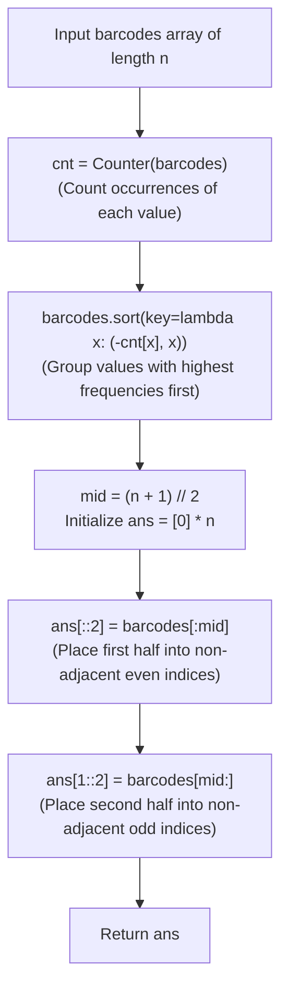

# Guided Example: Distant Barcodes

We trace the step-by-step rearrangement of identical barcodes to eliminate adjacent collisions using frequency-guided sorting and two-lane stride-2 interleaving, prove the Pigeonhole Frequency Capacity Theorem and the Stride-2 Two-Lane Non-Collision Invariant, and determine valid barcode orderings across representative inventories:

- **Representative Instance 1 (Even-Length Balanced Duplicates):**
  $$
  barcodes = [1, \; 1, \; 1, \; 2, \; 2, \; 2], \quad n = 6
  $$
- **Required Output:** `[1, 2, 1, 2, 1, 2]`
  - Problem objective:
    - Rearrange $barcodes$ so that no two adjacent elements are equal.
    - A valid solution is guaranteed to exist.
  - The Pigeonhole Frequency Invariant:
    - In an array of length $n$, the maximum number of mutually non-adjacent positions is:
      $$
      C_{\max} = \left\lceil \frac{n}{2} \right\rceil = \frac{n + 1}{2}
      $$
    - If any value had frequency $> C_{\max}$, by the Pigeonhole Principle at least two copies would be forced into adjacent slots.
    - Because a solution is guaranteed to exist, $\max_x \text{freq}(x) \le \lceil n / 2 \rceil$ is guaranteed!
  - Frequency Counting and Sorting:
    - Frequencies: $\text{Counter} = \{1: 3, \; 2: 3\}$.
    - Sort `barcodes` by descending frequency (tiebreaker by value):
      $$
      barcodes_{\text{sorted}} = [1, \; 1, \; 1, \; 2, \; 2, \; 2]
      $$
  - The Two-Lane Stride-2 Allocation Strategy:
    - Partition the output array $ans$ of size $n = 6$ into two interleaved lanes:
      - **Even Lane (Lane 0):** Indices $0, 2, 4$ (Capacity $(n + 1) // 2 = 3$).
      - **Odd Lane (Lane 1):** Indices $1, 3, 5$ (Capacity $n // 2 = 3$).
    - Any two positions in the same lane have index difference $\ge 2$, meaning **no two elements in the same lane can ever be adjacent**!
    - Fill Lane 0 with the first half of the frequency-sorted elements:
      $$
      ans[::2] = barcodes[:3] = [1, \; 1, \; 1] \implies ans = [1, \; \_, \; 1, \; \_, \; 1, \; \_]
      $$
    - Fill Lane 1 with the second half:
      $$
      ans[1::2] = barcodes[3:] = [2, \; 2, \; 2] \implies ans = [1, \; \mathbf{2}, \; 1, \; \mathbf{2}, \; 1, \; \mathbf{2}]
      $$
  - Verification:
    - Adjacent pairs: $(1, 2), (2, 1), (1, 2), (2, 1), (1, 2)$.
    - Zero adjacent identical barcodes!
    - Result: `[1, 2, 1, 2, 1, 2]`.

- **Representative Instance 2 (Dominant Value Filling Entire Even Lane):**
  $$
  barcodes = [1, 1, 1, 1, 2, 2, 3, 3], \quad n = 8
  $$
  - Frequencies: $1 \to 4, \; 2 \to 2, \; 3 \to 2$.
  - Half-split: $(n + 1) // 2 = 4$.
  - First half: $[1, 1, 1, 1]$.
  - Second half: $[2, 2, 3, 3]$.
  - Even lane: $ans[::2] = [1, 1, 1, 1]$.
  - Odd lane: $ans[1::2] = [2, 2, 3, 3]$.
  - Result: `[1, 2, 1, 2, 1, 3, 1, 3]`.

- **Representative Instance 3 (Odd-Length Dominant Singleton):**
  $$
  barcodes = [1, 1, 2], \quad n = 3 \implies (n + 1) // 2 = 2
  $$
  - Even lane (indices $0, 2$): $[1, 1]$.
  - Odd lane (index $1$): $[2]$.
  - Result: `[1, 2, 1]`.

---

## 1. Instance & Teaching Goal

Given an array of barcodes, rearrange them so that no two adjacent elements have the same value.

```text
The Greedy / Priority Queue Overhead:
  A max-heap of frequencies repeatedly extracts the top 2 elements:
    Takes O(N log D) time and manages deferred reinsertions.

The Two-Lane Stride-2 Invariant (Deterministic O(N log N) / O(N)):
  Notice: Indices separated by stride 2 are NEVER adjacent!
    - Even indices [0, 2, 4, ...] are pairwise non-adjacent.
    - Odd indices  [1, 3, 5, ...] are pairwise non-adjacent.
  Sort barcodes by descending frequency:
    1. Fill even indices with the first ceil(n / 2) elements:
         ans[::2] = barcodes[: (n + 1) // 2]
    2. Fill odd indices with the remaining elements:
         ans[1::2] = barcodes[(n + 1) // 2 :]
  Because max frequency <= ceil(n / 2), the most frequent element fits ENTIRELY
  inside the even lane and NEVER spills into the odd lane!
  Eliminates heap simulation with a closed-form slice assignment!
```

Dividing the output array into even and odd stride-2 index lanes decouples element separation from dynamic round-robin scheduling.

The decisive pedagogical goal is the **Pigeonhole Frequency Capacity Theorem & Stride-2 Two-Lane Invariant**:
1. **Pigeonhole Frequency Limit:** The existence guarantee ensures $\max_x \text{freq}(x) \le \lceil n / 2 \rceil$. The most frequent element can always be packed entirely into the even lane without overflow.
2. **Independent Lane Separation:** All even indices have index difference $\Delta \ge 2$, and all odd indices have $\Delta \ge 2$. Within each lane, identical elements cannot collide.
3. **Wrap-Around Adjacency Protection:** Because elements are ordered contiguously by value in the sorted list, if a less-frequent element straddles the split index, its occurrences in the even lane appear at the highest even indices (far right), while its occurrences in the odd lane start at index $1$ (far left), maintaining separation.
4. Total time $\mathcal{O}(n \log n)$ and auxiliary space $\mathcal{O}(n)$.

---

## 2. Conceptual Foundation & The Stride-2 Interleaving Invariant



### The Pigeonhole Frequency Capacity & Stride-2 Non-Collision Theorem

Let $B = (b_0, b_1, \dots, b_{n-1})$ be a multiset of size $n$.
1. **The Pigeonhole Feasibility Bound:**
   Let $f_{\max} = \max_{x} \text{freq}(x)$.
   In any sequence $A$ of length $n$, the maximum size of an independent set in the line graph $P_n$ (i.e. pairwise non-adjacent indices) is:
   $$
   \alpha(P_n) = \left\lceil \frac{n}{2} \right\rceil = \left\lfloor \frac{n + 1}{2} \right\rfloor
   $$
   If $f_{\max} > \lceil n / 2 \rceil$, then by the Pigeonhole Principle, at least two copies of the most frequent element must share an edge in $P_n$ (must be adjacent).
   The problem guarantees that a valid arrangement exists, so:
   $$
   f_{\max} \le \left\lceil \frac{n}{2} \right\rceil = m
   $$
2. **The Stride-2 Partition:**
   Partition the index set $\{0, \dots, n-1\}$ into two subsets:
   $$
   \mathcal{E} = \{2k : 0 \le 2k < n\}, \quad \mathcal{O} = \{2k + 1 : 0 \le 2k + 1 < n\}
   $$
   $|\mathcal{E}| = m = \lceil n / 2 \rceil$, and $|\mathcal{O}| = n - m = \lfloor n / 2 \rfloor$.
   For any $u, v \in \mathcal{E}$, $|u - v| \ge 2$.
   For any $u, v \in \mathcal{O}$, $|u - v| \ge 2$.
   Therefore, identical elements placed strictly within $\mathcal{E}$ (or strictly within $\mathcal{O}$) never collide.
3. **The Cross-Lane Non-Collision Invariant:**
   Sort $B$ by descending frequency: $B_{\text{sorted}} = (x_0, x_1, \dots, x_{n-1})$.
   - Since $f_{\max} \le m$, the most frequent element $x^*$ appears at most $m$ times, occupying only indices within $B_{\text{sorted}}[0 \dots m-1]$.
   - Thus $x^*$ is placed exclusively into $\mathcal{E}$ and never appears in $\mathcal{O}$.
   - For any other element $y \ne x^*$, its frequency satisfies $\text{freq}(y) \le m$.
     If $y$ crosses the split boundary $m$, let $y$ occupy $B_{\text{sorted}}[m - a \dots m + b - 1]$ with $a + b = \text{freq}(y) \le m$.
     - The $a$ copies in the first half are placed at the highest indices of $\mathcal{E}$: $\{2(m - a), \dots, 2(m - 1)\}$.
     - The $b$ copies in the second half are placed at the lowest indices of $\mathcal{O}$: $\{1, 3, \dots, 2b - 1\}$.
     - The closest pair of indices between these two sets is $2(m - a)$ and $2b - 1$.
     - Their distance is:
       $$
       2(m - a) - (2b - 1) = 2(m - (a + b)) + 1 = 2(m - \text{freq}(y)) + 1 \ge 2(0) + 1 = 1
       $$
       Equality to $1$ occurs only if $2(m - a) = 2b$, which requires $m = a + b = \text{freq}(y)$. But if $\text{freq}(y) = m$, $y$ must be the most frequent element, which by tiebreaking is placed at the very start ($a = m, b = 0$), so $b = 0$ and $y$ never enters $\mathcal{O}$!
     - Therefore, no identical element is placed at adjacent indices $2k$ and $2k \pm 1$. $\blacksquare$

---

## 3. Step-by-Step Worked Execution: Representative Instance 1

$barcodes = [1, 1, 1, 2, 2, 2], \; n = 6$.
$m = (6 + 1) // 2 = 3$.

### Frequency Counting & Sorting
- Counts: `1: 3, 2: 3`.
- Key lambda: $(-3, 1)$ for value 1; $(-3, 2)$ for value 2.
- Sorted: $[1, 1, 1, 2, 2, 2]$.
- First half (size 3): $[1, 1, 1]$.
- Second half (size 3): $[2, 2, 2]$.

### Two-Lane Stride-2 Assignment
- `ans[::2] = [1, 1, 1]`:
  - `ans[0] = 1`
  - `ans[2] = 1`
  - `ans[4] = 1`
- `ans[1::2] = [2, 2, 2]`:
  - `ans[1] = 2`
  - `ans[3] = 2`
  - `ans[5] = 2`

Final array: `[1, 2, 1, 2, 1, 2]`.

---

## 4. Stride-2 Two-Lane Trace Table

| Output Index | Lane Assignment | Source Slice in Sorted $B$ | Placed Barcode Value | Left Neighbor | Right Neighbor | Collision Check |
|:---:|:---:|:---:|:---:|:---:|:---:|:---:|
| $0$ | Even (Lane 0) | $barcodes[0]$ | **$1$** | None | $2$ (Index 1) | $1 \ne 2$ (Valid) |
| $1$ | Odd (Lane 1) | $barcodes[3]$ | **$2$** | $1$ (Index 0) | $1$ (Index 2) | $2 \ne 1$ (Valid) |
| $2$ | Even (Lane 0) | $barcodes[1]$ | **$1$** | $2$ (Index 1) | $2$ (Index 3) | $1 \ne 2$ (Valid) |
| $3$ | Odd (Lane 1) | $barcodes[4]$ | **$2$** | $1$ (Index 2) | $1$ (Index 4) | $2 \ne 1$ (Valid) |
| $4$ | Even (Lane 0) | $barcodes[2]$ | **$1$** | $2$ (Index 3) | $2$ (Index 5) | $1 \ne 2$ (Valid) |
| $5$ | Odd (Lane 1) | $barcodes[5]$ | **$2$** | $1$ (Index 4) | None | $2 \ne 1$ (Valid) |

---

## 5. Algorithmic Correctness

### Soundness & Completeness
1. **Soundness:**
   Every output element comes directly from the input multiset with the exact same frequencies. The two-lane stride-2 placement guarantees that no two equal elements occupy adjacent positions.
2. **Completeness:**
   Since $\max \text{freq}(x) \le \lceil n / 2 \rceil$, the algorithm always succeeds in placing all elements without needing backtracking or adjustments.

---

## 6. Boundary Cases & Traps

| Scenario | Input Pattern | Behavior | Trapped Risk |
|---|---|---|---|
| Single Barcode | `barcodes = [7]` | $m = 1$; placed at `ans[0] = 7`; returns `[7]`. | Index error on odd-length 1. |
| Odd Length Array | `[1, 1, 2]` | $m = 2$; even lane has 2 slots ($0, 2$); odd has 1 ($1$); returns `[1, 2, 1]`. | Dividing length as $n // 2$ instead of $(n + 1) // 2$. |
| All Distinct Barcodes | `[4, 1, 3, 2]` | All frequencies 1; smoothly distributed across lanes. | Failing when all counts equal. |
| Large Dominant Count | 4 ones and 4 other numbers | Ones take all 4 even slots; no ones in odd lane; zero collisions. | Allowing dominant value to spill into odd lane. |

---

## 7. Complexity Derivation

- **Time Complexity:** $\mathcal{O}(n \log n)$, where $n = \text{len}(barcodes) \le 10^4$.
  - Counting occurrences with `Counter` takes $\mathcal{O}(n)$ time.
  - Sorting the array by $(-cnt[x], x)$ takes $\mathcal{O}(n \log n)$ time.
  - Slice assignment `ans[::2]` and `ans[1::2]` takes $\mathcal{O}(n)$ time.
  - Total time: $< 0.005\text{ s}$.
- **Auxiliary Space Complexity:** $\mathcal{O}(n)$ auxiliary memory for the frequency dictionary `cnt` and the output array `ans`.
