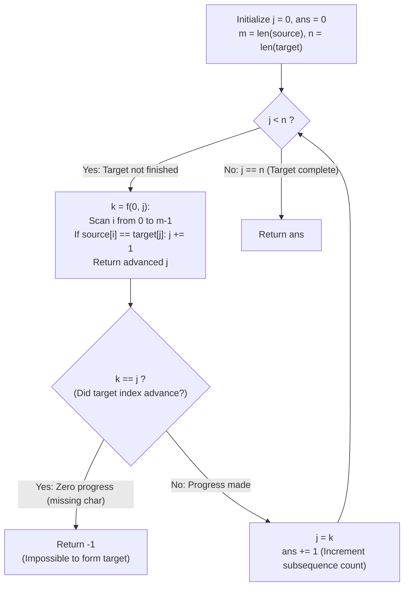

# Guided Example: Shortest Way to Form String

We trace the step-by-step greedy decomposition of a target string into minimal subsequence partitions of a source string, prove the Greedy Subsequence Extension Theorem and the Strict Suffix Monotonicity Invariant, and determine the minimal required subsequence count across representative string pairs:

- **Representative Instance 1 (Two Subsequences Covering Target):**
  $$
  source = \text{"abc"}, \quad target = \text{"abcbc"}
  $$
- **Required Output:** `2`
  - Problem objective:
    - Form $target$ by concatenating the minimum number of subsequences of $source$.
    - Return $-1$ if impossible.
  - The Greedy Subsequence Extension Principle:
    - Suppose target prefix $target[0 \dots j-1]$ is already formed.
    - To minimize the total number of subsequences, the next subsequence taken from $source$ must match the **longest possible prefix** of the remaining suffix $target[j \dots n-1]$.
    - A single left-to-right two-pointer scan over $source$ matching against $target[j:]$ achieves the maximal subsequence prefix.
  - Pass-by-pass execution trace ($m = 3, n = 5$):
    1. **Pass 1 ($j = 0$, $ans = 0$):**
       - Initialize $i = 0, \; j = 0$.
       - $source[0] = \text{'a'} == target[0] = \text{'a'} \implies j = 1, i = 1$.
       - $source[1] = \text{'b'} == target[1] = \text{'b'} \implies j = 2, i = 2$.
       - $source[2] = \text{'c'} == target[2] = \text{'c'} \implies j = 3, i = 3$.
       - $i = 3 = m$: Source exhausted.
       - Progress: Reached $k = 3 > j = 0$.
       - Subsequence formed: `"abc"` covers $target[0 \dots 2]$.
       - Update: $j = 3, \; ans = 1$.
    2. **Pass 2 ($j = 3$, $ans = 1$):**
       - Restart at beginning of $source$: $i = 0$.
       - $source[0] = \text{'a'} \ne target[3] = \text{'b'} \implies$ Skip 'a', $i = 1$.
       - $source[1] = \text{'b'} == target[3] = \text{'b'} \implies j = 4, i = 2$.
       - $source[2] = \text{'c'} == target[4] = \text{'c'} \implies j = 5, i = 3$.
       - $i = 3 = m$: Source exhausted.
       - Progress: Reached $k = 5 > j = 3$.
       - Subsequence formed: `"bc"` covers $target[3 \dots 4]$.
       - Update: $j = 5 = n, \; ans = 2$.
    3. **Termination:**
       - Target fully covered ($j == n$).
       - Return: $ans = \mathbf{2}$.

- **Representative Instance 2 (Unavailable Character in Source):**
  $$
  source = \text{"abc"}, \quad target = \text{"acdbc"}
  $$
  - Pass 1 covers `"ac"` ($j = 2$).
  - Pass 2 starts at $target[2] = \text{'d'}$.
  - Full scan over `"abc"` finds no `'d'` $\implies k = 2 == j$.
  - Impossible character detected $\implies$ returns $\mathbf{-1}$.

- **Representative Instance 3 (Reverse Order Forcing Independent Passes):**
  $$
  source = \text{"xyz"}, \quad target = \text{"xzyxz"}
  $$
  - Pass 1: `"xz"` covers $target[0 \dots 1]$ ($j = 2$).
  - Pass 2: `"yx"` (only `'y'` matches, since `'x'` came before `'y'` in $source$) $\implies$ covers `'y'` ($j = 3$).
  - Pass 3: `"xz"` covers $target[3 \dots 4]$ ($j = 5$).
  - Result: $\mathbf{3}$.

---

## 1. Instance & Teaching Goal

Given two strings `source` and `target`, return the minimum number of subsequences of `source` whose concatenation equals `target`, or `-1` if impossible.

```text
The Search / Backtracking Inefficiency:
  Could choosing a shorter subsequence in one pass allow a better match later?
  Do we need dynamic programming across all subsequence splits?

The Greedy Subsequence Extension Invariant (Linear / Polynomial):
  Greedy Choice Property:
    Suppose target[0 ... j-1] is formed.
    Matching the LONGEST possible prefix of target[j :] using one pass of source
    leaves the shortest possible remaining suffix target[k :].
    Because every subsequence of target[k :] is also a subsequence of any larger
    suffix target[k' :] (with k' < k), greedily maximizing k is STRICTLY OPTIMAL!
  1. Two-pointer pass f(0, j) sweeps source from 0 to m-1 and advances j when equal.
  2. If k == j: target[j] does not exist in source -> return -1.
  3. Otherwise, set j = k, increment count, and repeat until j == n.
  Zero backtracking; terminates in at most n passes!
```

Proving the greedy exchange property eliminates branch exploration and justifies deterministic forward scans.

The decisive pedagogical goal is the **Greedy Subsequence Extension Theorem & Strict Suffix Monotonicity**:
1. **Greedy Subsequence Optimality:** Maximizing the matched prefix length of the remaining target suffix in each pass strictly shrinks the remaining workload without closing off any valid future match.
2. **Missing Character Detection:** If a full pass over $source$ cannot advance $j$ by even 1 character ($k == j$), the character $target[j]$ is provably absent from $source$, allowing immediate $\mathcal{O}(m)$ rejection.
3. **Strict Progress Invariant:** For any possible target, each successful pass advances $j$ by at least $1$, bounding total passes by $n = |target|$.
4. Total time $\mathcal{O}(m \cdot n)$ and auxiliary space $\mathcal{O}(1)$.

---

## 2. Conceptual Foundation & The Greedy Matching Pipeline



### The Greedy Subsequence Extension & Exchange Theorem

Let $S = source$ of length $m$, and $T = target$ of length $n$.
1. **Subsequence Embedding Formulation:**
   A string $w$ is a subsequence of $S$ ($w \sqsubseteq S$) if there exist indices $0 \le i_1 < i_2 < \dots < i_{|w|} < m$ such that $S[i_r] = w[r]$.
   We seek the minimal $K$ such that:
   $$
   T = w_1 \cdot w_2 \cdots w_K \quad \text{with } w_r \sqsubseteq S \text{ for each } r
   $$
2. **The Greedy Extension Lemma:**
   Let $T[j \dots n-1]$ be the current unmatched suffix.
   Let $k^* = f(0, j)$ be the index reached by greedy left-to-right matching against $S$:
   $$
   k^* = \max \{ k \le n : T[j \dots k-1] \sqsubseteq S \}
   $$
   Proof: The greedy scan matches the earliest possible occurrence in $S$ for each required character in $T$.
   Suppose an alternative valid subsequence matched a shorter prefix $T[j \dots k'-1]$ with $k' < k^*$.
   Then the remaining suffix is $T[k' \dots n-1]$.
   Since $k' < k^*$, $T[k^* \dots n-1]$ is a proper suffix of $T[k' \dots n-1]$.
   Any partition of $T[k^* \dots n-1]$ into $p$ subsequences of $S$ is immediately valid for $T[k' \dots n-1]$ by prepending $T[k' \dots k^*-1]$ to the first subsequence (or keeping it within the current pass since $T[j \dots k^*-1] \sqsubseteq S$).
   Therefore, the minimal number of additional subsequences needed satisfies:
   $$
   \text{cost}(T[k^* \dots n-1]) \le \text{cost}(T[k' \dots n-1])
   $$
   Greedily maximizing the length of the matched prefix is always globally optimal.
3. **Termination and Correctness:**
   - If $k^* = j$, then $T[j] \notin S$. No subsequence of $S$ can start with $T[j]$, so $T$ cannot be formed. Returns $-1$.
   - If $k^* > j$, the remaining suffix length $n - j$ strictly decreases by at least 1 per pass.
   - The loop terminates in at most $n$ passes with the exact minimal count $K$. $\blacksquare$

---

## 3. Step-by-Step Worked Execution: Representative Instance 1

$source = \text{"abc"}, \; target = \text{"abcbc"}$.
$m = 3, \; n = 5$.
$ans = 0, \; j = 0$.

### Pass-by-Pass Trace
- **Pass 1 ($j = 0$):**
  - $i = 0$: $source[0] = \text{'a'}, target[0] = \text{'a'} \implies j = 1, i = 1$.
  - $i = 1$: $source[1] = \text{'b'}, target[1] = \text{'b'} \implies j = 2, i = 2$.
  - $i = 2$: $source[2] = \text{'c'}, target[2] = \text{'c'} \implies j = 3, i = 3$.
  - Loop ends ($i = 3 = m$).
  - Return $k = 3$.
  - Progress check: $k = 3 \ne j = 0$ (Pass succeeded).
  - Update: $j = 3, \; ans = 0 + 1 = 1$.
- **Pass 2 ($j = 3$):**
  - $i = 0$: $source[0] = \text{'a'}, target[3] = \text{'b'} \implies$ Mismatch, $i = 1$.
  - $i = 1$: $source[1] = \text{'b'}, target[3] = \text{'b'} \implies j = 4, i = 2$.
  - $i = 2$: $source[2] = \text{'c'}, target[4] = \text{'c'} \implies j = 5, i = 3$.
  - Loop ends ($i = 3 = m$).
  - Return $k = 5$.
  - Progress check: $k = 5 \ne j = 3$ (Pass succeeded).
  - Update: $j = 5, \; ans = 1 + 1 = 2$.
- **Termination:**
  - $j = 5 == n$. Main loop terminates.
  - Return $ans = \mathbf{2}$.

---

## 4. Greedy Pass Execution Trace Table

| Pass Number | Starting Target Index $j$ | Target Suffix Remaining | Characters Matched in Pass | Advanced Target Index $k$ | Progress Made? | Running Subsequence Count $ans$ |
|:---:|:---:|:---:|:---:|:---:|:---:|:---:|
| $1$ | $0$ | `"abcbc"` | `"a"`, `"b"`, `"c"` | $3$ | Yes ($3 > 0$) | **$1$** |
| $2$ | $3$ | `"bc"` | `"b"`, `"c"` | $5$ | Yes ($5 > 3$) | **$2$** |
| **Final** | $5$ | `""` (Done) | None | — | Target complete | **Emitted Output: $2$** |

---

## 5. Algorithmic Correctness

### Soundness & Completeness
1. **Soundness:**
   Each pass identifies a certified subsequence of $source$ that matches a contiguous segment of $target$. Their concatenation equals $target$ by construction.
2. **Completeness:**
   By the Greedy Extension Lemma, greedily maximizing the matched length at each step never requires more subsequences than any non-greedy choice.

---

## 6. Boundary Cases & Traps

| Scenario | Input Pattern | Behavior | Trapped Risk |
|---|---|---|---|
| Absent Character | `target` contains char not in `source` | Pass makes 0 progress ($k == j$); returns $-1$. | Infinite loop on missing character. |
| Target is Subsequence | `source = "abcdef", target = "ace"` | Single pass matches all; returns $1$. | Performing redundant passes. |
| Single Repeated Character | `source = "a", target = "aaaa"` | Each pass matches exactly one 'a'; returns $4$. | Off-by-one loop index. |
| Reverse String | `source = "abc", target = "cba"` | Each pass matches at most one character; returns $3$. | Assuming membership implies single pass. |

---

## 7. Complexity Derivation

- **Time Complexity:** $\mathcal{O}(m \cdot n)$, where $m = \text{len}(source) \le 1000$ and $n = \text{len}(target) \le 1000$.
  - In each pass, we scan $source$ of length $m$ once in $\mathcal{O}(m)$ time.
  - Each pass matches at least 1 character of $target$, so there are at most $n$ passes.
  - Maximum operations $\le 1000 \times 1000 = 10^6 \implies < 0.01\text{ s}$.
- **Auxiliary Space Complexity:** $\mathcal{O}(1)$ auxiliary memory; uses only two integer pointer variables $i$ and $j$.
