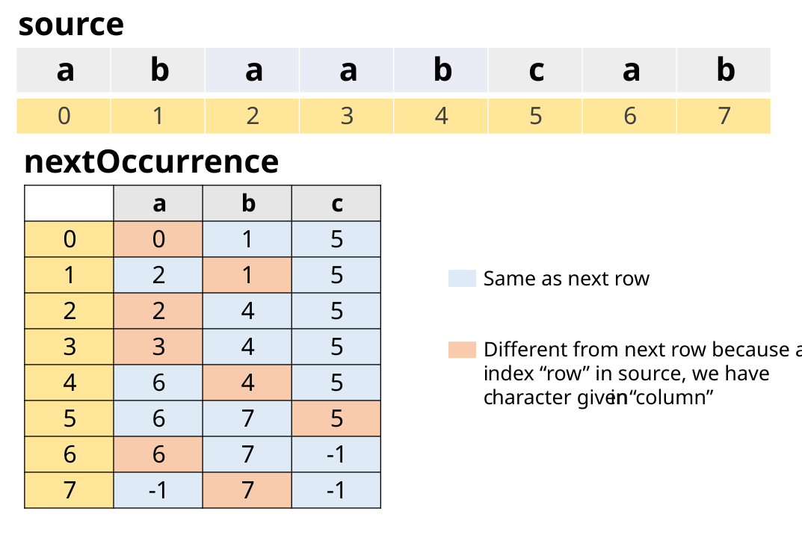

[TOC]

## Solution

---

### Overview

In this problem, we are given two strings, `source` and `target`. We need to find the minimum number of **[subsequences](https://leetcode.com/problems/is-subsequence/)** of `source` such that their concatenation equals `target`. If the task is impossible, return `-1`.

> Since the problem statement involves subsequences, readers are advised to attempt [392. Is Subsequence](https://leetcode.com/problems/is-subsequence/) before attempting this problem, to understand the algorithm for checking subsequences.

We can **rephrase** the problem as follows

> Given two strings, `source` and `target`, find the minimum number of times we need to concatenate `source` such that `target` is a subsequence of the concatenated string.

> **Explanation of Rephrasement**
>
> We can say that each of the subsequences in the optimal answer is obtained from one unit of `source`. If there are minimum `k` subsequences, then we can think of their concatenation as a subsequence of "`k` units of `source` concatenated together".
>
>  Therefore, if the "concatenation of `k` subsequences of `source`" is equal to `target`, We can say that we need to find minimum `k` such that `target` is a subsequence of the concatenation of `k` `source`'s.
>
> **Example**
> If `source` is "abc" and `target` is "abcbc", then we can obtain `target` by concatenating 2 subsequences of `source`, namely "abc" and "bc".
> This can be rephrased as target "abcbc" is a subsequence of the concatenation of 2 units of `source`, namely "abc" + "abc", from the first unit we have obtained "abc" and from the second unit we have obtained "bc".
>
> This rephrasing helps us understand the problem, and may perhaps give us some insight into how to solve the problem.

After rephrasing, Let's ponder on the easier part, and try to filter out cases when the task is impossible to achieve.

Can we observe anything just by looking at `source` and `target`? Let their lengths be $S$ and $T$ respectively.

- If `source` has equal or fewer characters than `target`, then we may or may not be able to achieve the task. The examples given in the problem statement are enough to prove this.

- If `source` has more characters than `target`, then still we may or may not be able to achieve the task.

- If `source` is "abcd" and `target` is "abc", then we can achieve the task by using "abcd" once.

- If `source` is "abcd" and `target` is "abx", then the task is impossible to achieve.

Thus, we just can't rule out any case just by looking at their lengths. Let's try to find some other way to filter out cases when the task is impossible to achieve. For this, we can focus on characters present in `source` and `target`.

- if `source` has a character that is not present in `target`, then we again cannot conclude anything, the reason being since we are interested in subsequence, we can ignore the character which is not present in `target`, and can proceed with the remaining characters as many times as we want.

- Let `source` be "abcd" and `target` be "abca". "d" of `source` is not present in `target`. Still, we can form "abca" using two concatenations of "abcd", since "abca" is a subsequence of "abcdabcd", although "d" is not present in `target`.

- Let `source` be "abcd" and `target` be "abx". Here also "d" is not present in `target`, but we can't form "abx" using subsequences of "abcd", since "abx" is not a subsequence of "abcdabcd".

- what if `target` has a character which is not present in `source`? In this case, we can't form `target` using subsequences of concatenation of `source`. Because no matter how many times we concatenate `source`, we won't be able to form the character which is not present in `source`.

- one more thing, can we be sure that the task is possible to achieve if all characters of `target` are present in `source`? Yes, we can. Because for every character of `target`, we can ultimately find its occurrence in `source` by concatenating `source` any number of times.

Thus, we can propose the following

> **Proposition:** Task is possible to achieve if and only if all characters of `target` are present in `source`.

Thus, with this proposition, we can filter out cases when the task is impossible to achieve. However, if it is achievable, we still need to find the minimum number of concatenations of `source` such that `target` is a subsequence of those concatenations. The article discusses multiple approaches to solve this.

A quick analysis shows that the optimal answer (if it exists) will be less than or equal to $T$. This is because if we concatenate `source` $T$ times, then from each unit of `source`, we can obtain at least one character of `target`. Therefore, from $T$ units of `source`, we can always completely form `target`.

Throughout the article, we will use the following notation:

- For the length of `source`, we will use $S$ in the article and `m` in the code.
- For the length of `target`, we will use $T$ in the article and `n` in the code.

Please note that neither can be equal to zero (the often encountered Edge Case) because of given constraints.

---

### Approach 1: Brute Force

#### Intuition

Analyzing the **original** (not rephrased) problem statement, the brute force method would be to generate all possible subsequences of `source`. There will be $2^S$ subsequences of `source`. This is because for each character of `source`, we have two choices, either to include it in the subsequence or not. Therefore, this is infeasible because of the given constraints that $1 \leq S \leq 1000$.

Moreover, even after generating all possible subsequences, we have to check for all of their possible `k`-concatenations, and then check if anyone is equal to `target` or not.

- `1`-concatenation means all subsequences of `source` as it is.

- `2`-concatenation means permutation of all subsequences of `source` with itself

Overall given the constraints, this is highly infeasible.

---

### Approach 2: Concatenate until Subsequence

#### Intuition

The rephrased problem statement in the overview gives us a hint that we can concatenate `source` until we get `target` as a subsequence of the concatenated string. This will be done only when the task is possible to achieve.

The answer thus will be the minimum number of concatenations of `source` such that `target` is a subsequence of those concatenations. Thus, we will keep on concatenating `source` and check if we have `target` as a subsequence of the concatenated string or not. When we get `target` as a subsequence of the concatenated string, we will return the number of concatenations we have done.

> **Note :** This approach falls under the category of **Greedy** algorithm paradigm. If the task is possible to achieve, then we will always get the optimal answer, because we are greedily trying to cover as much of the `target` as possible with each concatenation of `source`.
>
> We greedily match as many characters of `target` as possible with each concatenation of `source`, which leads to minimum usage of `source` and thus the minimum number of concatenations.
>
> In terms of the original problem statement, we are greedily exhausting all characters in the `source` before starting a new subsequence. In other words, **each concatenation is constructing the longest POSSIBLE subsequences and because of that we won't be able to construct a more optimal solution**

#### Algorithm

1. Taking inspiration from [Is Subsequence](https://leetcode.com/problems/is-subsequence/), define a function `isSubsequence` which takes two strings `toCheck` and `inString` as input, and returns `true` if `toCheck` is a subsequence of `inString`, and `false` otherwise. The time complexity of this function ideally should be $O(\text{|inString|})$.

- We will use two pointers `i` and `j` to traverse `toCheck` and `inString` respectively. Initially, both will be at index `0`.

- if $\text{toCheck}[i]$ is equal to $\text{inString}[j]$, then we will increment both `i` and `j`.

- otherwise, we will only increment `j`. We want to check if $\text{toCheck}[i]$ is present in `inString` or not. Since it is not present at `j`, we will increment `j` to check if it is present at `j+1` or not.

- at last, if `i` is equal to the length of `toCheck`, then we can be sure that all characters of `toCheck` are present in `inString` in the same order, not necessarily contiguous. Therefore, we will return `true`. Otherwise, we will return `false`.

2. Iterate over `target` and check if all characters of `target` are present in `source` or not. This can be done by having an $O(1)$ lookup table for all characters of `source`. We can use a set or `boolean` array of size $26$ (for the lowercase English alphabet) which stores `true` for characters present in `source` and `false` otherwise.

    If all characters of `target` are present in `source`, then proceed with the next step. Otherwise, return `-1`.

3. Define a variable `concatenatedSource` which will store concatenations of `source`. Initially, it will be equal to `source`. Define a variable `count` which will store the number of concatenations done. Initially, it will be `1`.

4. While `target` is not a subsequence of `concatenatedSource`, keep on concatenating `source` to `concatenatedSource` and increment `count` by `1`. This can be done by calling `isSubsequence(target, concatenatedSource)` in a `while` loop.

    Please note that there will be no infinite loop because it will run at most $T$ times. This is because, from every unit of source, we can extract a character of the target. Therefore, we can extract $T$ characters of the target from $T$ units of the source. We already have checked that all characters of the target are present in the source.

5. When `isSubsequence(target, concatenatedSource)` returns `true`, we will return `count`.

#### Implementation

```python
class Solution:
    def shortestWay(self, source: str, target: str) -> int:

        # To check if to_check is subsequence of in_string
        def is_subsequence(to_check, in_string):
            i = j = 0
            while i < len(to_check) and j < len(in_string):
                if to_check[i] == in_string[j]:
                    i += 1
                j += 1

            return i == len(to_check)

        # Set of all characters of the source. We could use a boolean array as well.
        source_chars = set(source)

        # Check if all characters of the target are present in the source
        # If any character is not present, return -1
        for char in target:
            if char not in source_chars:
                return -1

        # Concatenate source until the target is a subsequence
        # of the concatenated string
        concatenated_source = source
        count = 1
        while not is_subsequence(target, concatenated_source):
            concatenated_source += source
            count += 1

        # Number of concatenations done
        return count
```

**Implementation Note:**  We have used a boolean array to mark all characters of `source`. We can also use a set to store all characters of `source`. However, we should ensure $O(1)$ lookup time for each character. In C++, `set` is implemented using a balanced binary search tree. Therefore, the lookup time would be $O(\log S)$. Hence, we have used a boolean array instead of a set. However, we can use a set in Python as the lookup time in the set is $O(1)$ in Python.

#### Complexity Analysis

* Time complexity: $O(T^2 \cdot S)$ where $T$ is length of target and $S$ is length of source.

- $O(S)$ to create a boolean array to mark all characters of source.

- $O(T)$ to check if all characters of target are present in source.
- Then we have a loop.

- in the condition, we are calling `isSubsequence(toCheck, inString)` function which takes $O(\text{|inString|})$ time. In our case, `inString` is `concatenatedSource` which is the concatenation of the source string. There can be at most $T$ concatenations. Therefore, $O(\text{|inString|}) = O(T \cdot S)$.

- in the body, we are concatenating the source string to `concatenatedSource`. The time complexity of concatenating strings depends on the programming language. In languages where strings are immutable, concatenating takes $O(\text{string.length})$ time. In the worst case, the length of `concatenatedSource` would be $O(T \cdot S)$. Thus, concatenation in the worst case would be $O(T \cdot S)$.

- incrementing count takes $O(1)$ time.

- Thus, complexity of each iteration is $O((T \cdot S) + (T \cdot S))$ which is $O(T \cdot S)$.

- The loop runs until `target` is a subsequence of `concatenatedSource`. Therefore, there will be at most $T$ iterations. Therefore, the time complexity of the `while` part is $O(T \cdot (T \cdot S)) = O(T^2 \cdot S)$.

- Hence, overall time complexity is $O(S + T + T^2 \cdot S) = O(T^2 \cdot S)$.

* Space complexity: $O(TS)$.

- the boolean array to mark all characters of source takes $O(1)$ space.

- in the worst case, we will have to concatenate source string $T$ times. Therefore, `concatenatedSource` may consume $O(TS)$ space.

---

### Approach 3: Two Pointers

#### Intuition

In the previous approach, we were concatenating the source string to `concatenatedSource` until `target` is a subsequence of `concatenatedSource`. But, is concatenating the source string to `concatenatedSource` really necessary?

To answer that, let's first see what concatenation really does. It essentially adds "reference of the first character of `source`" at the end of `source`. Thus, we can avoid actual concatenation, and instead can just loop around the `source` string. Instead of having multiple concatenations of the `source` string, we can perhaps pass a parameter `k` to depict how many times we have to loop around the `source` string.
This definitely will save us some space.

Can we do better than this? For this let's analyze the `isSubsequence(toCheck, inString)` function. What does it technically do?

```
    bool isSubsequence(string toCheck, string inString) {
        int i = 0, j = 0;
        while (i < toCheck.length() && j < inString.length()) {
            if (toCheck[i] == inString[j]) {
                i++;
            }
            j++;
        }

        return i == toCheck.length();
```

Let's focus on two pointers `i` and `j`. The `i` is used to iterate over the `toCheck` string and the `j` is used to iterate over the `inString` string. Now, if we see the `while` loop, we can see that `j` is always incremented. Thus, `j` is always moving forward. But, `i` is only incremented when $\text{toCheck}[i] = \text{inString}[j]$. Thus, `i` is not always moving forward.
In other words, we are trying to find the occurrence of the `i`-th character of `toCheck` in `inString`.

This gives us hint that in our other approach, we can have two pointers `i` and `j` to iterate over the `target` and `source` strings respectively. And we can try to find the occurrence of the `i`-th character of `target` in `source`. For this, the iterator of `source` namely `j` should be moving forward. If the occurrence of the `i`-th character of `target` is found in `source`, we will increment `i` to find the occurrence of the `i+1`-th character of `target` in `source`. Please note that `j` won't be reset to 0, because we want to find the immediate next occurrence of the next character of `target` in `source`.

However, the only difference is that once the `source` string is exhausted, we will start again from the beginning of the `source` string, our very own idea of looping around the `source` string. This can be done by resetting `j` to 0, or by using $j = (j + 1) \% \text{source.length}()$. Moreover, we will also increment a counter `count` to keep track of the number of times we have to loop around the `source` string.

The answer will be the number of times we have to loop around the `source` string or the number of times `j` has to be reset to 0.

> This approach falls under the "Greedy" algorithm paradigm. We are trying to cover as much of the `target` string as possible with the `source` string. In other words, from one copy of the `source` string, we are trying to extract as many characters as we can to cover the `target` string. If we are not able to cover the `target` string with one copy of the `source` string, we will try to cover it with two copies of the `source` string, and so on.
>
> The characters covered by one copy of the `source` string can be thought of as subsequences, as demanded by the original problem statement.
>
> The **Proof of Optimality/Minimum Number of Subsequence** can be thought of as we are trying to cover the `target` string with the minimum number of copies of the `source` string. This we are ensuring by covering a maximum portion of the `target` string with the current copy of the `source` string. In other words, **each loop is constructing the longest possible subsequences and because of that we won't be able to construct a more optimal solution**

The approach can be named **Greedily find every character of `target` in `source` using Two Pointers**. As done in all previous approaches, if the task is not possible, we will `return -1`. This can be checked by the mentioned proposition in the overview section.

#### Algorithm

1. Iterate over `target` and check if all characters of `target` are present in `source` or not. This can be done by having a $O(1)$ lookup table for all characters of `source`. We can use a set or a `boolean` array of size $26$ (for the lowercase English alphabet) which stores `true` for characters present in `source` and `false` otherwise.

    If all characters of `target` are present in `source`, then proceed with the next step. Otherwise, return `-1`.

2. Initialize a pointer for the `source` string, $\text{source}_{iterator}$ to 0. Also, initialize a counter `count` to 0. Store the length of the `source` string in `m`, as mentioned in the overview section.

3. Iterate over every character of `target`. If while iterating, $\text{source}_{iterator}$ equals 0, increment `count` because reaching 0 means we are starting a new subsequence of `source`.

   Try to find the occurrence of character in the `source` string from $\text{source}_{iterator}$ onwards. For incrementing $\text{source}_{iterator}$, use $\text{source}_{iterator} = (\text{source}_{iterator} + 1) \% m$. **Please note that after incrementing $\text{source}_{iterator}$, if it ever reaches 0, AND we have characters to check in `target`, we will increment `count`**. Both these conditions should be met to increment `count`.

4. When all characters of `target` are found in `source`, return `count`.

**Example:** Let $source = "xyz"$ and $target = "xzyxz"$.

!?!../Documents/1055/1055_Two_Pointers.json:1280,720!?!

<br/>

#### Implementation

```python
class Solution:
    def shortestWay(self, source: str, target: str) -> int:

        # Set of all characters of source. Can use a boolean array too.
        source_chars = set(source)

        # Check if all characters of target are present in source
        # If any character is not present, return -1
        for char in target:
            if char not in source_chars:
                return -1

        # Length of source to loop back to start of source using mod
        m = len(source)

        # Pointer for source
        source_iterator = 0

        # Number of times source is traversed. It will be incremented when
        # while finding the occurrence of a character in target, source_iterator
        # reaches the start of source again.
        count = 0

        # Find all characters of target in source
        for char in target:

            # If while finding, iterator reaches start of source again,
            # increment count
            if source_iterator == 0:
                count += 1

            # Find the first occurrence of char in source
            while source[source_iterator] != char:

                # Formula for incrementing while looping back to start.
                source_iterator = (source_iterator + 1) % m

                # If while finding, iterator reaches the start of source again,
                # increment count
                if source_iterator == 0:
                    count += 1

            # Loop will break when char is found in source. Thus, increment.
            # Don't increment count until it is not clear that target has
            # remaining characters.
            source_iterator = (source_iterator + 1) % m

        # Return count
        return count
```

**Implementation Note:** The approach is Two Pointers because we are using two pointers to iterate over the `target` and `source` strings respectively. While the pointer for `source` is visible as `sourceIterator`, the pointer for `target` can be thought of in the `for` loop.

Moreover, we can combine two `for (char c : target.toCharArray())` loops into one. But having a separate `for` loop to check the possibility of a task reduces computational steps.

> Suppose `target` is "[achievable]x" where "[achievable]" can be formed by multiple concatenations of `source`, but "x" is not in `source` thereby making the task impossible. Combining `for` loops will first try to make the entire "[achievable]" using `source`, realizing at last that task was impossible. This will consume $O( (T-1)\cdot S )$ steps for making "[achievable]". However, if we have separate `for` loops, we can check the possibility of the task in $O(S + T)$ steps only.

#### Complexity Analysis

* Time complexity: $O(S \cdot T)$, where $T$ is length of target and $S$ is length of source.

- $O(S)$ to create a boolean array to mark all characters of source.

- $O(T)$ to check if all characters of target are present in source.

- Then, we have a loop that runs $O(T)$ times. The loop runs only when the task is possible.

        In each iteration, we have a `while` loop which runs at most $O(S)$ times because in one iteration of `source`, we must be able to find at least one occurrence of the character in `source`. One example of worst case is `source` = "mnopqrst" and `target` = "ttttttttttt". For each "t" in `target`, we have to traverse the entire `source` to find it.

    Thus, the total time complexity is $O(S \cdot T)$.

* Space complexity: $O(1)$.

- the boolean array to mark all characters of source takes $O(1)$ space.

- apart from that, no extra space is used.

**Follow Up for Readers :** Although boolean array uses $O(1)$ space, we can avoid having boolean array. For this, we can modify the `for` loop which checks if all characters of `target` are present in `source`. Before iterating the `while` loop, we can initialize a variable $start = sourceIterator$, which indicates that for this character, we will start searching from `start`. Now, if inside the `while` loop, if while incrementing and wrapping around, at any point if we find that `sourceIterator` is equal to `start`, it means that we have traversed the entire `source` and we have not found any character. Thus, we can return -1. This will have constant space complexity regardless of the alphabet size. Readers can try this approach as well. Overall both approaches are the same in terms of time and space complexity.

---

### Approach 4: Inverted Index and Binary Search

#### Intuition

Can we do better than the previous approach? Let's analyze the time-consuming `for` loop in the previous approach.

```plaintext
    for every character char in the target
    {
        Find its occurrence in the source ahead of sourceIterator
    }
```

We have to check all the characters. Thus, $O(T)$ will be there. Can we reduce the time complexity inside the loop, i. e. time complexity of finding the occurrence of a character in the `source` string?

For this, let's analyze the different cases of finding the occurrence of a character `char` in the `source` string, with respect to `sourceIterator`.

- **Best Case:** Character `char` is present in `source` at `sourceIterator` itself. Thus, the `while` loop will not run. Hence, the time complexity is $O(1)$.

- **Worst Case:** Character `char` is present in `source` just behind `sourceIterator`, i. e. at $sourceIterator - 1$ and there is no other occurrence of the character in `source` ahead of `sourceIterator`. In this case, we have to loop around, hence, the `while` loop will run $O(S)$ times. Hence, the time complexity is $O(S)$.

Let's try to reduce the worst-case time complexity of finding the occurrence of a character `char` in the `source` string. What if we already know the location/indices of `char` in the `source` string? Can we pre-process the `source` string in some way?

> Yes, we can use extra space to store all the indices of all characters present in the `source` string. We perhaps can use a hash table. It is often called the "Inverted Index".

Then we need to find the index of `char` in the `source` string, which is just greater than or equal to `sourceIterator`. If no greater than or equal index is found, we can loop around, and thus return the first index of `char` in `source`.

How can we find the index satisfying the above property using a hash table?
For that, we perhaps can traverse linearly in the "array of indices of `char`", and as soon as we find an index just greater than or equal to `sourceIterator`, we can return it. If no such index is found, we can return the first index. If corresponding to `char`, there are $C$ indices, then the time complexity will be $O(C)$.

Is there any faster way to find the index satisfying the above property? What if the "array of indices of `char`" is sorted?

Yes, then we can use binary search to find the index satisfying the above property. This will reduce the time complexity to $O(\log C)$. In the worst case, $C$ will be $O(S)$, when only one character is in `source`, hence, then time complexity will be $O(\log S)$, which is much better than $O(S)$ of the previous approach. And, the best part is that we can systematically fill the "array of indices" so that it is sorted.

> **Interview Tip:** Provided sorted data, always try to ponder if Binary Search can be used to reduce the time complexity. Readers can explore more in the [Binary Search Explore Card](https://leetcode.com/explore/learn/card/binary-search/).

As done in all previous approaches, we can `return -1` if the task is not possible. This can be done in $O(S + T)$ time. However, we can avoid the boolean array in this approach because we are using a hash table to store indices anyway.

#### Algorithm

1. Create a 2D array `charToIndices`. The size of the array will be 26 because there are 26 lowercase English letters. The list at each index will store the indices of the character corresponding to that index in the `source` string. This can be done by traversing the `source` string once and storing the indices in the `charToIndices`

2. Initialize `sourceIterator` to 0, and `count` to 1. The former will be used to iterate over the `source` string, and the latter will be used to count the number of times we need to iterate over the `source` string.

3. For every character `c` in the `target` string,

- if `c` is not present in the `source` string, `return -1`.

- else, find the index of `c` in the `source` string, which is just greater than or equal to `sourceIterator`. If no such index is found, we can loop around, and thus return the first index of `c` in `source`. Looping around should be marked by incrementing `count` by 1.

- Index can be found using binary search on $\text{charToIndices}[c]$.

- Update `sourceIterator` to the successor index because next time, we will start searching from the successor index.

4. Return `count`.

#### Implementation

```python
class Solution:
    def shortestWay(self, source: str, target: str) -> int:

        # List of indices for all characters in source
        char_to_indices = defaultdict(list)
        for i, c in enumerate(source):
            char_to_indices[c].append(i)

        # Pointer for source
        source_iterator = 0

        # Number of times we need to iterate through source
        count = 1

        # Find all characters of target in source
        for char in target:

            # If character is not in source, return -1
            if char not in char_to_indices:
                return -1

            # Binary Search to find the index of the character in source
            # next to the current source_iterator
            index = bisect.bisect_left(char_to_indices[char], source_iterator)

            # If we have reached the end of the list, we need to iterate
            # through source again, hence first index of character in source.
            if index == len(char_to_indices[char]):
                count += 1
                source_iterator = char_to_indices[char][0] + 1
            else:
                source_iterator = char_to_indices[char][index] + 1

        # Return the number of times we need to iterate through source
        return count
```

**Implementation Note:** For Binary Search, we have used different inbuilt functions in different languages. More about them can be read from the official documentation.

- In Python, we have used the [$bisect.\text{bisect}_{left}$](https://docs.python.org/3/library/bisect.html#bisect.bisect_left) function.
- In Java, we have used [`Collections.binarySearch`](https://docs.oracle.com/javase/7/docs/api/java/util/Arrays.html#binarySearch(int[],%20int)) function.
- In C++, we have used [$\text{lower}_{bound}$](https://en.cppreference.com/w/cpp/algorithm/lower_bound) function.
- In C#, we have used [`List.BinarySearch`](https://docs.microsoft.com/en-us/dotnet/api/system.collections.generic.list-1.binarysearch?view=net-5.0) function.

While there is variation in the different functions, the core idea remains the same. The function takes two parameters, an array `a` and a value `x`. It returns the index of the first element in `a` which is not less than `x`. If all elements in `a` are less than `x`, it returns the size of `a`. The algorithm is based on the fact that the array `a` is sorted.

Moreover, we have used following logic for checking if we have to loop around.

```python
            # Binary Search to find the index of the character in source
            # next to the current source_iterator
            index = bisect.bisect_left(char_to_indices[char], source_iterator)

            # If we have reached the end of the list, we need to iterate
            # through source again, hence first index of character in source.
            if index == len(char_to_indices[char]):
                count += 1
                source_iterator = char_to_indices[char][0] + 1
            else:
                source_iterator = char_to_indices[char][index] + 1
```

Above code finds an index of "proper index of `char` in `source` which is not less than $\text{source}_{iterator}$" in the $\text{char\_to\_indices}[char]$ array. If the index is equal to the length of the array, it means that we have to loop around. This looping around condition can **also** be checked using the fact that if the last index of `char` in `source` is less than $\text{source}_{iterator}$, then we have to loop around because no index of `char` in `source` is ahead of $\text{source}_{iterator}$.

```python
            if char_to_indices[char][-1] < source_iterator:
                count += 1
                source_iterator = char_to_indices[char][0] + 1
            else:
                index = bisect.bisect_left(char_to_indices[char], source_iterator)
                source_iterator = char_to_indices[char][index] + 1
```

#### Complexity Analysis

* Time complexity: $O(S + T \log (S))$, where $S$ is the length of `source` and $T$ is the length of `target`.

- For preprocessing, we iterate through `source` to create the `charToIndices` array, which takes $O(S)$ time.

- The `for` loop in the algorithm iterates through the `target`. There will be $O(T)$ such iterations.

        In every iteration, we perform a binary search on the $charToIndices[c - 'a']$ array. This array will have at most $S$ elements, and in the worst case when all characters in `source` are the same, `c` will be present in all $S$ indices. Thus, this binary search will take $O(\log (S))$ time.

        The rest of the operations in the `for` loop take constant time.

- Thus, the total time complexity is $O(S + T \log (S))$.

* Space complexity: $O(S)$.

    The `charToIndices` array takes $O(S)$ space because there are $S$ indices in the source.

---

### Approach 5: 2D Array

#### Intuition

Let's analyze the time-consuming `for` loop in the previous approach.

```plaintext
    for every character char in the target
    {
        Find its occurrence in the source ahead of sourceIterator
    }
```

For every iteration in the `for` loop, the very naïve approach uses a linear search to find the character in `source`, hence $O(S)$ time. This was improved to $O(\log (S))$ in the previous approach. Can we do better than this? Is there a way to find the character in `source` ahead of `sourceIterator` in $O(1)$ time, perhaps at the cost of some more extra space?

Let's focus more deeply on "Find occurrence of the character in `source` **ahead of `sourceIterator`**". Now, `sourceIterator` can take values from $0$ to $S-1$. Can we somehow for every possible value of `sourceIterator`, store the indices of characters in `source` ahead of `sourceIterator`?

In other words, if we have an index `sourceIterator` and a character `c`, we wish to compute the index of `c` in `source` ahead of (or including) `sourceIterator`. Let's try to pre-compute, for all possible values of `sourceIterator` and all possible characters `c`, the index of `c` in `source` ahead of `sourceIterator`.

For this, we can have a 2D array of size $S \times 26$. Let's name it `nextOccurrence`. $\text{nextOccurrence}[idx][c]$ will store the index of character `c` in `source` ahead of `idx`, or `-1` (or `None`) if there is no such character. In other words, $\text{nextOccurrence}[idx][c]$ represents earliest index **>=** `idx` such that $source[\text{nextOccurrence}[idx][c]] = c$.

**Example:** Let `source` be "abaabcab". Then `nextOccurrence` can be visualized as

!?!../Documents/1055/1055_next_occurrence_example.json:1280,720!?!

<br/>

Thus, using this 2D array, we can find the index of the character in `source` ahead of `sourceIterator` in $O(1)$ time.

Now, the question is how to prepare this 2D array. Very naïvely, we can iterate through `source`, and from every index `idx`, we can iterate towards the end of `source` to find the first index of every character ahead of `idx`. This will take $O(S^2)$ time.

Is there an efficient way to prepare this 2D array? This can be analyzed by looking at the `nextOccurrence` array closely.

>$\text{nextOccurrence}[idx][c]$ means the index of character `c` in `source` ahead of `idx`.
>
> Let's assume we know the value of $\text{nextOccurrence}[idx][c]$. Using this value, let's try to find the value of `nextOccurrence[idx-1][c]`. If $source[idx-1] = c$, then $nextOccurrence[idx-1][c] = idx - 1$, because it's the first index of `c` ahead of (or on) $idx - 1$. If $source[idx-1] \neq c$, then $nextOccurrence[idx-1][c] = \text{nextOccurrence}[idx][c]$ because the first index of `c` ahead of `idx-1` is the same as the first index of `c` ahead of `idx`.

The fact can be verified using the `nextOccurrence` table for "abaabcab". Every row is the same as the next row, except for one column.



Thus, we can iterate through `source` from the end, and for every index `idx`, we can copy the values of `nextOccurrence[idx+1]` to $\text{nextOccurrence}[idx]$, because for every character (except $\text{source}[idx]$), the first index of that character ahead of `idx` is the same as the first index of that character ahead of `idx+1`. For $\text{source}[idx]$, the first index of that character ahead of `idx` is `idx`.

Hence, mathematically, we can write the recurrence relation as:
$\text{\text{nextOccurrence}[idx][c] }= \begin{cases} idx \& \text{, if } c = \text{\text{source}[idx]} \\ \text{nextOccurrence}[idx+1][c] \& \text{, otherwise} \end{cases}$

With the base case being for $idx = S-1$, only $nextOccurrence[S-1][source[S-1]] = S-1$ will be true, and for all other characters, $nextOccurrence[S-1][c] = -1$.

Thus, with this 2D array, we can find the earliest occurrence of character `source` ahead of `sourceIterator` in $O(1)$ time. If no such index exists ahead of `sourceIterator`, we can loop back to the beginning of `source`, and in that case, we need to find the index of the character in `source` ahead of index $0$, i. e. in array $\text{nextOccurrence}[0]$. This will also mark an increment of `count` by $1$.

The handling of cases when the task is not possible is also very simple. If for any character, $\text{nextOccurrence}[0][c] = None$, it means that character is not present in `source` (since there is no occurrence of the character in `source` ahead of index $0$), and thus we can `return -1`.

Thus, this approach shortens the lookup time of the next occurrence of the character in `source` ahead of `sourceIterator` from $O(\log (S))$ to $O(1)$.

> **Interview Tip:** If you are aiming to reduce the time complexity of your solution, try to focus on the time-consuming block. Moreover, always be open to using more space when aiming to reduce time.
>
> Additionally, pre-computing and analyzing the input is always a good idea.

#### Algorithm

1. Create a 2D array `nextOccurrence` of size $S \times 26$. Initialize it with `-1` (or `None`).

   - Fill Base Case: $nextOccurrence[S-1][source[S-1]] = S-1$, which means that the first occurrence of `source[S-1]` in `source` ahead of (or on) index $S-1$ is $S-1$.

   - Fill remaining indices using the described recurrence relation: For every index `idx` from $S-2$ to $0$, copy the values of `nextOccurrence[idx+1]` to $\text{nextOccurrence}[idx]$, and then update $\text{nextOccurrence}[idx][\text{source}[idx]]$ to `idx`, because the first occurrence of $\text{source}[idx]$ in `source` ahead of (or on) index `idx` is `idx`.

2. Initialize `sourceIterator` to $0$ and `count` to $1$.

3. For every character `c` in `target`:
   - Check if `c` is present in `source` or not. If not, return $-1$. `c` is not present in `source` if $\text{nextOccurrence}[0][c] = -1$.

   - Now, if `sourceIterator` is at index $S$, **OR** If $\text{nextOccurrence}[sourceIterator][c] = -1$, loop back to index $0$ and increment `count` by $1$.
   - Set `sourceIterator` next to $\text{nextOccurrence}[sourceIterator][c]$, i. e. one index ahead of the first occurrence of `c` in `source` ahead of `sourceIterator`.

4. Return `count`.

#### Implementation

```python
class Solution:
    def shortestWay(self, source: str, target: str) -> int:

        # Length of source
        source_length = len(source)

        # Next Occurrence of Character after Index
        next_occurrence = [defaultdict(int) for idx in range(source_length)]

        # Base Case
        next_occurrence[source_length -
                        1][source[source_length - 1]] = source_length - 1

        # Using Recurrence Relation to fill next_occurrence
        for idx in range(source_length - 2, -1, -1):
            next_occurrence[idx] = next_occurrence[idx + 1].copy()
            next_occurrence[idx][source[idx]] = idx

        # Pointer for source
        source_iterator = 0

        # Number of times we need to iterate through source
        count = 1

        # Find all characters of target in source
        for char in target:

            # If character is not in source, return -1
            if char not in next_occurrence[0]:
                return -1

            # If we have reached the end of source, or the character is not in
            # source after source_iterator, loop back to beginning
            if (source_iterator == source_length or
                    char not in next_occurrence[source_iterator]):
                count += 1
                source_iterator = 0

            # Next occurrence of character in source after source_iterator
            source_iterator = next_occurrence[source_iterator][char] + 1

        # Return the number of times we need to iterate through source
        return count
```

#### Complexity Analysis

* Time complexity: $O(S + T)$, where $S$ and $T$ are the lengths of `source` and `target` respectively.

- Creating `nextOccurrence` takes $O(26 \cdot S)$ time. This can be generalized to $O(\Sigma \cdot S)$, where $\Sigma$ is the size of the alphabet.

- Now, we are iterating through `target` and finding the next occurrence of each character in `source` . There are $O(T)$ such iterations. Inside every iteration, we are performing $O(1)$ operations.

    Therefore, the total time complexity is $O(\Sigma \cdot S + T)$, which can be written as $O(26 \cdot S + T)$, or $O(S + T)$.

* Space complexity: $O(S)$.

    Only `nextOccurrence` is used, which takes $O(26 \cdot S)$ space. This can be generalized to $O(\Sigma \cdot S)$, where $\Sigma$ is the size of the alphabet. Since $\Sigma$ is constant, we can write the space complexity as $O(S)$.

<details><summary>Another Way of implementing 2D Array. Click to read.</summary>
<p>

For this let's revisit the Binary Search approach.
> If we know the list of indices of each character in the source string, then we can find the index next to `sourceIterator` in $O(\log S)$ time.

Now, can we, for every `character`-`index` pair, store the next index of `character` in the `source` after `index`?
For this, we can extend the "List of Indices" to "List of Index of Next Occurrence after this Index". In other words, for every index of `source` ranging from $0$ to $S-1$, we can store the index of the next occurrence of every character in the `source` after this index.

Consider the `source` string as "abcabcbbab". For every index ranging from $0$ to $S-1$, we can store the index of the next occurrence of every character in the `source` after this index.

The list created for Binary Search looked like

```
a: <0, 3, 8>
```

The list created for this approach will look like this. Observe how we have **flattened the array** to reduce lookup time from $O(\log S)$ to $O(1)$.

```
a : [0, 3, 3, 3, 8, 8, 8, 8, 8, -1]
```

Thus, if our `sourceIterator` is at index $4$, and we wish to find `a` of `target` in `source`, we can go to index 4 of `a` in the List, and find the next occurrence of `a` after index 4, which is index 8.
On the other hand, if `sourceIterator` is at index $9$, and we wish to find `a` of `target` in `source`, we can go to index 9 of `a` in the List, and find the next occurrence of `a` after index 9, which is index -1. It means no `a` is present in `source` after index 9. Thus, we need to start from index 0 again.

Thus, instead of $O(\log S)$ time, we can find the next occurrence of a character in $O(1)$ time. We can call our array $\text{nextOccurrence}[char][index]$. It will store the *index of next occurrence* of `char` in `source` after `index`.

To prepare this efficiently, for every character `char` in our alphabet, we can traverse the `source` string from $S-1$ to $0$. For every `index` varying from $S-1$ to $0$, If $\text{source}[index] = char$, then by definition, $\text{nextOccurrence}[char][index] = index$. Otherwise, $\text{nextOccurrence}[char][index] = \text{nextOccurrence}[char][index + 1]$.

The recurrence relation hints that the base case is for the last character. It is $\text{nextOccurrence}[char][S-1] = -1$ for every character `char` in our alphabet, except for `source[S-1]`, where $nextOccurrence[source[S-1]][S-1] = S-1$.

Thus, using this method, we can create the list for every character in our alphabet in $O(26 \cdot S)$ time.

The handling of the case when the task is not possible is also very simple. If for any character `c`, we have $\text{nextOccurrence}[c][0] = -1$, then we can return $-1$, because no occurrence of `c` is present in `source` after index 0.

Thus, this 2D Array also shortens the lookup time of the next occurrence of the character in `source` ahead of `sourceIterator`to $O(1)$. Here is the implementation of this 2D Array Method. Please note that Time Complexity and Space Complexity are the same as mentioned above in Complexity Analysis.

```python
class Solution:
    def shortestWay(self, source: str, target: str) -> int:

        # Length of source
        source_length = len(source)

        # Next Occurrence of Character after Index
        next_occurrence = [[-1] * source_length for char in range(26)]

        # Base Case
        next_occurrence[ord(source[source_length - 1]) - ord('a')][source_length -
                                                                   1] = source_length - 1

        # Using Recurrence Relation to fill next_occurrence
        for char in range(26):
            english_char = chr(char + ord('a'))
            for index in range(source_length - 2, -1, -1):
                if source[index] == english_char:
                    next_occurrence[char][index] = index
                else:
                    next_occurrence[char][index] = next_occurrence[char][index + 1]

        # Pointer for source
        source_iterator = 0

        # Number of times we need to iterate through source
        count = 1

        # Try to find all characters in target in source
        for char in target:

            # Scaling character to 0-25
            char = ord(char) - ord('a')

            # If character is not in source, return -1
            if next_occurrence[char][0] == -1:
                return -1

            # If we have reached the end of source, or the character is not in
            # source after source_iterator, loop back to beginning
            if (source_iterator == source_length or
                    next_occurrence[char][source_iterator] == -1):
                count += 1
                source_iterator = 0

            # Next occurrence of the character in source after source_iterator
            source_iterator = next_occurrence[char][source_iterator] + 1

        # Return the number of times we need to iterate through source
        return count
```

</p></details>

---

<details><summary>The following approaches are inefficient, but they are included to widen the horizon of the readers. Click to read.</summary>
<p>

### Approach 6: Top-Down Dynamic Programming [TLE]

#### Intuition

The problem is an optimization problem. We need to find  **minimum** (number of subsequences of `source`) that satisfies some constraints (their concatenation equals `target`). Whenever an optimization problem is given, one often dives into two Algorithm Paradigms.

1. **Greedy Algorithm** : In this approach, we try to find the **best** solution at every step. We do not look back to see if the solution we have found is the best. We just keep on finding the best solution at every step. This approach is very fast, but it does not always give the best solution.

    > However, the greedy algorithm has worked well in this problem. Approach 2 follows the basic greedy template, and all Approaches 3, 4, and 5 are just variations of Approach 2. Thus, all these approaches are also greedy algorithms.

2. **Dynamic Programming**: In this approach, we try to find the best solution for a given problem. We store the best solution for every subproblem. When we need to find the best solution for a problem, we look at the best solution for all the subproblems. It always gives the best solution if it exists.

    > Reader can dive deep into the topic using [Dynamic Programming Explore Card](https://leetcode.com/explore/learn/card/dynamic-programming/).

We are not very sure if dynamic programming will work in this problem. But, let's try!

> Dynamic Programming Problems have two important components.
>
> - **Optimal Substructure:** The best solution for a problem can be obtained by using the best solution for its subproblems.
> - **Overlapping Subproblems:** The problem can be broken down into subproblems, which are reused several times.
>
> We won't use these hard technical terms in this article. But we will try to get the intuition of these terms.

In any Dynamic Programming Problem, we need to find the recurrence relation. The recurrence relation is the relation between the best solution for a problem and the best solution for its subproblems.

Moreover, we need to find the base case. The base case is the best solution for the smallest subproblem.

> **What can be the subproblem?**
> We need to form the `target` string using subsequences of `source`. Thus, we can think of the subproblem as the problem of **forming a substring of `target` using subsequences of `source`**.

**How this will help us?**

Let `subtarget` be the substring of `target` that we need to form using subsequences of `source`.

- Now, if `subtarget` is a subsequence of `source`, then we can form `subtarget` using 1 subsequence of `source`. The optimal answer for `subtarget` will be 1 only.

- Otherwise, if that's not the case, then let's assume `subtarget` can further be broken down into two parts `st1` and `st2` such that $st1 + st2 = subtarget$ and `st2` is a subsequence of `source`.

    Now, if we know the optimal answer for `st1`, that is the minimum number of subsequences of `source` required to form `st1`, then we can form `subtarget` using those subsequences of `source` and one more subsequence of `source` that forms `st2`. Thus, one of the candidate answers for `subtarget` is $1 + optimal answer for st1$.

    It sounds like working. But, we need to find the best answer for `subtarget` from all the candidate answers. How many candidates do we have? The number of ways we can break down `subtarget` into `st1` and `st2`, such that `st2` is a subsequence of `source`. We are assuming we know the optimal answer for `st1`.

    Hence, we can formulate the recurrence relation as follows:

    > $optimal answer for subtarget = 1 + min(optimal answer for st1)$, where $st1 + st2 = subtarget$ and `st2` is a subsequence of `source`.

    Mathematically, we can write it as follows:

    $\text{opt({target[0:i]}}) = 1 + \min_{j < i} \bigg( \text{opt ( {target[0:j]} ) such that target[j:i] is a subsequence of source}\bigg)$

    where $\text{opt({target[0:i])}}$ is the optimal answer for the subproblem of forming the substring of `target` from index 0 to index `i` using subsequences of `source`.

    In our formulation, the starting index of the parameter inside the function `opt` is always 0. So, we can write $\text{opt(target[0:i])}$ as $\text{opt(\text{target}[i])}$, or simply $\text{opt({i})}$.

    > Going by the textbook definition, we can say that the problem is a 1D Dynamic Programming Problem because there is only one state variable namely the index of the last character of the substring of `target` that we need to form using subsequences of `source`. And thus, to memoize it we may need a 1D array.

So, very playfully we have formed the recurrence relation. But, we need to find the base case. The base case is the best solution for the smallest subproblem.

**What can be the smallest subproblem?**
The smallest subproblem is the subproblem of forming a single character string using subsequences of `source`. This single character will be $\text{target}[0]$. Hence, $\text{opt({0})} = 1$ will be the base case.

**How to handle case when some $\text{opt({j})}$ is not possible, or $\text{target[j:i]}$ is not a subsequence of `source`?**
We perhaps can save its answer as a very large number, so that, it is never the minimum of all the candidate answers used for solving the bigger problem. If for some $i$, all candidate answers are not possible, then $\text{opt({\text{target}[i]})}$ will also be a very large number.

> **Technical Terms**
> It seems they aren't very technical.
>
>  - **Optimal Substructure:** To compute $\text{opt}[i]$, we need to compute $\text{opt}[j]$ for all `j < i`. This is because if `target[0:i]` is not a subsequence of `source`, then we need to break it down into two parts `target[0:j]` and `target[j:i]` such that `target[j:i]` is a subsequence of `source`. Knowing the optimal answer of all $\text{opt}[j]$ for `j < i`, we can take the minimum of all of them and add 1 to it because we need to use one more subsequence of `source` to form `target[j:i]`. Thus, we can say that the problem has optimal substructure properties.
>
> - **Overlapping Subproblems:** The Optimal answer of the lower state variable is used to compute the optimal answer of all other higher state variables. Thus, one subproblem has occurred as a subproblem of other many other problems. Or, in other words, many problems have the same lower state variable as their subproblem. Thus, the problem has overlapping subproblem properties.

Readers are encouraged to implement the solution on their own. But, as a good habit, one is advised to rule out the case when the answer is not possible by using a Proposition.

> **Proposition:** Task is possible to achieve if and only if all characters of `target` are present in `source`.

**Moreover, our base case of $\text{opt({0})} = 1$ is only applicable if the task is possible.**

Another note is that we certainly can do better in `isSubsequence(toCheck, inString)` function.

- in our recurrence relation, `inString` is always `source`. So, we can remove it from the function signature

- Moreover, instead of passing the entire substring of `target`, we can pass the `start` and `end` index of the substring of `target` that we need to check. This will save us from creating a new string object in each function call.

Both these improvements are dependent on the programming language.

> As a side word, Dynamic Programming is somewhat redundant in this problem.
>
> Readers are motivated to verify this by manually printing the values of $\text{\text{opt}[i]}$ for all $i$ from 0 to $T-1$. They will find that they are monotonically non-decreasing in nature. That's why the greedy approach worked.
>
> However, it's a good exercise to solve it using Dynamic Programming and broaden our horizons.

#### Algorithm

1. Iterate over `target` and check if all characters of `target` are present in `source` or not. This can be done by having a $O(1)$ lookup table for all characters of `source`. We can use a set or a `boolean` array of size $26$ (for lowercase English alphabets) which stores `true` for characters present in `source` and `false` otherwise.

    If all characters of `target` are present in `source`, then proceed with the next step. Otherwise, return `-1`.

2. Define a function `isSubsequence(start, end, toCheck, inString)` which returns `true` if `toCheck[start: end]` is a subsequence of `inString` and `false` otherwise. This function can be implemented using two pointers. One pointer will iterate over `toCheck` and the other pointer will iterate over `inString`. If characters at both pointers are the same, then increment both pointers. If characters at both pointers are different, then increment only the pointer of `inString`. If the `toCheck` pointer reaches the end of `toCheck`, then return `true`, otherwise, return `false`.

3. Define another function `optimalAnswer(endingIndex)` which returns the optimal answer for `target[0:endingIndex]`. This function will be recursive in nature. For memoization, we can use a `memo` array of size $T$ where $T$ is the length of the `target`.

   - When `endingIndex` is 0, then return 1. This is the base case.

   - If we have already computed the answer for `target[0:endingIndex`, then return it from the `memo` array.

   - If `target[0:endingIndex]` is a subsequence of `source`, then return 1.

   - Otherwise, partition `target[0:endingIndex]` into two parts. For that have a pointer `partitionIndex` which will iterate from `0` to `endingIndex-1`. For each `partitionIndex`, if $target[partitionIndex + 1: endingIndex]$ is a subsequence of `source`, then compute `optimalAnswer(partitionIndex)`.

   - Take the minimum of all the answers computed in the previous step and add 1 to it. This is the answer for `target[0:endingIndex]`. Store this answer in the `memo` array and return it.

4. Return $optimalAnswer(len(target) - 1)$.

#### Implementation

```python
class Solution:
    def shortestWay(self, source: str, target: str) -> int:

        # Check if the Task is possible or not
        # Set of all characters of source. Can use a boolean array too.
        source_chars = set(source)

        # Check if all characters of target are present in source
        # If any character is not present, return -1
        for char in target:
            if char not in source_chars:
                return -1

        # Modified is_subsequence function. in_string will always be source
        # For to_check, passing indices of target, both included

        def is_subsequence(start, end):

            i = start
            j = 0

            while i <= end and j < len(source):
                if target[i] == source[j]:
                    i += 1
                j += 1

            return i == end + 1

        # Optimal Answer for a given ending index. Memoizing using a dictionary
        memo = {}

        def optimal_answer(ending_index):

            # Base case
            if ending_index == 0:
                return 1

            # If already computed, return the value
            if ending_index in memo:
                return memo[ending_index]

            # If is subsequence, return 1
            if is_subsequence(0, ending_index):
                memo[ending_index] = 1
                return 1

            # If not subsequence, partition into two parts and find minimum
            answer = float('inf')

            for partition_index in range(ending_index):

                # Check for subsequence only if the answer is less
                # than the current answer. Using AND Short Circuiting
                if (optimal_answer(partition_index) + 1 < answer and
                        is_subsequence(partition_index + 1, ending_index)):
                    answer = min(answer, optimal_answer(partition_index) + 1)

            # Memoize and return
            memo[ending_index] = answer
            return answer

        # Want to find the optimal answer for the last index.
        # Case when the task is not possible is already handled
        return optimal_answer(len(target) - 1)
```

**Implementation Note:** Since we want to utilize the concept of "a very large number", we have to use something like $Integer.\text{MAX}_{VALUE}$.  Note that we are using $Integer.\text{MAX}_{VALUE} / 2$ instead of $Integer.\text{MAX}_{VALUE}$. This is because, if we use $Integer.\text{MAX}_{VALUE}$, then adding 1 to it will result in $Integer.\text{MIN}_{VALUE}$ which is not what we want.

> One can use bit-wise operations to divide by 2.

#### Complexity Analysis

* Time complexity: $O(T^2 \cdot S)$, where $T$ is the length of the target string and $S$ is the length of the source string.

- To check the possibility of the task, it will take $O(S + T)$ time.

- Then we call `optimalAnswer()` for each `endingIndex` of the target string. So, there will be $O(T)$ such calls.

        For each call, we are calling `isSubsequence` for at most $T+1$ `partitionIndex` values. Each check will take $O(S)$ time.

        Thus, for a particular `endingIndex`, it will take $O((T+1) \cdot S)$ time to check for subsequence.

- Thus, we can have time complexity as $O(S + T + T \cdot ((T+1) \cdot S))$ which is $O(T^2 \cdot S)$.

* Space complexity: $O(T)$, where $T$ is the length of the target string.

- We are using a boolean array of size $26$ to mark all characters of the source string.

- We are using an array of size $T$ to memoize the optimal answer for each `endingIndex` of the target string.
- Stack calls will take $O(T)$ space.
- Thus, we can have space complexity as $O(26 + T + T) = O(T)$.

**Note:** If we had not used memoization, the time complexity would have been $O(T^3 \cdot S)$, and the approach would have been dubbed as **Recursive Brute Force**.

---

### Approach 7: Bottom-Up Dynamic Programming [TLE]

#### Intuition

The above approach of solving is often called Top-Down Dynamic Programming because we were first interested in finding the optimal answer for the last index, which forced us to find the optimal answer for the second last index, and so on.

The previous approach might give TLE because of high time complexity, and stack calls. To avoid stack calls, we perhaps can start from the base case and move towards the last index.

Thus, we can use Bottom-Up Dynamic Programming, where we start from the base case and move toward the last index. We will compute the base case first, then the two-character substring, then the three-character substring, and so on.

For the tabulation approach, we will use an array of size $T$ to store the optimal answer for each `endingIndex` of the target string.

> Readers are strongly encouraged to visit [Dynamic Programming Explore Card](https://leetcode.com/explore/learn/card/dynamic-programming/).

**How to move?**
This is one of the deciding parameters while implementing dynamic programming. For that one needs to minutely analyze the recurrence relation and the base case.
Courtesy of the fact we know the base case, from that we can compute the answer for a two-character substring, then a three-character substring, and so on. Please note that not only three-character substring, but also four-character substring, five-character substring, and so on, requires two-character substring to be computed. Thus, we can say that the direction of movement is from smaller substrings to bigger substrings. In all of these substrings, the starting index is always 0.

As done in all the previous approaches, it's better to check if the task is possible or not beforehand. If not possible, return `-1`. Otherwise, proceed with the algorithm.

> As also mentioned above, Dynamic Programming is redundant here. We can use greedy approach to solve this problem. But, it is always good to know how to solve a problem using DP. One should read the **Implementation Notes** section.

#### Algorithm

1. Iterate over `target` and check if all characters of `target` are present in `source` or not. This can be done by having a $O(1)$ lookup table for all characters of `source`. We can use a set or a `boolean` array of size $26$ (for lowercase English alphabets) which stores `true` for characters present in `source` and `false` otherwise.

    If all characters of `target` are present in `source`, then proceed with the next step. Otherwise, return `-1`.

2. Define a function `isSubsequence(start, end, toCheck, inString)` which returns `true` if `toCheck[start:end]` is a subsequence of `inString` and `false` otherwise. This function can be implemented using two pointers. One pointer will iterate over `toCheck` and the other pointer will iterate over `inString`. If characters at both pointers are the same, then increment both pointers. If characters at both pointers are different, then increment only the pointer of `inString`. If the `toCheck` pointer reaches the end of `toCheck`, then return `true`, otherwise, return `false`.

3. Define an array `dp` of size $T$ to store the optimal answer for each `endingIndex` of the target string. Initialize all values of `dp` to $\text{INT}_{MAX}$. Make $\text{dp}[0] = 1$, our base case

4. Iterate `endingIndex` from $1$ to $T-1$ (both included). For each `endingIndex`

- if `target[0:endingIndex]` is a subsequence of `source`, then $\text{dp}[endingIndex] = 1$

- otherwise, we need to partition. Iterate `partitionIndex` from `0` to `endingIndex-1` (both included). For each `partitionIndex`, if `target[partitionIndex+1:endingIndex]` is a subsequence of `source`, then $\text{dp}[endingIndex] = min(\text{dp}[endingIndex], \text{dp}[partitionIndex] + 1)$

5. Return `dp[T-1]`

#### Implementation

```python
class Solution:
    def shortestWay(self, source: str, target: str) -> int:

        # Check if the Task is possible or not
        # Set of all characters of source. Can use boolean array too.
        source_chars = set(source)

        # Check if all characters of target are present in source
        # If any character is not present, return -1
        for char in target:
            if char not in source_chars:
                return -1

        # Modified is_subsequence function. in_string will always be source
        # For to_check, passing indices of target, both included
        def is_subsequence(start, end):

            i = start
            j = 0

            while i <= end and j < len(source):
                if target[i] == source[j]:
                    i += 1
                j += 1

            return i == end + 1

        # Optimal Answer Array for each ending Index
        opt = [float('inf')] * len(target)
        opt[0] = 1

        for ending_index in range(1, len(target)):
            if is_subsequence(0, ending_index):
                opt[ending_index] = 1
            else:
                for partition_index in range(ending_index):
                    if (opt[partition_index] != float('inf') and
                            is_subsequence(partition_index + 1, ending_index)):
                        opt[ending_index] = min(
                            opt[ending_index], opt[partition_index] + 1)

        # Return Optimal Answer for last index
        return opt[-1]
```

**Implementation Note:** The code might run into TLE because of high time complexity. One may intelligently use inbuilt functions to make code accepted. However, time complexity will remain the same. And runtime will be high!

The reason for adding the Dynamic Programming Approach was to broaden our horizons. However, one message is clear we should not blindly follow Dynamic Programming. It is not always the best approach. We should always try to think of other approaches as well.

A critical analysis will tell us that for $\text{\text{opt}[i]}$, if $\text{target[0:i]}$ itself is not a subsequence of `source`, we don't need to go up to $i$ to check for all $j$ from $0$ to $i-1$. As soon as we found some $j$ for which $\text{target[j: i]}$ is a subsequence of `source`, we can be sure that this is the optimal answer for $\text{\text{opt}[i]}$. Readers are motivated to verify this by manually printing the values of $\text{\text{opt}[i]}$ for all $i$ from $0$ to $T-1$. They will find that they are monotonically non-decreasing in nature. That's why the greedy approach worked.

> **Interview Tip:** If constraints are large, and the Asymptotic Complexity of the Dynamic Programming approach is high, try to think of greedy.

#### Complexity Analysis

* Time complexity: $O(T^2 \cdot S)$, where $T$ is the length of the target string and $S$ is the length of the source string.

- To check the possibility of the task, it will take $O(S + T)$ time.

- Then we are iterating for each `endingIndex` of the target string, and for each `endingIndex`, we are iterating for each `partitionIndex` of target string. Thus, we have $O(T^2)$ iterations. Moreover, for all these iterations, we are checking if `source` is a subsequence of `target`. This will take $O(S)$ time for each iteration. Thus, we have $O(T^2 \cdot S)$ time complexity.

* Space complexity: $O(T)$, where $T$ is the length of the target string.

- We are using a boolean array of size $26$ to mark all characters of source string.

- We are using an array of size $T$ to memoize the optimal answer for each `endingIndex` of target string.

- Thus, we can have space complexity as $O(26 + T) = O(T)$.

</p>
</details>

---