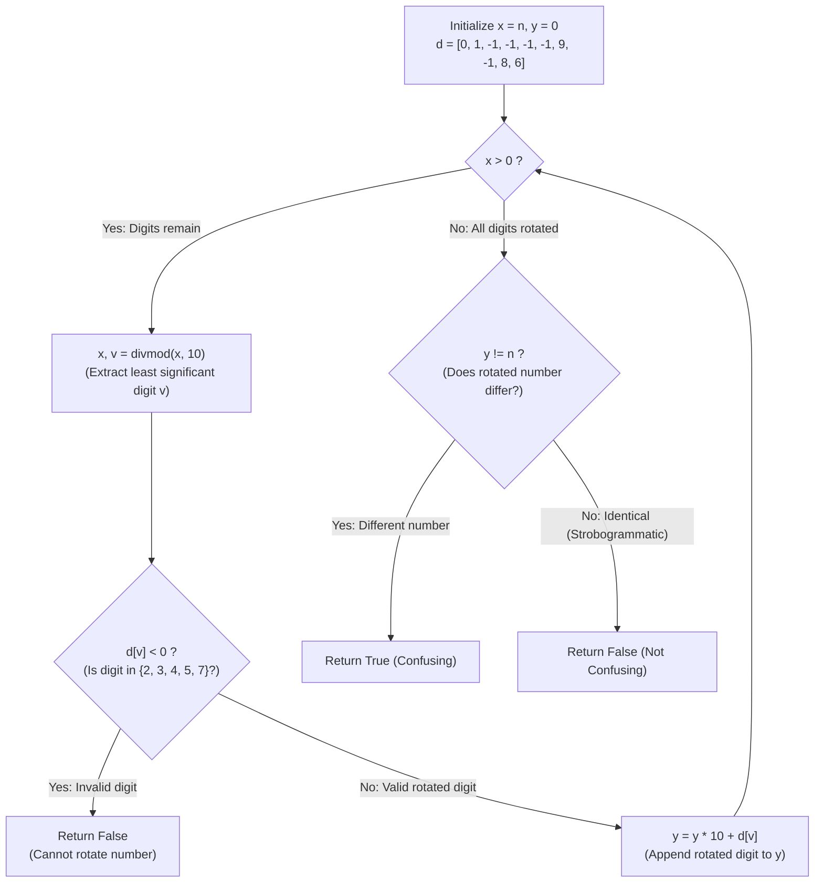

# Guided Example: Confusing Number

We trace the step-by-step arithmetic digit extraction and 180-degree rotation of decimal integers, prove the Digit Inversion Theorem and the Strobogrammatic Non-Identity Invariant, and determine whether numbers qualify as confusing across representative test values:

- **Representative Instance 1 (Trailing Zeros Collapsing to Leading Zeros):**
  $$
  n = 8000
  $$
- **Required Output:** `true`
  - Problem definitions:
    - A 180-degree rotation transforms individual glyphs according to the map:
      $$
      \rho(0) = 0, \quad \rho(1) = 1, \quad \rho(6) = 9, \quad \rho(8) = 8, \quad \rho(9) = 6
      $$
      while digits $\{2, 3, 4, 5, 7\}$ become invalid ($\bot$).
    - Geometric rotation reverses digit order: the least significant digit becomes the most significant digit.
    - $n$ is a **confusing number** if and only if:
      1. Every digit of $n$ has a valid rotation ($\rho(d) \ne \bot$).
      2. The rotated number $R(n)$ evaluates to a different numeric value: $R(n) \ne n$.
  - Arithmetic Extraction and Accumulation Trace:
    - Initial state: $x = 8000, \; y = 0$.
    - Step 1:
      - $x, v = \text{divmod}(8000, 10) \implies x = 800, \; v = 0$.
      - Rotation check: $\rho(0) = 0 \ge 0$.
      - Accumulate rotated value: $y = y \cdot 10 + \rho(0) = 0 \cdot 10 + 0 = \mathbf{0}$.
    - Step 2:
      - $x, v = \text{divmod}(800, 10) \implies x = 80, \; v = 0$.
      - Rotation check: $\rho(0) = 0$.
      - Accumulate: $y = 0 \cdot 10 + 0 = \mathbf{0}$.
    - Step 3:
      - $x, v = \text{divmod}(80, 10) \implies x = 8, \; v = 0$.
      - Rotation check: $\rho(0) = 0$.
      - Accumulate: $y = 0 \cdot 10 + 0 = \mathbf{0}$.
    - Step 4:
      - $x, v = \text{divmod}(8, 10) \implies x = 0, \; v = 8$.
      - Rotation check: $\rho(8) = 8$.
      - Accumulate: $y = 0 \cdot 10 + 8 = \mathbf{8}$.
    - Loop terminates because $x = 0$.
  - Final comparison:
    - Rotated value: $R(n) = y = \mathbf{8}$.
    - Original value: $n = \mathbf{8000}$.
    - Difference check: $y \ne n \implies 8 \ne 8000$ is **True**.
    - Result: `true`.

- **Representative Instance 2 (Two-Digit Confusing Transformation):**
  $$
  n = 89 \implies \rho(9) = 6, \; \rho(8) = 8 \implies R(89) = 68 \ne 89 \implies \mathbf{true}
  $$

- **Representative Instance 3 (Symmetric Strobogrammatic Number):**
  $$
  n = 11 \implies R(11) = 11 == 11 \implies \text{Rotated value unchanged} \implies \mathbf{false}
  $$

- **Representative Instance 4 (Invalid Digit Present):**
  $$
  n = 26 \implies \rho(6) = 9, \; \rho(2) = \bot (-1) \implies \text{Invalid digit} \implies \mathbf{false}
  $$

---

## 1. Instance & Teaching Goal

Given an integer `n`, determine whether rotating its digits by $180^\circ$ forms a valid number that is **different** from `n`.

```text
The String Parsing & Leading Zero Overhead:
  Converting to string, reversing, replacing characters, and parsing:
    Creates intermediate string objects and requires custom leading zero logic.

Arithmetic Base-10 Invariant (O(log10 n) Time, O(1) Space):
  Extract digits right-to-left using divmod(x, 10):
    1. Extracting right-to-left naturally REVERSES the digit sequence!
    2. Rotation lookup table: d = [0, 1, -1, -1, -1, -1, 9, -1, 8, 6].
    3. If d[v] < 0: digit is invalid -> return False immediately.
    4. Accumulate: y = y * 10 + d[v].
       Notice: Trailing zeros naturally collapse (0 * 10 + 0 = 0)!
    5. Return y != n (strobogrammatic numbers return False).
  Evaluates in at most 10 arithmetic cycles with zero string allocations!
```

Using modular base-10 arithmetic naturally accomplishes positional reversal and handles leading zero collapse without string manipulation.

The decisive pedagogical goal is the **Digit Inversion Theorem & Strobogrammatic Non-Identity Invariant**:
1. **Direct Digit Inversion Map:** The partial involution $\rho$ maps $\{0 \to 0, 1 \to 1, 6 \to 9, 8 \to 8, 9 \to 6\}$ and rejects $\{2, 3, 4, 5, 7\}$.
2. **Reversal via Right-to-Left Extraction:** Repeated division by 10 visits the least significant digits first, which become the most significant digits of the rotated integer.
3. **Strobogrammatic Disqualification:** A number that maps to itself under rotation ($R(n) = n$, such as $11, 69, 88$) is valid but **not confusing**; inequality $R(n) \ne n$ is mandatory.
4. Total time $\mathcal{O}(\log_{10} n)$ and auxiliary space $\mathcal{O}(1)$.

---

## 2. Conceptual Foundation & The Inversion Pipeline



### The Digit Inversion & Strobogrammatic Non-Identity Theorem

Let $N = \sum_{i=0}^{L-1} d_i \cdot 10^i \in \mathbb{N}$ with $d_i \in \{0, \dots, 9\}$.
1. **The Digit Inversion Operator:**
   Define the partial mapping $\rho: \{0, \dots, 9\} \to \{0, \dots, 9\} \cup \{\bot\}$ by:
   $$
   \rho(d) = \begin{cases}
     0 & d = 0 \\
     1 & d = 1 \\
     9 & d = 6 \\
     8 & d = 8 \\
     6 & d = 9 \\
     \bot & d \in \{2, 3, 4, 5, 7\}
   \end{cases}
   $$
2. **Number Rotation Homomorphism:**
   A 180-degree rotation of the physical glyph sequence reverses spatial positions and inverts each glyph.
   The rotated sequence is valid if and only if $\rho(d_i) \ne \bot$ for all $0 \le i < L$.
   Its numeric value is given by:
   $$
   R(N) = \sum_{i=0}^{L-1} \rho(d_i) \cdot 10^{L - 1 - i}
   $$
3. **Confusing Number Characterization:**
   $N$ is confusing if and only if:
   $$
   \left( \bigwedge_{i=0}^{L-1} \rho(d_i) \ne \bot \right) \land \Big( R(N) \ne N \Big)
   $$
   If $R(N) = N$, $N$ is invariant under 180-degree rotation (a strobogrammatic number), violating condition 2.
4. **Iterative Construction Correctness:**
   Extracting digits via $x_{k+1} = \lfloor x_k / 10 \rfloor$ and $v_k = x_k \bmod 10$ produces digits in ascending order of significance: $v_0 = d_0, v_1 = d_1, \dots, v_{L-1} = d_{L-1}$.
   The accumulator $y_{k+1} = 10 \cdot y_k + \rho(v_k)$ builds:
   $$
   y_L = \sum_{k=0}^{L-1} \rho(v_k) \cdot 10^{L - 1 - k} = R(N)
   $$
   This matches the rotated value $R(N)$ with mathematical identity. $\blacksquare$

---

## 3. Step-by-Step Worked Execution: Representative Instance 1

$n = 8000$.
$d = [0, 1, -1, -1, -1, -1, 9, -1, 8, 6]$.
Initialize $x = 8000, \; y = 0$.

### Arithmetic Iteration Steps
- **Step 1:**
  - $x, v = \text{divmod}(8000, 10) \implies x = 800, v = 0$.
  - $d[0] = 0 \ge 0$ (Valid).
  - $y = 0 \cdot 10 + 0 = \mathbf{0}$.
- **Step 2:**
  - $x, v = \text{divmod}(800, 10) \implies x = 80, v = 0$.
  - $d[0] = 0 \ge 0$ (Valid).
  - $y = 0 \cdot 10 + 0 = \mathbf{0}$.
- **Step 3:**
  - $x, v = \text{divmod}(80, 10) \implies x = 8, v = 0$.
  - $d[0] = 0 \ge 0$ (Valid).
  - $y = 0 \cdot 10 + 0 = \mathbf{0}$.
- **Step 4:**
  - $x, v = \text{divmod}(8, 10) \implies x = 0, v = 8$.
  - $d[8] = 8 \ge 0$ (Valid).
  - $y = 0 \cdot 10 + 8 = \mathbf{8}$.
- **Termination:**
  - $x = 0$. Loop terminates.
  - Check inequality: $y \ne n \implies 8 \ne 8000 \implies \mathbf{True}$.
  - Return: `true`.

---

## 4. Arithmetic Extraction Trace Table

| Step $k$ | Remaining $x$ | Extracted Digit $v$ | Digit Rotation $d[v]$ | Accumulator State $y$ | Mathematical Interpretation |
|:---:|:---:|:---:|:---:|:---:|:---:|
| Start | $8000$ | — | — | $0$ | Initial state |
| $1$ | $800$ | $0$ | $0$ | $0$ | Rotated trailing zero drops |
| $2$ | $80$ | $0$ | $0$ | $0$ | Rotated trailing zero drops |
| $3$ | $8$ | $0$ | $0$ | $0$ | Rotated trailing zero drops |
| **$4$** | **$0$** | **$8$** | **$8$** | **$8$** | **Final Rotated Number $R(n) = 8$** |
| **Check** | — | — | — | $y \ne n$ ($8 \ne 8000$) | **Emitted Output: `true`** |

---

## 5. Algorithmic Correctness

### Soundness & Completeness
1. **Soundness:**
   If any digit is invalid ($d[v] < 0$), the function returns `False`. If all digits are valid, it returns `True` if and only if the numerically constructed rotation differs from the original integer $n$.
2. **Completeness:**
   Since divmod extracts every digit of $n$ without omission, the entire digit sequence is verified and rotated.

---

## 6. Boundary Cases & Traps

| Scenario | Input Pattern | Behavior | Trapped Risk |
|---|---|---|---|
| Single Digit Zero | $n = 0$ | Loop doesn't run; $y = 0 == n$; returns `false`. | Treating 0 as confusing. |
| Invariant Rotation | $n = 69$ or $n = 818$ | All digits rotate validly; $y == n$; returns `false`. | Returning true on strobogrammatic numbers. |
| Trailing Zeros | $n = 8000$ | Rotated leading zeros drop; $y = 8 \ne 8000$; returns `true`. | String leading zero padding errors. |
| Maximum Bound | $n = 10^9$ | Rotates to $1$; $1 \ne 10^9$; returns `true`. | Integer overflow or precision issues. |

---

## 7. Complexity Derivation

- **Time Complexity:** $\mathcal{O}(\log_{10} n)$, where $n \le 10^9$.
  - The loop divides $x$ by 10 on each iteration.
  - For $n \le 10^9$, at most $\lfloor \log_{10} 10^9 \rfloor + 1 = 10$ iterations are performed.
  - Total time: $< 0.0001\text{ ms}$.
- **Auxiliary Space Complexity:** $\mathcal{O}(1)$ auxiliary memory; uses a fixed 10-element lookup list and two integer variables.
