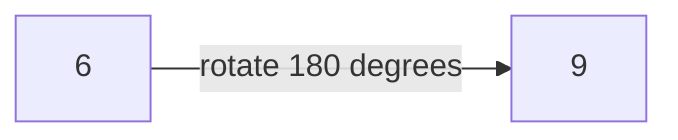
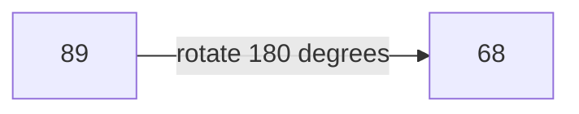
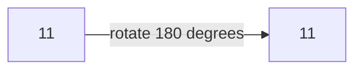

## Examples

**Example 1**

- Input: `n = 6`
- Output: `true`
- Explanation: Rotating `6` produces the valid number `9`. Because $9 \ne 6$, the input is confusing.

The source illustration shows the same single-digit transformation:

**Example 2**

- Input: `n = 89`
- Output: `true`
- Explanation: The rotated value is the valid number `68`. Since $68 \ne 89$, the input is confusing.

The source illustration depicts this two-digit transformation:

**Example 3**

- Input: `n = 11`
- Output: `false`
- Explanation: Rotating `11` produces the valid number `11`, but its value is unchanged. Therefore, the input is not confusing.

The source illustration emphasizes that the rotation leaves this value unchanged:

