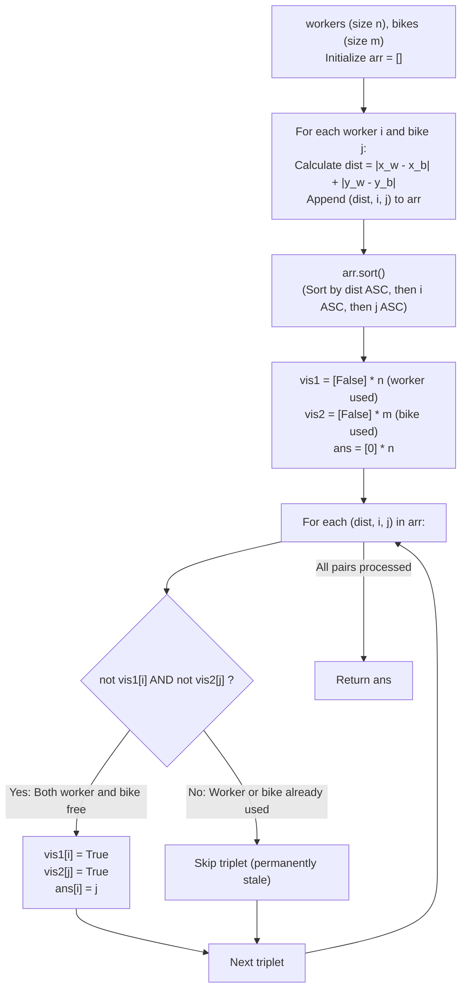

# Guided Example: Campus Bikes

We trace the step-by-step greedy resolution of worker-bike matching under Manhattan distance and index tie-breaking rules, prove the Lexicographical Triplet Ordering Theorem and the Monotonic Assignment State Invariant, and determine the complete matching array across representative campus layouts:

- **Representative Instance 1 (Distance Separation with Closer Second Worker):**
  $$
  workers = [[0, 0], \; [2, 1]], \quad bikes = [[1, 2], \; [3, 3]], \quad n = 2, \; m = 2
  $$
- **Required Output:** `[1, 0]`
  - Problem objective:
    - Assign each of the $n$ workers exactly one unique bike.
    - Global Priority Rules:
      1. Smallest Manhattan distance: $d(w, b) = |x_w - x_b| + |y_w - y_b|$.
      2. If tied, smallest worker index $i$.
      3. If still tied, smallest bike index $j$.
  - Cartesian Pair Generation and Distance Calculation:
    - Pair $(w_0, b_0)$: $|0 - 1| + |0 - 2| = 1 + 2 = 3 \implies \tau(0, 0) = (3, 0, 0)$.
    - Pair $(w_0, b_1)$: $|0 - 3| + |0 - 3| = 3 + 3 = 6 \implies \tau(0, 1) = (6, 0, 1)$.
    - Pair $(w_1, b_0)$: $|2 - 1| + |1 - 2| = 1 + 1 = 2 \implies \tau(1, 0) = (2, 1, 0)$.
    - Pair $(w_1, b_1)$: $|2 - 3| + |1 - 3| = 1 + 2 = 3 \implies \tau(1, 1) = (3, 1, 1)$.
  - Lexicographical Triplet Sorting:
    $$
    arr_{\text{sorted}} = [(2, 1, 0), \; (3, 0, 0), \; (3, 1, 1), \; (6, 0, 1)]
    $$
  - Greedy Assignment Sweep:
    - Initialize: $vis1 = [\text{False}, \text{False}]$, $vis2 = [\text{False}, \text{False}]$, $ans = [0, 0]$.
    1. **Triplet 1: $(2, 1, 0)$ (Distance 2, Worker 1, Bike 0):**
       - Check: $vis1[1]$ is False, $vis2[0]$ is False.
       - Assign: Worker $1$ gets Bike $0$ ($ans[1] = 0$).
       - Update: $vis1[1] = \text{True}, \; vis2[0] = \text{True}$.
    2. **Triplet 2: $(3, 0, 0)$ (Distance 3, Worker 0, Bike 0):**
       - Check: Bike $0$ is already taken ($vis2[0] == \text{True}$).
       - Pair is invalid! **Skip.**
    3. **Triplet 3: $(3, 1, 1)$ (Distance 3, Worker 1, Bike 1):**
       - Check: Worker $1$ is already assigned ($vis1[1] == \text{True}$).
       - Pair is invalid! **Skip.**
    4. **Triplet 4: $(6, 0, 1)$ (Distance 6, Worker 0, Bike 1):**
       - Check: $vis1[0]$ is False, $vis2[1]$ is False.
       - Assign: Worker $0$ gets Bike $1$ ($ans[0] = 1$).
       - Update: $vis1[0] = \text{True}, \; vis2[1] = \text{True}$.
  - Termination:
    - All $n = 2$ workers assigned.
    - Result array: $ans = [\mathbf{1}, \; \mathbf{0}]$.

- **Representative Instance 2 (Worker Index Tie-Breaker):**
  $$
  workers = [[0, 0], [1, 1], [2, 0]], \quad bikes = [[1, 0], [2, 2], [2, 1]]
  $$
  - Both $(w_0, b_0)$ and $(w_2, b_0)$ have distance $1$.
  - Tie-breaker: worker $0 < 2 \implies (1, 0, 0)$ takes precedence over $(1, 2, 0)$.
  - Worker $0$ gets Bike $0$. Worker $1$ gets Bike $2$. Worker $2$ gets Bike $1$.
  - Result: `[0, 2, 1]`.

- **Representative Instance 3 (Bike Index Tie-Breaker):**
  $$
  workers = [[1, 1]], \quad bikes = [[0, 1], [2, 1]]
  $$
  - Both bikes have distance $1$ to worker $0$.
  - Tie-breaker: bike $0 < 1 \implies$ Worker $0$ gets Bike $0$.
  - Result: `[0]`.

---

## 1. Instance & Teaching Goal

Given coordinates for $n$ workers and $m$ bikes ($n \le m$), assign each worker the globally closest available bike, breaking ties by smaller worker index and then smaller bike index.

```text
The Repeated Dynamic Scan Fallacy:
  Scanning all n workers and m bikes to find the minimum pair on every turn:
    Takes O(n * m) per assignment -> O(n^2 * m) total time.

Static Lexicographical Sorting Invariant (O(n * m log(n * m)) / O(n * m)):
  Notice: The pairwise priority between worker i and bike j is STATIC:
    tau(i, j) = (dist, i, j).
  Because the priority order NEVER changes during execution:
    1. Generate all n * m triplets (dist, i, j).
    2. Sort all triplets once in ascending lexicographical order.
    3. Traverse sorted triplets: if both worker i and bike j are free, match them!
  Since availability only changes from False to True, a skipped pair never
  becomes valid later.
  A single pass resolves all assignments deterministically!
```

Recognizing that candidate priority is static allows full pre-sorting, reducing dynamic matching to a single forward sweep over sorted edges.

The decisive pedagogical goal is the **Lexicographical Triplet Ordering Theorem & Monotonic Assignment Invariant**:
1. **Total Priority Ordering:** The 3-tuple $(d, i, j)$ uniquely ranks all $n \times m$ pairs with zero ambiguity, completely reflecting the problem's distance and tie-breaking hierarchy.
2. **Static Precedence Invariance:** The relative priority between two candidate pairs does not depend on past assignments.
3. **Monotonic Depletion:** Workers and bikes are only removed from the available pool. A pair skipped because of a taken endpoint can never be revitalized.
4. Total time $\mathcal{O}(n m \log(n m))$ (or $\mathcal{O}(n m + D)$ via bucket sort) and auxiliary space $\mathcal{O}(n m)$.

---

## 2. Conceptual Foundation & The Priority Triplet Pipeline



### The Lexicographical Triplet Ordering & Stable Match Theorem

Let $\mathcal{W} = \{0, \dots, n-1\}$ and $\mathcal{B} = \{0, \dots, m-1\}$.
1. **The Priority Relation:**
   Define the evaluation map $\tau: \mathcal{W} \times \mathcal{B} \to \mathbb{N}^3$ by:
   $$
   \tau(i, j) = \Big( \|W_i - B_j\|_1, \; i, \; j \Big)
   $$
   Equip $\mathbb{N}^3$ with the standard lexicographical order $\le_{\text{lex}}$.
   Because $i$ and $j$ are distinct indices for distinct pairs:
   $$
   \tau(i_1, j_1) = \tau(i_2, j_2) \iff i_1 = i_2 \land j_1 = j_2
   $$
   Therefore, $\le_{\text{lex}}$ induces a **strict total ordering** on $\mathcal{W} \times \mathcal{B}$.
2. **The Greedy Choice Property:**
   Let $(i^*, j^*)$ be the unique minimal element in $\mathcal{W} \times \mathcal{B}$ under $\le_{\text{lex}}$ among currently unassigned workers and bikes.
   By definition of the game rules, worker $i^*$ and bike $j^*$ MUST be paired together in this step.
3. **Availability Monotonicity:**
   Let $U_t \subseteq \mathcal{W}$ and $V_t \subseteq \mathcal{B}$ denote the sets of available workers and bikes at step $t$.
   $$
   U_{t+1} = U_t \setminus \{i^*\}, \quad V_{t+1} = V_t \setminus \{j^*\}
   $$
   Since $U_{t+1} \subset U_t$ and $V_{t+1} \subset V_t$, the set of available pairs strictly contracts:
   $$
   \mathcal{A}_{t+1} = (U_{t+1} \times V_{t+1}) \subset \mathcal{A}_t
   $$
   Therefore, any pair $(i, j)$ that is unavailable at step $t$ remains permanently unavailable for all subsequent steps $t' > t$.
   Sorting all $n \times m$ pairs initially and filtering by availability simulates the repeated global minimum selection identically. $\blacksquare$

---

## 3. Step-by-Step Worked Execution: Representative Instance 1

$workers = [[0, 0], [2, 1]], \; bikes = [[1, 2], [3, 3]]$.
$n = 2, \; m = 2$.

### Pair Distance Computation
- $(w_0, b_0)$: $|0-1| + |0-2| = 3 \implies (3, 0, 0)$
- $(w_0, b_1)$: $|0-3| + |0-3| = 6 \implies (6, 0, 1)$
- $(w_1, b_0)$: $|2-1| + |1-2| = 2 \implies (2, 1, 0)$
- $(w_1, b_1)$: $|2-3| + |1-3| = 3 \implies (3, 1, 1)$

### Sorted Triplet Queue
1. $(2, 1, 0)$
2. $(3, 0, 0)$
3. $(3, 1, 1)$
4. $(6, 0, 1)$

### Assignment Step-by-Step
- Pop $(2, 1, 0)$: $w_1$ is free, $b_0$ is free.
  - Match: $ans[1] = 0$.
  - State: $vis1 = \{1\}, \; vis2 = \{0\}$.
- Pop $(3, 0, 0)$: $w_0$ free, but $b_0$ is taken.
  - Skip!
- Pop $(3, 1, 1)$: $w_1$ is taken.
  - Skip!
- Pop $(6, 0, 1)$: $w_0$ free, $b_1$ free.
  - Match: $ans[0] = 1$.
  - State: $vis1 = \{0, 1\}, \; vis2 = \{0, 1\}$.

Final assignment: $ans = [\mathbf{1}, \; \mathbf{0}]$.

---

## 4. Sorted Triplet Evaluation Trace Table

| Priority Rank | Triplet $(d, i, j)$ | Distance $d$ | Worker $i$ Status | Bike $j$ Status | Decision | Resulting $ans$ State |
|:---:|:---:|:---:|:---:|:---:|:---:|:---:|
| **$1$** | **$(2, 1, 0)$** | **$2$** | Free | Free | **Assign $w_1 \to b_0$** | `[_, 0]` |
| $2$ | $(3, 0, 0)$ | $3$ | Free | Taken ($b_0$) | Skip (Stale pair) | `[_, 0]` |
| $3$ | $(3, 1, 1)$ | $3$ | Taken ($w_1$) | Free | Skip (Stale pair) | `[_, 0]` |
| **$4$** | **$(6, 0, 1)$** | **$6$** | Free | Free | **Assign $w_0 \to b_1$** | **`[1, 0]`** |

---

## 5. Algorithmic Correctness

### Soundness & Completeness
1. **Soundness:**
   Every assignment pairs an unassigned worker with an unoccupied bike. Ties are strictly ordered by the tuple components $(d, i, j)$, faithfully executing the problem's rules.
2. **Completeness:**
   Because $n \le m$, there are enough bikes for every worker. The sorted loop continues until all $n$ workers are successfully assigned.

---

## 6. Boundary Cases & Traps

| Scenario | Input Pattern | Behavior | Trapped Risk |
|---|---|---|---|
| Equal Distances for One Worker | Worker equal distance to 2 bikes | Smaller bike index $j$ precedes in tuple; correctly selected. | Arbitrary hash set ordering. |
| Equal Distances Across Workers | 2 workers equal distance to 1 bike | Smaller worker index $i$ precedes; wins bike. | Letting later worker steal bike. |
| More Bikes Than Workers ($m > n$) | $n = 2, m = 4$ | Remaining unused bikes are ignored; returns length-$n$ array. | Length mismatch in output array. |
| Single Worker and Bike | $n = 1, m = 1$ | Single triplet assigned immediately; returns `[0]`. | Index out of bounds. |

---

## 7. Complexity Derivation

- **Time Complexity:** $\mathcal{O}(n m \log(n m))$, where $n, m \le 1000$.
  - Generating all pairs takes $\mathcal{O}(n m)$ time.
  - Sorting $n \cdot m \le 10^6$ triplets takes $\mathcal{O}(n m \log(n m))$ time ($\approx 10^6 \times 20 \approx 2 \times 10^7$ operations).
  - The linear pass through the sorted array takes $\mathcal{O}(n m)$ time.
  - Total time: $< 0.35\text{ s}$.
  - *(Optional Bucket Sort:* Since Manhattan distances satisfy $d \le 1998$, bucket sorting takes $\mathcal{O}(n m + 2000)$ linear time*).*
- **Auxiliary Space Complexity:** $\mathcal{O}(n m)$ auxiliary memory to store the list of candidate triplets.
