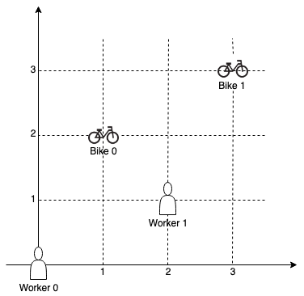
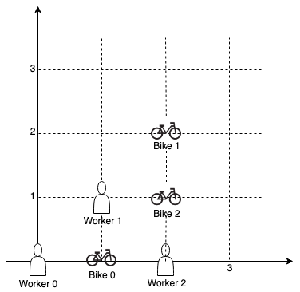

### 1. Description

On a campus represented on the X-Y plane, there are `n` workers and `m` bikes, with $n \le m$.

You are given an array `workers` of length `n` where $\text{workers}[i] = [x_{i}, y_{i}]$ is the position of the $i^{\text{th}}$ worker. You are also given an array `bikes` of length `m` where $\text{bikes}[j] = [x_{j}, y_{j}]$ is the position of the $j^{\text{th}}$ bike. All the given positions are **unique**.

Assign a bike to each worker. Among the available bikes and workers, we choose the $(\text{worker}_{i}, \text{bike}_{j})$ pair with the shortest **Manhattan distance** between each other and assign the bike to that worker.

If there are multiple $(\text{worker}_{i}, \text{bike}_{j})$ pairs with the same shortest **Manhattan distance**, we choose the pair with **the smallest worker index**. If there are multiple ways to do that, we choose the pair with **the smallest bike index**. Repeat this process until there are no available workers.

Return *an array *`answer`* of length *`n`*, where *$\text{answer}[i]$* is the index (**0-indexed**) of the bike that the *$i^{\text{th}}$* worker is assigned to*.

The **Manhattan distance** between two points `p1` and `p2` is $Manhattan(p1, p2) = |\text{p1.x} - \text{p2.x}| + |\text{p1.y} - \text{p2.y}|$.

### 2. Function Contract

**Inputs**

- `workers`: an array of $W$ distinct coordinate pairs, where index $i$ identifies worker $i$.
- `bikes`: an array of $B$ distinct coordinate pairs, where index $j$ identifies bike $j$.

Each assignment consumes one currently available worker and one currently available bike. The comparison key for every available pair is `(Manhattan distance, worker index, bike index)`, in that order.

Let $D$ denote the largest possible Manhattan distance between two legal coordinates. Under the stated coordinate bounds, $D=1998$.

**Return value**

- An integer array `answer` of length $W$, where $\text{answer}[i]$ is the 0-indexed bike assigned to worker `i`.

### 3. Examples

#### Example 1

- **Input:** $workers = [[0,0],[2,1]], bikes = [[1,2],[3,3]]$
- **Output:** `[1,0]`
- **Explanation:** Worker 1 grabs Bike 0 as they are closest (without ties), and Worker 0 is assigned Bike 1. So the output is [1, 0].

#### Example 2

- **Input:** $workers = [[0,0],[1,1],[2,0]], bikes = [[1,0],[2,2],[2,1]]$
- **Output:** `[0,2,1]`
- **Explanation:** Worker 0 grabs Bike 0 at first. Worker 1 and Worker 2 share the same distance to Bike 2, thus Worker 1 is assigned to Bike 2, and Worker 2 will take Bike 1. So the output is [0,2,1].

### 4. Constraints

- $n = \text{workers.length}$

- $m = \text{bikes.length}$

- $1 \le n \le m \le 1000$

- $\text{workers}[i].length = \text{bikes}[j].length = 2$

- $0 \le x_{i}, y_{i} < 1000$

- $0 \le x_{j}, y_{j} < 1000$

- All worker and bike locations are **unique**.
