## Solution

---

### Overview

We have $n$ workers and $m$ bikes. We need to assign each worker a bike and since $m \geq n$ it's always possible to do so. We are instructed to make the above assignments in the ascending order of the following parameters:

1. Manhattan Distance
2. Worker Index
3. Bike Index

First, we will check the Manhattan distance between each worker and each bike and prioritize the `(worker, bike)` pairs with smaller Manhattan distances. If multiple pairs have the same distance, we will go on to check the worker index and prioritize pairs with smaller worker indices. If the worker index is also the same, we prioritize pairs with lower bike indices. Two `(worker, bike)` pairs cannot have all the three attributes the same, so these three attributes are enough to ensure a unique solution. Therefore, the problem boils down to sorting the `(worker, bike)` pairs in the order as explained above while keeping track of which workers and bikes have been assigned.
</br>

---

### Approach 1: Sorting

**Intuition**

As discussed, we want to organize the `(worker, bike)` pairs in ascending order, prioritizing their Manhattan distance, then worker index, and then bike index. Therefore, we will generate all possible `(worker, bike)` pairs and sort them according to the previously listed priorities. We will then iterate over the pairs, if both the worker and bike are available, assign the bike to the worker, and mark them both as unavailable. We will repeat this process until all workers have been assigned a bike.

**Algorithm**

1. Generate all the `(worker, bike)` pairs, and for each pair find the Manhattan distance `distance`. Store these three attributes in the tuple as `{distance, worker index, bike index}`. In Java, we use the defined type `WorkerBikePair` to store these three attributes.
2. Store all the generated triplets in `allTriplets` which is the list of tuples (or `WorkerBikePair` in the case of Java).
3. Sort the list `allTriplets` in ascending order of their distance, worker index, and then bike index. In  C++ & Python we can use the default behavior of sorting in the order of the attributes by storing them as `{distance, worker index, bike index}` inside the tuple. While In Java we will explicitly define the custom comparator `WorkerBikePairComparator` to sort accordingly.
4. Iterate over the list `allTriplets`, and for each triplet:

- If the worker has not been assigned a bike ($\text{workerStatus}[workerIndex]$ is `-1`), and the bike is still available ($\text{bikeStatus}[bike]$ is `false`). Then assign the bike to the worker and mark them both as unavailable. Increment the number of pairs in the variable `pairCount`.
- If all the workers have been assigned a bike (`pairCount` is equal to the number of workers) we can stop iterating over the pairs.
5. Return `workerStatus`.

**Implementation**

```python
class Solution:
    def assignBikes(self, workers: List[List[int]], bikes: List[List[int]]) -> List[int]:

        def find_distance(worker_loc, bike_loc):
            return abs(worker_loc[0] - bike_loc[0]) + abs(worker_loc[1] - bike_loc[1])

        # Calculate the distance between each worker and bike.
        all_triplets = []
        for worker, worker_loc in enumerate(workers):
            for bike, bike_loc in enumerate(bikes):
                distance = find_distance(worker_loc, bike_loc)
                all_triplets.append((distance, worker, bike))

        # Sort the triplets. By default, sorting will prioritize the
        # tuple's first value, then second value, and finally the third value
        all_triplets.sort()

        # Initialize all values to False, to signify no bikes have been taken
        bike_status = [False] * len(bikes)
        # Initialize all values to -1, to signify no worker has a bike
        worker_status = [-1] * len(workers)
        # Keep track of how many worker-bike pairs have been made
        pair_count = 0

        for distance, worker, bike in all_triplets:
            # If both worker and bike are free, assign the bike to
            # the worker and mark the bike as taken
            if worker_status[worker] == -1 and not bike_status[bike]:
                bike_status[bike] = True
                worker_status[worker] = bike
                pair_count += 1

                # If all the workers have the bike assigned, we can stop
                if pair_count == len(workers):
                    return worker_status

        return worker_status
```

**Complexity Analysis**

Here, $N$ is the number of workers, and $M$ is the number of bikes.

* Time complexity: $O(NM \log (NM))$

   There will be a total of $NM$ `(worker, bike)` pairs. Sorting a list of $NM$ elements will cost $O(NM \log (NM))$ time. In the worst case, we have to iterate over all the pairs to assign each worker a bike. Thus, iterating over these pairs costs $O(NM)$ time. Since the time complexity for sorting is the dominant term, the time complexity is $O(NM \log (NM))$.

* Space complexity: $O(NM)$

  `WorkerBikePair` or the tuple has three variables, hence taking $O(1)$ space. Storing $NM$ `WorkerBikePairs` or tuples in `allTriplets` will cost $O(NM)$ space. To track the availability of the bikes `bikeStatus` takes $O(M)$ space. Storing bikes index corresponding to worker index in `workerStatus` takes $O(N)$ space.

  The space complexity of the sorting algorithm depends on the implementation of each programming language. For instance, in Java, the Arrays.sort() for primitives is implemented as a variant of quicksort algorithm whose space complexity is $O(\log NM)$. In C++ sort() function provided by STL is a hybrid of Quick Sort, Heap Sort, and Insertion Sort and has a worst-case space complexity of $O(\log NM)$. In Python sort() function uses TimSort which has a worst-case space complexity of $O(NM)$. Thus, the use of the inbuilt sort() function might add up to $O(NM)$ to space complexity.

  The total space required is $(NM + N + M + NM)$ hence, the complexity is equal to $O(NM)$.
<br/>

---

### Approach 2:  Bucket Sort

**Intuition**

As stated in the problem description, there can be at most `1000` workers and at most `1000` bikes, which means we could potentially have $10^6$ `(worker, bike)` pairs. If we closely observe the problem constraints, the coordinates for both bike and worker are in the range $[0, 1000)$. Therefore, the maximum Manhattan distance that is possible between a worker, and a bike is `1998`. This maximum value is possible when one of the bike/workers is at `(0, 0)` and the other entity worker/bike is at `(999, 999)`.

As discussed earlier, we want the `(worker, bike)` pairs in ascending order of their distance, and distance could be in range `[0, 1998]`. Remember, when we have input distributed over a known **short** range, we can use bucket sort. In bucket sort, we distribute the elements into an array of buckets and then sort each bucket individually. So instead of sorting a large number of pairs, we can group the pairs by distance, then sort each group individually. Thus, iterating over the buckets in ascending order and for each bucket, iterating over the sorted contents will be equivalent to iterating over a sorted list of all pairs.

Aside from implementing bucket sort, this approach is the same as the previous approach. We will still sort all of the pairs, but this time we will first group them by their distance and sort each group individually. Then, to arrange the pairs in ascending order, we simply iterate over the possible distances in ascending order.

**Note**: Our goal is to order the pairs according to distance first, then worker index, then bike index. Grouping the pairs by distance allows us to iterate over the groups of pairs in ascending order of distance. In bucket sort, normally, our next step is to sort each bucket to ensure that the `{worker index, bike index}` pairs are in ascending order within each bucket. However, when creating these pairs, we iterated over the worker indices in ascending order and then over the bike indices in ascending order. So it is guaranteed that the pairs are already in ascending order within each bucket! Thus, each bucket does not need to be sorted.

**Algorithm**

1. Generate all the `(worker, bike)` pairs, and for each pair, find the Manhattan distance, `distance`. Add this pair to the list `disToPairs` corresponding to the index `distance`.
2. Among all the pairs generated, store the minimum distance in the variable `minDis`.
3. Initialize `currDis` to `minDis`. Until all the workers have been assigned a bike, do the following:
   - Iterate over the pairs with distance `currDis`
   - If the worker and bike are available, assign the bike to the worker in the list `workerStatus` and mark the bike unavailable in `bikeStatus`. Increment the value of `pairCount` which is the value of worker-bike pairs that have been made.
   - Once all the pairs with the current distance have been traversed, increment the value of `currDis`.
4. Return `workerStatus`.

**Implementation**

```python
class Solution:
    def assignBikes(self, workers: List[List[int]], bikes: List[List[int]]) -> List[int]:

        def find_distance(worker_loc, bike_loc):
            return abs(worker_loc[0] - bike_loc[0]) + abs(worker_loc[1] - bike_loc[1])

        min_dist = float('inf')
        dist_to_pairs = collections.defaultdict(list)

        for worker, worker_loc in enumerate(workers):
            for bike, bike_loc in enumerate(bikes):
                distance = find_distance(worker_loc, bike_loc)
                dist_to_pairs[distance].append((worker, bike))
                min_dist = min(min_dist, distance)

        curr_dist = min_dist
        # Initialize all values to false, to signify no bikes have been taken
        bike_status = [False] * len(bikes)
        # Initialize all values to -1, to signify no worker has a bike
        worker_status = [-1] * len(workers)
        # Keep track of how many worker-bike pairs have been made
        pair_count = 0

        # While all workers have not been assigned a bike
        while pair_count < len(workers):
            for worker, bike in dist_to_pairs[curr_dist]:
                if worker_status[worker] == -1 and not bike_status[bike]:
                    # If both worker and bike are free, assign them to each other
                    bike_status[bike] = True
                    worker_status[worker] = bike
                    pair_count += 1
            curr_dist += 1

        return worker_status
```

**Complexity Analysis**

Here, $N$ is the number of workers, $M$ is the number of bikes, and $K$ is the maximum possible Manhattan distance of a worker/bike pair. In this problem, $K$ equals $1998$.

* Time complexity: $O(NM + K)$

   Generating all the `(worker, bike)` pairs takes $O(NM)$ time. We are iterating over the generated pairs in the while loop according to their distance. Hence, at most, we will iterate over all $NM$ pairs. But since there could be some `currDis` values at which no pairs exist, hence these operations have to be counted as well. The total possible values for `currDis` is $K$. Hence the time complexity equals $O(NM + K)$

* Space complexity: $O(NM + K)$

  We store all the pairs corresponding to their distance in `disToPairs`, which requires $O(NM)$ space. To track the availability of the bikes `bikeStatus` takes $O(M)$ space. Storing the index of the bike each worker is assigned in `workerStatus` takes $O(N)$ space. Also, note that in `C++` implementation, we have defined an array of size $K$. Hence, even if there are fewer than $K$ pairs, it will still cost $O(K)$ space.

<br/>

---

### Approach 3: Priority Queue

**Intuition**

As discussed earlier, we need `(worker, bike)` pairs in ascending order. One way is to put all the $n\cdot m$ `workerBikePair ({worker index, bike index, distance})` in a min-heap, and then we can keep popping from the heap to fetch the shortest Manhattan distance pair. The drawback here is that we have $n \cdot m$ pairs to choose the first pair from. However, we can discard some of the pairs without ever inserting them into the priority queue. Consider the first worker who will receive a bike. We don't need to push all the pairs for this worker corresponding to all the bikes. Instead, we could just put the one pair corresponding to the closest bike because the other pairs cannot be the pair with the smallest Manhattan distance.

In this approach, we will find the closest bike for each worker and put their corresponding `workerBikePair` (or tuple in the case of C++) in the priority queue. Thus, we will have at most $n$ elements in the priority queue at any given time instead of $n \cdot m$. This way, we can omit `(worker, bike)` pairs that are not the potential candidates for the shortest Manhattan distance.

Now, among these $n$ elements (one element for each worker), the one with the shortest Manhattan distance will be on top. Hence, we will pop it, and if the bike in this element is not taken, we will assign the bike to the worker. In case, the bike in the pair we popped is already assigned to a different worker, we will discard this pair and push a new pair (that is the next closest bike to this worker) into the priority queue. This way, the priority queue will always have the smallest distance pair for each remaining worker. We will continue to pop from the priority queue until all the workers have been assigned a bike.

Essentially we made a sorted list of bikes for each worker according to the Manhattan distance. Thus, we have sorted lists of size $m$ for each of the $n$ workers. We need to merge precisely one element from each of these $n$ sorted lists. Hence, we will insert the first element from each of the $n$ lists into a priority queue and pop the minimum element. If the bike in the popped pair is available, then we will assign it to the worker in the pair. Otherwise, we insert the next pair in the sorted list for the worker in the popped pair. This is very similar to what we do in merge sort when combining two sorted lists. The only difference is that we have $n$ lists, and we need to track the availability of bikes.

The below slideshow demonstrates the algorithm:

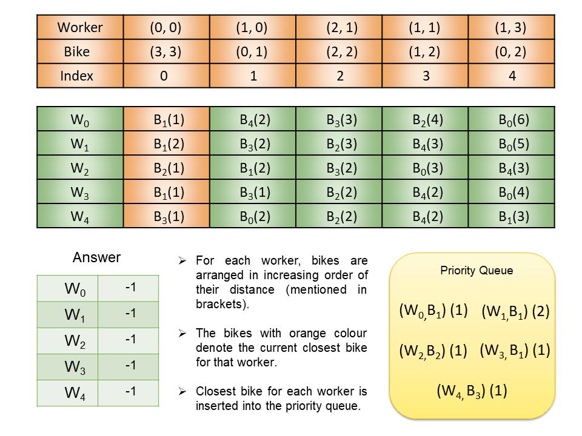

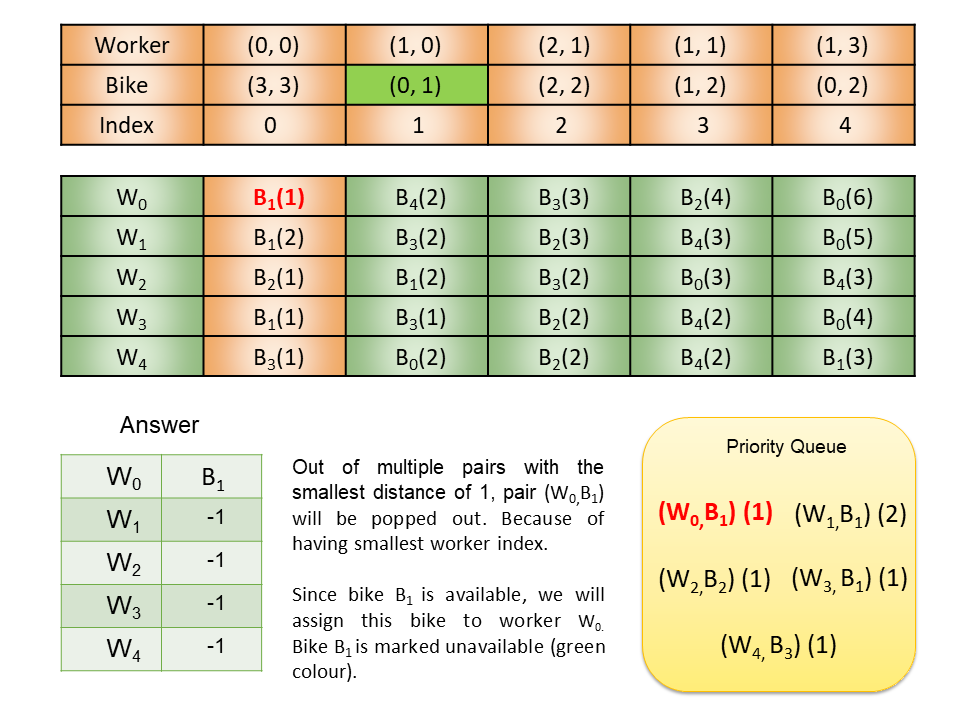

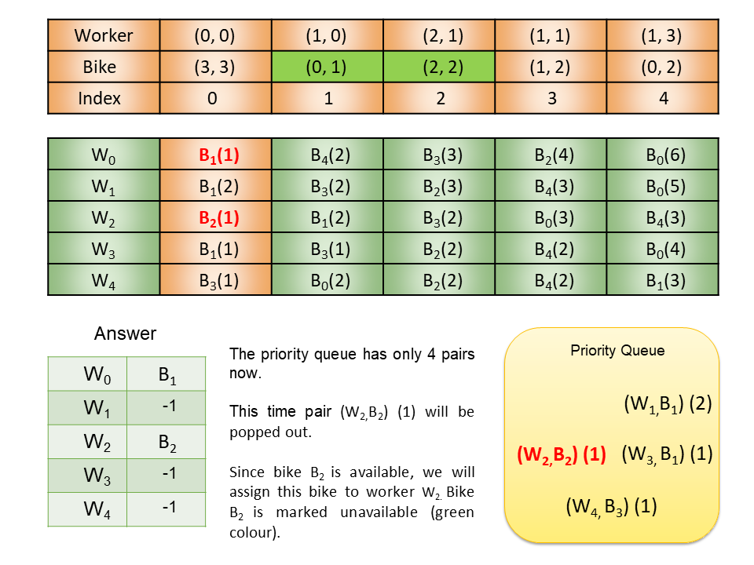

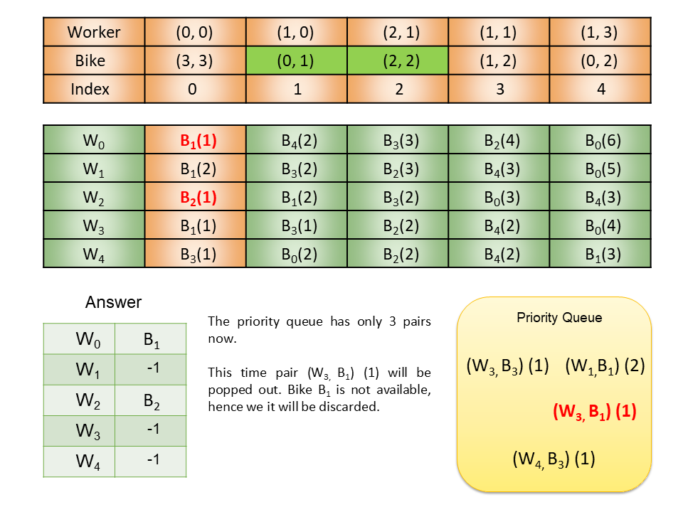

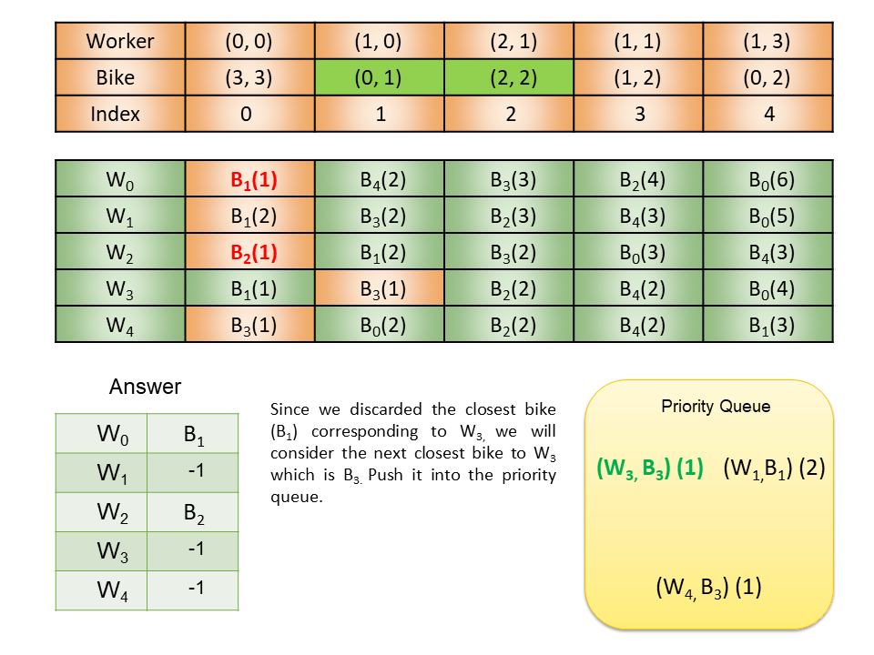

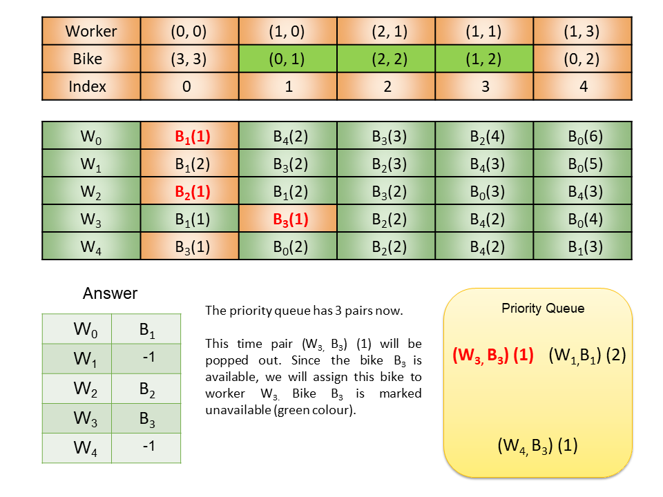

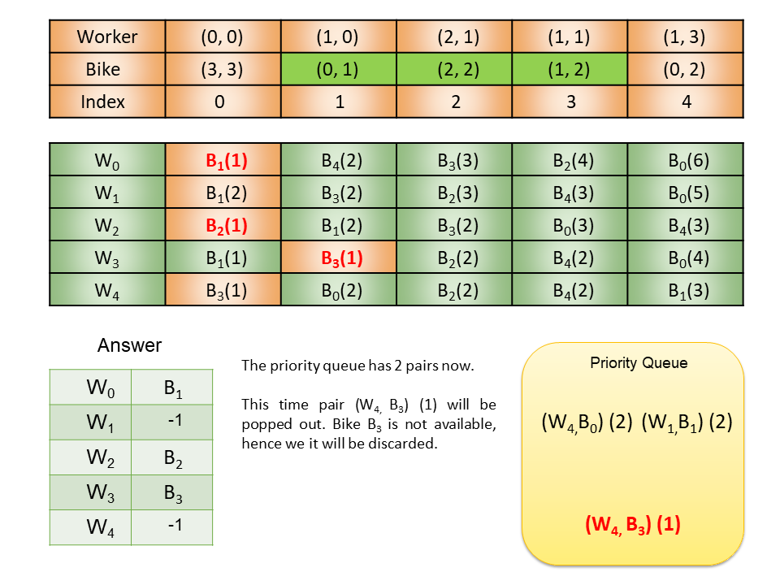

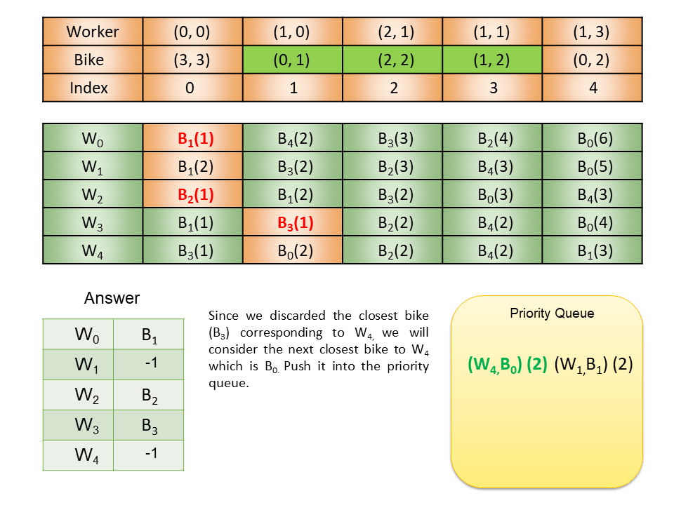

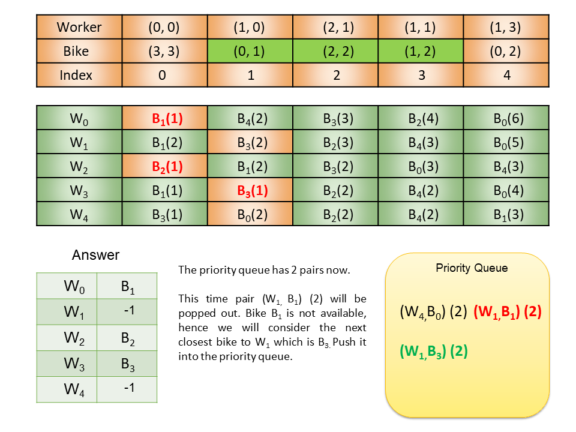

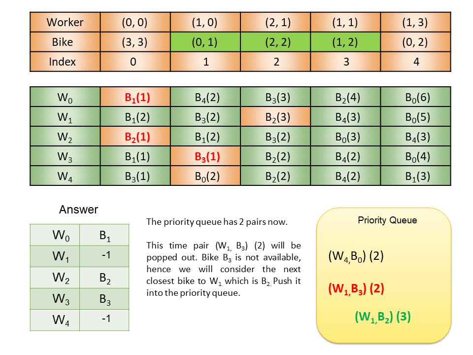

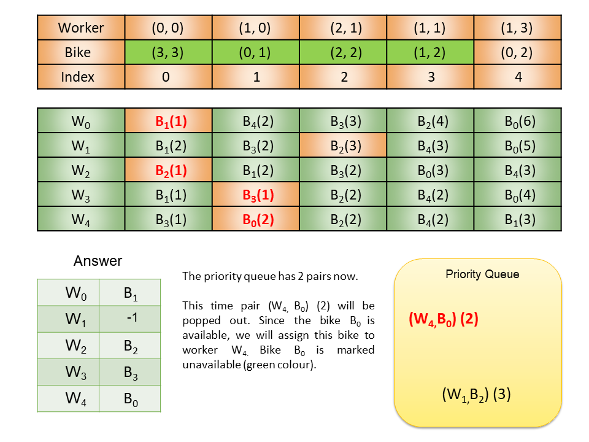

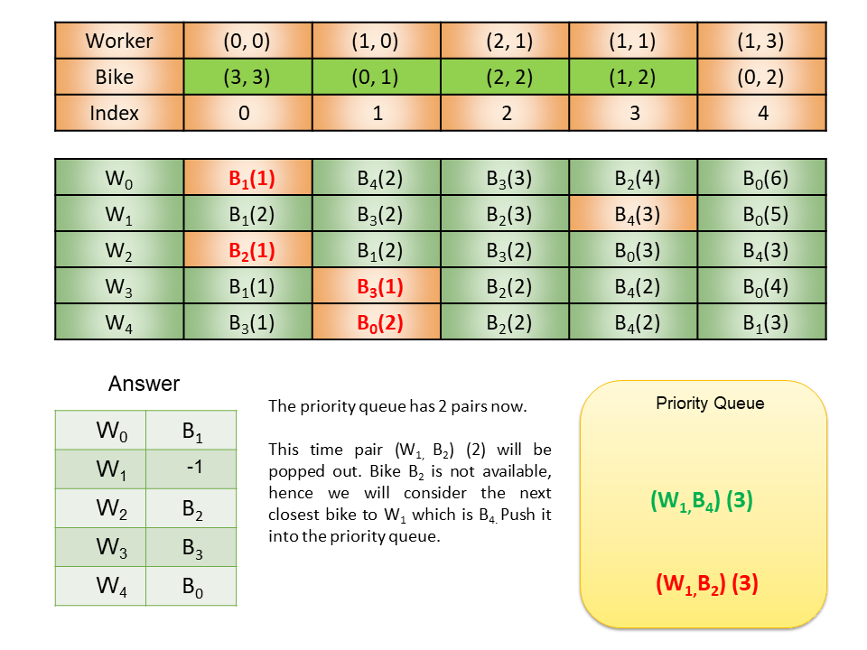

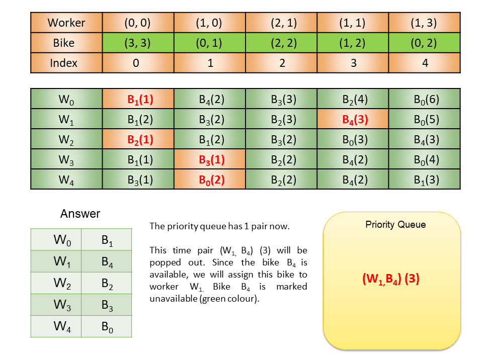

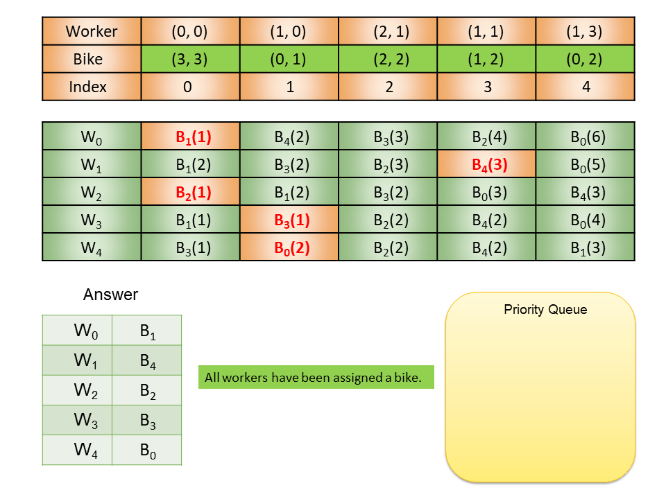

 <br>

**Algorithm**

**Note:** We have a different implementation for C++ & Python than Java owing to the absence of any standard Tuple library in Java. Hence, we have covered the algorithm separately for C++/Python & Java.

**Java**

1. Iterate over workers and for each worker:
   - Find the distance from each bike. Store the bike and distance information as defined type `WorkerBikePair` (`{distance, bike index}`) in the list `currWorkerPairs`.
   - Sort the list `currWorkerPairs` using the custom comparator `WorkerBikePairComparator`.
   - Store the above list corresponding to the worker as $\text{workerToBikeList}[worker] = currWorkerPairs$
   - In the list `closestBikeIndex`, set the closest bike index for this worker to `0`, as $\text{closestBikeIndex}[worker] = 0$.
   - Call the `addClosestBikeToPq` function, in this function we:
     - Fetch the closest bike for the worker. The closest bike index is present at $\text{closestBikeIndex}[worker]$. Thus, the closest bike pair can be accessed as $\text{workerToBikeList}[worker][\text{closestBikeIndex}[worker]]$.
     - Insert the above `WorkerBikePair` into the priority queue `pq`.
     - Increment the value of $\text{closestBikeIndex}[worker]$. This value now points to the next closest bike for this worker.
2. Until the priority queue is not empty:
   - Pop the top element from `pq`.
   - If the bike is available, assign it to the worker in the list `workerStatus` and mark the bike unavailable in `bikeStatus`.
   - If the bike is unavailable, call the `addClosestBikeToPq` for the current worker.
3. Return `workerStatus`.

**C++/Python**

1. Iterate over workers and for each worker:
   - Find the distance from each bike. Store the bike and distance information as a tuple `{distance, worker index, bike index}` in the list of tuples `currWorkerPairs`.
   - Sort the list `currWorkerPairs` in reverse order. The reason we sort in reverse order is so that the `(worker, bike)` pair with minimum value (in order of distance, then worker index, then bike index) will be present at the end of the sorted list. So getting the next closest bike for a worker only requires popping the last element from the sorted list.
   - Store the above list corresponding to the worker as $\text{workerToBikeList}[worker] = currWorkerPairs$
   - Fetch the tuple corresponding to the closest bike for the worker. The closest bike is present at `currWorkerPairs.back()`.
   - Insert the above tuple into the priority queue `pq`.
   - Pop the last element from `currWorkerPairs` to get the next closest bike to this worker.
2. While the priority queue is not empty:
   - Pop the top element from `pq`.
   - If the bike is available, assign it to the worker in the list `workerStatus` and mark the bike unavailable in `bikeStatus`.
   - If the bike is unavailable, push the next closest bike for the current worker into the `pq`, and pop the last element from the sorted list for the current worker.
3. Return `workerStatus`.

**Implementation**

```python
class Solution:
    def assignBikes(self, workers: List[List[int]], bikes: List[List[int]]) -> List[int]:

        def find_distance(worker_loc, bike_loc):
            return abs(worker_loc[0] - bike_loc[0]) + abs(worker_loc[1] - bike_loc[1])

        # List of triplets (distance, worker index, bike index) for each worker-bike combination
        worker_to_bike_list = []
        pq = []

        for worker, worker_loc in enumerate(workers):
            curr_worker_pairs = []
            for bike, bike_loc in enumerate(bikes):
                distance = find_distance(worker_loc, bike_loc)
                curr_worker_pairs.append((distance, worker, bike))

            # Sort the worker_to_bike_list for the current worker in reverse order
            curr_worker_pairs.sort(reverse=True)
            # Add the closest bike for this worker to the priority queue
            heapq.heappush(pq, curr_worker_pairs.pop())
            # Store the remaining options for the current worker in worker_to_bike_list
            worker_to_bike_list.append(curr_worker_pairs)

        # Initialize all values to false, to signify no bikes have been taken
        bike_status = [False] * len(bikes)
        # Initialize all values to -1, to signify no worker has a bike
        worker_status = [-1] * len(workers)

        while pq:
            # Pop the worker-bike pair with smallest distance
            distance, worker, bike = heapq.heappop(pq)

            if not bike_status[bike]:
                # If the bike is free, assign the bike to the worker
                bike_status[bike] = True
                worker_status[worker] = bike
            else:
                # Otherwise, add the next closest bike for the current worker to the priority queue
                next_closest_bike = worker_to_bike_list[worker].pop()
                heapq.heappush(pq, next_closest_bike)

        return worker_status
```

**Complexity Analysis**

Here, $N$ is the number of workers, and $M$ is the number of bikes.

* Time complexity: $O(NM \log M)$

   We iterate over the $N$ workers and for each worker:

     - Sorting the list of $M$ bikes `currWorkerPairs` takes $O(M \log M)$.
     - Add the next closest bike to `pq`. Insertion in `pq` takes $O(\log N)$.

    Thus, the time complexity up to this point is $O(NM \log M)$.

   In the worst case, the total number of pop operations from the `pq` in the while loop can be $O(N^2)$. This is because, for `ith` worker, its first `i-1` closest bike might have already been taken by previous workers. Hence, the first worker will get its first closest bike, the second worker gets its second-closest bike and so on. This way, the number of pop operations in the `pq` will be equal to $1 + 2 + 3 + 4 ...... N = (N * (N - 1)) / 2$.

  In each while loop operation, we are popping and pushing into the priority queue, which takes $O(\log N)$. Thus, the time complexity here is $O(N^2 \log N)$.

   Therefore, the total time complexity is $O(NM \log M + N^2 \log N)$. Since we know, $M \geq N$, the complexity can be written as $O(NM \log M)$.

* Space complexity: $O(NM)$
  - `workerToBikeList` store the list of $M$ bikes for each $N$ worker, hence it takes $O(NM)$.
  - `bikeStatus` takes $O(M)$ space.
  - `workerStatus` takes $O(N)$ space.
  - `pq` will store at most $N$ elements.

  Hence, the total space complexity is equal to $O(NM)$.
<br/>

---