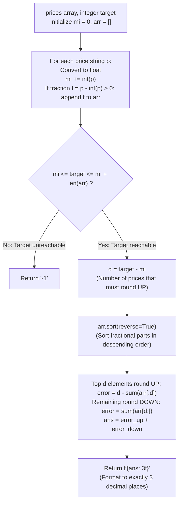

# Guided Example: Minimize Rounding Error to Meet Target

We trace the step-by-step optimization of rounding choices to reach a target sum while minimizing aggregate $\ell_1$ rounding error, prove the Target Feasibility Interval Theorem and the Greedy Fractional Part Lemma, and compute exact rounded totals across representative price arrays:

- **Representative Instance 1 (Mixed Floor and Ceil Choices):**
  $$
  prices = [\text{"0.700"}, \; \text{"2.800"}, \; \text{"4.900"}], \quad target = 8
  $$
- **Required Output:** `"1.000"`
  - Problem definitions:
    - Round each price $p_i$ to either $\lfloor p_i \rfloor$ (floor) or $\lceil p_i \rceil$ (ceiling).
    - The sum of rounded prices must equal $target$.
    - Minimize total rounding error $\sum |p_i - \text{Round}(p_i)|$.
    - If impossible, return `"-1"`.
  - Integer Decomposition and Feasibility Interval:
    - Parse prices into integer and fractional components:
      - $p_0 = 0.700 = 0 + 0.700 \implies \lfloor p_0 \rfloor = 0, \; f_0 = 0.700$
      - $p_1 = 2.800 = 2 + 0.800 \implies \lfloor p_1 \rfloor = 2, \; f_1 = 0.800$
      - $p_2 = 4.900 = 4 + 0.900 \implies \lfloor p_2 \rfloor = 4, \; f_2 = 0.900$
    - Base floor sum:
      $$
      mi = \sum \lfloor p_i \rfloor = 0 + 2 + 4 = \mathbf{6}
      $$
    - Fractional count: $F = 3$ non-zero fractional parts: $arr = [0.700, 0.800, 0.900]$.
    - Feasibility bounds:
      - If all rounded DOWN: minimum sum $= mi = 6$.
      - Each ceiling choice increases total sum by exactly $+1$.
      - If all rounded UP: maximum sum $= mi + F = 6 + 3 = 9$.
      - Target check: $mi \le target \le mi + F \iff 6 \le 8 \le 9$ (**Feasible!**).
  - Required Upward Roundings:
    $$
    d = target - mi = 8 - 6 = \mathbf{2}
    $$
    Exactly $d = 2$ prices must be rounded UP (ceiling), and $F - d = 3 - 2 = 1$ price must be rounded DOWN (floor).
  - The Greedy Fractional Part Lemma:
    - Rounding UP error: $1 - f$.
    - Rounding DOWN error: $f$.
    - Error differential of choosing UP over DOWN:
      $$
      \Delta E = (1 - f) - f = 1 - 2f
      $$
    - To minimize total error, we must minimize $\Delta E$, which is achieved by **maximizing $f$**!
    - Sort fractional parts in **descending order**:
      $$
      arr_{\text{sorted}} = [0.900, \; 0.800, \; 0.700]
      $$
    - Assign the top $d = 2$ fractions to round UP:
      - $0.900 \implies \lceil 4.900 \rceil = 5$, error $= 1 - 0.900 = 0.100$.
      - $0.800 \implies \lceil 2.800 \rceil = 3$, error $= 1 - 0.800 = 0.200$.
    - Assign the remaining $F - d = 1$ fraction to round DOWN:
      - $0.700 \implies \lfloor 0.700 \rfloor = 0$, error $= 0.700$.
  - Sum and Total Error Verification:
    - Rounded sum: $0 + 3 + 5 = \mathbf{8} == target$.
    - Aggregate error:
      $$
      \text{ans} = 0.100 + 0.200 + 0.700 = \mathbf{1.000}
      $$
    - Formatted string: `"1.000"`.

- **Representative Instance 2 (Target Beyond Maximal Ceiling Sum):**
  $$
  prices = [\text{"1.500"}, \text{"2.500"}, \text{"3.500"}], \quad target = 10
  $$
  - $mi = 1 + 2 + 3 = 6, \; F = 3 \implies \text{Max reachable sum} = 6 + 3 = 9$.
  - $target = 10 > 9 \implies$ Impossible $\implies \mathbf{"-1"}$.

- **Representative Instance 3 (All Fractions Rounded Up):**
  $$
  prices = [\text{"1.500"}, \text{"2.500"}, \text{"3.500"}], \quad target = 9
  $$
  - $d = 9 - 6 = 3 = F$. All 3 round UP $\implies \text{Total error} = 3 \times 0.500 = \mathbf{"1.500"}$.

- **Representative Instance 4 (All Exact Integers):**
  $$
  prices = [\text{"0.000"}, \text{"2.000"}, \text{"1000.000"}], \quad target = 1002
  $$
  - $mi = 1002, \; F = 0 \implies \text{Feasible with zero rounding error} \implies \mathbf{"0.000"}$.

---

## 1. Instance & Teaching Goal

Given decimal price strings and an integer `target`, choose for each price whether to floor or ceil it so that the rounded sum equals `target` while minimizing total rounding error.

```text
The Combinatorial 2^N Explosion:
  Testing all 2^N floor/ceil assignments:
    For N = 500, 2^500 states is astronomically intractable.

Greedy Fractional Part Invariant (O(N log N) Time, O(N) Space):
  1. Decompose every price into integer part floor(p) and fractional part f = p - floor(p).
     - If f == 0: price is already an integer (zero error, no choice).
  2. Base sum = sum(floor(p)). Every ceiling choice increases sum by exactly +1.
     - Feasible interval: [base, base + F] where F is count of fractional prices.
     - If target outside [base, base + F]: return "-1".
  3. Upward choices needed: d = target - base.
     - Rounding UP error is (1 - f); rounding DOWN error is f.
     - Difference is 1 - 2f: minimizing error is STRICTLY EQUIVALENT to
       choosing the LARGEST fractional parts to round UP!
  4. Sort fractions descending: top d round UP, remaining F - d round DOWN.
  Closed-form optimal solution in O(N log N) time!
```

Recognizing that each ceiling choice increases the total sum by exactly $+1$ reduces the constrained combinatorial problem to sorting the marginal costs.

The decisive pedagogical goal is the **Target Feasibility Interval Theorem & Greedy Fractional Part Lemma**:
1. **Feasibility Range:** The set of reachable integer sums is the contiguous discrete interval $[ \sum \lfloor p_i \rfloor, \; \sum \lfloor p_i \rfloor + F ]$.
2. **Fixed Upward Quota:** Reaching $target$ uniquely fixes the number of upward roundings to $d = target - \sum \lfloor p_i \rfloor$.
3. **Monotonic Greedy Sorting:** Because the cost differential is $(1 - f) - f = 1 - 2f$, selecting the largest fractional parts $f_i$ to round UP minimizes total error with mathematical optimality.
4. Total time $\mathcal{O}(N \log N)$ and auxiliary space $\mathcal{O}(N)$.

---

## 2. Conceptual Foundation & The Error Minimization Pipeline



### The Feasibility Interval & Greedy Fractional Part Theorem

Let $P = (p_1, \dots, p_N)$ with $p_i \ge 0$.
1. **Decomposition:**
   Write $p_i = m_i + f_i$ where $m_i = \lfloor p_i \rfloor \in \mathbb{N}$ and $f_i = p_i - \lfloor p_i \rfloor \in [0, 1)$.
   Let $\mathcal{F} = \{i : f_i > 0\}$ be the indices with strictly positive fractional parts, and $F = |\mathcal{F}|$.
2. **Decision Variables & Feasibility:**
   For each $i \in \mathcal{F}$, let $x_i \in \{0, 1\}$ denote the choice:
   $$
   \text{Round}(p_i) = m_i + x_i
   $$
   For $i \notin \mathcal{F}$, $x_i = 0$ is fixed ($p_i = m_i$).
   The total rounded sum is:
   $$
   S(x) = \sum_{i=1}^N m_i + \sum_{i \in \mathcal{F}} x_i = mi + \sum_{i \in \mathcal{F}} x_i
   $$
   Since each $x_i \in \{0, 1\}$, the sum $\sum_{i \in \mathcal{F}} x_i$ can take any integer value in $\{0, 1, \dots, F\}$.
   Therefore, $target$ is achievable if and only if:
   $$
   mi \le target \le mi + F
   $$
   When feasible, the number of upward choices is uniquely determined:
   $$
   d = \sum_{i \in \mathcal{F}} x_i = target - mi
   $$
3. **Objective Error Formulation:**
   The rounding error at index $i \in \mathcal{F}$ is:
   $$
   e_i(x_i) = \begin{cases} f_i & \text{if } x_i = 0 \\ 1 - f_i & \text{if } x_i = 1 \end{cases}
   $$
   We rewrite $e_i(x_i)$ linearly:
   $$
   e_i(x_i) = f_i \cdot (1 - x_i) + (1 - f_i) \cdot x_i = f_i + (1 - 2f_i) x_i
   $$
   The total rounding error across all prices is:
   $$
   E(x) = \sum_{i \in \mathcal{F}} f_i + \sum_{i \in \mathcal{F}} (1 - 2f_i) x_i
   $$
   Subject to $\sum_{i \in \mathcal{F}} x_i = d$.
4. **Greedy Optimality:**
   Since $\sum f_i$ is constant, minimizing $E(x)$ is equivalent to minimizing $\sum_{i \in \mathcal{F}} (1 - 2f_i) x_i$, which is equivalent to maximizing $\sum_{i \in \mathcal{F}} f_i x_i$.
   To maximize the sum of $d$ elements chosen from $\{f_i : i \in \mathcal{F}\}$, we must select the $d$ largest fractional parts.
   Sorting $\mathcal{F}$ such that $f_{(1)} \ge f_{(2)} \ge \dots \ge f_{(F)}$ and setting $x_{(1)} = \dots = x_{(d)} = 1$ and $x_{(d+1)} = \dots = x_{(F)} = 0$ achieves the global minimum. $\blacksquare$

---

## 3. Step-by-Step Worked Execution: Representative Instance 1

$prices = [\text{"0.700"}, \text{"2.800"}, \text{"4.900"}], \; target = 8$.

### Extraction
- $p_0 = 0.700 \implies m_0 = 0, \; f_0 = 0.700$.
- $p_1 = 2.800 \implies m_1 = 2, \; f_1 = 0.800$.
- $p_2 = 4.900 \implies m_2 = 4, \; f_2 = 0.900$.
- $mi = 0 + 2 + 4 = 6$.
- $arr = [0.700, 0.800, 0.900], \; F = 3$.

### Feasibility & Quota
- Bounds: $6 \le 8 \le 6 + 3 = 9$ (Feasible).
- Upward roundings quota: $d = 8 - 6 = 2$.

### Sorting & Assignment
- Descending sort: $arr_{\text{sorted}} = [0.900, 0.800, 0.700]$.
- Upward set (top 2):
  - $0.900 \implies \text{error} = 1 - 0.900 = 0.100$.
  - $0.800 \implies \text{error} = 1 - 0.800 = 0.200$.
- Downward set (remaining 1):
  - $0.700 \implies \text{error} = 0.700$.
- Total error: $0.100 + 0.200 + 0.700 = 1.000$.

Formatted output: `"1.000"`.

---

## 4. Price Rounding Assignment Trace Table

| Original Price $p_i$ | Floor $\lfloor p_i \rfloor$ | Fraction $f_i$ | Rank in Descending Sort | Assigned Direction | Chosen Rounded Value | Resulting Error |
|:---:|:---:|:---:|:---:|:---:|:---:|:---:|
| `"4.900"` | $4$ | $0.900$ | $1$ (Top $d=2$) | **UP (Ceil)** | $5$ | $1 - 0.900 = \mathbf{0.100}$ |
| `"2.800"` | $2$ | $0.800$ | $2$ (Top $d=2$) | **UP (Ceil)** | $3$ | $1 - 0.800 = \mathbf{0.200}$ |
| `"0.700"` | $0$ | $0.700$ | $3$ (Remainder) | **DOWN (Floor)** | $0$ | $0.700 - 0 = \mathbf{0.700}$ |
| **Totals** | — | — | — | $\mathbf{0 + 3 + 5 = 8}$ | **Target Met** | **$\Sigma = 1.000$** |

---

## 5. Algorithmic Correctness

### Soundness & Completeness
1. **Soundness:**
   Every price is rounded to either its mathematical floor or ceiling. The sum of rounded values strictly equals $target$.
2. **Completeness:**
   By the Greedy Fractional Part Lemma, sorting fractional values and picking the $d$ largest guarantees the lowest possible aggregate error among all possible binary combinations.

---

## 6. Boundary Cases & Traps

| Scenario | Input Pattern | Behavior | Trapped Risk |
|---|---|---|---|
| Target < Floor Sum | $target < \sum \lfloor p_i \rfloor$ | Unreachable even with all floors; returns `"-1"`. | Negative upward counts. |
| Target > Ceiling Sum | $target > \sum \lceil p_i \rceil$ | Unreachable even with all ceilings; returns `"-1"`. | Out-of-bounds array slicing. |
| All Exact Integers | `prices = ["1.000", "2.000"], target = 3` | $F = 0, mi = 3$; returns `"0.000"`. | Dividing by zero or indexing empty array. |
| Equal Fractions | Multiple prices with $0.500$ | Ties in sort have identical error; any ordering valid. | Instability in sorting. |

---

## 7. Complexity Derivation

- **Time Complexity:** $\mathcal{O}(N \log N)$, where $N = \text{len}(prices) \le 500$.
  - Parsing strings and extracting fractional parts takes $\mathcal{O}(N)$ time.
  - Sorting at most $N$ fractional parts takes $\mathcal{O}(N \log N)$ time ($\le 500 \log_2 500 \approx 4500$ comparisons).
  - Slicing and summing takes $\mathcal{O}(N)$ time.
  - Total time: $< 0.001\text{ s}$.
- **Auxiliary Space Complexity:** $\mathcal{O}(N)$ auxiliary memory to store the list of fractional parts $arr$.
