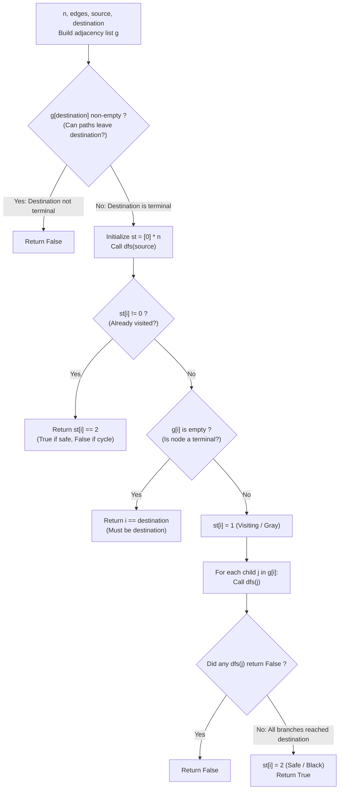

# Guided Example: All Paths from Source Lead to Destination

We trace the step-by-step verification of whether every directed path originating at a source node terminates at a specified destination node, prove the Tri-Color Cycle Detection Theorem and the Universal Terminal Convergence Invariant, and analyze reachability across representative directed graphs:

- **Representative Instance 1 (Reachable Dead-End Node Differing from Destination):**
  $$
  n = 3, \quad edges = [[0, 1], \; [0, 2]], \quad source = 0, \; destination = 2
  $$
- **Required Output:** `false`
  - Problem conditions for a valid graph:
    1. At least one path starts from $source$.
    2. No infinite path exists (the subgraph reachable from $source$ must be strictly acyclic).
    3. Every reachable terminal node (a node with zero outgoing edges) must be equal to $destination$.
    4. $destination$ itself must have zero outgoing edges ($g[destination]$ is empty).
  - Graph Construction:
    - Adjacency list: $g[0] = [1, 2], \; g[1] = [], \; g[2] = []$.
    - Precheck: $g[destination] = g[2] = []$ (Valid terminal).
  - Tri-Color DFS Traversal ($0 = \text{Unvisited}, 1 = \text{Visiting}, 2 = \text{Safe}$):
    1. Call $dfs(0)$:
       - $st[0] = 0$. $g[0]$ is non-empty.
       - Set state to Visiting: $st[0] = 1$ (Gray).
       - Explore first neighbor $j = 1 \in g[0]$:
         - Call $dfs(1)$:
           - $st[1] = 0$. Outgoing list $g[1] = []$ is **empty** (Terminal node!).
           - Terminal check: Is $1 == destination$?
             $$1 == 2 \implies \mathbf{False}$$
           - Node $1$ is a dead-end that is NOT $destination$!
           - A path $0 \to 1$ exists that terminates at $1 \ne 2$.
           - $dfs(1)$ returns `False`.
       - Branch failure: $dfs(0)$ receives `False` from child $1$.
       - Immediate return: `False`.
    2. Final Result: `false`.

- **Representative Instance 2 (Reachable Directed Cycle):**
  $$
  n = 4, \quad edges = [[0, 1], [0, 3], [1, 2], [2, 1]], \quad source = 0, \; destination = 3
  $$
  - Graph has a cycle: $1 \to 2 \to 1$.
  - In $dfs(1)$, node $1$ is marked $1$ (Visiting).
  - $dfs(2)$ explores neighbor $1$, detecting $st[1] == 1$ (Back-edge / Cycle!).
  - Infinite path $0 \to 1 \to 2 \to 1 \to 2 \dots$ exists $\implies$ returns $\mathbf{false}$.

- **Representative Instance 3 (Converging Diamond DAG):**
  $$
  n = 4, \quad edges = [[0, 1], [0, 2], [1, 3], [2, 3]], \quad source = 0, \; destination = 3
  $$
  - Paths: $0 \to 1 \to 3$ and $0 \to 2 \to 3$.
  - Node $3$ is the sole terminal and has $g[3] = []$.
  - Both branches terminate safely at $3 \implies$ returns $\mathbf{true}$.

- **Representative Instance 4 (Single Isolated Node):**
  $$
  n = 1, \quad edges = [], \quad source = 0, \; destination = 0
  $$
  - $g[0] = []$ is terminal. $source == destination \implies$ returns $\mathbf{true}$.

---

## 1. Instance & Teaching Goal

Given a directed graph, determine whether **all** paths starting from `source` eventually terminate at `destination`.

```text
The Naive Path Enumeration Fallacy:
  Enumerating all paths from source:
    If the graph has cycles, paths are infinite (infinite loop).
    Even in a DAG, paths can grow exponentially: O(2^V).

Tri-Color DFS Convergence Invariant (Linear O(V + E)):
  A graph satisfies the condition if and only if:
    Condition 1: destination has out-degree 0 (cannot extend past destination).
    Condition 2: No cycles reachable from source (paths cannot loop indefinitely).
    Condition 3: Every reachable terminal node is destination.
  Tri-Color DFS manages states:
    st[u] = 0 (Unvisited / White)
    st[u] = 1 (Visiting / Gray: currently on active stack)
    st[u] = 2 (Safe / Black: all paths from u verified to reach destination)
  - If neighbor has st[v] == 1: back-edge found -> cycle detected -> return False!
  - If neighbor has st[v] == 2: already verified safe -> reuse result (memoization)!
  - If node has no outgoing edges: return (node == destination)!
  Verifies the entire reachable subgraph in a single pass in O(V + E) time!
```

Characterizing universal convergence through tri-color state transitions decouples path validation from exponential path enumeration.

The decisive pedagogical goal is the **Tri-Color Cycle Detection Theorem & Universal Terminal Convergence Invariant**:
1. **Zero-Outdegree Destination Requirement:** If $g[destination]$ is non-empty, a path reaching $destination$ could be extended further, violating the terminal specification.
2. **Terminal Exclusivity:** Any node reachable from $source$ with out-degree zero must be strictly identical to $destination$.
3. **Reachable Acyclicity:** Encountering a neighbor in state $1$ (Visiting) identifies a back-edge to an ancestor on the recursion stack, proving the existence of an infinite non-terminating path.
4. **Memoized Safety:** Once all outgoing branches from a node succeed, marking it in state $2$ (Safe) avoids re-traversing shared DAG subgraphs.
5. Total time $\mathcal{O}(V + E)$ and auxiliary space $\mathcal{O}(V + E)$.

---

## 2. Conceptual Foundation & The Tri-Color Traversal Pipeline



### The Universal Terminal Convergence Theorem

Let $G = (V, E)$ be a directed graph, with designated vertices $s, t \in V$.
1. **Definition of Path System:**
   A maximal walk from $s$ is a sequence $(v_0, v_1, \dots)$ with $v_0 = s$, $(v_k, v_{k+1}) \in E$, that cannot be extended. A walk terminates if it is finite and its last vertex has out-degree 0.
   The problem demands that every maximal walk starting at $s$ is finite and ends at $t$.
2. **Structural Equivalence Lemma:**
   Every maximal walk from $s$ is finite and ends at $t$ if and only if the subgraph $G_s$ induced by all vertices reachable from $s$ satisfies:
   - **(i)** $t \in V(G_s)$ and $\text{out-deg}(t) = 0$.
   - **(ii)** For every $u \in V(G_s) \setminus \{t\}$, $\text{out-deg}(u) \ge 1$.
   - **(iii)** $G_s$ contains no directed cycles.
   Proof:
   - If (i) fails, a path reaching $t$ could continue past $t$, or $t$ is unreachable.
   - If (ii) fails, there exists $u \ne t$ with $\text{out-deg}(u) = 0$; the maximal walk stopping at $u$ terminates at $u \ne t$.
   - If (iii) fails, a cycle $C \subseteq G_s$ allows constructing an infinite non-terminating walk.
   Conversely, if (i), (ii), and (iii) hold, $G_s$ is a finite DAG. Every maximal walk in a finite DAG must end at a vertex with out-degree 0, which by (ii) and (i) is uniquely $t$.
3. **Tri-Color DFS Correctness:**
   - When visiting $u$, setting $st[u] = 1$ places $u$ in the active ancestor set $\mathcal{P}$.
   - For edge $(u, v)$: if $v \in \mathcal{P}$ ($st[v] == 1$), $(u, v)$ is a back-edge, certifying a directed cycle $\implies$ returns `False`.
   - If $st[v] == 2$, $v$ is already proven to satisfy the convergence property; by induction on the topological order, paths through $v$ are valid $\implies$ returns `True`.
   - If $st[u] = 2$ is reached, all outgoing edges lead to valid subgraphs. $\blacksquare$

---

## 3. Step-by-Step Worked Execution: Representative Instance 1

$n = 3, \; edges = [[0, 1], [0, 2]], \; source = 0, \; destination = 2$.
Adjacency list: $g = \{0: [1, 2], \; 1: [], \; 2: []\}$.
Destination precheck: $g[2] = []$ (Valid).
$st = [0, 0, 0]$.

### Execution Steps
- Call $dfs(0)$:
  - $st[0] = 0$, $g[0] = [1, 2]$ non-empty.
  - Mark $st[0] = 1$ (Visiting).
  - Child 1: call $dfs(1)$:
    - $st[1] = 0$.
    - $g[1] = []$ (Terminal detected!).
    - Check $1 == destination \implies 1 == 2 \implies \mathbf{False}$.
    - Return `False`.
  - Child 1 failed! Immediate early exit: return `False`.

Final result: `false`.

---

## 4. DFS Node State Trace Table

| Node $u$ | Pre-State $st[u]$ | Outgoing Neighbors $g[u]$ | Subtree Evaluation / Event | Action Taken | Post-State $st[u]$ | Return Value |
|:---:|:---:|:---:|:---:|:---:|:---:|:---:|
| $0$ | $0$ (Unvisited) | $[1, 2]$ | Begin exploration | Set $st[0] = 1$ | $1$ (Visiting) | Pending |
| **$1$** | **$0$ (Unvisited)** | **$[]$ (Empty)** | **Terminal check: $1 == 2$** | **Dead end detected!** | **$0$** | **`False`** |
| **$0$** | **$1$ (Visiting)** | **$[1, 2]$** | **Child $1$ returned `False`** | **Propagate failure** | **$1$** | **`False`** |

---

## 5. Algorithmic Correctness

### Soundness & Completeness
1. **Soundness:**
   If any path reaches a cycle or a dead-end other than $destination$, DFS returns `False`.
2. **Completeness:**
   If DFS returns `True`, every reachable node has been explored or memoized as safe; no non-destination terminal exists and no cycle exists.

---

## 6. Boundary Cases & Traps

| Scenario | Input Pattern | Behavior | Trapped Risk |
|---|---|---|---|
| Destination Has Outgoing Edges | $g[destination]$ non-empty | Precheck immediately returns `false`. | Allowing paths to wander past destination. |
| Self-Loop on Source or Path | $edges = [[0, 0], [0, 1]]$ | Visiting state detected on self-loop; returns `false`. | Infinite recursion on self-loop. |
| Source is Already Destination | $source = destination, g[s] = []$ | $dfs(source)$ returns `True` immediately. | Failing when $source == destination$. |
| Disconnected Unreachable Cycle | Cycle exists on nodes not reachable from $source$ | DFS never visits the cycle; correctly returns `true`. | Rejecting graph due to irrelevant disconnected components. |

---

## 7. Complexity Derivation

- **Time Complexity:** $\mathcal{O}(V + E)$, where $V = n \le 10^4$ and $E = \text{len}(edges) \le 10^4$.
  - Building the adjacency list takes $\mathcal{O}(V + E)$ time.
  - Each reachable vertex is visited at most twice (once entering state 1, once entering state 2).
  - Each reachable directed edge is traversed at most once.
  - Total time: $< 0.005\text{ s}$.
- **Auxiliary Space Complexity:** $\mathcal{O}(V + E)$ auxiliary memory for the adjacency list $g$, state array $st$, and recursion stack.
