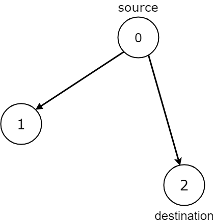
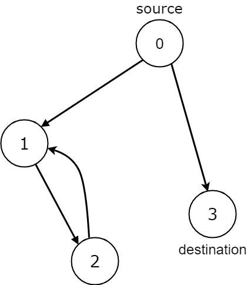
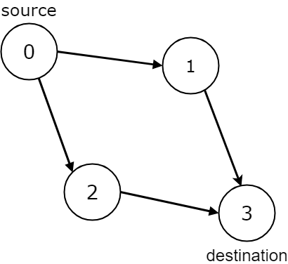

## Description

Given the `edges` of a directed graph where $\text{edges}[i] = [a_{i}, b_{i}]$ indicates there is an edge between nodes $a_{i}$ and $b_{i}$, and two nodes `source` and `destination` of this graph, determine whether or not all paths starting from `source` eventually, end at `destination`, that is:

- At least one path exists from the `source` node to the `destination` node

- If a path exists from the `source` node to a node with no outgoing edges, then that node is equal to `destination`.

- The number of possible paths from `source` to `destination` is a finite number.

Return `true` if and only if all roads from `source` lead to `destination`.
### Function Contract

**Inputs**

- `n`: the number of nodes, labeled from `0` through $n - 1$.
- `edges`: the directed edges, where each row $[a_{i}, b_{i}]$ points from $a_{i}$ to $b_{i}$.
- `source`: the node at which every considered path begins.
- `destination`: the node at which every considered path must terminate.

Self-loops and repeated parallel edges may occur. Only nodes and cycles reachable from `source` affect the result; a disconnected invalid component does not create a path from `source`.

Let $V = n$ and let $E = \lvert\texttt{edges}\rvert$.

**Return value**

- `true` exactly when at least one path runs from `source` to `destination`, every reachable terminal is `destination`, and the source-reachable subgraph contains no directed cycle; otherwise, `false`.

### Examples

#### Example 1

- **Input:** $n = 3, edges = [[0,1],[0,2]], source = 0, destination = 2$
- **Output:** `false`
- **Explanation:** It is possible to reach and get stuck on both node 1 and node 2.
#### Example 2

- **Input:** $n = 4, edges = [[0,1],[0,3],[1,2],[2,1]], source = 0, destination = 3$
- **Output:** `false`
- **Explanation:** We have two possibilities: to end at node 3, or to loop over node 1 and node 2 indefinitely.
#### Example 3

- **Input:** $n = 4, edges = [[0,1],[0,2],[1,3],[2,3]], source = 0, destination = 3$
- **Output:** `true`
### Constraints

- $1 \le n \le 10^{4}$

- $0 \le \text{edges.length} \le 10^{4}$

- $\text{edges.length} = 2$

- $0 \le a_{i}, b_{i} \le n - 1$

- $0 \le source \le n - 1$

- $0 \le destination \le n - 1$

- The given graph may have self-loops and parallel edges.