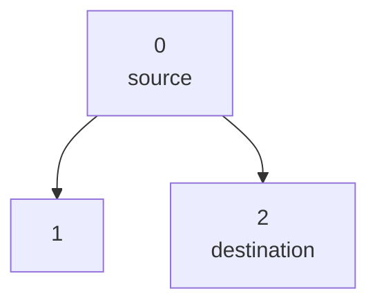
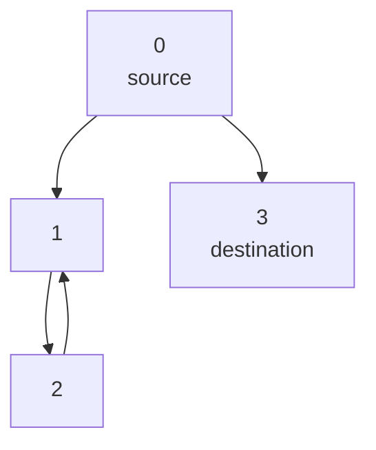
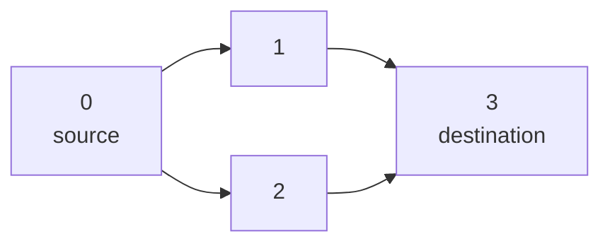

## Examples

**Example 1**

- Input: `n = 3, edges = [[0,1],[0,2]], source = 0, destination = 2`
- Output: `false`
- Explanation: A path can stop at node `1` as well as at node `2`. Because node `1` is a reachable terminal other than `destination`, not every path has the required endpoint.

The source illustration shows the two terminal branches:

**Example 2**

- Input: `n = 4, edges = [[0,1],[0,3],[1,2],[2,1]], source = 0, destination = 3`
- Output: `false`
- Explanation: One choice reaches node `3`, but another enters the directed cycle between nodes `1` and `2` and can continue indefinitely.

The source illustration contrasts the destination branch with the reachable cycle:

**Example 3**

- Input: `n = 4, edges = [[0,1],[0,2],[1,3],[2,3]], source = 0, destination = 3`
- Output: `true`

Both acyclic branches in the source illustration converge at the same destination:

