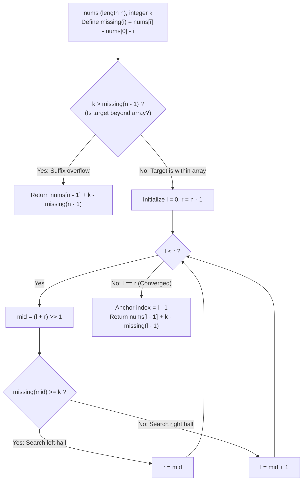

# Guided Example: Missing Element in Sorted Array

We trace the logarithmic determination of the $k$-th missing integer in a sorted array, prove the Monotonic Missing Counter Theorem and the Suffix Extrapolation Formula, and pinpoint missing values across representative sorted inputs:

- **Representative Instance 1 (First Internal Gap):**
  $$
  nums = [4, \; 7, \; 9, \; 10], \quad k = 1, \quad n = 4
  $$
- **Required Output:** `5`
  - Problem definitions:
    - `nums` is sorted in strictly ascending order with unique elements.
    - Missing numbers are counted starting strictly from the leftmost element $nums[0]$.
    - Return the $k$-th missing number.
  - The Missing Numbers Function:
    - If no numbers were missing up to index $i$, the value would be $nums[0] + i$.
    - The actual number of missing integers up to index $i$ is:
      $$
      missing(i) = nums[i] - nums[0] - i
      $$
    - Compute $missing(i)$ for all indices:
      - $missing(0) = 4 - 4 - 0 = \mathbf{0}$
      - $missing(1) = 7 - 4 - 1 = \mathbf{2}$ (Missing integers: $5, 6$)
      - $missing(2) = 9 - 4 - 2 = \mathbf{3}$ (Missing integers: $5, 6, 8$)
      - $missing(3) = 10 - 4 - 3 = \mathbf{3}$ (Missing integers: $5, 6, 8$)
  - Suffix Check:
    - Total missing within the array: $missing(n - 1) = missing(3) = 3$.
    - Is $k > missing(n - 1)$? $1 > 3$ is **False**.
    - The $k = 1$-st missing number lies **inside** the array bounds!
  - Binary Search for Smallest Index with $missing(i) \ge k$:
    - Search interval: $l = 0, \; r = 3$.
    - Iteration 1:
      - $mid = (0 + 3) // 2 = 1$.
      - $missing(1) = 2 \ge k = 1$ is True.
      - Contract right: $r = mid = 1$.
    - Iteration 2:
      - $mid = (0 + 1) // 2 = 0$.
      - $missing(0) = 0 \ge k = 1$ is False.
      - Contract left: $l = mid + 1 = 1$.
    - Termination: $l == r = 1$.
  - Offset Extraction:
    - The first index with $missing \ge k$ is $l = 1$.
    - Therefore, the $k$-th missing number lies strictly between $nums[l - 1] = nums[0] = 4$ and $nums[l] = nums[1] = 7$.
    - Number of missing integers before $nums[l - 1]$ is $missing(l - 1) = missing(0) = 0$.
    - Remaining missing integers to advance:
      $$
      rem = k - missing(l - 1) = 1 - 0 = 1
      $$
    - Result value:
      $$
      \text{ans} = nums[l - 1] + rem = 4 + 1 = \mathbf{5}
      $$

- **Representative Instance 2 (Second Internal Gap):**
  $$
  nums = [4, 7, 9, 10], \quad k = 3
  $$
  - $missing = [0, 2, 3, 3]$.
  - $k = 3 \le 3$ (Within array).
  - Binary search converges to $l = 2$ ($missing(2) = 3 \ge 3$).
  - Preceding anchor: $l - 1 = 1$ ($nums[1] = 7, missing(1) = 2$).
  - Offset: $nums[1] + (k - missing(1)) = 7 + (3 - 2) = \mathbf{8}$.

- **Representative Instance 3 (Missing Number Beyond Array Bounds):**
  $$
  nums = [1, 2, 4], \quad k = 3
  $$
  - $missing(2) = 4 - 1 - 2 = 1$.
  - $k = 3 > missing(2) = 1$ (**Beyond suffix!**).
  - Suffix extrapolation formula:
    $$
    \text{ans} = nums[n - 1] + k - missing(n - 1) = 4 + 3 - 1 = \mathbf{6}
    $$

- **Representative Instance 4 (Single Element Array):**
  $$
  nums = [5], \quad k = 4 \implies n = 1, \; missing(0) = 0 \implies 5 + 4 - 0 = \mathbf{9}
  $$

---

## 1. Instance & Teaching Goal

Given a strictly sorted unique integer array `nums` and an integer `k`, return the $k$-th missing number starting from $nums[0]$.

```text
The Linear Counting Fallacy:
  Iterating value by value from nums[0] and counting missing numbers:
    Takes O(nums[n-1] - nums[0] + k) or O(N) time.
    For nums[i] up to 10^7, linear simulation is too slow.

Monotonic Missing Counter Invariant (O(log N) Time, O(1) Space):
  Key observation:
    missing(i) = nums[i] - nums[0] - i is STRICTLY MONOTONICALLY NON-DECREASING!
    - If k > missing(n - 1): answer lies beyond array -> nums[n-1] + k - missing(n-1).
    - If k <= missing(n-1): binary search finds smallest l with missing(l) >= k.
      The k-th missing number lies in the gap (nums[l-1], nums[l]):
        ans = nums[l-1] + (k - missing(l-1)).
  Finds the exact answer in O(log N) operations with zero value iteration!
```

Mapping array values to a monotonic function of missing counts allows binary search to pinpoint the enclosing gap in logarithmic time.

The decisive pedagogical goal is the **Monotonic Missing Counter Theorem & Suffix Extrapolation Formula**:
1. **Count Closed Form:** $missing(i) = nums[i] - nums[0] - i$ provides the exact count of missing integers in $[nums[0], nums[i]]$ in $\mathcal{O}(1)$ time.
2. **Monotonicity Property:** $missing(i+1) - missing(i) = (nums[i+1] - nums[i]) - 1 \ge 0$, establishing that $missing(i)$ is non-decreasing.
3. **Suffix Extrapolation:** When $k > missing(n-1)$, the target is strictly greater than $nums[n-1]$ and is given directly by $nums[n-1] + k - missing(n-1)$.
4. **Gap Anchor Invariant:** When $k \le missing(n-1)$, binary search finds the unique gap $(nums[l-1], nums[l])$ containing the $k$-th missing number.
5. Total time $\mathcal{O}(\log n)$ and auxiliary space $\mathcal{O}(1)$.

---

## 2. Conceptual Foundation & The Binary Search Pipeline



### The Monotonic Missing Counter & Gap Anchor Theorem

Let $A = (a_0, a_1, \dots, a_{n-1})$ be a strictly increasing sequence of integers.
1. **The Missing Count Identity:**
   Between $a_0$ and $a_i$ inclusive, there are $a_i - a_0 + 1$ total integer values.
   Exactly $i + 1$ of these values appear in the array: $a_0, a_1, \dots, a_i$.
   Therefore, the count of integers in $[a_0, a_i]$ missing from $A$ is:
   $$
   M(i) = (a_i - a_0 + 1) - (i + 1) = a_i - a_0 - i
   $$
2. **Monotonicity:**
   For any $0 \le i < n - 1$:
   $$
   M(i+1) - M(i) = (a_{i+1} - a_0 - (i+1)) - (a_i - a_0 - i) = (a_{i+1} - a_i) - 1
   $$
   Because $a_{i+1} > a_i$ for all $i$, $a_{i+1} - a_i \ge 1 \implies M(i+1) - M(i) \ge 0$.
   Thus $M(i)$ is a monotonically non-decreasing function on $\{0, \dots, n-1\}$.
3. **The Suffix Extrapolation Formula:**
   If $k > M(n - 1)$, all integers up to $a_{n-1}$ account for $M(n - 1) < k$ missing values.
   Every integer $x > a_{n-1}$ is missing because $a_{n-1}$ is the maximum element in $A$.
   To reach $k$ total missing values, we must count $k - M(n - 1)$ additional integers beyond $a_{n-1}$:
   $$
   \text{ans} = a_{n-1} + (k - M(n - 1))
   $$
4. **Internal Gap Invariant:**
   If $k \le M(n - 1)$, define $l$ as the minimal index satisfying $M(l) \ge k$:
   $$
   l = \min \{ i \in \{0, \dots, n-1\} : M(i) \ge k \}
   $$
   Since $M(0) = a_0 - a_0 - 0 = 0 < k$, we have $l \ge 1$.
   By minimality of $l$:
   $$
   M(l - 1) < k \le M(l)
   $$
   This proves that the $k$-th missing integer lies strictly in the interval $(a_{l-1}, a_l)$.
   Since no elements of $A$ exist between $a_{l-1}$ and $a_l$, every integer in this interval is missing.
   The $k$-th missing value is obtained by adding the remaining deficit $k - M(l - 1)$ to $a_{l-1}$:
   $$
   \text{ans} = a_{l-1} + (k - M(l - 1))
   $$
   Binary search finds $l$ in $\lceil \log_2 n \rceil$ evaluations of $M$. $\blacksquare$

---

## 3. Step-by-Step Worked Execution: Representative Instance 1

$nums = [4, 7, 9, 10], \; k = 1, \; n = 4$.
$missing(i) = nums[i] - 4 - i$.

### Suffix Check
- $missing(3) = 10 - 4 - 3 = 3$.
- $k = 1 \le 3 \implies$ Target is within array bounds.

### Binary Search Iterations
- Initialize $l = 0, \; r = 3$.
- **Iteration 1:**
  - $mid = (0 + 3) // 2 = 1$.
  - $missing(1) = 7 - 4 - 1 = 2$.
  - Check $missing(1) \ge 1 \implies 2 \ge 1$ (True).
  - Update: $r = 1$.
- **Iteration 2:**
  - $mid = (0 + 1) // 2 = 0$.
  - $missing(0) = 4 - 4 - 0 = 0$.
  - Check $missing(0) \ge 1 \implies 0 \ge 1$ (False).
  - Update: $l = 0 + 1 = 1$.
- **Convergence:**
  - $l = 1, \; r = 1 \implies$ Loop terminates.

### Target Extraction
- Anchor index: $l - 1 = 1 - 1 = 0$.
- Anchor value: $nums[0] = 4$.
- Missing count at anchor: $missing(0) = 0$.
- Offset: $k - missing(0) = 1 - 0 = 1$.
- Answer: $nums[0] + 1 = 4 + 1 = \mathbf{5}$.

---

## 4. Binary Search State Trace Table

| Step | Search Range $[l, r]$ | Midpoint $mid$ | $nums[mid]$ | $missing(mid)$ | Condition $missing(mid) \ge k$ | Next Interval $[l, r]$ |
|:---:|:---:|:---:|:---:|:---:|:---:|:---:|
| Init | $[0, 3]$ | — | — | — | — | $[0, 3]$ |
| $1$ | $[0, 3]$ | $1$ | $7$ | $2$ | $2 \ge 1$ (True) | $[0, 1]$ |
| $2$ | $[0, 1]$ | $0$ | $4$ | $0$ | $0 \ge 1$ (False) | $[1, 1]$ |
| **Final** | **$[1, 1]$** | **Converged** | **$l = 1$** | **Anchor $l-1 = 0$** | **$4 + (1 - 0) = \mathbf{5}$** | **Output: $5$** |

---

## 5. Algorithmic Correctness

### Soundness & Completeness
1. **Soundness:**
   The exact count of missing integers before any index is determined by mathematical identity $nums[i] - nums[0] - i$. The offset formula adds the exact deficit without skipping any candidate.
2. **Completeness:**
   Because $missing(i)$ is monotonic, binary search is guaranteed to locate the unique first index where $missing \ge k$ in $\mathcal{O}(\log n)$ steps.

---

## 6. Boundary Cases & Traps

| Scenario | Input Pattern | Behavior | Trapped Risk |
|---|---|---|---|
| Single Element | $nums = [5], k = 4$ | Handled by suffix formula: $5 + 4 - 0 = 9$. | Division by zero or out-of-bounds index $l-1$. |
| Target Beyond Array | $nums = [1, 2, 4], k = 3$ | $3 > missing(2)=1$; returns $4 + 3 - 1 = 6$. | Failing to check suffix bound before binary search. |
| Consecutive Elements | $nums = [10, 11, 12], k = 1$ | $missing(2) = 0$; returns $12 + 1 - 0 = 13$. | Searching internal gaps when none exist. |
| Large Gaps and $k$ | $nums = [1, 10^7], k = 10^8$ | Arithmetic executes in $\mathcal{O}(1)$ without overflow. | Iterative TLE. |

---

## 7. Complexity Derivation

- **Time Complexity:** $\mathcal{O}(\log n)$, where $n = \text{len}(nums) \le 5 \times 10^4$.
  - Suffix check takes $\mathcal{O}(1)$ time.
  - Binary search halves the interval on every step: $\le \lceil \log_2 50000 \rceil = 16$ iterations.
  - Total time: $< 0.0001\text{ ms}$.
- **Auxiliary Space Complexity:** $\mathcal{O}(1)$ auxiliary memory; uses only a few integer scalar variables ($l, r, mid, n$).