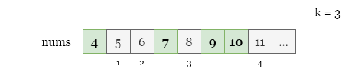
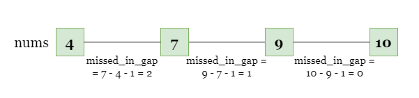
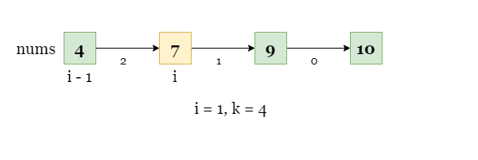
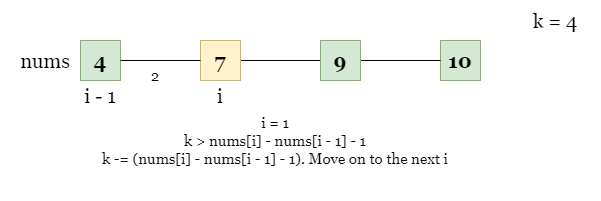
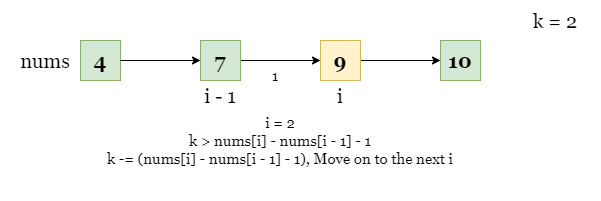
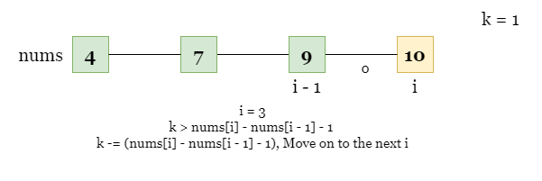
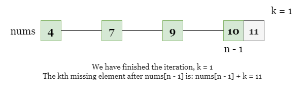
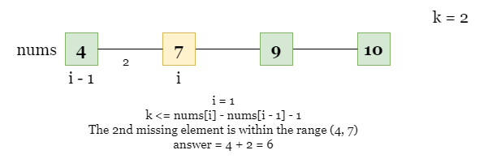
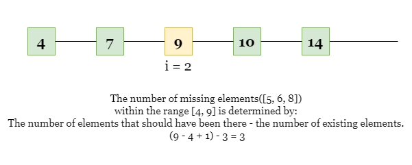
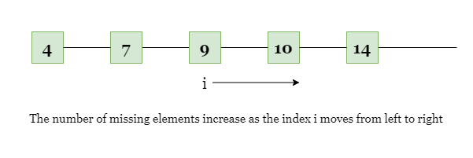

[TOC]

## Solution

---

### Overview

We have filled in the missing numbers and can see that the third missing number is 8. However, we need to pay attention to the size of k (potentially up to $10^8$) in the problem - we cannot traverse the numbers one by one as it may lead to a time limit exceeded error.



---

### Approach 1: Iteration

#### Intuition

So we cannot traverse all integers one by one. Instead, we can traverse the `nums` array. Of course, the difference between two adjacent numbers in "nums" may not necessarily be `1`. Therefore, we can calculate how many missing elements exist between these two numbers.

For each index `i`, we can set $missed_{in\_gap} = \text{nums}[i] - nums[i - 1] - 1$ to get the number of missing elements between the interval `[nums[i], nums[i - 1]]`.



<br>

Now, let's see how we can solve the problem. We start from $i = 1$ and check if the interval `[nums[i - 1], nums[i]]` contains less than `k` missing elements.



If it contains missing elements less than `k`, which is `missed_in_gap < k`, then the $k^{th}$ missing element must be on the right side of $\text{nums}[i]$, so we can reduce `k` by `missed_in_gap`, and move on to the next interval `[nums[i], nums[i + 1]]` by incrementing `i` by 1.







If we have finished the iteration while there is still `k` left, the $k^{th}$ missing element is at the $k^{th}$ position to the right of $nums[n - 1]$, which is $answer = nums[n - 1] + k$.



<br>

Otherwise ($missed_{in\_gap} \ge k$,), the $k^{th}$ missing element must be between $nums[i - 1]$ and $\text{nums}[i]$. The $k^{th}$ missing element is at the $k^{th}$ position to the right of $nums[i - 1]$, which is $answer = nums[i - 1] + k$.



As shown in the picture above, $i = 1$, the count is $missed_{in\_gap} = \text{nums}[1] - \text{nums}[0] - 1 = 2 = k$, which means the $2^{nd}$ missing element is within the range `(4, 7)`. We can get it using $answer = \text{nums}[0] + 2 = 6$.

<br>

#### Algorithm

1) Let `n` be the size of `nums`.
2) Iterate over index `i` from `1` to `n`, for each index:
- Calculate the number of missing elements between $nums[i - 1]$ and $\text{nums}[i]$ as $missed_{in\_gap} = \text{nums}[i] - nums[i - 1] - 1$.
- If `missed_in_gap` is greater than or equal to `k`, return $nums[i - 1] + k$. Otherwise, reduce `k` by `missed_in_gap` and repeat step 2.
- Otherwise, return $nums[i - 1] + k$.
3) If we have reached the end of `nums` and `k` is still larger than 0, return $nums[-1] + k$.

#### Implementation

```python
class Solution:
    def missingElement(self, nums: List[int], k: int) -> int:
        n = len(nums)

        for i in range(1, n):
            missed_in_gap = nums[i] - nums[i - 1] - 1
            if missed_in_gap >= k:
                return nums[i - 1] + k
            k -= missed_in_gap

        return nums[n - 1] + k
```

#### Complexity Analysis

Let $n$ be the length of the input array `nums`.

* Time complexity: $O(n)$

- The algorithm requires iterating over the entire array at most once to calculate the number of missing elements between each adjacent pair of numbers.

* Space complexity: $O(1)$

- We only use a constant amount of extra space for variables `missed_in_gap` and `i`.

<br/>

---

### Approach 2: Binary Search

#### Intuition

Another approach to solving this problem is to use binary search. Instead of focusing on the number of missing elements in every two adjacent numbers like $\text{nums}[i]$ and $nums[i + 1]$. We will focus on the total number of missing elements on $\text{nums}[i]$'s left, that is, within the range `[nums[0], nums[i]]`.

For an index `i`, we can get the number of missing elements on its left using the following observation. The total number of integers within the range of `[nums[0], nums[i]]` is $\text{nums}[i] - \text{nums}[0] + 1$. We know that there are $i + 1$ existing elements, so the number of missing elements is:

$(\text{nums}[i] - \text{nums}[0] + 1) - (i + 1) = \text{nums}[i] - \text{nums}[0] - i$.



Given an index `i`:

- If $\text{nums}[i] - \text{nums}[0] - i \ge k$, the $k^{th}$ missing element is on $\text{nums}[i]$'s left.
- Otherwise, the $k^{th}$ missing element is on $\text{nums}[i]$'s right.

Another key point is, the number of missing elements increases as `i` moves to the right.



<br>

Now is the time for binary search, we can define the search space as $left = 0, right = n - 1$. We will then find the midpoint of the range using $mid = right - (right - left) / 2$ and calculate the number of missing elements between $\text{nums}[mid]$ and $\text{nums}[0]$.
We use $\text{nums}[mid] - \text{nums}[0] - i$ as mentioned above to decide which direction to move the search range:

- If the count is less than `k`, we can update the search range to the right side of the `mid`.
- Otherwise, we update the search range to the left side of the `mid`.

We can repeat this process until $left \ge right$. At this point, `left`, is **the rightmost index** such that `[nums[0], nums[left]]` has fewer missing elements than `k`.

The answer, the $k^{th}$ missing element must be somewhere to the right of $\text{nums}[left]$. There will be no elements in the array between the answer and $\text{nums}[left]$.

We don't know the `answer` yet, but let's focus on the range `[nums[0], answer]`. We know that it contains $left + 1$ elements from the input array, and `k` missing elements (by definition, the last element of the range `answer` is the $k^{th}$ missing element). Therefore the total number of elements in the range is:

$elements from the input + missing elements = left + 1 + k$

Finally, as we know, $answer - \text{nums}[0] + 1$ is the size of the range. Setting these equations equal to each other, we can rearrange for `answer`.

$answer - \text{nums}[0] + 1 = left + 1 + k$ -> $answer = \text{nums}[0] + left + k$.

<br>

#### Algorithm

1) Let `n` be the size of `nums`. Initialize the boundaries of the search space, set $left = 0$ and $right = n - 1$.
2) While `left` is less than `right`, repeat step 3 and 4.

3) Calculate the midpoint of `left` and `right` as $mid = right - (right - left) // 2$.

4) Calculate the number of missing elements between $\text{nums}[mid]$ and $\text{nums}[0]$ as $\text{nums}[mid] - \text{nums}[0] - mid$.
- If the count of missing elements calculated in last step is less than `k`, set $left = mid$.
- Otherwise, set $right = mid - 1$.

5) Return $\text{nums}[0] + k + left$.

#### Implementation

```python
class Solution:
    def missingElement(self, nums: List[int], k: int) -> int:
        n = len(nums)
        left, right = 0, n - 1

        while left < right:
            mid = right - (right - left) // 2
            if (nums[mid] - nums[0]) - mid < k:
                left = mid
            else:
                right = mid - 1

        return nums[0] + k + left
```

#### Complexity Analysis

LLet $n$ be the length of the input array `nums`.

* Time complexity: $O(\log n)$

- The algorithm repeatedly divides the search space in half using binary search until it finds the $k^{th}$ missing element.

* Space complexity: $O(1)$

- The algorithm only uses a constant amount of extra space for variables `left`, `right`, and `mid`.

<br/>