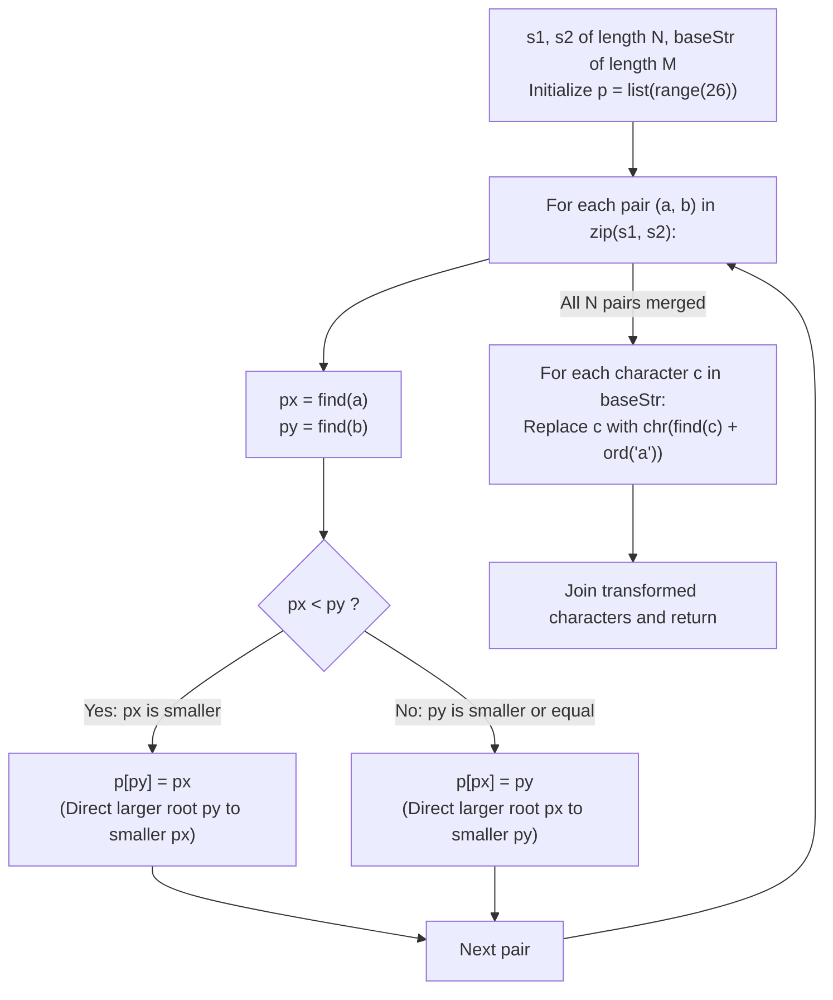

# Guided Example: Lexicographically Smallest Equivalent String

We trace the step-by-step partition of the lowercase Latin alphabet into equivalence classes using a disjoint-set union (DSU) structure with a directed minimal-root invariant, prove the Equivalence Relation Canonical Representative Theorem and the Positional Independence Lemma, and transform representative base strings into their lexicographically smallest equivalents:

- **Representative Instance 1 (Multi-Component Equivalence Network):**
  $$
  s1 = \text{"parker"}, \quad s2 = \text{"morris"}, \quad baseStr = \text{"parser"}
  $$
- **Required Output:** `"makkek"`
  - Problem definitions:
    - Aligned pairs $(s1[i], s2[i])$ define an equivalence relation (reflexive, symmetric, transitive) on the alphabet $\Sigma = \{'a', \dots, 'z'\}$.
    - Any character in a string may be replaced by any equivalent character.
    - Return the lexicographically smallest equivalent string of $baseStr$.
  - The Positional Independence Lemma:
    - Lexicographical comparison evaluates strings from left to right.
    - An assignment at index $j$ does not restrict the choice at any other index $k$.
    - Therefore, minimizing the entire string is strictly equivalent to replacing each character $c$ with the **minimum character** in its equivalence class:
      $$
      c^* = \min \{ x \in \Sigma : x \sim c \}
      $$
  - DSU with Directed Minimal-Root Invariant ($p[x] = x$ initially):
    - When merging roots $px$ and $py$, always set $p[\max(px, py)] = \min(px, py)$ so that the root of every connected tree is always its **lexicographically smallest member**!
    1. Pair 1: $(p, m) \implies \text{ord}(p)=15, \text{ord}(m)=12$. Since $12 < 15$, set $p[15] = 12$ ($p \to m$).
    2. Pair 2: $(a, o) \implies \text{ord}(a)=0, \text{ord}(o)=14$. Since $0 < 14$, set $p[14] = 0$ ($o \to a$).
    3. Pair 3: $(r, r) \implies \text{Identical}$. No change.
    4. Pair 4: $(k, r) \implies \text{ord}(k)=10, \text{ord}(r)=17$. Since $10 < 17$, set $p[17] = 10$ ($r \to k$).
    5. Pair 5: $(e, i) \implies \text{ord}(e)=4, \text{ord}(i)=8$. Since $4 < 8$, set $p[8] = 4$ ($i \to e$).
    6. Pair 6: $(r, s) \implies \text{find}(r) = 10 \; (k), \; \text{find}(s) = 18 \; (s)$. Since $10 < 18$, set $p[18] = 10$ ($s \to k$).
  - Resulting Equivalence Classes & Canonical Minima:
    - $[p, m] \implies \text{canonical minimum} = \mathbf{'m'}$
    - $[a, o] \implies \text{canonical minimum} = \mathbf{'a'}$
    - $[r, k, s] \implies \text{canonical minimum} = \mathbf{'k'}$
    - $[e, i] \implies \text{canonical minimum} = \mathbf{'e'}$
  - Substituting $baseStr = \text{"parser"}$:
    - $baseStr[0] = \text{'p'} \implies \text{find}('p') = \mathbf{'m'}$
    - $baseStr[1] = \text{'a'} \implies \text{find}('a') = \mathbf{'a'}$
    - $baseStr[2] = \text{'r'} \implies \text{find}('r') = \mathbf{'k'}$
    - $baseStr[3] = \text{'s'} \implies \text{find}('s') = \mathbf{'k'}$
    - $baseStr[4] = \text{'e'} \implies \text{find}('e') = \mathbf{'e'}$
    - $baseStr[5] = \text{'r'} \implies \text{find}('r') = \mathbf{'k'}$
  - Emitted string: `"makkek"`.

- **Representative Instance 2 (Partial Disjoint Replacements):**
  $$
  s1 = \text{"hello"}, \quad s2 = \text{"world"}, \quad baseStr = \text{"hold"} \implies \mathbf{"hdld"}
  $$

- **Representative Instance 3 (Large Transitive Component Collapsing to 'a'):**
  $$
  s1 = \text{"leetcode"}, \quad s2 = \text{"programs"}, \quad baseStr = \text{"sourcecode"} \implies \mathbf{"aauaaaaada"}
  $$

---

## 1. Instance & Teaching Goal

Given two strings `s1` and `s2` declaring pairwise character equivalences, find the lexicographically smallest string obtainable by substituting equivalent characters into `baseStr`.

```text
The Floyd-Warshall / BFS Matrix Fallacy:
  Building a 26x26 adjacency matrix and running all-pairs reachability:
    Takes O(A^3) or repeated BFS sweeps with quadratic memory.

Disjoint-Set Union with Min-Root Invariant (O(N + M) Time, O(1) Space):
  Key observation:
    Each connected component has a unique minimal character.
    If the DSU tree root is GUARANTEED to be the smallest character in the component:
      find(c) directly returns the optimal replacement character in O(1) time!
  1. Initialize p = list(range(26)).
  2. For each pair (a, b) in zip(s1, s2):
       px, py = find(a), find(b)
       Set p[max(px, py)] = min(px, py)  <-- Direct root to smaller value!
  3. Replace each c in baseStr with chr(find(c) + ord('a')).
  Runs in linear time with path compression and exactly 26 integers of memory!
```

Directing union edges toward the smaller numerical vertex index embeds optimal representative selection directly into the DSU structure without auxiliary queries.

The decisive pedagogical goal is the **Equivalence Canonical Representative Theorem & Directed Min-Root Union**:
1. **Component Equivalence:** The transitive closure of the input pairs decomposes $\Sigma$ into connected components where every pair of nodes can substitute for each other.
2. **Positional Independence:** Because lexicographical order gives priority to earlier characters and choices are unconstrained across positions, greedily minimizing each character independently produces the global optimum.
3. **Directed Min-Root Invariant:** Directing union assignments $p[\max(px, py)] = \min(px, py)$ ensures that every root is the minimum element of its set.
4. Total time $\mathcal{O}(N + M)$ (where $N = |s1|, M = |baseStr|$) and auxiliary space $\mathcal{O}(1)$.

---

## 2. Conceptual Foundation & The DSU Minimization Pipeline



### The Equivalence Canonical Representative Theorem

Let $\Sigma = \{0, 1, \dots, 25\}$ represent the alphabet $\{'a', \dots, 'z'\}$.
1. **Equivalence Relation:**
   Let $E = \{(s1[i], s2[i]) : 0 \le i < N\}$.
   Let $\sim$ be the reflexive, symmetric, and transitive closure of $E$ on $\Sigma$.
   Then $\sim$ partitions $\Sigma$ into disjoint equivalence classes $\mathcal{C}_1, \dots, \mathcal{C}_k$.
2. **Positional Independence of Lexicographical Minimization:**
   Let $W = (w_0, w_1, \dots, w_{M-1})$ be the original string $baseStr$.
   A replacement string $W' = (w'_0, \dots, w'_{M-1})$ is valid if and only if $w'_j \sim w_j$ for all $0 \le j < M$.
   Suppose there exists an index $j$ such that $w'_j > \min [w_j]_\sim$.
   Let $w^*_j = \min [w_j]_\sim$.
   Replacing $w'_j$ with $w^*_j$ produces a string $W''$ that agrees with $W'$ on all indices $< j$ and has $W''[j] < W'[j]$.
   By definition of lexicographical comparison, $W'' <_{\text{lex}} W'$.
   Therefore, the uniquely minimal equivalent string satisfies:
   $$
   w^*_j = \min [w_j]_\sim \quad \forall 0 \le j < M
   $$
3. **Directed Min-Root DSU Correctness:**
   - **Base case:** Initially, $p[x] = x$ for all $x$, so root of $\{x\}$ is $x = \min \{x\}$.
   - **Inductive step:** Suppose two disjoint components have roots $r_1 = \min C_1$ and $r_2 = \min C_2$.
     When unioning, setting $p[\max(r_1, r_2)] = \min(r_1, r_2)$ merges the trees under root $r^* = \min(r_1, r_2)$.
     Since $\min(C_1 \cup C_2) = \min(\min C_1, \min C_2) = \min(r_1, r_2) = r^*$, the invariant that **the tree root is the component minimum** is preserved!
   - Therefore, $\text{find}(c)$ always returns the minimal equivalent character. $\blacksquare$

---

## 3. Step-by-Step Worked Execution: Representative Instance 1

$s1 = \text{"parker"}, \; s2 = \text{"morris"}, \; baseStr = \text{"parser"}$.
Initialize $p = [0, 1, \dots, 25]$.

### Pairwise Union Trace
- Pair 1: $(p, m) \to (15, 12) \implies px = 15, py = 12$. Since $12 < 15$: $p[15] = 12$.
- Pair 2: $(a, o) \to (0, 14) \implies px = 0, py = 14$. Since $0 < 14$: $p[14] = 0$.
- Pair 3: $(r, r) \to (17, 17) \implies px = 17, py = 17$. Same root.
- Pair 4: $(k, r) \to (10, 17) \implies px = 10, py = 17$. Since $10 < 17$: $p[17] = 10$.
- Pair 5: $(e, i) \to (4, 8) \implies px = 4, py = 8$. Since $4 < 8$: $p[8] = 4$.
- Pair 6: $(r, s) \to (17, 18) \implies px = \text{find}(17) = 10, py = \text{find}(18) = 18$. Since $10 < 18$: $p[18] = 10$.

### Transformation of $baseStr = \text{"parser"}$
- $j = 0: \text{'p'} \to 15 \implies \text{find}(15) = 12 \implies \mathbf{'m'}$
- $j = 1: \text{'a'} \to 0 \implies \text{find}(0) = 0 \implies \mathbf{'a'}$
- $j = 2: \text{'r'} \to 17 \implies \text{find}(17) = 10 \implies \mathbf{'k'}$
- $j = 3: \text{'s'} \to 18 \implies \text{find}(18) = 10 \implies \mathbf{'k'}$
- $j = 4: \text{'e'} \to 4 \implies \text{find}(4) = 4 \implies \mathbf{'e'}$
- $j = 5: \text{'r'} \to 17 \implies \text{find}(17) = 10 \implies \mathbf{'k'}$

Result: `"makkek"`.

---

## 4. DSU Component Merge and Replacement Trace Table

| Character Position in `baseStr` | Original Letter | Integer Code $x$ | Path to Root in $p$ | Component Canonical Root | Replaced Letter |
|:---:|:---:|:---:|:---:|:---:|:---:|
| $0$ | `'p'` | $15$ | $15 \to 12$ | $12$ | **`'m'`** |
| $1$ | `'a'` | $0$ | $0 \to 0$ | $0$ | **`'a'`** |
| $2$ | `'r'` | $17$ | $17 \to 10$ | $10$ | **`'k'`** |
| $3$ | `'s'` | $18$ | $18 \to 10$ | $10$ | **`'k'`** |
| $4$ | `'e'` | $4$ | $4 \to 4$ | $4$ | **`'e'`** |
| $5$ | `'r'` | $17$ | $17 \to 10$ | $10$ | **`'k'`** |
| **Output** | — | — | — | — | **`"makkek"`** |

---

## 5. Algorithmic Correctness

### Soundness & Completeness
1. **Soundness:**
   Every replacement character belongs to the connected component of the original character in the equivalence relation graph.
2. **Completeness:**
   Because the DSU union operation directs all edges toward the strictly smaller root index, the root of every tree is provably the minimum element in its component.

---

## 6. Boundary Cases & Traps

| Scenario | Input Pattern | Behavior | Trapped Risk |
|---|---|---|---|
| Reflexive Identity Pairs | $s1[i] == s2[i]$ | $px == py$; parent array remains unchanged. | Creating self-referential cycle. |
| Character Not in $s1$ or $s2$ | Letter in $baseStr$ untouched by pairs | $p[c] == c$; replaces character with itself. | Crash or incorrect substitution of isolated characters. |
| All Characters Equivalent | Long chain connecting all 26 letters | All roots collapse to $0$ ('a'); all characters become 'a'. | Deep recursion without path compression. |
| Already Smallest | Every character in $baseStr$ is minimal in its class | String returns completely unchanged. | Unnecessary mutation. |

---

## 7. Complexity Derivation

- **Time Complexity:** $\mathcal{O}((N + M) \alpha(26)) \approx \mathcal{O}(N + M)$, where $N = \text{len}(s1) \le 1000$ and $M = \text{len}(baseStr) \le 1000$.
  - With an alphabet of size $|\Sigma| = 26$, the inverse Ackermann factor $\alpha(26) \le 2$.
  - Processing $N$ pair unions takes $\mathcal{O}(N)$ operations.
  - Transforming $M$ characters takes $\mathcal{O}(M)$ operations.
  - Total time: $< 0.001\text{ s}$.
- **Auxiliary Space Complexity:** $\mathcal{O}(1)$ auxiliary memory; uses a fixed 26-element integer array $p$ for parent tracking.
