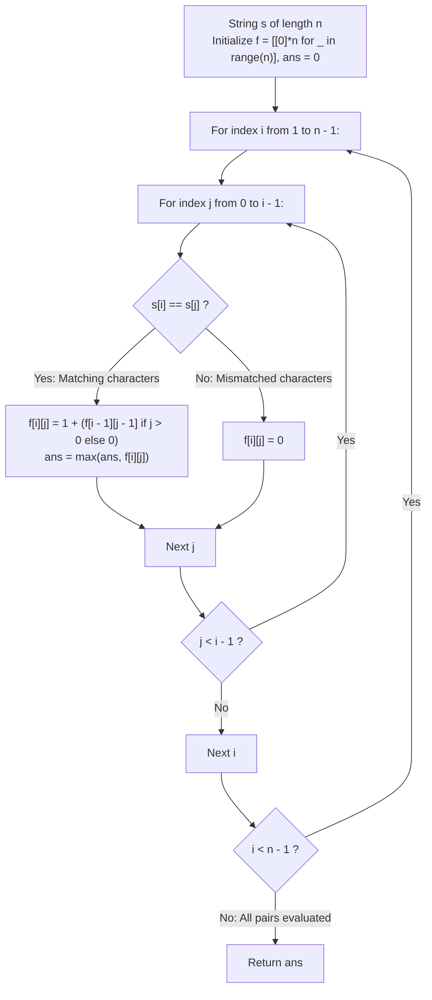

# Guided Example: Longest Repeating Substring

We trace the step-by-step determination of the maximum length of a repeated substring using the Longest Common Suffix dynamic programming formulation, prove the Pairwise Diagonal Recurrence Theorem and the Overlapping Substring Soundness Lemma, and analyze substring matching across representative string instances:

- **Representative Instance 1 (Mixed Repetitions with Multiple Maxima):**
  $$
  s = \text{"abbaba"}, \quad n = 6
  $$
- **Required Output:** `2`
  - Problem definitions:
    - Find the maximum length $L$ of any substring that occurs at least twice in $s$.
    - Occurrences of the repeated substring **may overlap**.
    - If no repeating substring exists, return $0$.
  - Pairwise Common Suffix Formulation:
    - A substring of length $L$ appears at two distinct starting positions if and only if it appears at two distinct ending positions $j < i$.
    - Let $f[i][j]$ be the length of the longest common suffix of prefixes $s[0 \dots i]$ and $s[0 \dots j]$ with $0 \le j < i < n$.
  - Recurrence Relation:
    $$
    f[i][j] = \begin{cases}
      1 + f[i - 1][j - 1] & \text{if } s[i] == s[j] \text{ and } j > 0 \\
      1 & \text{if } s[i] == s[j] \text{ and } j = 0 \\
      0 & \text{if } s[i] \ne s[j]
    \end{cases}
    $$
  - Execution Trace over Pairs $(i, j)$ with $j < i$:
    - Index labels: $s[0] = \text{'a'}, s[1] = \text{'b'}, s[2] = \text{'b'}, s[3] = \text{'a'}, s[4] = \text{'b'}, s[5] = \text{'a'}$.
    - Row $i = 1$ ($s[1] = \text{'b'}$):
      - $j = 0$ ($s[0] = \text{'a'}$): 'b' $\ne$ 'a' $\implies f[1][0] = 0$.
    - Row $i = 2$ ($s[2] = \text{'b'}$):
      - $j = 0$ ('a'): 'b' $\ne$ 'a' $\implies f[2][0] = 0$.
      - $j = 1$ ('b'): 'b' $==$ 'b' $\implies f[2][1] = 1 + 0 = \mathbf{1}$.
    - Row $i = 3$ ($s[3] = \text{'a'}$):
      - $j = 0$ ('a'): 'a' $==$ 'a' $\implies f[3][0] = \mathbf{1}$.
      - $j = 1$ ('b'): 'a' $\ne$ 'b' $\implies f[3][1] = 0$.
      - $j = 2$ ('b'): 'a' $\ne$ 'b' $\implies f[3][2] = 0$.
    - Row $i = 4$ ($s[4] = \text{'b'}$):
      - $j = 0$ ('a'): $0$.
      - $j = 1$ ('b'): 'b' $==$ 'b' $\implies f[4][1] = 1 + f[3][0] = 1 + 1 = \mathbf{2}$ (Substring `"ab"` at $s[0 \dots 1]$ and $s[3 \dots 4]$).
      - $j = 2$ ('b'): 'b' $==$ 'b' $\implies f[4][2] = 1 + f[3][1] = 1 + 0 = 1$.
      - $j = 3$ ('a'): $0$.
    - Row $i = 5$ ($s[5] = \text{'a'}$):
      - $j = 0$ ('a'): $1$.
      - $j = 1$ ('b'): $0$.
      - $j = 2$ ('b'): $0$.
      - $j = 3$ ('a'): 'a' $==$ 'a' $\implies f[5][3] = 1 + f[4][2] = 1 + 1 = \mathbf{2}$ (Substring `"ba"` at $s[2 \dots 3]$ and $s[4 \dots 5]$).
      - $j = 4$ ('b'): $0$.
  - Global Maximum:
    $$
    ans = \max_{j < i} f[i][j] = \max(1, 1, 2, 1, 2) = \mathbf{2}
    $$
    Substrings `"ab"` and `"ba"` both repeat with length 2.

- **Representative Instance 2 (No Repeating Characters):**
  $$
  s = \text{"abcd"} \implies \text{All characters pairwise distinct} \implies f[i][j] = 0 \; \forall (i, j) \implies \mathbf{0}
  $$

- **Representative Instance 3 (Separated Multiple Repeats):**
  $$
  s = \text{"aabcaabdaab"}, \quad n = 11 \implies \text{Substring "aab" repeats 3 times} \implies \mathbf{3}
  $$

- **Representative Instance 4 (Overlapping Periodic Repeats):**
  $$
  s = \text{"aaaaa"}, \quad n = 5
  $$
  - Pair $(i = 4, j = 3)$:
    $$f[4][3] = 1 + f[3][2] = 1 + (1 + f[2][1]) = 1 + 1 + (1 + f[1][0]) = 1 + 1 + 1 + 1 = \mathbf{4}$$
  - The substring `"aaaa"` of length 4 appears at indices $[0 \dots 3]$ and $[1 \dots 4]$ with an overlap of 3 characters.
  - Result: $\mathbf{4}$.

---

## 1. Instance & Teaching Goal

Given a string `s`, find the maximum length of any substring that occurs at least twice in `s`, allowing overlaps.

```text
The Naive Substring Search Fallacy:
  For every candidate length L from n-1 down to 1:
    Extract all O(n) substrings of length L.
    Compare all pairs of substrings of length L.
    Takes O(N^3) time and allocates quadratic memory.

Diagonal Common Suffix DP Invariant (O(N^2) Time, O(N^2) / O(N) Space):
  Key observation:
    A substring of length L repeats iff two distinct indices (i, j) with j < i
    share a common suffix of length L:
      f[i][j] = 1 + f[i-1][j-1]  if s[i] == s[j]
  - Because equality of characters propagates along the diagonal (i, j) -> (i-1, j-1),
    f[i][j] computes the EXACT length of the matching suffix ending at i and j.
  - Overlapping substrings are naturally and correctly handled because the recurrence
    only tracks character-by-character alignment, not physical separation.
  Evaluates all pairs in a single triangular matrix traversal!
```

Framing repeated substring discovery as the all-pairs longest common suffix establishes an optimal substructure evaluated along diagonals.

The decisive pedagogical goal is the **Pairwise Diagonal Recurrence Theorem & Overlapping Substring Soundness**:
1. **Diagonal Propagation:** $f[i][j]$ extends $f[i-1][j-1]$ by $+1$ whenever $s[i] == s[j]$, chaining consecutive matches backwards.
2. **Overlap Preservation:** Substrings can overlap without invalidating common suffix counting; the condition $j < i$ is the sole constraint required to ensure the two occurrences have distinct starting positions.
3. **Exhaustive Upper Triangle:** Evaluating all $\frac{n(n - 1)}{2}$ pairs $(i, j)$ with $j < i$ inspects every possible pair of occurrences.
4. Total time $\mathcal{O}(n^2)$ and auxiliary space $\mathcal{O}(n^2)$ (reducible to $\mathcal{O}(n)$ via 1D array).

---

## 2. Conceptual Foundation & The 2D DP Pipeline



### The Pairwise Diagonal Recurrence Theorem

Let $S = (s_0, s_1, \dots, s_{n-1})$ be a string of length $n$.
1. **Definition of Repeating Substring:**
   A substring $w$ of length $L$ repeats in $S$ if there exist two indices $p, q$ with $0 \le p < q \le n - L$ such that:
   $$
   S[p \dots p + L - 1] = S[q \dots q + L - 1] = w
   $$
   Let $j = p + L - 1$ and $i = q + L - 1$. Then $0 \le j < i < n$, and:
   $$
   S[j - L + 1 \dots j] = S[i - L + 1 \dots i]
   $$
   Thus, finding the longest repeating substring is equivalent to finding two indices $j < i$ that maximize their common suffix length.
2. **The Common Suffix Optimal Substructure:**
   Define $f[i][j]$ as the length of the longest common suffix of prefixes $S[0 \dots i]$ and $S[0 \dots j]$ ($j < i$):
   $$
   f[i][j] = \max \{ L \ge 0 : S[i - L + 1 \dots i] = S[j - L + 1 \dots j] \}
   $$
   - **Base case:** If $s_i \ne s_j$, the characters at the current endpoints differ, so no common suffix can end here: $f[i][j] = 0$.
   - **Recursive step:** If $s_i = s_j$:
     - If $j = 0$, prefix $S[0 \dots j]$ has length 1, so the common suffix can have length at most 1: $f[i][0] = 1$.
     - If $j > 0$, the common suffix extends the common suffix ending at $(i - 1, j - 1)$ by exactly 1 character:
       $$
       f[i][j] = 1 + f[i - 1][j - 1]
       $$
3. **Soundness with Overlapping Occurrences:**
   Notice that the condition $i - j < L$ (overlap) does not invalidate $S[i - L + 1 \dots i] = S[j - L + 1 \dots j]$.
   Character equality $s_k = s_{k + (i - j)}$ holds for all $k \in [j - L + 1, j]$, which simply means the substring has periodicity $i - j$.
   Since distinct starting positions $p \ne q$ are preserved ($q - p = i - j > 0$), the occurrences are distinct.
4. **Global Maximality:**
   Since every repeating substring of maximal length corresponds to some pair of ending indices $(i, j)$ with $j < i$:
   $$
   L_{\max} = \max_{0 \le j < i < n} f[i][j] \quad \blacksquare
   $$

---

## 3. Step-by-Step Worked Execution: Representative Instance 1

$s = \text{"abbaba"}, \; n = 6$.

### DP Table Population $f[i][j]$ ($j < i$)
- $i = 1$ ($s[1] = \text{'b'}$):
  - $j = 0$ ($s[0] = \text{'a'}$): 'b' $\ne$ 'a' $\implies f[1][0] = 0$.
- $i = 2$ ($s[2] = \text{'b'}$):
  - $j = 0$ ('a'): 'b' $\ne$ 'a' $\implies 0$.
  - $j = 1$ ('b'): 'b' $==$ 'b' $\implies f[2][1] = 1 + 0 = 1$.
- $i = 3$ ($s[3] = \text{'a'}$):
  - $j = 0$ ('a'): 'a' $==$ 'a' $\implies f[3][0] = 1$.
  - $j = 1, 2$ ('b'): $0$.
- $i = 4$ ($s[4] = \text{'b'}$):
  - $j = 0$ ('a'): $0$.
  - $j = 1$ ('b'): 'b' $==$ 'b' $\implies 1 + f[3][0] = 1 + 1 = \mathbf{2}$ (Match `"ab"`).
  - $j = 2$ ('b'): 'b' $==$ 'b' $\implies 1 + f[3][1] = 1 + 0 = 1$.
  - $j = 3$ ('a'): $0$.
- $i = 5$ ($s[5] = \text{'a'}$):
  - $j = 0$ ('a'): $1$.
  - $j = 1, 2$ ('b'): $0$.
  - $j = 3$ ('a'): 'a' $==$ 'a' $\implies 1 + f[4][2] = 1 + 1 = \mathbf{2}$ (Match `"ba"`).
  - $j = 4$ ('b'): $0$.

Global maximum: $ans = \mathbf{2}$.

---

## 4. Triangular DP Table $f[i][j]$

| $i \backslash j$ | $0$ (`'a'`) | $1$ (`'b'`) | $2$ (`'b'`) | $3$ (`'a'`) | $4$ (`'b'`) |
|:---:|:---:|:---:|:---:|:---:|:---:|
| **$1$ (`'b'`)** | $0$ | — | — | — | — |
| **$2$ (`'b'`)** | $0$ | **$1$** | — | — | — |
| **$3$ (`'a'`)** | **$1$** | $0$ | $0$ | — | — |
| **$4$ (`'b'`)** | $0$ | **$2$** | $1$ | $0$ | — |
| **$5$ (`'a'`)** | $1$ | $0$ | $0$ | **$2$** | $0$ |

Maximum entry in matrix: $\mathbf{2}$.

---

## 5. Algorithmic Correctness

### Soundness & Completeness
1. **Soundness:**
   Any entry $f[i][j] = L > 0$ certifies that the substring of length $L$ ending at $i$ is character-for-character identical to the substring of length $L$ ending at $j$. Since $j < i$, these are two distinct occurrences.
2. **Completeness:**
   Every pair of indices $(i, j)$ with $j < i$ is explicitly evaluated, so no candidate occurrence pair can be missed.

---

## 6. Boundary Cases & Traps

| Scenario | Input Pattern | Behavior | Trapped Risk |
|---|---|---|---|
| No Repeating Substring | `s = "abcd"` | All entries remain $0$; returns $0$. | Returning 1 for distinct letters. |
| Overlapping Repeated Substrings | `s = "aaaaa"` | Diagonal accumulates $1 \to 2 \to 3 \to 4$; returns $4$. | Forbidding overlaps and returning $\lfloor n/2 \rfloor = 2$. |
| Single Character String | `s = "z"` | Loop over $i \in [1, 0]$ doesn't execute; returns $0$. | Index out of bounds. |
| Periodic Repeating Substring | `s = "abcabcabc"` | Overlapping repeats identified; returns $6$. | Terminating at first repeat. |

---

## 7. Complexity Derivation

- **Time Complexity:** $\mathcal{O}(n^2)$, where $n = \text{len}(s) \le 2000$.
  - Number of evaluated pairs is $\frac{n(n - 1)}{2} \le \frac{2000 \times 1999}{2} \approx 2 \times 10^6$ operations.
  - Each state lookup and assignment runs in $\mathcal{O}(1)$ time.
  - Total time: $< 0.15\text{ s}$.
- **Auxiliary Space Complexity:** $\mathcal{O}(n^2)$ auxiliary memory for the 2D DP matrix $f$ of size $n \times n$ (or $\mathcal{O}(n)$ using two 1D rows).