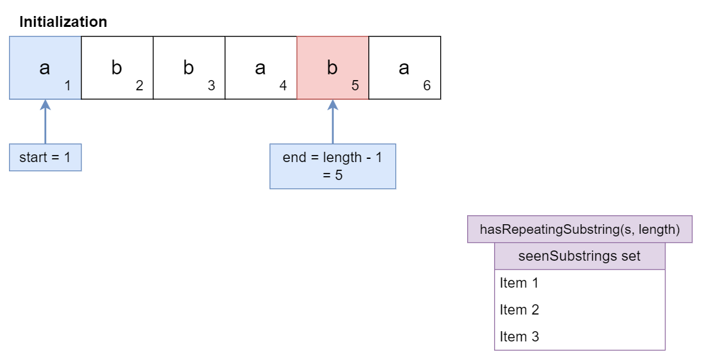
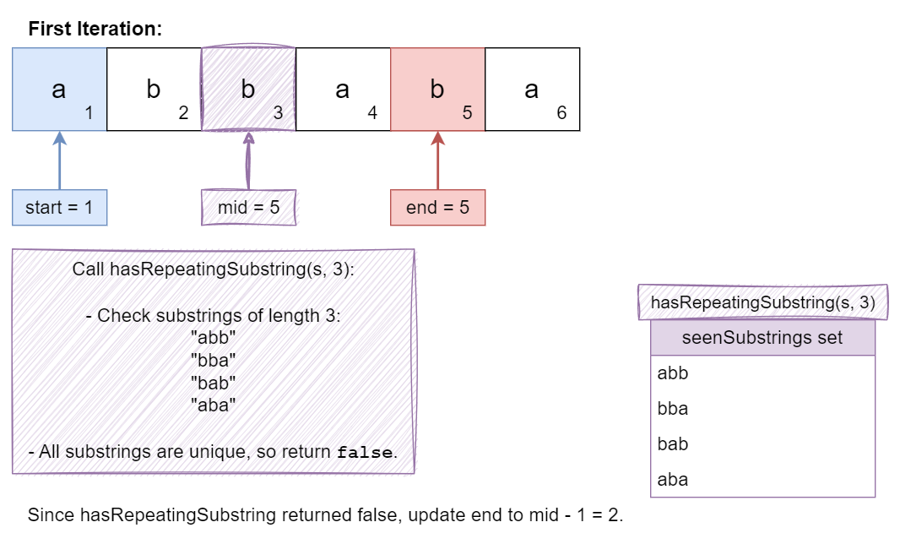
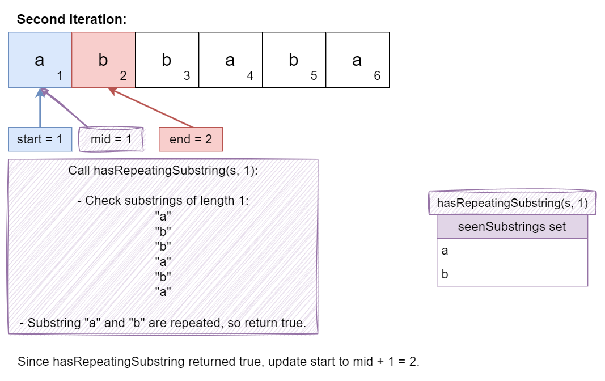
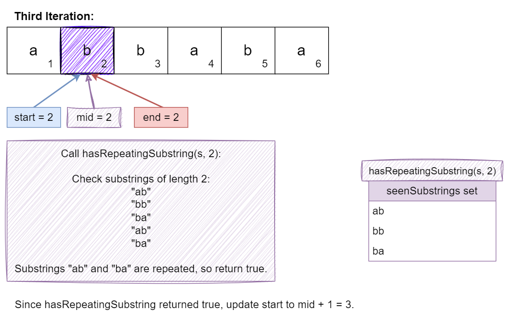
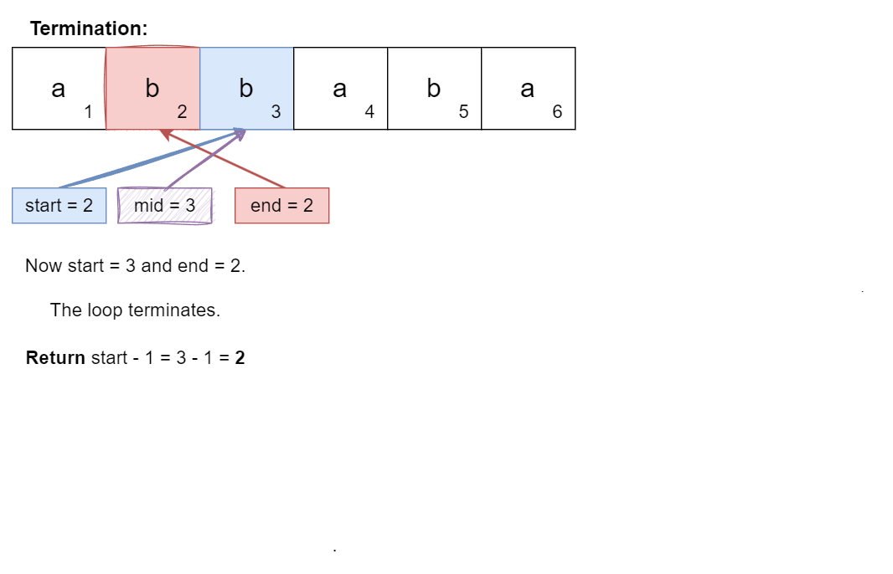

## Solution

---

### Overview

The problem asks for the length of the longest repeating substring within a given string `s`. A repeating substring is defined as a sequence of consecutive characters that appears more than once in the original string.

> $Input: s = "abbaba"$
> `Output: 2`

In this string, there are multiple repeating substrings. The longest repeating substrings are "ab" and "ba", each of which appears twice. Specifically:

- The substring "ab" appears at the start of the string and again starting from the fourth character.
- The substring "ba" appears starting from the third character and again starting from the fifth character.

Both "ab" and "ba" have a length of `2`, which is the maximum length of any repeating substring in this example. Therefore, the function should return `2`.

If no repeating substring exists, such as in a string with all unique characters, the function should return `0`.

---

### Approach 1: Brute Force with Set

#### Intuition

In this approach, we start by assuming that the longest repeating substring could be as long as `n-1`, where `n` is the length of the string. The idea is to test for substrings starting from this maximum length and decrease until we find a repeating substring. This way we ensure that once we find a repeating substring, it is the longest possible one.

We initialize a set to store the substrings we encounter as we iterate through the string. The process involves extracting substrings of the current maximum length from the string and checking if they have been seen before. If we find a match in the set, this means the substring has repeated, and we can conclude that its length is the longest repeating length. If not, we decrease the substring length, reset our set, and continue the search.

For instance, in the string "abbaba", we would check substrings starting from length 5, then 4, and so on, until we find "ab" and "ba" both repeat, which gives us the longest repeating substring length of 2.

#### Algorithm

- Initialize `seenSubstrings` as a Set to store unique substrings and `maxLength` as the maximum length of the repeating substring found.
- Iterate over each possible starting index `start` in the string `s`:
  - For each `start`, set `end` to `start`.
  - If the current substring's length ($end + maxLength$) exceeds the string's length:
- Decrease `maxLength` by 1.
- Reset `start` to `-1` and clear `seenSubstrings`.
- Continue to the next iteration.
  - Extract the current substring from `s` using `start` and `maxLength`.
  - If `seenSubstrings` already contains this substring, return `maxLength` as the result.
  - Add the current substring to `seenSubstrings`.
- Return `maxLength` after checking all possible substrings.

#### Implementation

```python
class Solution:
    def longestRepeatingSubstring(self, s: str) -> int:
        seen_substrings = set()
        max_length = len(s) - 1

        while max_length > 0:
            seen_substrings.clear()
            for start in range(len(s) - max_length + 1):
                end = start
                # Extract substring of length max_length
                current_substring = s[end : end + max_length]
                # If the substring is already in the set,
                # it means we've found a repeating substring
                if current_substring in seen_substrings:
                    return max_length
                seen_substrings.add(current_substring)
            # If no repeating substring found,
            # decrease max_length and try again
            max_length -= 1
        return 0
```

#### Complexity Analysis

Let $n$ be the length of the string.

- Time complexity: $O(n^3)$

    The primary time-consuming operations are the nested loops and the substring extraction for every combination of start and end positions, which involves up to $n^2$ iterations, and each substring extraction and set operation takes $O(n)$ time.

- Space complexity: $O(n^2)$

    $O(n^2)$, as we may store up to $O(n^2)$ substrings of various lengths in the set.

---

### Approach 2: Brute Force with Incremental Search

#### Intuition

Instead of starting with the maximum possible substring length, here we begin with the shortest possible repeating substring and gradually increase the length. We begin with length 1 and increase the length until we fail to find any repeating substrings, at which point the previous length is the longest repeating one.

We initialize a set to keep track of substrings of the current length as we scan through the string. For each starting index, we extract a substring of the current length and check if it's in the set. If a duplicate is found, this indicates a repeating substring. We then clear the set, reset the starting index, and increase the length to test longer substrings. If we do not find any repeating substrings for a given length, we return the length of the last successful find. This way we systematically explore possible substring lengths, ensuring that the longest is identified.

#### Algorithm

- Initialize a variable `maxLength` to track the length of the longest repeating substring found, and create a Set named `seenSubstrings` to store substrings.
- Iterate through the string `s` starting from each position `start`:
  - For each starting position `start`, initialize `end` to `start`.
  - Check if the current maximum length of repeating substrings ($end + maxLength$) exceeds the string length:
- If so, return `maxLength` as it is no longer possible to find a longer repeating substring.
  - Generate a substring `currentSubstring` of length $maxLength + 1$ starting from position `end`.
  - Attempt to add `currentSubstring` to `seenSubstrings`:
- If the substring was already present in the set, it means a repeating substring has been found.
- Reset `start` to `-1` to restart the search for substrings of increased length, clear the set `seenSubstrings`, and increment `maxLength`.
- Continue this process until all possible starting positions are checked.
- Return `maxLength`, which now represents the length of the longest repeating substring found.

#### Implementation

```python
class Solution:
    def longestRepeatingSubstring(self, s: str) -> int:
        length = len(s)
        max_length = 0
        seen_substrings = set()

        start = 0
        while start < length:
            end = start
            # Stop if it's not possible to find a
            # longer repeating substring
            if end + max_length >= length:
                return max_length
            # Generate substrings of length max_length + 1
            current_substring = s[end : end + max_length + 1]
            # If a repeating substring is found,
            #  increase max_length and restart
            if current_substring in seen_substrings:
                start = -1  # Restart search for new length
                seen_substrings.clear()
                max_length += 1
            else:
                seen_substrings.add(current_substring)
            start += 1

        return max_length
```

#### Complexity Analysis

Let $n$ be the length of the string.

- Time complexity: $O(n^3)$

   For each possible starting index `start`, the algorithm generates substrings of length $maxLength + 1$. As `maxLength` increases, substring generation involves examining substrings of lengths up to `n`. The number of substrings generated can be up to $O(n^2)$.

   Each substring extraction takes $O(n)$ time in the worst case because it involves copying a portion of the original string.

   Given that each substring extraction is $O(n)$ and there are up to $O(n^2)$ substrings, the overall time complexity is $O(n^3)$ due to the nested loops and substring operations.

- Space complexity: $O(n^2)$

    The set is used to store substrings that have been seen. In the worst case, the number of unique substrings stored can be up to $O(n^2)$, and each substring can be up to length `n`. Thus, the space complexity for the set is $O(n^2)$.

---

### Approach 3: Suffix Array with Sorting

#### Intuition

The suffix array approach is based on the idea that suffixes of a string, when sorted, will have common prefixes adjacent to each other. By scanning these sorted suffixes, we can efficiently find the longest repeating substring.

We start by creating a suffix array, which involves generating all suffixes of the string, starting from each character to the end of the string. These suffixes are then sorted lexicographically. After sorting, adjacent suffixes are compared to determine the length of the longest common prefix between them. The logic here is simple: if two suffixes share a common prefix, this prefix must appear more than once in the original string.

Here we keep track of the maximum length of these common prefixes encountered during the comparison of adjacent suffixes. This maximum value represents the length of the longest repeating substring in the string.

For instance, in the string "abbaba", the suffixes like "abbaba", "bbaba", "baba", "aba" are sorted, and the longest common prefix found is "ab", which appears twice, giving us a length of 2.

#### Algorithm

- Initialize `length` as the length of the string `s`.
- Create a `suffixes` array to store all suffixes of the string.
- Populate the `suffixes` array with substrings starting from each index in `s`.
- Sort the `suffixes` array.
- Initialize `maxLength` to 0.
- Iterate over the sorted `suffixes` array starting from the second element:
  - Compare each suffix with the previous one to find the longest common prefix.
  - Update `maxLength` with the length of the longest common prefix found.
- Return `maxLength` as the length of the longest repeating substring.

#### Implementation

```python
class Solution:
    def longestRepeatingSubstring(self, s: str) -> int:
        length = len(s)
        suffixes = []

        # Create suffix array by storing all suffixes of the string
        for i in range(length):
            suffixes.append(s[i:])
        # Sort the suffix array
        suffixes.sort()

        max_length = 0
        # Compare adjacent suffixes to find the longest common prefix
        for i in range(1, length):
            j = 0
            # Compare characters one by one until
            # they differ or end of one suffix is reached
            while (
                j < min(len(suffixes[i]), len(suffixes[i - 1]))
                and suffixes[i][j] == suffixes[i - 1][j]
            ):
                j += 1
            # Update max_length with the length of the common prefix
            max_length = max(max_length, j)
        return max_length
```

#### Complexity Analysis

Let $n$ be the length of the string.

* Time complexity: $O(n^2 \log n)$

    The time complexity for generating all suffixes is $O(n^2)$ because we have to create `n` suffixes and each suffix, in the worst case, can be up to length `n`.

    Sorting the suffixes involves comparing pairs of suffixes, each comparison taking up to $O(n)$ time. Sorting `n` suffixes takes $O(n \log n)$ time, resulting in an overall time complexity of $O(n^2 \log n)$.

    Comparing adjacent suffixes to find the longest common prefix takes up to $O(n)$ time per comparison. With `n` suffixes, this step takes $O(n^2)$ time.

    Combining these, the overall time complexity is dominated by the sorting step, resulting in $O(n^2 \log n)$.

* Space complexity: $O(n^2)$

    We store all `n` suffixes, each of which can be up to length `n`. This results in $O(n^2)$ space for storing the suffixes.

    Some extra space is used when we sort an array of size $n$ in place. The space complexity of the sorting algorithm depends on the programming language.
- In Python, the sort method sorts a list using the Timsort algorithm which is a combination of Merge Sort and Insertion Sort and has a space complexity of $O(n)$
- In C++, the sort() function is implemented as a hybrid of Quick Sort, Heap Sort, and Insertion Sort, with a worst-case space complexity of $O( \log n )$
- In Java, Arrays.sort() is implemented using a variant of the Quick Sort algorithm which has a space complexity of $O( \log n)$

    Apart from storing suffixes and sorting space, other variables and operations use $O(1)$ space.

   Thus, the overall space complexity remains $O(n^2)$ due to the dominant factor being the storage of suffixes. However, the space used by the sorting algorithm (whether $O(n)$, $O(\log n)$, or similar) adds to the total space usage, though it is less significant in comparison.

---

### Approach 4: Binary Search with Set

#### Intuition

We can use binary search to efficiently determine the maximum length of a repeating substring. The key idea is to think about the problem as a search for the longest "common section" that repeats in the string. Here's how we can do it:

Any binary search algorithm typically involves four key steps. Each step can include various adjustments or optimizations depending on the problem. The four core steps are:
1. Defining the search range
2. Processing the task given in the problem
3. Adjusting the Search Range
4. Determining the Result

Let's understand each step in detail for this problem:

1. We define a search range for the possible lengths of repeating substrings, starting from `1` (the shortest possible repeating substring) to `n-1`. This range represents our uncertainty about the length of the repeating substring.
2. Checking for Repeating Substrings:
- For a given length (`mid`), we check if there are any repeating substrings of that length in the string. To do this, we use a set, which helps us quickly check for duplicates.
- We slide a window of length `mid` across the string, adding each substring to the set. If we find that a substring is already in the set, we know we have a repeat.
3. Adjusting the Search Range:
- If a repeating substring of length `mid` is found, it means that possibly even longer repeating substrings exist, so we move our search to the upper half of the range ($mid + 1$ to `end`).
- If no repeating substring of length `mid` is found, we move to the lower half of the range (`start` to $mid - 1$).
4. Determining the Result:
- The process continues until the search range is exhausted. The last successful length check gives us the length of the longest repeating substring.

The binary search efficiently narrows down the possible lengths of repeating substrings. The set ensures that we only need to do a quick check for duplicates, making the process efficient even for larger strings.

For instance, in the string "abbaba", the function might start by checking for repeating substrings of length 3, finding none, and then checking length 2, where it identifies "ab" and "ba" as repeating, concluding that the length is 2.

#### Algorithm

- Convert the input string `s` into a character array `characters`.
- Initialize `start` to `1` and `end` to $\text{characters.length} - 1$.
- Use binary search to find the maximum length of a repeating substring:
  - Calculate `mid` as the average of `start` and `end`.
  - If a repeating substring of length `mid` exists (`hasRepeatingSubstring`), set `start` to $mid + 1$.
  - Otherwise, set `end` to $mid - 1$.
- Return $start - 1$ as the length of the longest repeating substring.

- Define `hasRepeatingSubstring` function:
  - Initialize `seenSubstrings` as a Set to store substrings of length `length`.
  - Iterate over the `characters` array to extract substrings of the specified `length`.
  - If a substring is already in `seenSubstrings`, return `true`.
  - Add the substring to `seenSubstrings`.
  - If no repeating substring is found, return `false`.

The algorithm is visualized below:











#### Implementation

```python
class Solution:
    def longestRepeatingSubstring(self, s: str) -> int:
        start, end = 1, len(s) - 1

        while start <= end:
            mid = (start + end) // 2
            # Check if there's a repeating substring of length mid
            if self._has_repeating_substring(s, mid):
                start = mid + 1  # Try longer substrings
            else:
                end = mid - 1  # Try shorter substrings
        return start - 1

    def _has_repeating_substring(self, s: str, length: int) -> bool:
        seen_substrings = set()
        for i in range(len(s) - length + 1):
            # Extract a substring of the given length
            substring = s[i : i + length]
            # Check if the substring has been seen before
            if substring in seen_substrings:
                return True
            seen_substrings.add(substring)
        return False
```

#### Complexity Analysis

Let $n$ be the length of string.

* Time complexity: $O(n^2 \log n)$

    $O(n^2 log n)$, where $\log n$ comes from the binary search and $O(n^2)$ from the set operations for each substring length check.

* Space complexity: $O(n^2)$

    $O(n^2)$, for storing substrings in the set.

---

### Approach 5: Dynamic Programming

#### Intuition

We can also use Dynamic programming (DP) here to systematically capture overlapping subproblems and avoid redundant calculations. The DP table keeps track of the longest common suffix between all pairs of substring endings.

In any dynamic programming (DP) tabulation approach, there are typically three key steps that lead to a solution. First, an appropriate indexing is determined for the DP table setup, which helps in organizing the data. Next, a logic is devised to fill the DP table, often involving common iterations and comparisons based on the problem's requirements. Finally, the result is extracted from the DP table according to the specific conditions of the problem.

In summary, these are the three steps:
1. Setting Up the DP Table.
2. Filling the DP Table.
3. Extracting the Result.

Let's explore how these steps apply to our algorithm:

1. Setting Up the DP Table:
- Imagine a table where each cell `(i, j)` records the length of the longest common suffix of substrings ending at `i` and `j`. A suffix here means the end portion of a substring.

2. Filling the DP Table:
- We start filling the table by comparing each character in the string with every other character that comes after it. If $S[i] = S[j]$ and $i \neq j$ (to avoid comparing the same character), it means the characters match, and we can extend the length of the common suffix we found previously by `1`.
- This is recorded in the DP table as $\text{dp}[i][j] = dp[i-1][j-1] + 1$.

3. Extracting the Result:
- The maximum value in the DP table represents the length of the longest repeating substring found.

This way we ensure that we explore all possible common suffixes, building up the solution from smaller subproblems. This way is efficient because it avoids redundant calculations by reusing previously computed results stored in the DP table.

#### Algorithm

- Initialize `length` as the length of the string `s`.
- Create a 2D array `dp` with dimensions $(length + 1) x (length + 1)$ to store the lengths of common substrings.
- Initialize `maxLength` to `0`.
- Iterate over the string with two indices `i` and `j` starting from 1:
  - If characters at positions $i - 1$ and $j - 1$ in `s` are the same:
- Set $\text{dp}[i][j]$ to $dp[i - 1][j - 1] + 1$.
- Update `maxLength` with the maximum value between `maxLength` and $\text{dp}[i][j]$.
- Return `maxLength` as the length of the longest repeating substring.

#### Implementation

```python
class Solution:
    def longestRepeatingSubstring(self, s: str) -> int:
        length = len(s)
        dp = [[0] * (length + 1) for _ in range(length + 1)]
        max_length = 0

        # Populate the DP array
        for i in range(1, length + 1):
            for j in range(i + 1, length + 1):
                # Check if the characters match and
                # update the DP value
                if s[i - 1] == s[j - 1]:
                    dp[i][j] = dp[i - 1][j - 1] + 1
                    # Update max_length
                    max_length = max(max_length, dp[i][j])
        return max_length
```

#### Complexity Analysis

Let $n$ be the length of the string.

* Time complexity: $O(n^2)$

    The nested loops each run up to `n` times, filling in the DP table.

* Space complexity: $O(n^2)$

    $O(n^2)$, for the DP table used to store the lengths of common substrings.

---

### Approach 6: MSD Radix Sort

#### Intuition

MSD Radix Sort, or Most Significant Digit Radix Sort, is a sorting algorithm particularly effective for strings or numbers with multiple components (like digits or characters). It sorts these items based on their most significant part first, and then progresses to less significant parts.

The core idea behind MSD Radix Sort (Most Significant Digit Radix Sort) is to perform a multi-pass sorting process. Each pass sorts items based on a particular "digit" or "character position", starting from the most significant position. This is similar to sorting words in a dictionary: first by the first letter of each word, then by the second letter for words sharing the same first letter, and so on.

In our problem, the key is to sort the suffixes of a string in a manner that groups similar prefixes together. This is particularly useful in problems where we need to analyze or extract patterns from strings, such as finding the longest common prefix or the longest repeating substring.

The MSD Radix Sort involves four main steps:
1. Initialization
2. Sorting by Characters
3. Recursive Sorting
4. Combining Results

Let's explore how these steps apply to our algorithm:

1. Initialization:
- Begin with an array of strings (or suffixes of a single string, in our case). Determine the maximum length of the strings to sort (to know how deep the sorting will go). A suffix is just a substring that starts from any position in the string and extends to the end.

2. Sorting by Characters:
- Sort the strings based on their first character. Group them into buckets according to the character.
- For strings that have the same first character, recursively sort them by the next character (second character), and so on.
- If strings run out of characters to sort (i.e., they are of different lengths), shorter strings are considered smaller.

3. Recursive Sorting to Find Repeating Substrings:
- After grouping by the first character, we recursively sort each bucket based on the next character (second character, then third, etc.).
- If strings run out of characters, shorter strings are considered smaller (i.e., "abc" would come before "abcad").

The sorting step ensures that any common prefixes (repeating parts) are positioned next to each other in the sorted array. By comparing these adjacent elements, we can easily find the longest repeating substring. MSD Radix Sort is extremely efficient because it leverages the limited alphabet size (e.g., 26 lowercase letters) to sort quickly.

4. Combining Results:
- Once all levels have been sorted, we combine the buckets in the order of their significance, starting from the most significant character group to the least.
- The result is a fully sorted array, where items are ordered first by their most significant characters, then by their next significant ones, and so on.

Consider sorting the following suffixes of the string `abbaba`:

#### 1. Initialization:

1. `abbaba`
2. `bbaba`
3. `baba`
4. `aba`
5. `ba`
6. `a`

#### 2. Sort by the First Character (Most Significant Digit)

- Bucket for `a`: [`abbaba`, `aba`, `a`]
- Bucket for `b`: [`bbaba`, `baba`, `ba`]

#### 3. Recursively Sort Each Bucket by the Next Character

- Bucket for `a` (next sort by second character):
  - `a`: [`a`]
  - `b`: [`abbaba`, `aba`]
  - Sorted bucket for `a`: [`a`, `abbaba`, `aba`]

- Bucket for `b` (next sort by second character):
  - `a`: [`baba`, `ba`]
  - `b`: [`bbaba`]
  - Sorted bucket for `b`: [`baba`, `ba`, `bbaba`]

#### 4. Combining Results:

After sorting, we combine the buckets:

Sorted order: [`a`, `abbaba`, `aba`, `baba`, `ba`, `bbaba`]

To find the longest repeating substring, we look for the longest common prefix between consecutive suffixes in this sorted list:

- Between `a` and `abbaba`: Common prefix `a`.
- Between `abbaba` and `aba`: Common prefix `ab`.
- Between `aba` and `baba`: No common prefix.
- Between `baba` and `ba`: Common prefix `ba`.
- Between `ba` and `bbaba`: Common prefix `b`.

Among these, `ab` and `ba` are the longest common prefixes found, both with a length of 2. Therefore, the length of the longest repeating substring in `abbaba` is 2.

#### Algorithm

- Initialize `length` as the length of the string `s`.
- Create a `suffixes` array to store all suffixes of the string.
- Populate the `suffixes` array with substrings starting from each index in `s`.
- Call `msdRadixSort` on the `suffixes` array.
- Initialize `maxLength` to 0.
- Iterate over the sorted `suffixes` array starting from the second element:
  - Compare each suffix with the previous one to find the longest common prefix.
  - Update `maxLength` with the length of the longest common prefix found.
- Return `maxLength` as the length of the longest repeating substring.

- Define `msdRadixSort` function:
  - Call the recursive `sort` function with initial parameters.

- Define `sort` function:
  - If $lo \ge hi$, return.
  - Create a `count` array to count characters at the current `depth`.
  - Populate the `count` array and use it to sort the suffixes into `aux`.
  - Copy the sorted suffixes back into `input`.
  - Recursively call `sort` for each character group.

- Define `charAt` function:
  - Return the character's index in the alphabet for the given `depth`, or 0 if the index exceeds the length of the string.

#### Implementation

```python
class Solution:
    def longestRepeatingSubstring(self, s: str) -> int:
        length = len(s)
        suffixes = []

        # Create suffix array by storing all suffixes of the string
        for i in range(length):
            suffixes.append(s[i:])
        # Sort the suffix array using MSD Radix Sort
        self._msd_radix_sort(suffixes)

        max_length = 0
        # Compare adjacent suffixes to find the longest common prefix
        for i in range(1, length):
            j = 0
            # Compare characters one by one until they
            # differ or end of one suffix is reached

            while (
                j < min(len(suffixes[i]), len(suffixes[i - 1]))
                and suffixes[i][j] == suffixes[i - 1][j]
            ):
                j += 1
            # Update max_length with the length of the common prefix
            max_length = max(max_length, j)
        return max_length

    def _msd_radix_sort(self, input: List[str]) -> None:
        aux = ["" for _ in input]
        self._sort(input, 0, len(input) - 1, 0, aux)

    def _sort(
        self, input: List[str], lo: int, hi: int, depth: int, aux: List[str]
    ) -> None:
        if lo >= hi:
            return

        count = [0] * 28
        # Count frequencies of each character at the current depth
        for i in range(lo, hi + 1):
            count[self._char_at(input[i], depth) + 1] += 1

        # Compute cumulates which give positions of each character
        for i in range(1, 28):
            count[i] += count[i - 1]

        # Move items to auxiliary array based on cumulates
        for i in range(lo, hi + 1):
            aux[count[self._char_at(input[i], depth)]] = input[i]
            count[self._char_at(input[i], depth)] += 1

        # Copy back to original array
        for i in range(lo, hi + 1):
            input[i] = aux[i - lo]

        # Recursively sort for each character value
        for i in range(27):
            self._sort(
                input, lo + count[i], lo + count[i + 1] - 1, depth + 1, aux
            )

    def _char_at(self, s: str, index: int) -> int:
        if index >= len(s):
            return 0
        return ord(s[index]) - ord("a") + 1
```

#### Complexity Analysis

Let $n$ be the length of the string.

* Time complexity: $O(n^2)$

    The main operations are creating the suffix array, sorting it using MSD Radix Sort, and then comparing consecutive suffixes, each taking $O(n^2)$ time in the worst case.

* Space complexity: $O(n^2)$

    $O(n^2)$, for the storage of the suffixes and auxiliary arrays during the sorting process.

---

---

#### Further Thoughts On The Editorial:

The primary difference between this Medium-level problem and the [1044. Longest Duplicate Substring problem (Hard)](https://leetcode.com/problems/longest-duplicate-substring) lies in the runtime constraints. For the Medium problem, a solution with a time complexity of $O(n^2)$ is acceptable. In contrast, the Hard version necessitates a more efficient solution, typically requiring $O(n \log n)$ or better.

We haven't covered the more advanced algorithms here because introducing them might complicate the solution to this Medium-level question, especially since there's a dedicated Hard version (1044) that specifically addresses those techniques. Therefore, we recommend exploring problem [1044](https://leetcode.com/problems/longest-duplicate-substring) to learn about the following two approaches:

1. **Binary Search and Rabin-Karp:** This approach achieves $O(n \log n)$ complexity by leveraging a rolling hash mechanism.
2. **Suffix Array:** This method can also achieve $O(n \log n)$ complexity, or even $O(n)$ if you implement Ukkonen's algorithm.

These advanced techniques are more suited to the challenges posed by the Hard version of the problem.