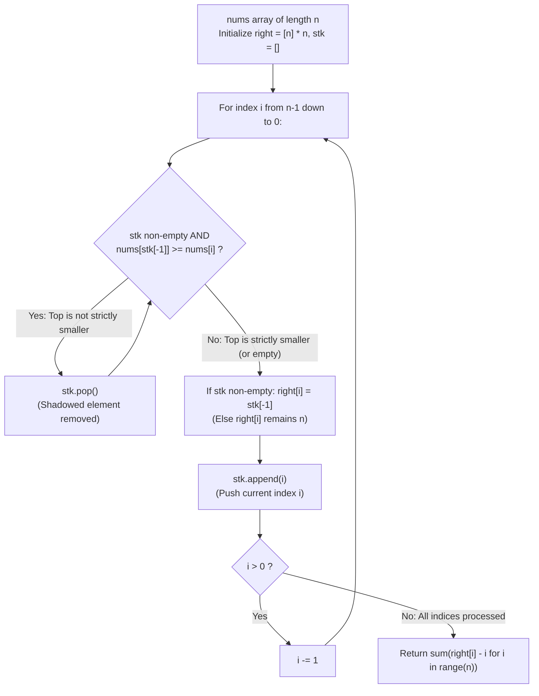

# Guided Example: Number of Valid Subarrays

We trace the step-by-step counting of valid subarrays where the leftmost element is the minimum of the subarray, prove the Next Strictly Smaller Element (NSE) Span Theorem and the Monotonic Stack Invariant, and determine the exact subarray count across representative integer arrays:

- **Representative Instance 1 (Mixed Local Minima and Inversions):**
  $$
  nums = [1, \; 4, \; 2, \; 5, \; 3], \quad n = 5
  $$
- **Required Output:** `11`
  - Problem definitions:
    - A contiguous subarray $nums[i \dots k]$ is valid if and only if $nums[i] \le nums[j]$ for all $j \in [i, k]$.
    - Count the total number of non-empty valid subarrays across all starting positions.
  - The Next Strictly Smaller Element (NSE) Boundary Principle:
    - For a fixed starting index $i$, the subarray continues to be valid as long as every subsequent element is $\ge nums[i]$.
    - The first index $R(i) > i$ where $nums[R(i)] < nums[i]$ breaks the condition.
    - If no element strictly smaller than $nums[i]$ exists to its right, set $R(i) = n$.
    - The number of valid subarrays starting at index $i$ is:
      $$
      C(i) = R(i) - i
      $$
  - Right-to-Left Monotonic Stack Evaluation Trace:
    - Initialize: $right = [5, 5, 5, 5, 5]$, $stk = []$.
    1. **$i = 4$ ($nums[4] = 3$):**
       - Stack is empty $\implies R(4) = 5$.
       - Valid span: $5 - 4 = \mathbf{1}$ (`[3]`).
       - Push $4$: $stk = [4]$.
    2. **$i = 3$ ($nums[3] = 5$):**
       - $stk[-1] = 4, \; nums[4] = 3 < nums[3] = 5$. (No pop!).
       - Stack top is smaller $\implies R(3) = 4$.
       - Valid span: $4 - 3 = \mathbf{1}$ (`[5]`).
       - Push $3$: $stk = [4, 3]$.
    3. **$i = 2$ ($nums[2] = 2$):**
       - $nums[stk[-1]] = nums[3] = 5 \ge 2 \implies$ Pop $3$.
       - $nums[stk[-1]] = nums[4] = 3 \ge 2 \implies$ Pop $4$.
       - Stack is now empty $\implies R(2) = 5$.
       - Valid span: $5 - 2 = \mathbf{3}$ (`[2]`, `[2, 5]`, `[2, 5, 3]`).
       - Push $2$: $stk = [2]$.
    4. **$i = 1$ ($nums[1] = 4$):**
       - $stk[-1] = 2, \; nums[2] = 2 < nums[1] = 4$. (No pop!).
       - Stack top is smaller $\implies R(1) = 2$.
       - Valid span: $2 - 1 = \mathbf{1}$ (`[4]`).
       - Push $1$: $stk = [2, 1]$.
    5. **$i = 0$ ($nums[0] = 1$):**
       - $nums[stk[-1]] = nums[1] = 4 \ge 1 \implies$ Pop $1$.
       - $nums[stk[-1]] = nums[2] = 2 \ge 1 \implies$ Pop $2$.
       - Stack is now empty $\implies R(0) = 5$.
       - Valid span: $5 - 0 = \mathbf{5}$ (`[1]`, `[1, 4]`, `[1, 4, 2]`, `[1, 4, 2, 5]`, `[1, 4, 2, 5, 3]`).
       - Push $0$: $stk = [0]$.
  - Total Subarrays Summation:
    $$
    \text{Total} = \sum_{i=0}^{4} (R(i) - i) = 5 + 1 + 3 + 1 + 1 = \mathbf{11}
    $$

- **Representative Instance 2 (Strictly Decreasing Array):**
  $$
  nums = [3, 2, 1], \quad n = 3 \implies R = [1, 2, 3] \implies \text{Total} = 1 + 1 + 1 = \mathbf{3}
  $$

- **Representative Instance 3 (All Equal Elements):**
  $$
  nums = [2, 2, 2], \quad n = 3
  $$
  - Condition is $nums[i] \le nums[j]$. Equal elements are valid!
  - No strictly smaller element exists $\implies R = [3, 3, 3]$.
  - Total: $(3 - 0) + (3 - 1) + (3 - 2) = 3 + 2 + 1 = \mathbf{6}$.

- **Representative Instance 4 (Strictly Increasing Array):**
  $$
  nums = [1, 2, 3, 4], \quad n = 4 \implies R = [4, 4, 4, 4] \implies \text{Total} = 4 + 3 + 2 + 1 = \mathbf{10}
  $$

---

## 1. Instance & Teaching Goal

Given an integer array `nums`, count all non-empty subarrays whose leftmost element is less than or equal to every other element in the subarray.

```text
The Quadratic Brute-Force Fallacy:
  For each starting index i from 0 to n-1:
    Iterate ending index k from i to n-1.
    Check if min(nums[i...k]) == nums[i].
    Takes O(N^2) time. For N = 50,000, 2.5 * 10^9 operations will Time Out.

Next Strictly Smaller Element Invariant (Linear O(N)):
  Notice: Once an element nums[k] < nums[i] is encountered:
    EVERY subarray nums[i...k'] with k' >= k is INVALID!
  Therefore, the valid subarrays starting at i are EXACTLY those ending at:
    k in [i, R(i) - 1], where R(i) is the Next Strictly Smaller Element.
  1. Count of valid subarrays starting at i is simply R(i) - i.
  2. A monotonic stack computes R(i) for all indices in a single O(N) backward pass:
     - Pop elements >= nums[i] (they cannot be smaller than elements to the left).
     - R(i) = stk[-1] if stk else n.
     - Push i.
  Solves the problem in strictly linear O(N) time and O(N) space!
```

Transforming the range-minimum property into finding the first violating element reduces the entire problem to a standard Next Smaller Element query.

The decisive pedagogical goal is the **Next Strictly Smaller Element (NSE) Span Theorem & Monotonic Stack Invariant**:
1. **Contiguous Validity Interval:** If $nums[i] \le nums[j]$ for all $j \in [i, k]$, and $nums[R(i)] < nums[i]$, then the valid ending points form the exact contiguous interval $\{i, i+1, \dots, R(i)-1\}$.
2. **Cardinality Identity:** The count of valid subarrays starting at $i$ is identically $R(i) - i$.
3. **Monotonic Stack Filtering:** Elements $\ge nums[i]$ are popped because $nums[i]$ is smaller and situated further left, shadowing them from ever acting as an NSE for any index $< i$.
4. **Amortized Linearity:** Each index is pushed once and popped at most once, yielding $2n = \mathcal{O}(n)$ operations.
5. Total time $\mathcal{O}(n)$ and auxiliary space $\mathcal{O}(n)$.

---

## 2. Conceptual Foundation & The Monotonic Stack Pipeline



### The Next Strictly Smaller Element Span Theorem

Let $A = (a_0, a_1, \dots, a_{n-1}) \in \mathbb{Z}^n$.
1. **Subarray Validity Condition:**
   A contiguous subsegment $A[i \dots k]$ with $0 \le i \le k < n$ is valid if and only if:
   $$
   a_i \le a_j \quad \forall j \in [i, k]
   $$
2. **The First Violation Boundary:**
   Define $R(i)$ as the index of the first strictly smaller element to the right of $i$:
   $$
   R(i) = \min \big( \{ j \in [i + 1, n - 1] : a_j < a_i \} \cup \{n\} \big)
   $$
   - **For any $k$ with $i \le k < R(i)$:** By definition of $R(i)$, no index $j \in [i, k]$ has $a_j < a_i$. Thus $a_i \le a_j$ holds for all $j \in [i, k]$, so $A[i \dots k]$ is valid.
   - **For any $k$ with $R(i) \le k < n$:** The element $a_{R(i)}$ is contained in $A[i \dots k]$. Since $a_{R(i)} < a_i$, the subarray violates the minimum condition, so $A[i \dots k]$ is invalid.
   Therefore, the valid subarrays starting at $i$ correspond 1-to-1 with $k \in [i, R(i) - 1]$.
   The cardinality is:
   $$
   C(i) = |\{i, i + 1, \dots, R(i) - 1\}| = R(i) - i
   $$
3. **Monotonic Stack Invariant:**
   Maintain a stack of indices $stk$.
   When scanning right-to-left at step $i$:
   - For any index $p \in stk$ with $a_p \ge a_i$: Since $i < p$ and $a_i \le a_p$, for any index $q < i$, if $a_p < a_q$, then $a_i \le a_p < a_q$ is also strictly smaller than $a_q$, and $i$ occurs before $p$. Therefore, $p$ can never be the *first* strictly smaller element for any $q < i$.
   - Popping all such $p$ preserves correctness while maintaining $stk$ as strictly increasing in value from top to bottom.
   - The top element after popping is the earliest index $j > i$ with $a_j < a_i$, which is precisely $R(i)$.
   - Each index is pushed once and popped at most once $\implies \mathcal{O}(n)$ total time. $\blacksquare$

---

## 3. Step-by-Step Worked Execution: Representative Instance 1

$nums = [1, 4, 2, 5, 3], \; n = 5$.
$right = [5, 5, 5, 5, 5], \; stk = []$.

### Reverse Scan Execution
- **$i = 4$ ($nums[4] = 3$):**
  - $stk = []$. No pop.
  - $right[4] = 5$.
  - Push $4 \implies stk = [4]$.
- **$i = 3$ ($nums[3] = 5$):**
  - $stk[-1] = 4, \; nums[4] = 3 < 5$. No pop.
  - $right[3] = stk[-1] = 4$.
  - Push $3 \implies stk = [4, 3]$.
- **$i = 2$ ($nums[2] = 2$):**
  - $nums[3] = 5 \ge 2 \implies$ Pop $3$.
  - $nums[4] = 3 \ge 2 \implies$ Pop $4$.
  - $stk = [] \implies right[2] = 5$.
  - Push $2 \implies stk = [2]$.
- **$i = 1$ ($nums[1] = 4$):**
  - $nums[2] = 2 < 4$. No pop.
  - $right[1] = stk[-1] = 2$.
  - Push $1 \implies stk = [2, 1]$.
- **$i = 0$ ($nums[0] = 1$):**
  - $nums[1] = 4 \ge 1 \implies$ Pop $1$.
  - $nums[2] = 2 \ge 1 \implies$ Pop $2$.
  - $stk = [] \implies right[0] = 5$.
  - Push $0 \implies stk = [0]$.

### Total Calculation
- $i=0: 5 - 0 = 5$
- $i=1: 2 - 1 = 1$
- $i=2: 5 - 2 = 3$
- $i=3: 4 - 3 = 1$
- $i=4: 5 - 4 = 1$
- Sum: $5 + 1 + 3 + 1 + 1 = \mathbf{11}$.

---

## 4. Stack Evolution Trace Table

| Step $i$ | $nums[i]$ | Stack Before Step | Popped Indices | Stack Top After Pops | Assigned $R(i)$ | Span $R(i) - i$ | Stack After Push |
|:---:|:---:|:---:|:---:|:---:|:---:|:---:|:---:|
| $4$ | $3$ | `[]` | None | None | $5$ | **$1$** | `[4]` |
| $3$ | $5$ | `[4]` | None | $4$ ($nums[4]=3$) | $4$ | **$1$** | `[4, 3]` |
| $2$ | $2$ | `[4, 3]` | $3, 4$ | None | $5$ | **$3$** | `[2]` |
| $1$ | $4$ | `[2]` | None | $2$ ($nums[2]=2$) | $2$ | **$1$** | `[2, 1]` |
| $0$ | $1$ | `[2, 1]` | $1, 2$ | None | $5$ | **$5$** | `[0]` |
| **Sum** | — | — | — | — | — | **$\mathbf{11}$** | — |

---

## 5. Algorithmic Correctness

### Soundness & Completeness
1. **Soundness:**
   Every counted subarray $nums[i \dots k]$ has $k < R(i)$, guaranteeing that no element inside the subarray is strictly smaller than the starting anchor $nums[i]$.
2. **Completeness:**
   Every valid subarray must start at some index $i \in [0, n - 1]$. The span $R(i) - i$ counts all valid ending points $k \ge i$ without omitting any configuration.

---

## 6. Boundary Cases & Traps

| Scenario | Input Pattern | Behavior | Trapped Risk |
|---|---|---|---|
| Single Element | `nums = [0]` | $R(0) = 1$; returns $1 - 0 = 1$. | Out-of-bounds stack access. |
| Strictly Increasing Array | `[1, 2, 3, 4]` | No smaller elements; $R = [4, 4, 4, 4]$; returns $4 + 3 + 2 + 1 = 10$. | Popping valid increasing sequences. |
| Duplicate / Equal Values | `[2, 2, 2]` | Popped by $\ge$; no element acts as boundary; returns $6$. | Treating equal elements as strictly smaller. |
| Strictly Decreasing Array | `[3, 2, 1]` | Each element bounded by next index; returns $1 + 1 + 1 = 3$. | Quadratic scanning overhead. |

---

## 7. Complexity Derivation

- **Time Complexity:** $\mathcal{O}(n)$, where $n = \text{len}(nums) \le 5 \times 10^4$.
  - Each index $i \in [0, n - 1]$ is appended to the stack exactly once.
  - Each index is popped from the stack at most once.
  - The sum over spans takes $\mathcal{O}(n)$ time.
  - Total operations $\le 2n \implies < 0.005\text{ s}$.
- **Auxiliary Space Complexity:** $\mathcal{O}(n)$ auxiliary memory for the `right` array and the monotonic stack `stk`.
