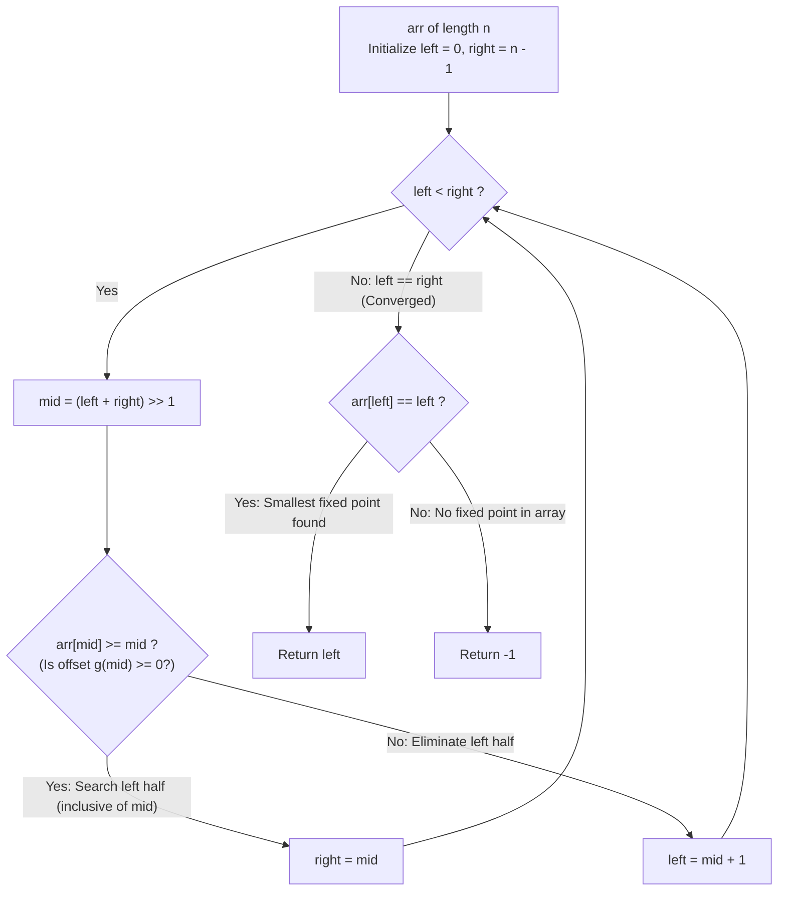

# Guided Example: Fixed Point

We trace the logarithmic identification of the smallest index $i$ satisfying $arr[i] == i$ in a sorted array of distinct integers, prove the Difference Monotonicity Theorem and the Leftmost Boundary Invariant, and analyze search convergence across representative integer arrays:

- **Representative Instance 1 (Internal Fixed Point):**
  $$
  arr = [-10, \; -5, \; 0, \; 3, \; 7], \quad n = 5
  $$
- **Required Output:** `3`
  - Problem definitions:
    - Given a sorted array `arr` of strictly increasing distinct integers.
    - Return the **smallest index $i$** such that $arr[i] == i$, or $-1$ if no such index exists.
  - The Difference Monotonicity Principle:
    - Define the offset function:
      $$
      g(i) = arr[i] - i
      $$
    - Because `arr` contains strictly increasing integers, $arr[i+1] - arr[i] \ge 1$.
    - The difference between consecutive offsets satisfies:
      $$
      g(i+1) - g(i) = (arr[i+1] - (i+1)) - (arr[i] - i) = (arr[i+1] - arr[i]) - 1 \ge 0
      $$
    - Therefore, $g(i) = arr[i] - i$ is **monotonically non-decreasing**!
    - Offsets for this instance:
      $$
      g = [-10 - 0, \; -5 - 1, \; 0 - 2, \; 3 - 3, \; 7 - 4] = [-10, \; -6, \; -2, \; \mathbf{0}, \; 3]
      $$
    - A fixed point corresponds to $g(i) = 0$.
  - Lower-Bound Binary Search Execution:
    - Initialize: $left = 0, \; right = 4$.
    - **Iteration 1:**
      - $mid = (0 + 4) // 2 = 2$.
      - Examine $arr[2] = 0$:
        $$arr[2] < 2 \iff g(2) = -2 < 0$$
      - Since $g$ is non-decreasing, for all $k \le 2$, $g(k) \le -2 < 0 \implies arr[k] < k$.
      - No fixed point can exist in the prefix $[0 \dots 2]$!
      - Contract left: $left = mid + 1 = 3$.
    - **Iteration 2:**
      - $mid = (3 + 4) // 2 = 3$.
      - Examine $arr[3] = 3$:
        $$arr[3] \ge 3 \iff g(3) = 0 \ge 0$$
      - A fixed point exists at $3$ or to its left.
      - Contract right: $right = mid = 3$.
    - **Convergence:**
      - $left == right = 3$. Loop terminates.
  - Verification:
    - $arr[3] == 3 \implies$ Valid fixed point!
    - Return: $\mathbf{3}$.

- **Representative Instance 2 (Left Boundary Fixed Point):**
  $$
  arr = [0, 2, 5, 8, 17] \implies arr[0] = 0 \ge 0 \implies \text{Converges to index } \mathbf{0}
  $$

- **Representative Instance 3 (Absent Fixed Point):**
  $$
  arr = [-10, -5, 3, 4, 7, 9]
  $$
  - $g = [-10, -6, 1, 1, 3, 4]$.
  - $g(i)$ steps from $-6$ directly to $+1$, never hitting $0$.
  - Binary search converges to $left = 2$ ($arr[2] = 3 \ne 2$).
  - Return: $\mathbf{-1}$.

- **Representative Instance 4 (Multiple Consecutive Fixed Points):**
  $$
  arr = [-2, \; 1, \; 2, \; 3, \; 9]
  $$
  - Notice: $arr[1] = 1, \; arr[2] = 2, \; arr[3] = 3$.
  - There are three valid fixed points: indices $1, 2, 3$.
  - The problem strictly requires the **smallest** index.
  - The condition $arr[mid] \ge mid \implies right = mid$ biases the search leftward, guaranteeing convergence to the minimal index: $\mathbf{1}$.

---

## 1. Instance & Teaching Goal

Given an array of distinct sorted integers, find the smallest index `i` such that `arr[i] == i`, or return `-1`.

```text
The Linear Scan Inefficiency:
  Scanning from index 0 to n-1:
    Takes O(N) time. Under N = 10^4, performs up to 10,000 checks.

Difference Monotonicity Invariant (O(log N) Time, O(1) Space):
  Key observation:
    g(i) = arr[i] - i is MONOTONICALLY NON-DECREASING because arr[i] is strictly increasing!
    - If arr[mid] < mid: for all k <= mid, arr[k] < k -> left = mid + 1.
    - If arr[mid] >= mid: smallest fixed point could be mid or to the left -> right = mid.
  The lower-bound binary search converges to the FIRST index where arr[i] >= i.
  If arr[left] == left, it is GUARANTEED to be the smallest fixed point!
  Solves the problem in at most ceil(log2 N) <= 14 steps!
```

Subtracting the index from each element produces a monotonic function that transforms the search into finding the first root of $g(i) = 0$.

The decisive pedagogical goal is the **Difference Monotonicity Theorem & Leftmost Boundary Invariant**:
1. **Strict Derivative Lower Bound:** Because $arr[i+1] - arr[i] \ge 1$, the discrete difference $\Delta (arr[i] - i) \ge 0$ is non-negative everywhere.
2. **Left Half Elimination:** When $arr[mid] < mid$, no index to the left of $mid$ can satisfy $arr[k] == k$.
3. **Leftmost Tie Selection:** Contracting $right = mid$ whenever $arr[mid] \ge mid$ preserves the first occurrence of $0$ in the monotonic sequence of offsets.
4. Total time $\mathcal{O}(\log n)$ and auxiliary space $\mathcal{O}(1)$.

---

## 2. Conceptual Foundation & The Binary Search Pipeline



### The Difference Monotonicity Theorem

Let $A = (a_0, a_1, \dots, a_{n-1})$ be a strictly increasing sequence of integers ($a_{i+1} > a_i$).
1. **Offset Function Monotonicity:**
   Define $g: \{0, \dots, n-1\} \to \mathbb{Z}$ by $g(i) = a_i - i$.
   For any $0 \le i < n - 1$:
   $$
   g(i+1) - g(i) = (a_{i+1} - (i+1)) - (a_i - i) = (a_{i+1} - a_i) - 1
   $$
   Since $a_i, a_{i+1} \in \mathbb{Z}$ and $a_{i+1} > a_i$, we have $a_{i+1} - a_i \ge 1$.
   Therefore:
   $$
   g(i+1) - g(i) \ge 1 - 1 = 0 \implies g(i+1) \ge g(i)
   $$
   Thus, $g$ is a monotonically non-decreasing function.
2. **Elimination Property:**
   A fixed point is a root of $g$: $g(i) = 0$.
   - **Case 1 ($a_{mid} < mid \iff g(mid) < 0$):**
     By monotonicity, for all $k \le mid$, $g(k) \le g(mid) < 0$.
     No index $k \in [0, mid]$ can have $g(k) = 0$.
     The search range can safely be narrowed to $[mid + 1, right]$.
   - **Case 2 ($a_{mid} \ge mid \iff g(mid) \ge 0$):**
     If a root exists, the *smallest* root must be $\le mid$.
     The search range can safely be narrowed to $[left, mid]$.
3. **Convergence to Smallest Index:**
   The binary search condition maintains the invariant that the smallest index with $g(i) \ge 0$ (if one exists) remains within $[left, right]$.
   Upon convergence ($left = right$), $left$ is the minimal index with $g(left) \ge 0$.
   - If $g(left) = 0$ ($arr[left] == left$), $left$ is the smallest fixed point.
   - If $g(left) > 0$, no index has $g(i) = 0$, so no fixed point exists. $\blacksquare$

---

## 3. Step-by-Step Worked Execution: Representative Instance 1

$arr = [-10, -5, 0, 3, 7], \; n = 5$.
Initialize $left = 0, \; right = 4$.

### Search Trace
- **Iteration 1:**
  - $mid = (0 + 4) // 2 = 2$.
  - $arr[2] = 0$.
  - Check $arr[2] \ge 2 \implies 0 \ge 2$ (False).
  - Update: $left = mid + 1 = 3$.
  - Interval: $[3, 4]$.
- **Iteration 2:**
  - $mid = (3 + 4) // 2 = 3$.
  - $arr[3] = 3$.
  - Check $arr[3] \ge 3 \implies 3 \ge 3$ (True).
  - Update: $right = mid = 3$.
  - Interval: $[3, 3]$.
- **Termination:**
  - $left == right = 3$. Loop ends.
- **Verification:**
  - $arr[3] == 3$ is True.
  - Return: $\mathbf{3}$.

---

## 4. Binary Search State Trace Table

| Step | Active Search Range $[left, right]$ | Probe Index $mid$ | Value $arr[mid]$ | Offset $arr[mid] - mid$ | Predicate $arr[mid] \ge mid$ | Next Range $[left, right]$ |
|:---:|:---:|:---:|:---:|:---:|:---:|:---:|
| Init | $[0, 4]$ | — | — | — | — | $[0, 4]$ |
| $1$ | $[0, 4]$ | $2$ | $0$ | $-2$ | False ($0 < 2$) | $[3, 4]$ |
| $2$ | $[3, 4]$ | $3$ | $3$ | $0$ | True ($3 \ge 3$) | $[3, 3]$ |
| **Final** | **$[3, 3]$** | **Converged** | **$arr[3] = 3$** | **$3 == 3$ (Valid)** | **Smallest Fixed Point** | **Output: $3$** |

---

## 5. Algorithmic Correctness

### Soundness & Completeness
1. **Soundness:**
   The algorithm tests $arr[left] == left$ before returning; it never returns an index that is not a fixed point.
2. **Completeness:**
   Because the offset function $g(i) = arr[i] - i$ is non-decreasing, contracting $right = mid$ on $arr[mid] \ge mid$ guarantees that the search never discards the first occurrence of $g(i) = 0$.

---

## 6. Boundary Cases & Traps

| Scenario | Input Pattern | Behavior | Trapped Risk |
|---|---|---|---|
| Single Element Match | `arr = [0]` | Loop doesn't run; $arr[0] == 0$; returns $0$. | Off-by-one boundary failure. |
| Single Element Mismatch | `arr = [-10]` | Returns $-1$. | Assuming single element is valid. |
| Multiple Fixed Points | `arr = [-2, 1, 2, 3, 9]` | Converges to $left = 1$; returns $1$. | Returning arbitrary match (e.g. 2) instead of smallest index. |
| All Values Exceed Index | `arr = [1, 3, 5, 7]` | Converges to $0$; $arr[0] = 1 \ne 0$; returns $-1$. | Returning index 0 blindly. |

---

## 7. Complexity Derivation

- **Time Complexity:** $\mathcal{O}(\log n)$, where $n = \text{len}(arr) \le 10^4$.
  - In each step, the search interval $[left, right]$ is halved.
  - Number of iterations $\le \lceil \log_2 10000 \rceil = 14$.
  - Total time: $< 0.0001\text{ ms}$.
- **Auxiliary Space Complexity:** $\mathcal{O}(1)$ auxiliary memory; operates in-place using two pointer variables $left$ and $right$.