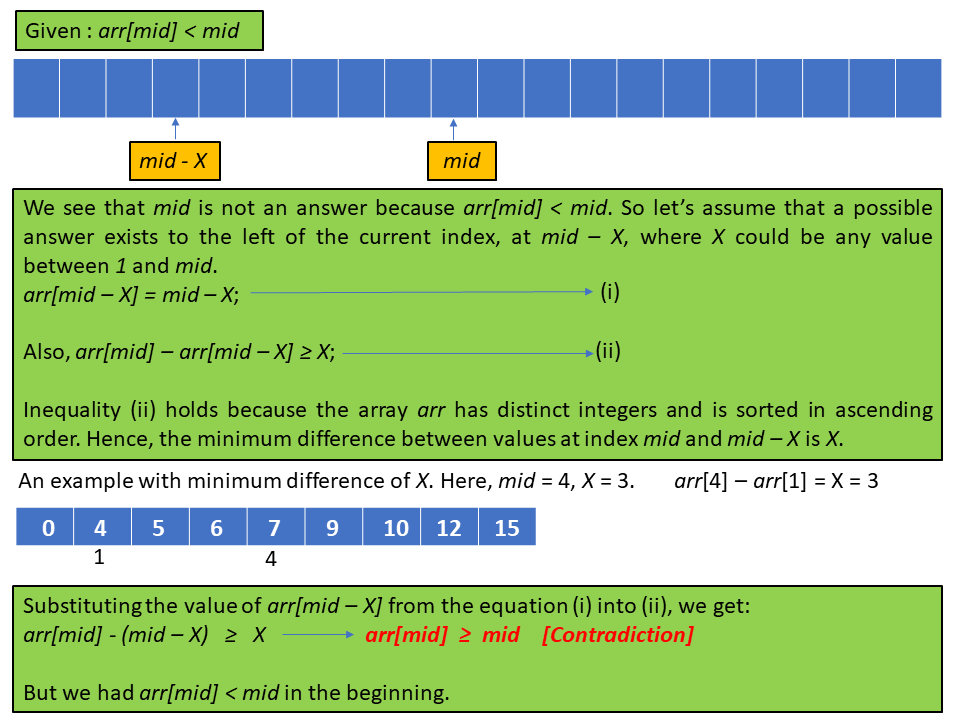
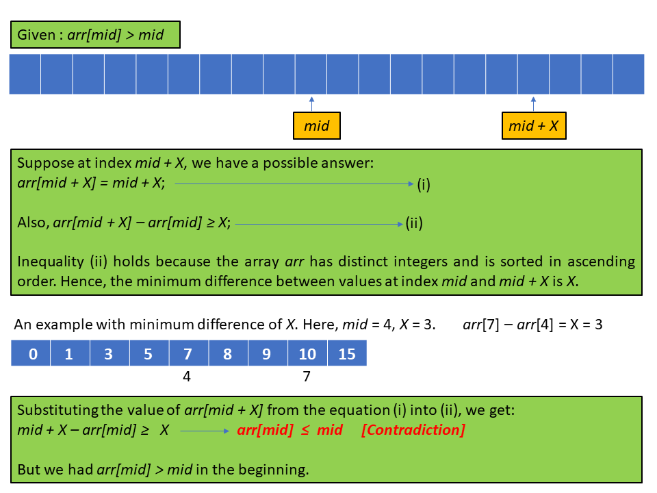
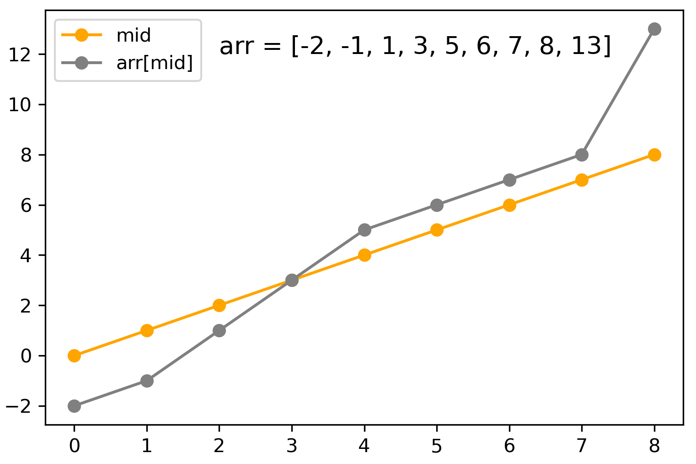
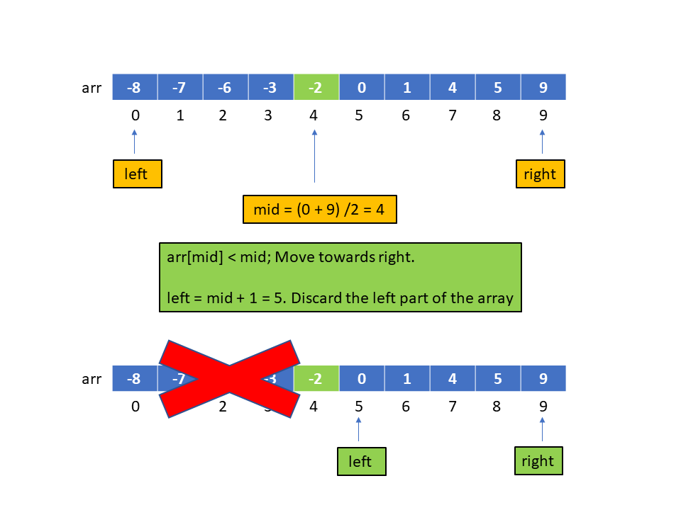
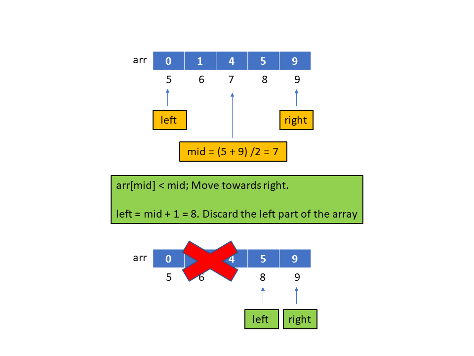
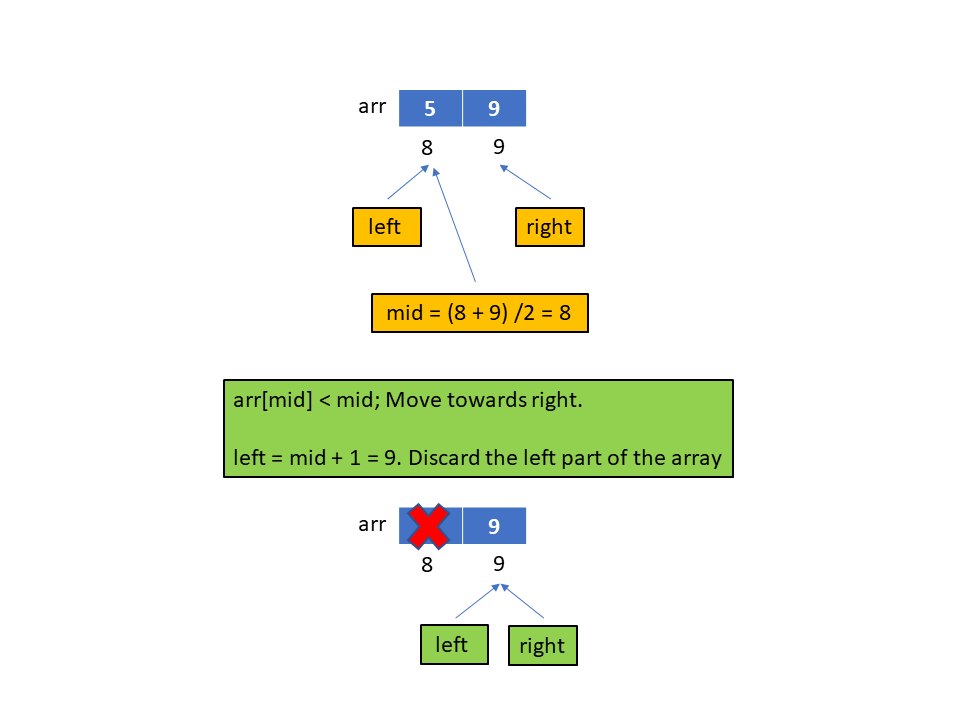
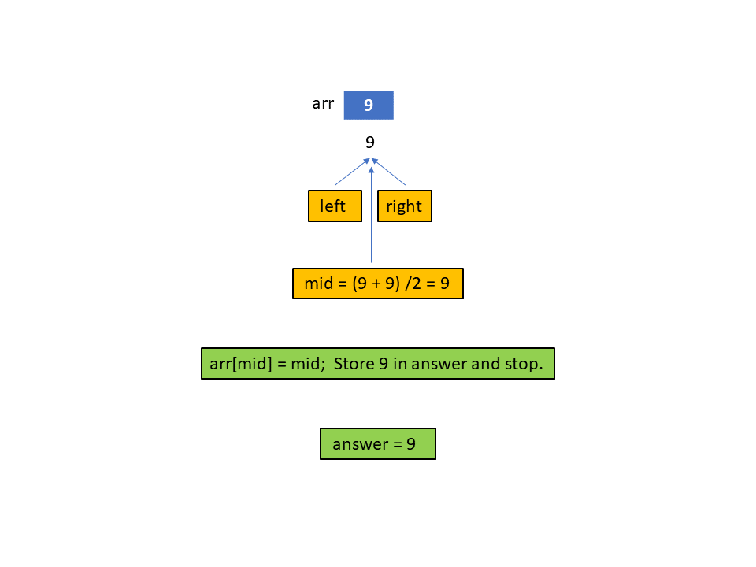

[TOC]

## Solution

---

### Overview

In an interview setting, it's important to clarify the problem constraints. Because constraints sometimes help us to guess the expected time complexity of the solution. In this problem, the length of the array can be at max $10^4$. In most cases, we can solve a problem involving $\leq$ $10^8$ operations with an $O(N)$ time complexity solution. A simple linear search solution with $O(N)$ time and $O(1)$ space complexity would be enough to pass the test cases. But most probably this solution would invite a follow-up, asking to do better. Hence, we will discuss a better-optimized solution than linear search in this article.

> To solve this problem in linear time, we could simply iterate over the array from left to right and return the first index `i` at which $\text{arr}[i] = i$. Iterating over the entire array would require $N$ operations, hence, $O(N)$ time complexity. Furthermore, this naive approach does not require any extra space, so it would have $O(1)$ space complexity.
</br>

---

### Approach 1: Binary Search

**Intuition**

Remember that the array we are given is **sorted** in ascending order. Whenever you are working with **sorted** data, it is always worth considering whether binary search can be applied to the current problem. Hence, let's see if we can use binary search to solve this problem more efficiently.

> If you're not familiar with Binary Search, check out our [Explore Card](https://leetcode.com/explore/learn/card/binary-search/]).

Generally, a binary search solution has the following steps:

1. Define the search boundary for the answer variable, say `[left, right]`. This range defines the possible values of the answer to the problem.
2. Find the midpoint of the above range; here, we will define the midpoint as $mid = (left + right) / 2$.
3. Check if $mid$ can be the answer to our problem.

- Based on the above check, we redefine our search boundary. Precisely, we reduce the search space to half of the original search space.
- We either reduce it to `[left, mid - 1]` or `[mid + 1, right]`.
- The method used to check if $mid$ can be the answer is problem-dependent. We will discuss this in the latter part of the article.

4. When `mid could be the answer, then set `answer` equal to `mid`. When the size of the search space is reduced to `0` i.e., `left > right`, we can stop the process and return the current value of `answer`.

Let's try to map each of the above steps to the given problem.

-  The answer to the problem (if there is any) is an index in the given array. Hence we can define the left and right boundaries as `0` and $N - 1$, respectively. Here, `N` is the size of the given array.
- Find $mid = (left + right) / 2$.
- Check if `mid` can be the answer, there can be three possibilities:

  - $\text{arr}[mid] = mid$: This means that `mid` is a possible answer, so we will set `answer` equal to `mid`. However, because we need to find the smallest index, we will keep looking for a smaller index in the left part of `arr` by reducing the search space to `[left, mid - 1]`. We do not include the index `mid` in the search space as we just stored this index in our answer variable.
  - $\text{arr}[mid] < mid$ : Let's analyze this scenario:

     

     In the above figure, we assumed that the solution is on the left side of `mid` but we ended up with a contradictory inequality. **This means that when $\text{arr}[mid]$ is less than `mid`, it is impossible to have the answer on the left side of `mid`.** Therefore, we will move towards the right side by changing: $left = mid + 1$.

  - $\text{arr}[mid] > mid$ :

    

    In the above figure, we assumed that the solution is on the right side of `mid` but we ended up with a contradictory inequality. **This means that when $\text{arr}[mid]$ is greater than `mid`, it is impossible to have the answer on the right side of `mid`.** Therefore, we will move towards the left side by changing: $right = mid - 1$.

To summarize, the above proof shows that if $\text{arr}[mid]$ is greater than or equal to `mid`, then we will reduce the right boundary and search to the left of `mid`, otherwise we will reduce our left boundary search to the right of `mid`. For those of us who are less comfortable with mathematical proofs, we can also come to this realization visually. Consider the plot shown below. The orange line represents `mid`, and the gray line represents $\text{arr}[mid]$. The possible answer(s), when $\text{arr}[mid]$ equals `mid`, is where the two lines meet. From this, we can see that if `mid` is greater than $\text{arr}[mid]$, we should move to the right to find where the two lines meet and vice versa.



The below slideshow demonstrates the algorithm:









 <br>

**Algorithm**

1. Initialize the value of `left` to `0`, `right` to $N - 1$ and `answer` to `-1`.
2. While the size of search space is not zero i.e., $left \le right$ perform the following steps:

- Find mid as $mid = (left + right) / 2$.
- Compare $\text{arr}[mid]$ and `mid`

- $\text{arr}[mid] = mid$. Store `mid` in `answer`. Move to the left half by changing `right` to $mid - 1$
- $\text{arr}[mid] < mid$. Move to the right half by changing `left` to $mid + 1$
- $\text{arr}[mid] > mid$. Move to the left half by changing `right` to $mid - 1$
3. Return `answer`.

**Implementation**

```python
class Solution:
    def fixedPoint(self, arr: List[int]) -> int:
        # Initialize the boundary of search space
        left, right = 0, len(arr) - 1

        # Initialize answer to -1,
        # If no answer is possible, we will return -1
        answer = -1

        # While the boundary size is non zero
        while left <= right:
            # The middle point in the search space
            # To divide the search space into two halves
            mid = (left + right) // 2

            if arr[mid] == mid:
                # We found a possible answer, but keep looking
                # for a smaller index on the left part
                answer = mid
                right = mid - 1
            elif arr[mid] < mid:
                # No solution possible on left, move to the right half
                left = mid + 1
            else:
                # No solution possible on right, move to the left half
                right = mid - 1

        return answer
```

**Complexity Analysis**

Here, $N$ is the size of the given array.

* Time complexity: $O(\log N)$

   The time complexity equals the number of times the while loop gets executed. Because the operations inside the while loop take $O(1)$ time. After every execution in the while loop, we discard half of the remaining search space. The size of the search space decreases as follows: $N$, $N / 2$, $N / 4$, $N / 8$...........$1$. Therefore, it takes $\log N$ operations to reduce the size $N$ search space to zero. Hence, the time complexity is $O(\log N)$.

* Space complexity: $O(1)$

   We don't require any extra space to perform the binary search. Hence, the space complexity is constant.

---