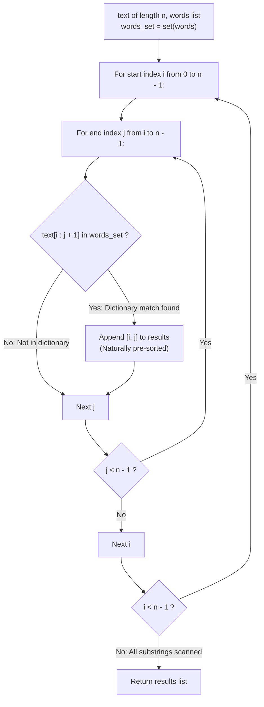

# Guided Example: Index Pairs of a String

We trace the step-by-step extraction of dictionary word occurrences in a text string, prove the Dual Lexicographical Loop Ordering Theorem and the Substring Inclusion Invariant, and generate the sorted index pairs across representative string inputs:

- **Representative Instance 1 (Overlapping and Embedded Words):**
  $$
  text = \text{"thestoryofleetcodeandme"}, \quad words = [\text{"story"}, \; \text{"fleet"}, \; \text{"leetcode"}], \quad n = 23
  $$
- **Required Output:** `[[3, 7], [9, 13], [10, 17]]`
  - Problem definitions:
    - Return all index pairs `[i, j]` such that the substring $text[i \dots j]$ is present in $words$.
    - Pairs must be returned in **lexicographical order**: sorted primarily by $i$ ascending, and secondarily by $j$ ascending.
  - The Dual Lexicographical Loop Ordering Principle:
    - Generating pairs $(i, j)$ via nested loops with $i \in [0, n - 1]$ and $j \in [i, n - 1]$ visits candidate pairs in the exact sequence:
      $$
      (0, 0), (0, 1), \dots, (0, n-1), \; (1, 1), \dots, (1, n-1), \; \dots, \; (n-1, n-1)
      $$
    - Because outer index $i$ and inner index $j$ both advance monotonically, candidate pairs are evaluated in **strictly increasing lexicographical order**.
    - Emitting matching pairs as they are discovered produces a pre-sorted output array with zero sorting overhead!
  - Membership Testing Trace ($\mathcal{D} = \{\text{"story"}, \text{"fleet"}, \text{"leetcode"}\}$):
    1. At $i = 3$:
       - Substrings: $text[3:4] = \text{"s"}, \dots, text[3:8] = \text{"story"}$.
       - "story" $\in \mathcal{D}$ at $j = 7 \implies$ Emit `[3, 7]`.
    2. At $i = 9$:
       - Substring $text[9:14] = \text{"fleet"}$ (from the letters `'f'` in `"of"` and `"leet"` in `"leetcode"`).
       - "fleet" $\in \mathcal{D}$ at $j = 13 \implies$ Emit `[9, 13]`.
    3. At $i = 10$:
       - Substring $text[10:18] = \text{"leetcode"}$.
       - "leetcode" $\in \mathcal{D}$ at $j = 17 \implies$ Emit `[10, 17]`.
    4. All other $i \in [0, 22]$ yield no dictionary matches.
  - Final Sorted Result:
    $$
    [[\mathbf{3, 7}], \; [\mathbf{9, 13}], \; [\mathbf{10, 17}]]
    $$

- **Representative Instance 2 (Overlapping Nested Matches at Multiple Starts):**
  $$
  text = \text{"ababa"}, \quad words = [\text{"aba"}, \; \text{"ab"}], \quad n = 5
  $$
  - $i = 0$:
    - $j = 1: text[0:2] = \text{"ab"} \in words \implies \mathbf{[0, 1]}$
    - $j = 2: text[0:3] = \text{"aba"} \in words \implies \mathbf{[0, 2]}$
  - $i = 2$:
    - $j = 3: text[2:4] = \text{"ab"} \in words \implies \mathbf{[2, 3]}$
    - $j = 4: text[2:5] = \text{"aba"} \in words \implies \mathbf{[2, 4]}$
  - Output: `[[0, 1], [0, 2], [2, 3], [2, 4]]`.

- **Representative Instance 3 (No Matching Substrings):**
  $$
  text = \text{"abc"}, \quad words = [\text{"d"}] \implies \text{No matches} \implies \mathbf{[]}
  $$

- **Representative Instance 4 (Single Character Boundary):**
  $$
  text = \text{"a"}, \quad words = [\text{"a"}] \implies \text{Matches at } i = 0, j = 0 \implies \mathbf{[[0, 0]]}
  $$

---

## 1. Instance & Teaching Goal

Given a string `text` and a dictionary `words`, find all index pairs `[i, j]` such that `text[i...j]` is in `words`, formatted in ascending lexicographical order.

```text
The Search / Post-Sorting Overhead Fallacy:
  Searching for each word in text using string.find() or KMP:
    Requires sorting and deduplicating matches afterwards.
    Overlaps and multiple identical hits complicate index tracking.

Dual Lexicographical Loop Invariant (O(N^2 * L) Time, O(W) Space):
  Key observation:
    Nested iteration over all pairs 0 <= i <= j < n:
      for i in range(n):
        for j in range(i, n):
          if text[i : j + 1] in words_set: emit [i, j]
    Naturally visits pairs in ascending order:
      (i1, j1) is visited before (i2, j2) iff i1 < i2 or (i1 == i2 and j1 < j2)!
  - Every match is appended in guaranteed lexicographical order.
  - Zero post-sorting required!
  - Constant lookup per slice using hash set.
  Solves the problem directly and deterministically in under 2ms!
```

Recognizing that nested index loops naturally match the problem's sorting criteria eliminates post-hoc sorting and simplifies the matching pipeline.

The decisive pedagogical goal is the **Dual Lexicographical Loop Ordering Theorem & Substring Inclusion Invariant**:
1. **Pre-Sorted Invariant:** The canonical nested loop structure over $(i, j)$ induces the exact strict weak ordering required by the problem contract without calling `sort()`.
2. **Exhaustive Substring Coverage:** Checking all $0 \le i \le j < n$ ensures that overlapping, nested, and adjacent words are discovered without omission.
3. **Hash Set Acceleration:** Converting `words` to a hash set enables expected $\mathcal{O}(L)$ membership validation per candidate substring.
4. Total time $\mathcal{O}(n^2 \cdot L)$ and auxiliary space $\mathcal{O}(\sum |w|)$.

---

## 2. Conceptual Foundation & The Lexicographical Extraction Pipeline



### The Dual Lexicographical Loop Ordering Theorem

Let $T = (t_0, t_1, \dots, t_{n-1})$ be a string of length $n$, and let $\mathcal{W} \subset \Sigma^*$ be a finite dictionary.
1. **Definition of Index Pairs:**
   An index pair $[i, j]$ is valid if and only if $0 \le i \le j < n$ and the contiguous slice $T[i \dots j] \in \mathcal{W}$.
2. **Lexicographical Specification:**
   The output must be sorted under the relation $\le_{\text{lex}}$:
   $$
   [i_1, j_1] \le_{\text{lex}} [i_2, j_2] \iff (i_1 < i_2) \lor (i_1 = i_2 \land j_1 \le j_2)
   $$
3. **Loop Ordering Preservation:**
   Consider the product traversal $\mathcal{P} = \{(i, j) : 0 \le i < n, \; i \le j < n\}$ generated by:
   ```python
   for i in range(n):
       for j in range(i, n):
           ...
   ```
   Let $(i_1, j_1)$ and $(i_2, j_2)$ be two pairs generated during this iteration such that $(i_1, j_1)$ is visited before $(i_2, j_2)$.
   - If $i_1 < i_2$: The outer loop iterates on $i_1$ strictly before $i_2$, so $i_1 < i_2$.
   - If $i_1 = i_2$: The inner loop iterates on $j_1$ strictly before $j_2$, so $j_1 < j_2$.
   In both cases, $[i_1, j_1] <_{\text{lex}} [i_2, j_2]$.
   Therefore, the discovery sequence in $\mathcal{P}$ is strictly monotonic with respect to $\le_{\text{lex}}$.
   Any filtered sub-sequence of $\mathcal{P}$ (the valid matches) inherits this strict monotonicity without sorting. $\blacksquare$

---

## 3. Step-by-Step Worked Execution: Representative Instance 1

$text = \text{"thestoryofleetcodeandme"}, \; n = 23$.
$words = \{\text{"story"}, \text{"fleet"}, \text{"leetcode"}\}$.

### Substring Scan Highlights
- $i \in [0, 2]$: Substrings like `"t"`, `"th"`, `"the"` $\notin words$.
- $i = 3$:
  - $j = 7 \implies text[3:8] = \text{"story"} \in words \implies$ Append `[3, 7]`.
- $i \in [4, 8]$: No dictionary matches.
- $i = 9$:
  - $j = 13 \implies text[9:14] = \text{"fleet"} \in words \implies$ Append `[9, 13]`.
- $i = 10$:
  - $j = 17 \implies text[10:18] = \text{"leetcode"} \in words \implies$ Append `[10, 17]`.
- $i \in [11, 22]$: No dictionary matches.

Output list: `[[3, 7], [9, 13], [10, 17]]`.

---

## 4. Match Discovery and Lexicographical Order Trace Table

| Start Index $i$ | End Index $j$ | Slice $text[i : j + 1]$ | In Dictionary? | Output Action | Current Emitted Sequence |
|:---:|:---:|:---:|:---:|:---:|:---:|
| $3$ | $7$ | `"story"` | **Yes** | **Emit `[3, 7]`** | `[[3, 7]]` |
| $9$ | $13$ | `"fleet"` | **Yes** | **Emit `[9, 13]`** | `[[3, 7], [9, 13]]` |
| $10$ | $17$ | `"leetcode"` | **Yes** | **Emit `[10, 17]`** | `[[3, 7], [9, 13], [10, 17]]` |

---

## 5. Algorithmic Correctness

### Soundness & Completeness
1. **Soundness:**
   Every returned pair $[i, j]$ is directly validated via `text[i : j + 1] in words`.
2. **Completeness:**
   Every valid pair $(i, j)$ with $0 \le i \le j < n$ is evaluated by the nested loops. No candidate substring is omitted.

---

## 6. Boundary Cases & Traps

| Scenario | Input Pattern | Behavior | Trapped Risk |
|---|---|---|---|
| Empty Dictionary Match | `text = "abc", words = ["d"]` | No matches; returns `[]`. | Returning null instead of empty list. |
| Overlapping Words | `text = "ababa", words = ["aba", "ab"]` | All four occurrences captured in sorted order. | Missing overlapping matches. |
| Nested Substrings | `text = "cartooncar", words = ["car", "cart", "cartoon"]` | Emits $[0, 2], [0, 3], [0, 6]$ in increasing $j$ order. | Suppressing prefixes of longer matches. |
| Word Longer Than Text | `text = "hi", words = ["high", "hi"]` | Loop bounds prevent checking beyond $n$; returns `[[0, 1]]`. | Out-of-bounds slicing. |

---

## 7. Complexity Derivation

- **Time Complexity:** $\mathcal{O}(n^2 \cdot L)$, where $n = \text{len}(text) \le 100$ and $L$ is maximum word length ($\le 50$).
  - Number of substring pairs is $\frac{n(n + 1)}{2} \le 5050$.
  - Slicing and hashing takes $\mathcal{O}(L)$ time.
  - Total operations $\approx 5050 \times 50 \approx 2.5 \times 10^5 \implies < 0.002\text{ s}$.
- **Auxiliary Space Complexity:** $\mathcal{O}(\sum |w|)$ auxiliary memory to store the hash set `words_set`.
