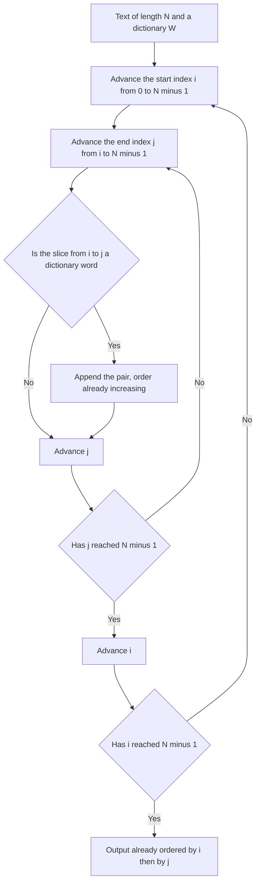

# Guided Example: Index Pairs of a String

We work one representative text through a full enumeration of candidate substrings, and show that the enumeration order itself already satisfies the output-order contract — so no sorting step is ever needed.

**Representative instance (the first official example).**

$$
text = \texttt{"thestoryofleetcodeandme"}, \qquad
words = \{\texttt{"story"},\ \texttt{"fleet"},\ \texttt{"leetcode"}\}, \qquad n = \lvert text \rvert = 23 .
$$

**Required outcome.** Every inclusive index pair `[i, j]` for which $text[i \dots j]$ is a dictionary word, ordered first by $i$ and then by $j$:

$$
[[3, 7],\ [9, 13],\ [10, 17]].
$$

The index map of the instance is worth fixing in advance, because two of the three matches are not aligned to word boundaries and one starts inside another word.

| $i$ | 0 | 1 | 2 | 3 | 4 | 5 | 6 | 7 | 8 | 9 | 10 | 11 | 12 | 13 | 14 | 15 | 16 | 17 | 18 | 19 | 20 | 21 | 22 |
|:---:|:---:|:---:|:---:|:---:|:---:|:---:|:---:|:---:|:---:|:---:|:---:|:---:|:---:|:---:|:---:|:---:|:---:|:---:|:---:|:---:|:---:|:---:|:---:|
| $text[i]$ | `t` | `h` | `e` | `s` | `t` | `o` | `r` | `y` | `o` | `f` | `l` | `e` | `e` | `t` | `c` | `o` | `d` | `e` | `a` | `n` | `d` | `m` | `e` |

Reading the map confirms the outcome directly: characters $3$–$7$ spell `story`, characters $9$–$13$ spell `fleet` (the `f` comes from the word `of`, so the match crosses a natural word boundary), and characters $10$–$17$ spell `leetcode`, which overlaps the `fleet` match.

---

## 1. The Candidate Set and the Ordering Contract

Let $N = \lvert text \rvert$ and let $\mathcal{W}$ be the dictionary. A pair $[i, j]$ is *admissible* exactly when

$$
0 \le i \le j < N
\quad\text{and}\quad
text[i \dots j] \in \mathcal{W}.
$$

Because the boundaries are inclusive, the pair $[i, j]$ denotes the slice $text[i : j + 1]$ of length $j - i + 1$. The complete candidate space is

$$
\mathcal{C} = \{\, (i, j) : 0 \le i \le j < N \,\},
\qquad
\lvert \mathcal{C} \rvert = \frac{N(N+1)}{2}.
$$

For $N = 23$ that is $\frac{23 \cdot 24}{2} = 276$ candidates; at the largest legal input, $N = 100$, it is $\frac{100 \cdot 101}{2} = 5050$.

The output contract imposes a total order often called *lexicographical* order on pairs:

$$
[i_1, j_1] \preceq_{\text{lex}} [i_2, j_2]
\iff
(i_1 < i_2) \ \lor\ \bigl(i_1 = i_2 \ \land\ j_1 \le j_2\bigr).
$$

This is a **total order**: any two distinct admissible pairs are comparable, because either their first coordinates differ or their first coordinates are equal and their second coordinates differ. That total-order property is what makes the following section work.

| Quantity | Symbol | Value for this instance | Role |
|:---|:---:|:---:|:---|
| Text length | $N$ | $23$ | Bounds the candidate space |
| Dictionary size | $W$ | $3$ | Number of words to recognise |
| Longest word | $L$ | $8$ (`leetcode`) | Caps the useful slice length |
| Candidate count | $\lvert \mathcal{C} \rvert$ | $276$ | Number of membership tests in the exhaustive sweep |
| Admissible pairs | — | $3$ | Matches to emit, already in $\preceq_{\text{lex}}$ order |

---

## 2. Why the Enumeration Order Is Already the Output Order

Consider the natural exhaustion of $\mathcal{C}$: the outer index $i$ runs from $0$ to $N-1$, and for each fixed $i$ the inner index $j$ runs from $i$ to $N-1$. The visit sequence is therefore

$$
(0,0), (0,1), \dots, (0,N-1),\ (1,1), \dots, (1,N-1),\ \dots,\ (N-1,N-1).
$$

> **Ordering theorem.** If the pair $(i_1, j_1)$ is visited before $(i_2, j_2)$ in this exhaustion, then $[i_1, j_1] \prec_{\text{lex}} [i_2, j_2]$.

*Proof.* Two cases exhaust the possibilities.

1. **Different outer index.** If $i_1 \ne i_2$, the outer sweep visits $i_1$ strictly before $i_2$, so $i_1 < i_2$, which immediately gives $[i_1, j_1] \prec_{\text{lex}} [i_2, j_2]$.
2. **Same outer index.** If $i_1 = i_2$, the pair $(i_2, j_2)$ is visited during the same inner sweep as $(i_1, j_1)$, and the inner index advances monotonically, so $j_1 < j_2$. With equal first coordinates and a strictly smaller second coordinate, $[i_1, j_1] \prec_{\text{lex}} [i_2, j_2]$.

In both cases the visit order agrees with $\preceq_{\text{lex}}$. Since the relation is a total order, the exhaustion is a strictly increasing enumeration of $\mathcal{C}$. Any subsequence of a strictly increasing sequence is still strictly increasing, so the subsequence of admissible pairs — written out in discovery order — is sorted exactly as the contract demands. $\blacksquare$

> **Invariant (pre-sorted emission).** Every pair is appended to the output at the moment it is discovered, and the discovery sequence is strictly increasing in $\preceq_{\text{lex}}$. The output is therefore sorted by construction, and no sorting step is performed at any point.

This is the decisive observation of the problem. The sorting requirement does not add work; it is *absorbed* by choosing the traversal that respects it.

A prefix of the visit sequence makes the absorption visible:

| Position in visit sequence | Pair | Slice $text[i : j+1]$ | Length | In $\mathcal{W}$? | Emitted so far |
|:---|:---:|:---|:---:|:---:|:---|
| 1st | $(0,0)$ | `t` | $1$ | No | `[]` |
| 2nd | $(0,1)$ | `th` | $2$ | No | `[]` |
| 3rd | $(0,2)$ | `the` | $3$ | No | `[]` |
| after the whole sweep of $i = 0,1,2$ | — | no slice matches | — | No | `[]` |
| 5th candidate of the sweep for $i = 3$ | $(3,7)$ | `story` | $5$ | **Yes** | `[[3, 7]]` |
| after the whole sweep of $i = 4 \dots 8$ | — | no slice matches | — | No | `[[3, 7]]` |
| 5th candidate of the sweep for $i = 9$ | $(9,13)$ | `fleet` | $5$ | **Yes** | `[[3, 7], [9, 13]]` |
| 8th candidate of the sweep for $i = 10$ | $(10,17)$ | `leetcode` | $8$ | **Yes** | `[[3, 7], [9, 13], [10, 17]]` |

The relative ranks of the three matches follow from the order alone: $(3,7)$ is visited before $(9,13)$ because $3 < 9$, and $(9,13)$ is visited before $(10,17)$ because $9 < 10$ — even though the `leetcode` match physically *overlaps* the `fleet` match in the text.

---

## 3. Membership Testing: How to Recognise a Slice

The traversal decides *which* pairs are examined and *in what order*; a separate decision is how to answer "is this slice a dictionary word?" quickly.

| Representation | Per-candidate cost | Notes |
|:---|:---|:---|
| Linear scan of the word list | $\Theta(W)$ comparisons plus up to $\Theta(L)$ per comparison | Simple, but multiplies the work by the dictionary size |
| Hash set of words | Expected $\Theta(\ell)$ to hash a slice of length $\ell \le L$ | Constant expected lookup after hashing; the standard choice here |
| Trie keyed by characters | $\Theta(1)$ per character with early pruning; a walk stops at the first missing edge | Best when many candidates share prefixes (see §6) |

Both structured options rest on the same conceptual move: treat the dictionary as a *membership oracle on strings* rather than as a list to be searched. Since the problem asks for slice membership — not for the positions of whole-word occurrences — the oracle is queried with the slice itself.

Two contract details about $\mathcal{W}$ matter for correctness. The words are non-empty and distinct, so the oracle's answer is a clean boolean; and because all words consist of lowercase English letters only, no normalisation of case or punctuation is required. If the word list were permitted to contain duplicates, converting it to a set would be *necessary* rather than merely convenient, because membership is a set predicate and a repeated word must not produce a repeated pair.

---

## 4. Exhaustive Sweep of the Representative Instance

We now run the exhaustion of $\mathcal{C}$ over `thestoryofleetcodeandme`, grouping the work by starting index.

| Start $i$ | Slice lengths examined ($\ell = j - i + 1$) | Longest slice examined | Match at which $j$ | Emitted pair |
|:---:|:---:|:---|:---:|:---:|
| $0$ | $1 \dots 23$ | `thestoryofleetcodeandme` | none | — |
| $1$ | $1 \dots 22$ | `hestoryofleetcodeandme` | none | — |
| $2$ | $1 \dots 21$ | `estoryofleetcodeandme` | none | — |
| $3$ | $1 \dots 20$ | `storyofleetcodeandme` | $j = 7$ → `story` | `[3, 7]` |
| $4$ | $1 \dots 19$ | `toryofleetcodeandme` | none | — |
| $5$ | $1 \dots 18$ | `oryofleetcodeandme` | none | — |
| $6$ | $1 \dots 17$ | `ryofleetcodeandme` | none | — |
| $7$ | $1 \dots 16$ | `yofleetcodeandme` | none | — |
| $8$ | $1 \dots 15$ | `ofleetcodeandme` | none | — |
| $9$ | $1 \dots 14$ | `fleetcodeandme` | $j = 13$ → `fleet` | `[9, 13]` |
| $10$ | $1 \dots 13$ | `leetcodeandme` | $j = 17$ → `leetcode` | `[10, 17]` |
| $11 \dots 22$ | $1 \dots 12$ | suffix of `eetcodeandme` | none | — |

The running emission matches the required output with no reordering:

| Discovery order | Pair | Slice | Reason admitted | Output after appending |
|:---:|:---:|:---|:---|:---|
| 1st | `[3, 7]` | `story` | $text[3:8] \in \mathcal{W}$ | `[[3, 7]]` |
| 2nd | `[9, 13]` | `fleet` | $text[9:14] \in \mathcal{W}$ | `[[3, 7], [9, 13]]` |
| 3rd | `[10, 17]` | `leetcode` | $text[10:18] \in \mathcal{W}$ | `[[3, 7], [9, 13], [10, 17]]` |

**Second official instance — overlaps at several start positions.** For $text = \texttt{"ababa"}$ with $words = \{\texttt{"aba"}, \texttt{"ab"}\}$, the same traversal yields four matches:

| Start $i$ | Inner index $j$ | Slice $text[i : j+1]$ | In $\mathcal{W}$? | Emitted |
|:---:|:---:|:---:|:---:|:---:|
| $0$ | $0$ | `a` | No | — |
| $0$ | $1$ | `ab` | Yes | `[0, 1]` |
| $0$ | $2$ | `aba` | Yes | `[0, 2]` |
| $0$ | $3, 4$ | `abab`, `ababa` | No | — |
| $1$ | — | `b`, `ba`, `bab`, `baba` | No | — |
| $2$ | $2$ | `a` | No | — |
| $2$ | $3$ | `ab` | Yes | `[2, 3]` |
| $2$ | $4$ | `aba` | Yes | `[2, 4]` |
| $3, 4$ | — | remaining suffixes | No | — |

The pair `[2, 4]` reuses the characters of the `[0, 2]` match. Overlapping matches are not alternatives to be resolved: each is a distinct admissible pair, and the sequence above is still increasing in $\preceq_{\text{lex}}$ because $0 < 2$, and within $i = 0$ the pairs appear in increasing $j$.

---

## 5. Correctness of the Argument

**Soundness (no false pairs).** A pair enters the output only after the membership query on its slice returns true. The slice is well formed for every enumerated pair because the traversal maintains $i \le j < N$, so $text[i : j+1]$ always denotes a non-empty contiguous substring of the text. Hence every emitted pair is admissible, and no out-of-range pair can be emitted — the inner index never exceeds $N - 1$.

**Completeness (no missed pairs).** The exhaustion enumerates each element of $\mathcal{C}$ exactly once: for a pair $(i, j)$ with $i \le j$, the outer sweep reaches the unique start $i$, and the inner sweep of that start reaches the unique end $j$ before moving on. Since every admissible pair belongs to $\mathcal{C}$, every admissible pair is tested and — if the query succeeds — emitted. Nothing is omitted, and nothing is duplicated, because the map from enumerated pairs to elements of $\mathcal{C}$ is a bijection.

**Order correctness.** Section 2 proves that the visit order is strictly increasing in $\preceq_{\text{lex}}$; appending on discovery therefore yields an output that already satisfies the ordering clause of the contract, with no post-processing.

**Termination and determinism.** The candidate set is finite, both counters advance monotonically, and each candidate costs a bounded amount of work depending only on the slice length, so the traversal always terminates. No randomness, hashing-order dependence, or tie-breaking choice enters the output, so the same input always produces the same pair sequence.

---

## 6. Boundary Cases and Traps

| Scenario | Concrete input | Correct behaviour | Trap it exposes |
|:---|:---|:---|:---|
| No dictionary word occurs | $text = \texttt{"abc"}$, $words = \{\texttt{"d"}\}$ | Empty output `[]` | Returning a null value or omitting the field instead of an empty list |
| Minimum boundaries | $text = \texttt{"a"}$, $words = \{\texttt{"a"}\}$ | `[[0, 0]]` | Off-by-one: the pair `[0, 0]` is admissible because boundaries are inclusive |
| Single-character words | $text = \texttt{"abaca"}$, $words = \{\texttt{"a"}, \texttt{"c"}\}$ | `[[0, 0], [2, 2], [3, 3], [4, 4]]` | Testing only slices of length $\ge 2$ |
| Nested prefixes at one start | $text = \texttt{"aaaa"}$, $words = \{\texttt{"a"}, \texttt{"aa"}, \texttt{"aaa"}\}$ | Nine pairs, ordered by increasing $i$ then increasing $j$ | Suppressing shorter matches once a longer one is found at the same start |
| Word longer than the text | $text = \texttt{"hi"}$, $words = \{\texttt{"high"}, \texttt{"hi"}\}$ | `[[0, 1]]` | Probing slices beyond the last index; the traversal bound $j < N$ simply makes such words unreachable |
| Whole text is a word | $text = \texttt{"code"}$, $words = \{\texttt{"code"}, \texttt{"ode"}, \texttt{"cod"}\}$ | `[[0, 2], [0, 3], [1, 3]]` | Forgetting that the maximal slice $[0, N-1]$ is itself a candidate |
| Maximum legal scale | $N = 100$; $20$ unique words of length $50$ sharing a $49$-character prefix | Empty output `[]` | Assuming a shared prefix must yield a match; the discriminating final character decides |

The principal *algorithmic* trap is a different decomposition: locating every occurrence of each dictionary word by an independent string search and then merging the results. That approach finds the same occurrences, but it produces them grouped by word rather than in pair order, so it must reorder the merged list, and it must additionally suppress duplicate pairs when two searches report the same occurrence. The traversal of §2 avoids both problems by generating candidates in exactly the order the contract requires.

A second trap is letting the useful slice length grow without bound. No dictionary word exceeds $L$ characters, so for a fixed start $i$ no candidate with $j - i + 1 > L$ can ever match. Stopping the inner sweep at $j = \min(N - 1,\ i + L - 1)$ prunes most of the candidate space without changing the output: the pruning is sound because every skipped slice is longer than every dictionary word, and it is complete because the only slices that can match are retained.

---

## 7. Complexity Derivation

Let $N = \lvert text \rvert$, let $W = \lvert words \rvert$, let $L$ be the length of the longest dictionary word, and let $S = \sum_{w \in words} \lvert w \rvert$.

**Time.** The exhaustive traversal examines $\lvert \mathcal{C} \rvert = \frac{N(N+1)}{2} = \Theta(N^2)$ candidates. Testing a candidate of length $\ell$ hashes a slice of $\ell$ characters and performs an expected-constant bucket lookup, so the per-candidate cost is $\Theta(\ell) \le \Theta(L)$. The total is therefore

$$
T(N, L) = \sum_{(i,j) \in \mathcal{C}} \Theta(j - i + 1) = \Theta\!\left(N^2 L\right).
$$

With the length pruning of §6 the inner sweep stops after $L$ steps, leaving at most $N \cdot L$ candidates, so the tighter bound is $\Theta(NL)$ character operations. For the representative instance the exhaustive figure is $276$ candidates with at most $23$ characters each, and at the largest legal input the pruned figure is at most $100 \times 50 = 5000$ character operations — comfortably within any practical limit.

**Auxiliary space.** The membership oracle stores the dictionary once. A hash set of the words holds $S$ characters, and a trie holds $S$ characters plus $O(S)$ structural links, so in both cases

$$
S_{\text{aux}} = \Theta\!\left(\sum_{w \in words} \lvert w \rvert\right) \le \Theta(WL),
$$

which for the constraints is at most $20 \times 50 = 1000$ characters. The traversal itself uses only the two monotone counters $i$ and $j$ and a constant-size buffer for the current slice, so its own footprint is $\Theta(1)$. The emitted pair list is the required output, not auxiliary state, and grows with the number of admissible pairs — up to $\Theta(N^2)$ pairs in the worst case, when every slice is a word.

**Where the savings come from.** Had the solution generated candidates in an arbitrary order and then sorted the result, it would add $\Theta(M \log M)$ for $M$ admissible pairs. The ordering theorem of §2 removes that term entirely, which is why the traversal — not a sorting routine — is the centre of this lesson.
