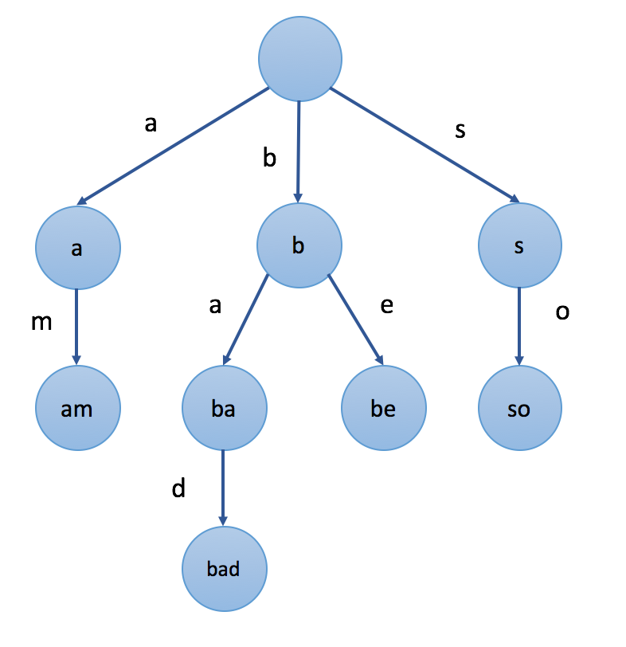

## Solution

---

### Overview

One of the first things you should always do is look at the constraints. Often you can figure out what approach needs to be taken simply by looking at the input size. In an interview, asking your interviewer about the constraints will also show your attention to detail – on top of giving you information.

In this particular problem, the input is small. With such small input sizes, we can safely assume that a naïve solution will pass.

---

### A Hash Set Approach

#### Intuition

The problem asks us to find all occurrences of elements from `words` in `text`.

One can iterate over all index pairs `(i, j)` in `text`, where each index pair represents a substring `text[i...j]` and check whether this substring is in `words`. To make the check quick, we maintain all words in a hash set.

A hash set is more efficient than a list, for example. If we want to find a string of length $l$ in a list, we must iterate over its elements and compare them with this string, which could take $O(n \cdot l)$. With a hash set, we can do it in $O(l)$.

#### Algorithm

1. Maintain a hash set of the words.
2. Iterate `i` from `0` to `text.length-1`.
* Iterate `j` from `i` to `text.length-1`.
* If the substring `text[i...j]` belongs to the hash set of words, add the pair `[i, j]` to the answer.
3. Return the answer.

#### Implementation

```python
class Solution:
    def indexPairs(self, text: str, words: List[str]) -> List[List[int]]:
        words = set(words)
        ans = []
        for i in range(len(text)):
            for j in range(i, len(text)):
                if text[i:j + 1] in words:
                    ans.append([i, j])
        return ans
```

#### Complexity Analysis

Let $m$ denote `text.length`, $n$ denote `words.length`, and $s$ as the average length of the words.

* Time complexity: $O(n \cdot s + m^3)$.

First, we add the words to the hash set. The words combined have a length of $n \cdot s$, so this costs $O(n \cdot s)$.

Then we iterate over $O(m^2)$ index pairs. At each index pair, we perform a substring operation and check if that substring is in the hash set, which costs up to $O(m)$. Thus, this iteration costs $O(m^3)$.

* Space complexity: $O(n \cdot s)$.

We store all the words in a hash set, and as mentioned above the total length of the words is $O(n \cdot s)$.

---

### A Trie Approach

#### Intuition

It is possible to solve this problem more efficiently.

We want a data structure that can quickly check if a substring `text[i...j]` belongs to `words`. One can use a trie for this purpose.

>**Note**. If you are unfamiliar with this data structure, we highly recommend you visit the [Trie Explore Card](https://leetcode.com/explore/learn/card/trie/) to gain a general understanding as this data structure is used frequently in string problems. In this article, to save time, we will assume that you already understand how a trie works in code and not talk about implementation details.

Here is an example of a trie with the words `"am"`, `"bad"`, `"be"`, `"so"`:



Consider an example with $text = "abacaba"$. In the previous approach, at some point, we check the substring $text[1...4] = "baca"$ and then the substring $text[1...5] = "bacab"$. However, we do not use any information on `"baca"` while checking `"bacab"`. With a trie, we can check the substring faster using the information about its prefix.

We keep the words in the trie. The trie contains nodes, each of which corresponds to a string. Some nodes are marked, and some are not. Marked nodes correspond to elements of `words`. To verify whether a string is in `words`, one may check whether the corresponding node is marked.

We will use one more important property of a trie: if a string belongs to a trie, all its prefixes also belong to it. For example, if there is a node corresponding to `"bacab"`, there must also be nodes corresponding to `"baca"`, `"bac"`, `"ba"`, and `"b"`. There exists an edge labeled with the letter `"b"` from the node `"baca"` to the node `"bacab"`.

Let's say we have already considered the substring `text[i...j]` and know what node in the trie corresponds to it. Now we want to add `text[j+1]` to the substring and proceed to `text[i...j+1]`. If there exists an edge labeled with `text[j+1]` outgoing from the current node, we traverse this edge and come to the node corresponding to `text[i...j+1]`. Otherwise, this substring is not in the trie, and we can stop checking the substrings starting at the `i`-th element.

If we build a trie using the elements from `words`, then we can save a lot of time when iterating over `text`.

For example, say $text = "abacaba"$ and we are at the node corresponding to `"baca" (text[1...4])`. **If there is no edge labeled with the letter `"b"` outgoing from this node**, it means that the trie does not contain the string `"bacab"`, which means that `words` does not contain any word with it as a prefix, so we don't need to waste time checking `"bacab"` or `"bacaba"`. We can immediately stop checking all substrings starting at index `1` and move on to the next starting index.

On top of saving computation by "abandoning" a start index, we also save time on not needing to perform substring operations.

#### Algorithm

1. Maintain the trie. Insert all elements from `words` into it. Each trie node contains (possibly zero) outgoing edges to other nodes and a flag that indicates whether the string corresponding to the node belongs to the words set (whether it is marked).
2. Iterate `i` from `0` to `text.length-1`.
* Let `p` be the trie node corresponding to the current substring, which is empty now. `p` is the trie root initially.
* Iterate `j` from `i` to `text.length-1`
* If an outgoing edge from `p` labeled with $\text{text}[j]$ does not exist, we cannot add characters to the current substring anymore, so break from the loop. Otherwise, traverse this edge and set `p` to its child. If the node is marked, it means `text[i...j]` belongs to the set of words, so add the pair `[i, j]` to the answer.
* Note: this optimization is what makes this approach much more efficient because we break from the loop once we know there cannot be any more answers.
3. Return the answer.

#### Implementation

```python
class TrieNode:
    def __init__(self):
        self.flag = False
        self.next = dict()

class Trie:
    def __init__(self):
        self.root = TrieNode()

    def insert(self, word):
        p = self.root
        for c in word:
            if c not in p.next:
                p.next[c] = TrieNode()
            p = p.next[c]
        p.flag = True

class Solution:
    def indexPairs(self, text: str, words: List[str]) -> List[List[int]]:
        trie = Trie()
        for word in words:
            trie.insert(word)
        result = []
        for i in range(len(text)):
            p = trie.root
            for j in range(i, len(text)):
                if text[j] not in p.next:
                    break
                p = p.next[text[j]]
                if p.flag:
                    result.append([i, j])
        return result
```

#### Complexity Analysis

Let $m$ denote `text.length`, $n$ denote `words.length`, and $s$ as the average length of the words.

* Time complexity: $O(n \cdot s + m^2)$.

Just like in the previous approach, we need $O(n \cdot s)$ to build our data structure (the trie). Then, we iterate over $O(m^2)$ index pairs. This time, instead of performing $O(m)$ substring operations at each index pair, we only need $O(1)$. This gives us a total time complexity of $O(n \cdot s + m^2)$.

Note that this time complexity is only in the worst case, and in reality, this algorithm will be much more efficient because most index pairs will be skipped.

* Space complexity: $O(n \cdot s)$.

In the worst case scenario, each letter of each word in `words` will have its own node in the trie. There are $n \cdot s$ total letters.