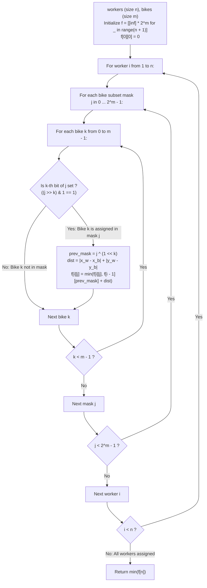

# Guided Example: Campus Bikes II

We trace the step-by-step optimization of assigning unique bikes to workers to minimize the global sum of Manhattan distances, prove the Bitmask Substructure Recurrence Theorem and the Greedy Inadequacy Lemma, and compute exact assignment costs across representative campus instances:

- **Representative Instance 1 (Two Workers and Two Bikes):**
  $$
  workers = [[0, 0], \; [2, 1]], \quad bikes = [[1, 2], \; [3, 3]], \quad n = 2, \; m = 2
  $$
- **Required Output:** `6`
  - Problem definitions:
    - There are $n$ workers and $m$ bikes ($n \le m \le 10$).
    - Assign each worker a unique bike such that the **sum of Manhattan distances** is minimized.
    - Manhattan distance: $d(w, b) = |x_w - x_b| + |y_w - y_b|$.
  - Pairwise Distance Matrix ($d(W_i, B_k)$):
    - Worker $0$ at $[0, 0]$:
      - To Bike $0$ at $[1, 2]$: $|0 - 1| + |0 - 2| = 1 + 2 = \mathbf{3}$
      - To Bike $1$ at $[3, 3]$: $|0 - 3| + |0 - 3| = 3 + 3 = \mathbf{6}$
    - Worker $1$ at $[2, 1]$:
      - To Bike $0$ at $[1, 2]$: $|2 - 1| + |1 - 2| = 1 + 1 = \mathbf{2}$
      - To Bike $1$ at $[3, 3]$: $|2 - 3| + |1 - 3| = 1 + 2 = \mathbf{3}$
  - The Greedy Inadequacy Phenomenon (Contrast with Campus Bikes I):
    - If Worker $1$ greedily took their closest bike ($Bike \; 0$ at distance $2$):
      - Worker $0$ is forced to take $Bike \; 1$ at distance $6$.
      - Total sum $= 2 + 6 = \mathbf{8}$.
    - If Worker $0$ takes $Bike \; 0$ (distance $3$) and Worker $1$ takes $Bike \; 1$ (distance $3$):
      - Total sum $= 3 + 3 = \mathbf{6}$.
    - Because $6 < 8$, local greedy decisions fail; global dynamic programming over subset states is mandatory!
  - Bitmask Dynamic Programming Trace:
    - Let $j \in [0, 2^2 - 1] = [0 \dots 3]$ represent the bitmask of assigned bikes:
      - Bit $0$ ($1 \ll 0 = 1$): Bike $0$ is assigned.
      - Bit $1$ ($1 \ll 1 = 2$): Bike $1$ is assigned.
    - Base state:
      $$
      f[0][00_2] = 0, \quad f[0][01_2] = \infty, \quad f[0][10_2] = \infty, \quad f[0][11_2] = \infty
      $$
    - **Step $i = 1$ (Assign Worker $0$):**
      - Assign Bike $0$ (mask $01_2 = 1$):
        $$f[1][01_2] = f[0][0] + d(W_0, B_0) = 0 + 3 = \mathbf{3}$$
      - Assign Bike $1$ (mask $10_2 = 2$):
        $$f[1][10_2] = f[0][0] + d(W_0, B_1) = 0 + 6 = \mathbf{6}$$
    - **Step $i = 2$ (Assign Worker $1$):**
      - Target mask $11_2 = 3$ (both bikes assigned):
        - Option A: Worker $1$ gets Bike $1$ ($k = 1$, previous mask $01_2$):
          $$f[2][11_2] = f[1][01_2] + d(W_1, B_1) = 3 + 3 = \mathbf{6}$$
        - Option B: Worker $1$ gets Bike $0$ ($k = 0$, previous mask $10_2$):
          $$f[2][11_2] = f[1][10_2] + d(W_1, B_0) = 6 + 2 = \mathbf{8}$$
        - Transition minimum: $\min(6, 8) = \mathbf{6}$.
    - Terminal Answer:
      $$
      ans = \min f[2] = f[2][11_2] = \mathbf{6}
      $$

- **Representative Instance 2 (Three-Way Assignment):**
  $$
  workers = [[0, 0], [1, 1], [2, 0]], \quad bikes = [[1, 0], [2, 2], [2, 1]], \quad n = 3, \; m = 3
  $$
  - Optimal matching: $W_0 \to B_0 (1), \; W_1 \to B_1 (2), \; W_2 \to B_2 (1)$.
  - Total minimum sum: $1 + 2 + 1 = \mathbf{4}$.

- **Representative Instance 3 (The Classic Greedy Trap):**
  $$
  workers = [[0, 0], [10, 0]], \quad bikes = [[1, 0], [0, 2]]
  $$
  - Worker $0$ has distances $d(W_0, B_0) = 1$ and $d(W_0, B_1) = 2$.
  - Worker $1$ has distances $d(W_1, B_0) = 9$ and $d(W_1, B_1) = 12$.
  - Greedy choice: Worker 0 picks closest $B_0$ ($1$). Worker 1 forced to $B_1$ ($12$). Total $= 13$.
  - Optimal choice: Worker 0 takes $B_1$ ($2$). Worker 1 takes $B_0$ ($9$). Total $= 2 + 9 = \mathbf{11}$.
  - Result: $\mathbf{11}$.

---

## 1. Instance & Teaching Goal

Given $n$ workers and $m$ bikes on a 2D plane ($n \le m \le 10$), assign each worker to a distinct bike such that the sum of Manhattan distances is globally minimized.

```text
The Factorial Search Fallacy:
  Evaluating all P(m, n) = m! / (m - n)! injective assignments:
    For n = 10, m = 10: 10! = 3,628,800 permutations.
    Greedy simulation fails because a locally optimal assignment can
    force a downstream worker to travel an enormous distance.

Bitmask DP Optimal Substructure Invariant (O(n * 2^m * m)):
  Notice: To assign worker i, we only need to know WHICH BIKES ARE OCCUPIED!
  We do NOT need to know which specific worker took which specific bike!
  Encode the occupied bike subset as a bitmask j in [0, 2^m - 1]:
    f[i][j] = min total distance to assign first i workers using bike set j.
    f[i][j] = min_{k in j} ( f[i-1][j ^ (1 << k)] + dist(worker[i-1], bike[k]) )
  Total states: (n + 1) * 2^m <= 11 * 1024 = 11,264 states.
  Each state transitions in O(m) operations.
  Total operations <= 1.1 * 10^5, executing in under 0.01 seconds!
```

Compressing the history of past assignments into an unordered bitmask of occupied resources eliminates factorial permutation overhead while preserving the optimal substructure.

The decisive pedagogical goal is the **Bitmask Substructure Recurrence Theorem & Greedy Inadequacy Lemma**:
1. **Permutation Collapse:** The exact identity of earlier worker-bike pairs is irrelevant to future decisions; only the subset of remaining available bikes matters.
2. **Bitmask Encoding:** A binary integer $j$ with $\text{popcount}(j) = i$ uniquely represents any subset of $i$ assigned bikes.
3. **Stepwise Worker Induction:** Assigning workers sequentially $1, \dots, n$ guarantees that every valid state $f[i][j]$ draws dependencies strictly from $f[i-1][j']$, forming a topological DAG.
4. Total time $\mathcal{O}(n \cdot m \cdot 2^m)$ and auxiliary space $\mathcal{O}(n \cdot 2^m)$ (or $\mathcal{O}(2^m)$).

---

## 2. Conceptual Foundation & The Bitmask DP Pipeline



### The Bitmask Substructure Recurrence Theorem

Let $\mathcal{W} = \{0, \dots, n-1\}$ and $\mathcal{B} = \{0, \dots, m-1\}$ with $n \le m \le 10$.
1. **Mathematical Objective:**
   Let $\Phi$ be the set of all injective functions $\pi: \mathcal{W} \to \mathcal{B}$.
   We seek:
   $$
   \min_{\pi \in \Phi} \sum_{i=0}^{n-1} \|W_i - B_{\pi(i)}\|_1
   $$
2. **Subproblem Definition:**
   For each prefix of workers $\{0, \dots, i-1\}$ ($0 \le i \le n$) and each subset of bikes $S \subseteq \mathcal{B}$ with $|S| = i$:
   Define $f(i, S)$ as the minimum cost to match the first $i$ workers to the bikes in $S$.
3. **Optimal Substructure:**
   Consider worker $i-1$. In any matching of $\{0, \dots, i-1\}$ onto $S$, worker $i-1$ is matched to some unique bike $k \in S$.
   The remaining $i-1$ workers $\{0, \dots, i-2\}$ must be matched injectively onto the subset $S \setminus \{k\}$.
   By the principle of optimality:
   $$
   f(i, S) = \min_{k \in S} \Big( f(i - 1, S \setminus \{k\}) + \|W_{i-1} - B_k\|_1 \Big)
   $$
   with base case $f(0, \emptyset) = 0$, and $f(0, S) = \infty$ for all $S \ne \emptyset$.
4. **Binary Integer Representation:**
   Represent subset $S \subseteq \mathcal{B}$ as an integer bitmask $j = \sum_{k \in S} 2^k$.
   Then:
   - $k \in S \iff (j \gg k) \& 1 == 1$.
   - $S \setminus \{k\}$ is represented by $j \oplus (1 \ll k)$.
   The recurrence takes the exact form implemented:
   $$
   f[i][j] = \min_{k: (j \gg k) \& 1 = 1} \Big( f[i - 1][j \oplus (1 \ll k)] + d(W_{i-1}, B_k) \Big)
   $$
   The global minimum is $\min_{j} f[n][j]$. $\blacksquare$

---

## 3. Step-by-Step Worked Execution: Representative Instance 1

$workers = [[0, 0], [2, 1]], \; bikes = [[1, 2], [3, 3]], \; n = 2, \; m = 2$.
Distances:
- $d(W_0, B_0) = 3, \; d(W_0, B_1) = 6$
- $d(W_1, B_0) = 2, \; d(W_1, B_1) = 3$

### Base Step $i = 0$
- $f[0][00_2] = 0$. All other $f[0][j] = \infty$.

### Step $i = 1$ (Worker $0$)
- $j = 01_2$ ($B_0$ assigned): $f[1][01_2] = f[0][0] + 3 = \mathbf{3}$.
- $j = 10_2$ ($B_1$ assigned): $f[1][10_2] = f[0][0] + 6 = \mathbf{6}$.
- (All other masks remain $\infty$).

### Step $i = 2$ (Worker $1$)
- Mask $j = 11_2$ (Both $B_0, B_1$ assigned):
  - Transition from $k = 1$ ($W_1 \to B_1$):
    $$f[1][01_2] + d(W_1, B_1) = 3 + 3 = \mathbf{6}$$
  - Transition from $k = 0$ ($W_1 \to B_0$):
    $$f[1][10_2] + d(W_1, B_0) = 6 + 2 = \mathbf{8}$$
  - Optimal selection: $f[2][11_2] = \min(6, 8) = \mathbf{6}$.

Terminal extraction: $\min f[2] = \mathbf{6}$.

---

## 4. Bitmask State Transition Trace Table

| Worker $i$ | Subset Mask $j$ | Binary Pattern | Bikes Assigned | Optimal Prior Sub-state | Distance Added | State Cost $f[i][j]$ |
|:---:|:---:|:---:|:---:|:---:|:---:|:---:|
| $0$ | $0$ | $00_2$ | None | Base Definition | $0$ | **$0$** |
| $1$ | $1$ | $01_2$ | $\{B_0\}$ | $f[0][00_2] = 0$ | $d(W_0, B_0) = 3$ | **$3$** |
| $1$ | $2$ | $10_2$ | $\{B_1\}$ | $f[0][00_2] = 0$ | $d(W_0, B_1) = 6$ | **$6$** |
| $2$ | $3$ | $11_2$ | $\{B_0, B_1\}$ | $f[1][01_2] = 3$ (Opt A) | $d(W_1, B_1) = 3$ | **$6$** |
| $2$ | $3$ | $11_2$ | $\{B_0, B_1\}$ | $f[1][10_2] = 6$ (Opt B) | $d(W_1, B_0) = 2$ | $8$ |
| **Final** | — | — | — | $\min f[2]$ | — | **Output: $6$** |

---

## 5. Algorithmic Correctness

### Soundness & Completeness
1. **Soundness:**
   Every mask $j$ with $\text{popcount}(j) = i$ represents a valid injective assignment of the first $i$ workers to distinct bikes.
2. **Completeness:**
   Since every possible bike $k \in j$ is evaluated as a candidate for worker $i-1$, no possible permutation of assignments can be overlooked.

---

## 6. Boundary Cases & Traps

| Scenario | Input Pattern | Behavior | Trapped Risk |
|---|---|---|---|
| Equal Number of Workers and Bikes | $n = m = 10$ | Evaluates all $1024$ subsets; full assignment ends at mask $2^{10}-1$. | Permutation factorial timeout. |
| More Bikes Than Workers ($m > n$) | $n = 2, m = 4$ | Evaluates subsets with popcount 2; unassigned bikes cost nothing. | Forcing all bikes to be used. |
| Single Worker and Bike | $n = 1, m = 1$ | Direct distance computed; returns $d(W_0, B_0)$. | Bit shift errors on small $m$. |
| Greedy Trap | Local closest bike starves another worker | DP evaluates all combinations, correctly identifying non-greedy minimum. | Using greedy matching. |

---

## 7. Complexity Derivation

- **Time Complexity:** $\mathcal{O}(n \cdot m \cdot 2^m)$, where $n \le m \le 10$.
  - Outer loop over workers: $n \le 10$.
  - Bitmask loop: $2^m \le 2^{10} = 1024$.
  - Inner loop over bikes: $m \le 10$.
  - Total operations $\le 10 \times 1024 \times 10 \approx 1.02 \times 10^5 \implies < 0.01\text{ s}$.
- **Auxiliary Space Complexity:** $\mathcal{O}(n \cdot 2^m)$ auxiliary memory for the DP table $f$ of size $(n + 1) \times 1024$ floats ($\approx 45\text{ KB}$).
