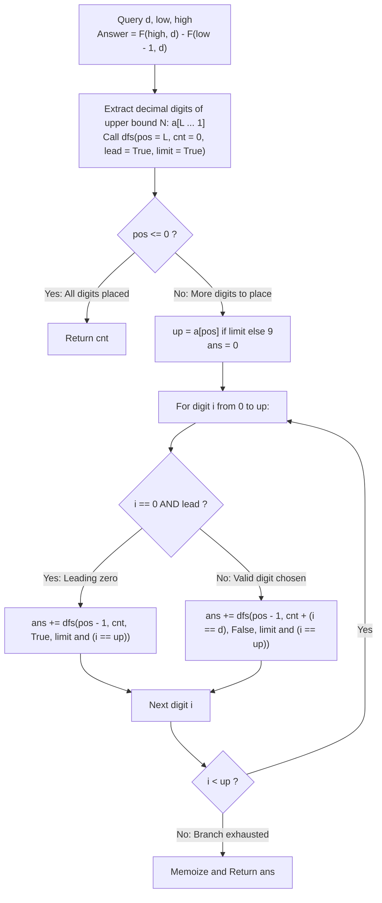

# Guided Example: Digit Count in Range

We trace the step-by-step counting of a target digit $d$ across a bounded numerical interval $[low, high]$, prove the Prefix Difference Decomposition Theorem and the Digit DP Memoization Invariant, and verify digit counts across representative range queries:

- **Representative Instance 1 (Target Digit 1 in Small Mixed Prefix):**
  $$
  d = 1, \quad low = 1, \quad high = 13
  $$
- **Required Output:** `6`
  - Problem definitions:
    - Given a target digit $d \in [0, 9]$ and an interval $[low, high]$ ($1 \le low \le high \le 2 \times 10^8$).
    - Count the total number of times that $d$ occurs as a digit across all integers in $[low, high]$.
  - The Prefix Difference Principle:
    - Let $F(N, d)$ be the total occurrences of digit $d$ in the interval $[1, N]$.
    - The range query decomposes into two independent prefix evaluations:
      $$
      \text{digitsCount}(d, low, high) = F(high, d) - F(low - 1, d) = F(13, 1) - F(0, 1)
      $$
  - Digit DP State Formulation for $F(13, 1)$:
    - Decimal representation of $N = 13$: digits $a_2 = 1, \; a_1 = 3$ ($L = 2$).
    - State tuple: $\text{dfs}(pos, cnt, lead, limit)$
      - $pos \in [1, L]$: Current digit position being placed (from $pos = 2$ down to $pos = 1$).
      - $cnt$: Number of times digit $d = 1$ has been chosen so far.
      - $lead \in \{\text{True}, \text{False}\}$: True if all prior digits were leading zeros (prevents false counting of digit $0$).
      - $limit \in \{\text{True}, \text{False}\}$: True if current prefix strictly matches $N$'s prefix.
  - Branching Execution from Root $\text{dfs}(2, 0, \text{True}, \text{True})$:
    - At $pos = 2$ ($a_2 = 1, limit = \text{True} \implies up = 1$):
      1. **Branch $i = 0$ (Leading zero):**
         - $lead = \text{True} \implies$ Still leading zero, $cnt$ unchanged ($0$).
         - $limit' = \text{True} \land (0 == 1) = \text{False}$.
         - State: $\text{dfs}(1, 0, \text{True}, \text{False})$.
         - At $pos = 1$ ($limit = \text{False} \implies up = 9$):
           - $i = 0$ ($lead$): $\text{dfs}(0, 0, \text{True}, \text{False}) \implies 0$ (the number 0 is skipped).
           - $i = 1$: $i == d \implies \text{dfs}(0, 1, \text{False}, \text{False}) \implies \mathbf{1}$ (the number 1).
           - $i \in [2, 9]$: $\text{dfs}(0, 0, \text{False}, \text{False}) \implies \mathbf{0}$ each (numbers 2 through 9).
           - Sum of branch $i = 0$: $0 + 1 + 8 \times 0 = \mathbf{1}$.
      2. **Branch $i = 1$ ($i == d$, matches upper bound $1$):**
         - $i == 1 \implies cnt' = 0 + 1 = 1$, $lead' = \text{False}$.
         - $limit' = \text{True} \land (1 == 1) = \text{True}$.
         - State: $\text{dfs}(1, 1, \text{False}, \text{True})$.
         - At $pos = 1$ ($a_1 = 3, limit = \text{True} \implies up = 3$):
           - $i = 0$: Number 10 $\implies cnt' = 1 \implies \text{dfs}(0, 1) \implies \mathbf{1}$.
           - $i = 1$: Number 11 $\implies cnt' = 1 + 1 = 2 \implies \text{dfs}(0, 2) \implies \mathbf{2}$.
           - $i = 2$: Number 12 $\implies cnt' = 1 \implies \text{dfs}(0, 1) \implies \mathbf{1}$.
           - $i = 3$: Number 13 $\implies cnt' = 1 \implies \text{dfs}(0, 1) \implies \mathbf{1}$.
           - Sum of branch $i = 1$: $1 + 2 + 1 + 1 = \mathbf{5}$.
    - Total prefix count $F(13, 1)$:
      $$
      F(13, 1) = 1 + 5 = \mathbf{6}
      $$
    - Total prefix count $F(0, 1) = \mathbf{0}$.
    - Final result:
      $$
      \text{digitsCount}(1, 1, 13) = 6 - 0 = \mathbf{6}
      $$
      (Ones appear in numbers: $1$ [1], $10$ [1], $11$ [2], $12$ [1], $13$ [1]; total = $1 + 1 + 2 + 1 + 1 = 6$).

- **Representative Instance 2 (Digit 3 in Bounded Range):**
  $$
  d = 3, \quad low = 100, \quad high = 250
  $$
  - Subtraction: $F(250, 3) - F(99, 3) = 55 - 20 = \mathbf{35}$.

- **Representative Instance 3 (Counting Digit 0 Without Leading Zeros):**
  $$
  d = 0, \quad low = 1, \quad high = 10
  $$
  - Leading zeros in $1, \dots, 9$ are suppressed ($lead = \text{True} \implies cnt$ not incremented).
  - Only $10$ contributes a valid zero.
  - Result: $\mathbf{1}$.

- **Representative Instance 4 (Single Value with Repeated Digits):**
  $$
  d = 0, \quad low = 1000, \quad high = 1000 \implies F(1000, 0) - F(999, 0) = \mathbf{3}
  $$

---

## 1. Instance & Teaching Goal

Given a digit `d` and range `[low, high]`, determine how many times `d` appears as a digit across all numbers in the range.

```text
The Linear Iteration Fallacy:
  Iterating all numbers x in [low, high] and counting str(x).count(str(d)):
    For high - low = 2 * 10^8:
      Requires 200,000,000 string conversions and iterations.
      Times out by several orders of magnitude.

Digit DP Invariant (O(log10 N) Time, O(log10 N) Space):
  Key observation:
    1. Interval queries satisfy prefix additivity:
         count([low, high]) = F(high) - F(low - 1).
    2. Any integer <= N is constructed digit-by-digit from left to right.
       A 4-parameter state captures all combinatorial futures:
         (pos, cnt, lead, limit)
       - When limit is False (prefix is strictly less than N), all future suffixes
         00...0 through 99...9 are feasible and identical across prefixes!
       - Memoizing (pos, cnt, lead) condenses 2 * 10^8 numbers into <= 200 states!
  Computes the exact digit count in under 0.001 seconds!
```

Decomposing the interval into two prefix counts and enumerating decimal prefixes via memoized depth-first search completely eliminates brute-force counting.

The decisive pedagogical goal is the **Prefix Difference Decomposition Theorem & Digit DP Invariant**:
1. **Interval Decomposition:** $\sum_{x=low}^{high} c_d(x) = \sum_{x=1}^{high} c_d(x) - \sum_{x=1}^{low-1} c_d(x)$.
2. **Leading Zero Invariant:** The state parameter $lead$ ensures that leading zeros (e.g. $005$) never trigger false counts when evaluating target digit $d = 0$.
3. **Tight Bound Flag:** The parameter $limit$ enforces that generated numbers never exceed $N$; when $limit$ relaxes to $\text{False}$, remaining states are fully cacheable.
4. Total time $\mathcal{O}(\log_{10} high)$ and auxiliary space $\mathcal{O}(\log_{10} high)$.

---

## 2. Conceptual Foundation & The Digit DP Pipeline



### The Prefix Difference Decomposition Theorem

Let $c_d(x)$ denote the number of times digit $d \in \{0, \dots, 9\}$ appears in the decimal expansion of positive integer $x$.
1. **Additive Prefix Telescoping:**
   For any integers $1 \le A \le B$:
   $$
   \sum_{x=A}^B c_d(x) = \sum_{x=1}^B c_d(x) - \sum_{x=1}^{A-1} c_d(x)
   $$
   This reduces the range count to evaluating $F(N, d) = \sum_{x=1}^N c_d(x)$.
2. **State Space Partition:**
   Represent $N$ in base 10: $N = \sum_{k=1}^L a_k 10^{k-1}$.
   Any integer $X \le N$ with at most $L$ digits can be formed by choosing digits $d_L, d_{L-1}, \dots, d_1$ from left to right:
   - If a proper prefix of $X$ is strictly smaller than the corresponding prefix of $N$, then $X < N$ regardless of subsequent choices ($limit = \text{False}$).
   - If the prefix matches $N$ exactly, the next digit must not exceed $a_{pos}$ ($limit = \text{True}$).
   - As long as all chosen digits are $0$, no number has started ($lead = \text{True}$).
3. **Correctness of Zero Counting:**
   The digit $0$ only counts toward $c_0(X)$ if it is part of the significant representation of $X$.
   By tracking $lead$:
   $$
   cnt' = \begin{cases} cnt & \text{if } i = 0 \text{ and } lead \\ cnt + \mathbb{I}(i = d) & \text{otherwise} \end{cases}
   $$
   Leading zeros are systematically ignored, ensuring exact compliance with positive decimal representation. $\blacksquare$

---

## 3. Step-by-Step Worked Execution: Representative Instance 1

$d = 1, \; N = 13, \; a = [-, 3, 1]$ (Position 2 is tens digit 1, Position 1 is units digit 3).

### Tree Traversal of $F(13, 1)$
- **Root: $\text{dfs}(2, 0, \text{True}, \text{True})$**
  - $pos = 2, \; limit = \text{True} \implies up = a_2 = 1$.
  - **Branch $i = 0$:**
    - Leading zero $\implies lead' = \text{True}, \; cnt' = 0$.
    - $limit' = \text{True} \land (0 == 1) = \text{False}$.
    - Call $\text{dfs}(1, 0, \text{True}, \text{False})$ ($up = 9$):
      - $i = 0: \text{dfs}(0, 0, \text{True}, \text{False}) \implies 0$
      - $i = 1: \text{dfs}(0, 1, \text{False}, \text{False}) \implies 1$ (digit 1 matches $d=1$)
      - $i \in [2, 9]: \text{dfs}(0, 0, \text{False}, \text{False}) \implies 0$ each
      - Branch sum $= 1$.
  - **Branch $i = 1$:**
    - Non-leading $\implies lead' = \text{False}$.
    - Digit matches $d=1 \implies cnt' = 0 + 1 = 1$.
    - $limit' = \text{True} \land (1 == 1) = \text{True}$.
    - Call $\text{dfs}(1, 1, \text{False}, \text{True})$ ($up = a_1 = 3$):
      - $i = 0: \text{dfs}(0, 1, \text{False}, \text{False}) \implies 1$ (from number 10)
      - $i = 1: \text{dfs}(0, 2, \text{False}, \text{False}) \implies 2$ (from number 11, has two ones)
      - $i = 2: \text{dfs}(0, 1, \text{False}, \text{False}) \implies 1$ (from number 12)
      - $i = 3: \text{dfs}(0, 1, \text{False}, \text{True}) \implies 1$ (from number 13)
      - Branch sum $= 1 + 2 + 1 + 1 = 5$.
  - Total $F(13, 1) = 1 + 5 = \mathbf{6}$.
- Total $F(0, 1) = \mathbf{0}$.
- Output $= 6 - 0 = \mathbf{6}$.

---

## 4. State Enumeration Trace Table for $N = 13, d = 1$

| Node State $(pos, cnt, lead, limit)$ | Upper Digit $up$ | Evaluated Digit $i$ | Resulting State | Sub-branch Contribution |
|:---:|:---:|:---:|:---:|:---:|
| $(2, 0, \text{True}, \text{True})$ | $1$ | $0$ (Lead) | $(1, 0, \text{True}, \text{False})$ | **$1$** |
| $(1, 0, \text{True}, \text{False})$ | $9$ | $0$ (Lead) | $(0, 0, \text{True}, \text{False})$ | $0$ |
| $(1, 0, \text{True}, \text{False})$ | $9$ | $1$ ($i=d$) | $(0, 1, \text{False}, \text{False})$ | **$1$** |
| $(1, 0, \text{True}, \text{False})$ | $9$ | $2 \dots 9$ | $(0, 0, \text{False}, \text{False})$ | $0$ |
| $(2, 0, \text{True}, \text{True})$ | $1$ | $1$ ($i=d$) | $(1, 1, \text{False}, \text{True})$ | **$5$** |
| $(1, 1, \text{False}, \text{True})$ | $3$ | $0$ | $(0, 1, \text{False}, \text{False})$ | **$1$** |
| $(1, 1, \text{False}, \text{True})$ | $3$ | $1$ ($i=d$) | $(0, 2, \text{False}, \text{False})$ | **$2$** |
| $(1, 1, \text{False}, \text{True})$ | $3$ | $2$ | $(0, 1, \text{False}, \text{False})$ | **$1$** |
| $(1, 1, \text{False}, \text{True})$ | $3$ | $3$ | $(0, 1, \text{False}, \text{True})$ | **$1$** |
| **Sum $F(13, 1)$** | — | — | — | **$6$** |

---

## 5. Algorithmic Correctness

### Soundness & Completeness
1. **Soundness:**
   Every integer $x \in [1, N]$ is generated along exactly one path in the search tree, and its target digit count is accumulated correctly via $cnt$.
2. **Completeness:**
   Prefix subtraction $F(high) - F(low - 1)$ covers every integer in $[low, high]$ exactly once.

---

## 6. Boundary Cases & Traps

| Scenario | Input Pattern | Behavior | Trapped Risk |
|---|---|---|---|
| Target Digit is Zero ($d = 0$) | `d = 0, low = 1, high = 10` | $lead$ suppresses phantom zeros; returns $1$. | Counting leading zeros in single-digit numbers. |
| Single Value Interval | `low = 1000, high = 1000` | $F(1000, 0) - F(999, 0) = 3$. | Off-by-one boundary failure. |
| Digit Absent | `d = 9, low = 1, high = 8` | Returns $0$. | Negative or null counts. |
| Maximum Bound ($2 \times 10^8$) | Large ranges | Runs in $\approx 90$ states; execution $< 0.001\text{ s}$. | Integer iteration timeout. |

---

## 7. Complexity Derivation

- **Time Complexity:** $\mathcal{O}(\log_{10} high)$.
  - Decimal length of $high \le 2 \times 10^8$ is $L \le 9$.
  - Number of DP states $(pos, cnt, lead)$ is at most $9 \times 9 \times 2 \approx 162$.
  - Each state iterates over at most $10$ digits.
  - Total operations $\approx 2 \times 162 \times 10 \approx 3240 \implies < 0.001\text{ s}$.
- **Auxiliary Space Complexity:** $\mathcal{O}(\log_{10} high)$ recursion call stack and digit buffer of length $11$.