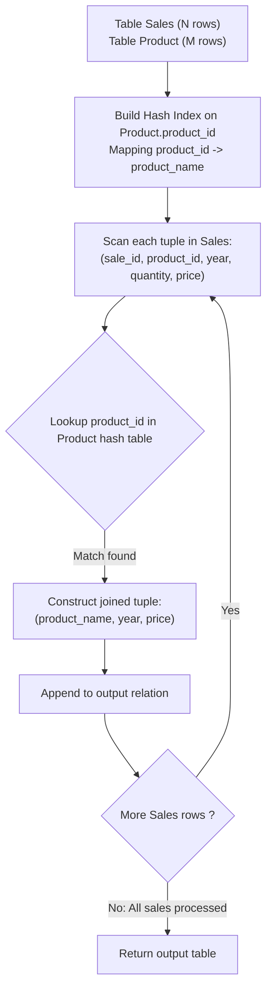

# Guided Example: Product Sales Analysis I

We trace the step-by-step relational evaluation of projecting product names, sale years, and unit prices from sales and product catalogs, prove the Foreign Key Functional Dependency Theorem and the Multiplicity Preservation Invariant, and analyze equi-join behavior across representative database instances:

- **Representative Instance 1 (Repeated Product Sales and Unused Catalog Items):**
  - Table `Sales`:
    $$
    \begin{array}{|c|c|c|c|c|}
    \hline
    \textbf{sale\_id} & \textbf{product\_id} & \textbf{year} & \textbf{quantity} & \textbf{price} \\
    \hline
    1 & 100 & 2008 & 10 & 5000 \\
    2 & 100 & 2009 & 12 & 5000 \\
    7 & 200 & 2011 & 15 & 9000 \\
    \hline
    \end{array}
    $$
  - Table `Product`:
    $$
    \begin{array}{|c|c|}
    \hline
    \textbf{product\_id} & \textbf{product\_name} \\
    \hline
    100 & \text{"Nokia"} \\
    200 & \text{"Apple"} \\
    300 & \text{"Samsung"} \\
    \hline
    \end{array}
    $$
- **Required Output:**
  $$
  \begin{array}{|c|c|c|}
  \hline
  \textbf{product\_name} & \textbf{year} & \textbf{price} \\
  \hline
  \text{"Nokia"} & 2008 & 5000 \\
  \text{"Nokia"} & 2009 & 5000 \\
  \text{"Apple"} & 2011 & 9000 \\
  \hline
  \end{array}
  $$
  - Relational Schema Contracts:
    - In `Sales`, `(sale_id, year)` forms the primary key. Column `product_id` is a foreign key referencing `Product`.
    - In `Product`, `product_id` is the primary key.
    - Each record in `Sales` represents a distinct sale event. `price` is given per unit.
  - Equi-Join Execution Step:
    - Match tuples from `Sales` and `Product` where `Sales.product_id = Product.product_id`.
    1. **Sale Record 1** (`sale_id = 1, product_id = 100, year = 2008, price = 5000`):
       - Look up `product_id = 100` in `Product` $\implies$ matches `product_name = "Nokia"`.
       - Emitted row: `["Nokia", 2008, 5000]`.
    2. **Sale Record 2** (`sale_id = 2, product_id = 100, year = 2009, price = 5000`):
       - Look up `product_id = 100` in `Product` $\implies$ matches `product_name = "Nokia"`.
       - Emitted row: `["Nokia", 2009, 5000]`.
    3. **Sale Record 3** (`sale_id = 7, product_id = 200, year = 2011, price = 9000`):
       - Look up `product_id = 200` in `Product` $\implies$ matches `product_name = "Apple"`.
       - Emitted row: `["Apple", 2011, 9000]`.
    4. **Unused Product 300 ("Samsung")**:
       - No record in `Sales` references `product_id = 300`.
       - Inner join eliminates unreferenced catalog entries.
  - Column Projection:
    - Select exactly the attributes `product_name`, `year`, `price`.
    - Attributes `sale_id`, `product_id`, and `quantity` are omitted from the projection list.

- **Representative Instance 2 (Products Without Sales Omitted):**
  - `Product` has items `1: "Unused"`, `2: "Used"`, `3: "Idle"`.
  - `Sales` contains only one sale for `product_id = 2`.
  - Result contains only `"Used"`, filtering out `"Unused"` and `"Idle"`.

- **Representative Instance 3 (Quantity Irrelevant to Price):**
  - A sale of quantity $100$ at unit price $7$ outputs `price = 7`, not $700$.

---

## 1. Instance & Teaching Goal

Given relational tables `Sales` and `Product`, report `product_name`, `year`, and `price` for every sale record.

```text
The Cardinality Distortion Fallacy:
  Applying DISTINCT to the output:
    If two distinct sales transactions happen to share the same (product_name, year, price),
    DISTINCT would collapse them into a single row, violating the problem contract
    "for each sale_id in the Sales table"!

Foreign Key Multiplicity Preservation Invariant:
  Because product_id is the PRIMARY KEY of Product:
    Every product_id matches AT MOST one row in Product.
  Because product_id in Sales is a FOREIGN KEY:
    Every sale_id matches AT LEAST one row in Product.
  Therefore:
    The inner join is a strict 1-to-1 functional attribute lookup:
      |Sales JOIN Product| == |Sales|
  Every sale record receives its descriptive product_name without row multiplication or omission!
```

Recognizing that primary-to-foreign key joins are bijection-preserving attribute enrichments guarantees correct result cardinality without row loss or duplicates.

The decisive pedagogical goal is the **Foreign Key Functional Dependency Theorem & Multiplicity Preservation Invariant**:
1. **Relational Equi-Join:** $\mathcal{R}_{\text{Result}} = \pi_{\text{product\_name}, \text{year}, \text{price}} (\mathcal{R}_{\text{Sales}} \bowtie_{\text{product\_id}} \mathcal{R}_{\text{Product}})$.
2. **Cardinality Identity:** Because `product_id` is unique in `Product` and non-null in `Sales`, $|\mathcal{R}_{\text{Result}}| = |\mathcal{R}_{\text{Sales}}|$.
3. **No Redundant Aggregation:** Attribute `price` is already per-unit; quantity is preserved implicitly by transaction grain.
4. Total time $\mathcal{O}(|\text{Sales}| + |\text{Product}|)$ via hash join and space $\mathcal{O}(|\text{Product}|)$.

---

## 2. Conceptual Foundation & Relational Join Pipeline



### The Foreign Key Functional Dependency Theorem

Let $\mathcal{S}$ denote the `Sales` relation and $\mathcal{P}$ denote the `Product` relation.
1. **Primary Key Uniqueness:**
   In relation $\mathcal{P}$, attribute `product_id` is the primary key.
   Thus, the functional dependency holds:
   $$
   \text{product\_id} \to \text{product\_name}
   $$
   For every key $k$, $|\sigma_{\text{product\_id} = k}(\mathcal{P})| \le 1$.
2. **Foreign Key Integrity:**
   Attribute `product_id` in $\mathcal{S}$ is a foreign key referencing $\mathcal{P}$.
   For every tuple $s \in \mathcal{S}$, there exists $p \in \mathcal{P}$ such that $s[\text{product\_id}] = p[\text{product\_id}]$.
3. **Join Cardinality Invariant:**
   Consider the natural inner equi-join:
   $$
   \mathcal{J} = \mathcal{S} \bowtie_{\mathcal{S}.\text{product\_id} = \mathcal{P}.\text{product\_id}} \mathcal{P}
   $$
   For each tuple $s \in \mathcal{S}$, exactly one matching tuple $p \in \mathcal{P}$ exists.
   Hence:
   $$
   |\mathcal{J}| = |\mathcal{S}|
   $$
   The join neither creates orphan sales nor duplicates sales records.
4. **Projection Fidelity:**
   The projection $\pi_{\text{product\_name}, \text{year}, \text{price}}(\mathcal{J})$ produces one output row per `sale_id`, satisfying the specification. $\blacksquare$

---

## 3. Step-by-Step Worked Execution: Representative Instance 1

### Join Matching Table
- **Tuple 1 ($sale\_id = 1$):**
  - $product\_id = 100 \implies Product.product\_name = \text{"Nokia"}$.
  - Projected: `["Nokia", 2008, 5000]`.
- **Tuple 2 ($sale\_id = 2$):**
  - $product\_id = 100 \implies Product.product\_name = \text{"Nokia"}$.
  - Projected: `["Nokia", 2009, 5000]`.
- **Tuple 3 ($sale\_id = 7$):**
  - $product\_id = 200 \implies Product.product\_name = \text{"Apple"}$.
  - Projected: `["Apple", 2011, 9000]`.

All 3 sales are preserved. Catalog item $300$ ("Samsung") has no matching sales and is omitted.

---

## 4. Join and Projection Trace Table

| `sale_id` | `Sales.product_id` | `year` | `price` | Matched `Product.product_name` | Emitted Row in Result |
|:---:|:---:|:---:|:---:|:---:|:---:|
| $1$ | $100$ | $2008$ | $5000$ | `"Nokia"` | `["Nokia", 2008, 5000]` |
| $2$ | $100$ | $2009$ | $5000$ | `"Nokia"` | `["Nokia", 2009, 5000]` |
| $7$ | $200$ | $2011$ | $9000$ | `"Apple"` | `["Apple", 2011, 9000]` |

---

## 5. Algorithmic Correctness

### Soundness & Completeness
1. **Soundness:**
   Every returned row contains the authentic `product_name` associated with the sale's `product_id` and the recorded `year` and `price`.
2. **Completeness:**
   Every sale record in `Sales` is joined and projected; no sales transaction is omitted.

---

## 6. Boundary Cases & Traps

| Scenario | Input Pattern | Behavior | Trapped Risk |
|---|---|---|---|
| Unused Products in Catalog | Product with zero sales | Omitted by inner join; only sales are reported. | Including catalog items with null sales data. |
| Duplicate Rows in Projection | Two sales with identical product, year, price | Both rows returned; no distinct filtering. | Using `DISTINCT` and collapsing distinct transactions. |
| Quantity Multiplication | Quantity $> 1$ | `price` projected directly; not multiplied. | Computing total revenue (`quantity * price`). |
| Empty Sales Table | No sales | Returns empty table with 3 column headers. | Null pointer errors. |

---

## 7. Complexity Derivation

- **Time Complexity:** $\mathcal{O}(|\mathcal{S}| + |\mathcal{P}|)$, where $|\mathcal{S}|$ is the number of rows in `Sales` and $|\mathcal{P}|$ is the number of rows in `Product`.
  - Building a hash table over `Product` takes $\mathcal{O}(|\mathcal{P}|)$ time.
  - Probing the hash table for each row in `Sales` takes $\mathcal{O}(|\mathcal{S}|)$ time.
  - Total query execution time is strictly linear in input size.
- **Auxiliary Space Complexity:** $\mathcal{O}(|\mathcal{P}|)$ auxiliary memory for the join index or hash table built over the smaller `Product` table.
