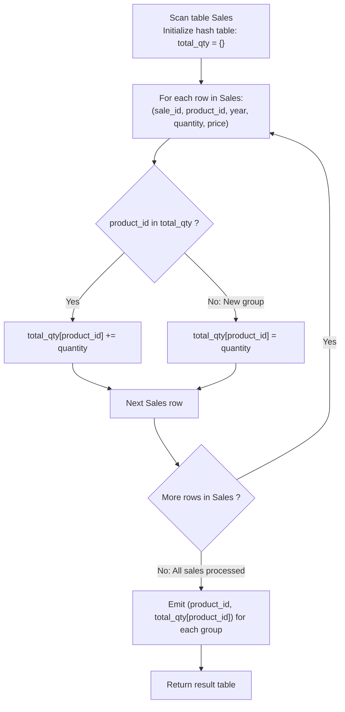

# Guided Example: Product Sales Analysis II

We trace the step-by-step aggregation of total product sales volume, prove the Group-By Aggregation Reduction Theorem and the Catalog Join Elimination Lemma, and compute aggregated sales across representative database instances:

- **Representative Instance 1 (Multi-Year Product Aggregation and Catalog Independence):**
  - Table `Sales`:
    $$
    \begin{array}{|c|c|c|c|c|}
    \hline
    \textbf{sale\_id} & \textbf{product\_id} & \textbf{year} & \textbf{quantity} & \textbf{price} \\
    \hline
    1 & 100 & 2008 & 10 & 5000 \\
    2 & 100 & 2009 & 12 & 5000 \\
    7 & 200 & 2011 & 15 & 9000 \\
    \hline
    \end{array}
    $$
  - Table `Product` (Catalog):
    $$
    \begin{array}{|c|c|}
    \hline
    \textbf{product\_id} & \textbf{product\_name} \\
    \hline
    100 & \text{"Nokia"} \\
    200 & \text{"Apple"} \\
    300 & \text{"Samsung"} \\
    \hline
    \end{array}
    $$
- **Required Output:**
  $$
  \begin{array}{|c|c|}
  \hline
  \textbf{product\_id} & \textbf{total\_quantity} \\
  \hline
  100 & 22 \\
  200 & 15 \\
  \hline
  \end{array}
  $$
  - Problem definitions:
    - Compute the total quantity sold for every product id appearing in `Sales`.
    - Return the resulting table with columns `product_id` and `total_quantity`.
  - The Catalog Join Elimination Lemma:
    - The output requires only `product_id` and the sum of `quantity`.
    - Both attributes exist directly in table `Sales`.
    - The `Product` table contains metadata (`product_name`) that is not requested.
    - Joining with `Product` is strictly redundant: it introduces hash table construction and join overhead without altering any value.
    - Aggregating directly over `Sales` simplifies the query to a single-pass hash grouping!
  - Group-By Aggregation Trace:
    - Partition records in `Sales` by key `product_id`:
    1. **Group `product_id = 100`:**
       - Row 1 ($sale\_id = 1$): $quantity = 10$
       - Row 2 ($sale\_id = 2$): $quantity = 12$
       - Total quantity $= 10 + 12 = \mathbf{22}$
    2. **Group `product_id = 200`:**
       - Row 3 ($sale\_id = 7$): $quantity = 15$
       - Total quantity $= \mathbf{15}$
    3. **Unsold Product 300:**
       - Does not appear in `Sales`, so no group is created.
  - Final Result Table:
    $$
    [[\mathbf{100, 22}], \; [\mathbf{200, 15}]]
    $$

- **Representative Instance 2 (Shared Years Across Different Products):**
  - Sales contains `product_id = 1` ($quantity = 2, 5$) and `product_id = 2` ($quantity = 3$).
  - Year attribute is ignored in grouping.
  - Result: `[[1, 7], [2, 3]]`.

- **Representative Instance 3 (Price Variation Irrelevance):**
  - Sales of `product_id = 5` at price $1000$ ($qty = 1$) and price $1$ ($qty = 9$).
  - Sum is strictly over `quantity`: $1 + 9 = \mathbf{10}$.

- **Representative Instance 4 (Empty Sales Table):**
  - `Sales` has zero rows $\implies$ returns empty relation `[]`.

---

## 1. Instance & Teaching Goal

Given relational tables `Sales` and `Product`, compute the total quantity sold for each product id.

```text
The Redundant Join Inefficiency:
  Executing SELECT product_id, SUM(quantity) FROM Sales JOIN Product USING (product_id):
    Requires scanning Product, building an in-memory hash table of product catalog items,
    and performing join lookups for every sale.
    Since product_name is never projected, joining Product is pure wasted overhead!

Catalog Join Elimination & Single-Pass Hash Grouping Invariant:
  Both product_id and quantity reside natively in Sales!
  Direct grouping on Sales:
    SELECT product_id, SUM(quantity) AS total_quantity
    FROM Sales
    GROUP BY product_id;
  Processes the entire query in a single linear streaming pass:
    - Maintain a hash map: product_id -> sum_qty.
    - For each row (p, q), sum_qty[p] += q.
  Eliminates the join entirely, running in O(|Sales|) time and O(|Distinct Products|) space!
```

Recognizing attribute sufficiency within a single relation allows eliminating dead joins and optimizes the execution plan to a single hash-aggregate pass.

The decisive pedagogical goal is the **Group-By Aggregation Reduction Theorem & Catalog Join Elimination Lemma**:
1. **Relational Aggregation:** $\mathcal{R}_{\text{Out}} = \gamma_{\text{product\_id}, \; \text{SUM}(\text{quantity}) \to \text{total\_quantity}}(\mathcal{R}_{\text{Sales}})$.
2. **Attribute Sufficiency:** Because all needed attributes $\{\text{product\_id}, \text{quantity}\} \subseteq \text{Attrs}(\mathcal{R}_{\text{Sales}})$, relation $\mathcal{R}_{\text{Product}}$ is independent of the projection and can be eliminated.
3. **Additive Group Conservation:** For each group, the sum accumulates all transactions without deduplication (`SUM` vs. `SUM(DISTINCT)`).
4. Total time $\mathcal{O}(|\text{Sales}|)$ and auxiliary space $\mathcal{O}(G)$, where $G$ is the count of distinct products sold.

---

## 2. Conceptual Foundation & Aggregation Pipeline



### The Group-By Aggregation Reduction Theorem

Let $\mathcal{S}$ denote the `Sales` relation with schema $(sale\_id, product\_id, year, quantity, price)$.
1. **Relational Grouping Operator:**
   The relational grouping operator $\gamma_{A, F(B) \to C}(\mathcal{S})$ partitions $\mathcal{S}$ into equivalence classes under attribute set $A$:
   $$
   [s]_A = \{ t \in \mathcal{S} : t[A] = s[A] \}
   $$
   and maps each equivalence class to a single tuple with key $s[A]$ and aggregated value $F(\{t[B] : t \in [s]_A\})$.
2. **Quantity Summation Function:**
   Here $A = \{\text{product\_id}\}$, $B = \text{quantity}$, and $F = \sum$.
   For each distinct product identifier $p \in \pi_{\text{product\_id}}(\mathcal{S})$:
   $$
   \text{total\_quantity}(p) = \sum_{t \in \mathcal{S}, \; t[\text{product\_id}] = p} t[\text{quantity}]
   $$
3. **Catalog Join Elimination:**
   Consider relation $\mathcal{P}(\text{product\_id}, \text{product\_name})$.
   Because $\text{product\_id}$ is the primary key of $\mathcal{P}$ and foreign key of $\mathcal{S}$, the equi-join $\mathcal{S} \bowtie \mathcal{P}$ is a 1-to-1 extension of each row in $\mathcal{S}$.
   Since the query requests only attributes from $\mathcal{S}$, projecting onto $\text{Attrs}(\mathcal{S})$ yields:
   $$
   \pi_{\text{product\_id}, \text{quantity}}(\mathcal{S} \bowtie \mathcal{P}) \equiv \pi_{\text{product\_id}, \text{quantity}}(\mathcal{S})
   $$
   Thus, joining with $\mathcal{P}$ produces an identical relation but incurs unnecessary lookup cost. Eliminating $\mathcal{P}$ preserves algebraic equivalence. $\blacksquare$

---

## 3. Step-by-Step Worked Execution: Representative Instance 1

### Row-by-Row Hash Table Evolution
- **Row 1 ($sale\_id = 1, product\_id = 100, quantity = 10$):**
  - Key $100 \notin total\_qty \implies total\_qty[100] = 10$.
- **Row 2 ($sale\_id = 2, product\_id = 100, quantity = 12$):**
  - Key $100 \in total\_qty \implies total\_qty[100] = 10 + 12 = \mathbf{22}$.
- **Row 3 ($sale\_id = 7, product\_id = 200, quantity = 15$):**
  - Key $200 \notin total\_qty \implies total\_qty[200] = \mathbf{15}$.

Final aggregated groups: `[[100, 22], [200, 15]]`.

---

## 4. Group Aggregation Trace Table

| Processed Row $(sale\_id, product\_id, qty)$ | Group Key $product\_id$ | Quantity Value | Running Total for Group | Current Group Hash Map |
|:---:|:---:|:---:|:---:|:---:|
| $(1, 100, 10)$ | $100$ | $10$ | $10$ | $\{100: 10\}$ |
| $(2, 100, 12)$ | $100$ | $12$ | **$22$** | $\{100: 22\}$ |
| $(7, 200, 15)$ | $200$ | $15$ | **$15$** | $\{100: 22, \; 200: 15\}$ |
| **Output** | — | — | — | **`[[100, 22], [200, 15]]`** |

---

## 5. Algorithmic Correctness

### Soundness & Completeness
1. **Soundness:**
   Every returned row contains a unique `product_id` and the exact arithmetic sum of all `quantity` values recorded for that product.
2. **Completeness:**
   Every sale record in `Sales` is processed into its corresponding group; no transaction is omitted.

---

## 6. Boundary Cases & Traps

| Scenario | Input Pattern | Behavior | Trapped Risk |
|---|---|---|---|
| Unsold Catalog Products | Product $300$ has no sales | Naturally excluded from `Sales` grouping; no row emitted. | Emitting rows with `NULL` or $0$ quantity. |
| Single Sale for Product | Only one sale record | Aggregate sum equals that single record's quantity. | Off-by-one aggregation errors. |
| Repeated Quantity Values | Multiple sales with identical quantity | All values are summed; `DISTINCT` is not applied. | Dropping identical sales with `SUM(DISTINCT)`. |
| Positional Grouping | `GROUP BY 1` | Refers to `product_id` (first expression in select list). | Misinterpreting 1 as a constant integer literal. |

---

## 7. Complexity Derivation

- **Time Complexity:** $\mathcal{O}(|\mathcal{S}|)$, where $|\mathcal{S}|$ is the number of rows in `Sales`.
  - A single scan over `Sales` processes each row in $\mathcal{O}(1)$ amortized time via hash table.
  - Emitting the $G$ groups takes $\mathcal{O}(G)$ time ($G \le |\mathcal{S}|$).
  - Total time is strictly linear in the size of the sales table.
- **Auxiliary Space Complexity:** $\mathcal{O}(G)$, where $G$ is the number of distinct products sold, to store the hash aggregation state.
