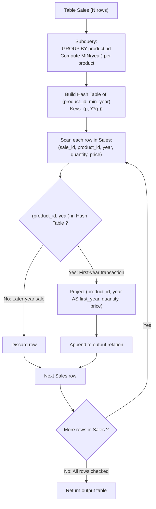

# Guided Example: Product Sales Analysis III

We trace the step-by-step extraction of initial product sales records using composite key semi-joins, prove the Composite Minimum Year Semi-Join Theorem and the First-Year Tie-Retention Invariant, and analyze query execution across representative database instances:

- **Representative Instance 1 (Earliest Sale Year per Product):**
  - Table `Sales`:
    $$
    \begin{array}{|c|c|c|c|c|}
    \hline
    \textbf{sale\_id} & \textbf{product\_id} & \textbf{year} & \textbf{quantity} & \textbf{price} \\
    \hline
    1 & 100 & 2008 & 10 & 5000 \\
    2 & 100 & 2009 & 12 & 5000 \\
    7 & 200 & 2011 & 15 & 9000 \\
    \hline
    \end{array}
    $$
- **Required Output:**
  $$
  \begin{array}{|c|c|c|c|}
  \hline
  \textbf{product\_id} & \textbf{first\_year} & \textbf{quantity} & \textbf{price} \\
  \hline
  100 & 2008 & 10 & 5000 \\
  200 & 2011 & 15 & 9000 \\
  \hline
  \end{array}
  $$
  - Problem definitions:
    - Select the `product_id`, `year` (renamed as `first_year`), `quantity`, and `price` for the **first year** of every product sold.
    - Return the resulting table in any order.
  - The Two-Phase Semi-Join Strategy:
    1. **Phase 1 (Discover Earliest Year per Product):**
       - Group by `product_id` and compute the minimum year:
         $$
         \mathcal{K}^* = \gamma_{\text{product\_id}, \; \min(\text{year}) \to \text{year}}(\text{Sales})
         $$
       - For this instance:
         $$\mathcal{K}^* = \{(100, 2008), \; (200, 2011)\}$$
    2. **Phase 2 (Filter Original Sales via Composite Semi-Join):**
       - Filter `Sales` tuples whose composite pair $(product\_id, year) \in \mathcal{K}^*$.
       - Row 1: $(100, 2008) \in \mathcal{K}^* \implies$ **Retained**: `[100, 2008, 10, 5000]`.
       - Row 2: $(100, 2009) \notin \mathcal{K}^* \implies$ Filtered out ($2009 > 2008$).
       - Row 3: $(200, 2011) \in \mathcal{K}^* \implies$ **Retained**: `[200, 2011, 15, 9000]`.
  - Result:
    $$
    [[\mathbf{100, 2008, 10, 5000}], \; [\mathbf{200, 2011, 15, 9000}]]
    $$

- **Representative Instance 2 (First-Year Tie Retention):**
  - Table `Sales`:
    $$
    \begin{array}{|c|c|c|c|c|}
    \hline
    \textbf{sale\_id} & \textbf{product\_id} & \textbf{year} & \textbf{quantity} & \textbf{price} \\
    \hline
    1 & 5 & 2020 & 2 & 10 \\
    2 & 5 & 2020 & 3 & 11 \\
    3 & 5 & 2021 & 4 & 12 \\
    \hline
    \end{array}
    $$
  - Notice: Product $5$ has **two separate sales in its first year** ($2020$):
    - Transaction $1$: $qty = 2, price = 10$
    - Transaction $2$: $qty = 3, price = 11$
  - The problem requires reporting all sales entries for the first year.
  - $\mathcal{K}^* = \{(5, 2020)\}$.
  - Both transaction $1$ and transaction $2$ match $(5, 2020)$ and are **both retained**:
    $$
    [[5, 2020, 2, 10], \; [5, 2020, 3, 11]]
    $$
  - Any ranking mechanism that artificially breaks ties (e.g. `ROW_NUMBER() = 1`) would erroneously discard transaction $2$!

- **Representative Instance 3 (Single Sale per Product):**
  - A product with exactly one sale record has its only recorded year automatically as its first year.

---

## 1. Instance & Teaching Goal

Given table `Sales`, report `product_id`, `first_year`, `quantity`, and `price` for every transaction occurring in the product's debut sale year.

```text
The Single-Row Aggregation / Window Fallacy:
  Fallacy 1: SELECT product_id, MIN(year), quantity, price FROM Sales GROUP BY product_id
    SQL engines reject this because quantity and price are not aggregated.
    Picking an arbitrary quantity/price distorts the transaction facts.

  Fallacy 2: ROW_NUMBER() OVER (PARTITION BY product_id ORDER BY year) = 1
    Arbitrarily discards all but one transaction when a product has multiple sales in its first year!

Composite Key Semi-Join Invariant (Preserves All First-Year Ties):
  1. Discover the minimum year for each product:
       (product_id, MIN(year))
  2. Filter Sales rows using the composite pair:
       WHERE (product_id, year) IN (SELECT product_id, MIN(year) FROM Sales GROUP BY product_id)
  - Retains EVERY legitimate transaction from that debut year.
  - Preserves exact transaction quantities and unit prices.
  - Operates in linear O(|Sales|) time via hash semi-join!
```

Separating debut year discovery from transaction attribute retrieval preserves the exact grain of the underlying sales records while accommodating ties.

The decisive pedagogical goal is the **Composite Minimum Year Semi-Join Theorem & First-Year Tie-Retention Invariant**:
1. **Per-Product Minimum Partition:** The debut year $Y^*(p) = \min \{ t[year] : t \in \mathcal{R}_{\text{Sales}}, t[product\_id] = p \}$ defines the temporal boundary for each product.
2. **Semi-Join Filtering:** $\mathcal{R}_{\text{Out}} = \pi_{\text{product\_id}, \text{year} \to \text{first\_year}, \text{quantity}, \text{price}} (\mathcal{R}_{\text{Sales}} \ltimes_{(product\_id, year)} \mathcal{K}^*)$.
3. **Tie Multiplicity Preservation:** All tuples sharing the debut year $(p, Y^*(p))$ are retained, preventing data loss.
4. Total time $\mathcal{O}(|\text{Sales}|)$ via hash aggregation and probe, auxiliary space $\mathcal{O}(|\text{Products}|)$.

---

## 2. Conceptual Foundation & Composite Semi-Join Pipeline



### The Composite Minimum Year Semi-Join Theorem

Let $\mathcal{S}$ denote the `Sales` relation with schema $(sale\_id, product\_id, year, quantity, price)$.
1. **Debut Year Functional Mapping:**
   Define the debut year function $Y^*: \pi_{\text{product\_id}}(\mathcal{S}) \to \mathbb{Z}^+$ by:
   $$
   Y^*(p) = \min \{ t[\text{year}] : t \in \mathcal{S}, \; t[\text{product\_id}] = p \}
   $$
   The set of valid debut key pairs is:
   $$
   \mathcal{K}^* = \{ (p, Y^*(p)) : p \in \pi_{\text{product\_id}}(\mathcal{S}) \}
   $$
2. **Semi-Join Selection:**
   The set of all first-year sale transactions is the semi-join:
   $$
   \mathcal{S}^* = \mathcal{S} \ltimes_{(\text{product\_id}, \text{year}) \in \mathcal{K}^*} \mathcal{K}^* = \{ s \in \mathcal{S} : (s[\text{product\_id}], s[\text{year}]) \in \mathcal{K}^* \}
   $$
3. **Soundness with Respect to First-Year Ties:**
   Suppose product $p$ has $k \ge 1$ transactions in year $Y^*(p)$:
   $$
   s_1, s_2, \dots, s_k \in \mathcal{S} \quad \text{with } s_i[\text{product\_id}] = p, \; s_i[\text{year}] = Y^*(p)
   $$
   For every $i \in \{1, \dots, k\}$, the pair $(s_i[\text{product\_id}], s_i[\text{year}]) = (p, Y^*(p)) \in \mathcal{K}^*$.
   Therefore, each $s_i$ is preserved in $\mathcal{S}^*$.
   No transaction is dropped, and no non-first-year transaction ($year > Y^*(p)$) can match.
4. **Attribute Renaming:**
   Projecting $\pi_{\text{product\_id}, \text{year} \to \text{first\_year}, \text{quantity}, \text{price}}(\mathcal{S}^*)$ yields the target schema with authentic sale quantities and prices. $\blacksquare$

---

## 3. Step-by-Step Worked Execution: Representative Instance 1

### Phase 1: Aggregate Earliest Year Table $\mathcal{K}^*$
- Group $100$: years $\{2008, 2009\} \implies \min(year) = \mathbf{2008} \implies (100, 2008) \in \mathcal{K}^*$.
- Group $200$: years $\{2011\} \implies \min(year) = \mathbf{2011} \implies (200, 2011) \in \mathcal{K}^*$.

### Phase 2: Probe and Filter `Sales`
- **Row 1 ($sale\_id = 1$):** $(100, 2008) \in \mathcal{K}^* \implies$ Retain `[100, 2008, 10, 5000]`.
- **Row 2 ($sale\_id = 2$):** $(100, 2009) \notin \mathcal{K}^* \implies$ Filtered out.
- **Row 3 ($sale\_id = 7$):** $(200, 2011) \in \mathcal{K}^* \implies$ Retain `[200, 2011, 15, 9000]`.

Final Output: `[[100, 2008, 10, 5000], [200, 2011, 15, 9000]]`.

---

## 4. Semi-Join Evaluation Trace Table

| `sale_id` | `product_id` | `year` | Composite Pair | In $\mathcal{K}^*$? | Filter Decision | Output Tuple |
|:---:|:---:|:---:|:---:|:---:|:---:|:---:|
| $1$ | $100$ | $2008$ | $(100, 2008)$ | **Yes** | **Retain** | `[100, 2008, 10, 5000]` |
| $2$ | $100$ | $2009$ | $(100, 2009)$ | No | Discard | — |
| $7$ | $200$ | $2011$ | $(200, 2011)$ | **Yes** | **Retain** | `[200, 2011, 15, 9000]` |

---

## 5. Algorithmic Correctness

### Soundness & Completeness
1. **Soundness:**
   Every retained tuple belongs to `Sales` and has a `year` equal to the minimum year recorded for its `product_id`.
2. **Completeness:**
   Every sale occurring in a product's first year satisfies $(product\_id, year) \in \mathcal{K}^*$; all ties within that year are preserved.

---

## 6. Boundary Cases & Traps

| Scenario | Input Pattern | Behavior | Trapped Risk |
|---|---|---|---|
| Multiple Sales in Debut Year | Multiple rows for $(p, \min(year))$ | All rows match and are outputted. | Using `ROW_NUMBER() = 1` and dropping ties. |
| Single Sale Record | Only one sale for a product | Year is trivially the minimum; outputted directly. | Null comparison issues. |
| Identical Debut Years Across Products | Products A and B both start in $2020$ | Composite pair $(p, year)$ isolates groups. | Comparing on `year` alone. |
| Renamed Output Header | Column `year` renamed to `first_year` | Outer query aliases `year AS first_year`. | Filtering on the alias instead of source attribute. |

---

## 7. Complexity Derivation

- **Time Complexity:** $\mathcal{O}(|\mathcal{S}|)$, where $|\mathcal{S}|$ is the number of rows in `Sales`.
  - Phase 1: Grouping over `Sales` takes $\mathcal{O}(|\mathcal{S}|)$ time to compute the hash table of minimum years.
  - Phase 2: Scanning `Sales` and probing the hash table takes $\mathcal{O}(|\mathcal{S}|)$ time.
  - Total time: strictly linear in table size.
- **Auxiliary Space Complexity:** $\mathcal{O}(|\mathcal{P}_{\text{sold}}|)$, where $|\mathcal{P}_{\text{sold}}|$ is the number of distinct products sold, to store the key pairs $(product\_id, \min(year))$ in memory.
