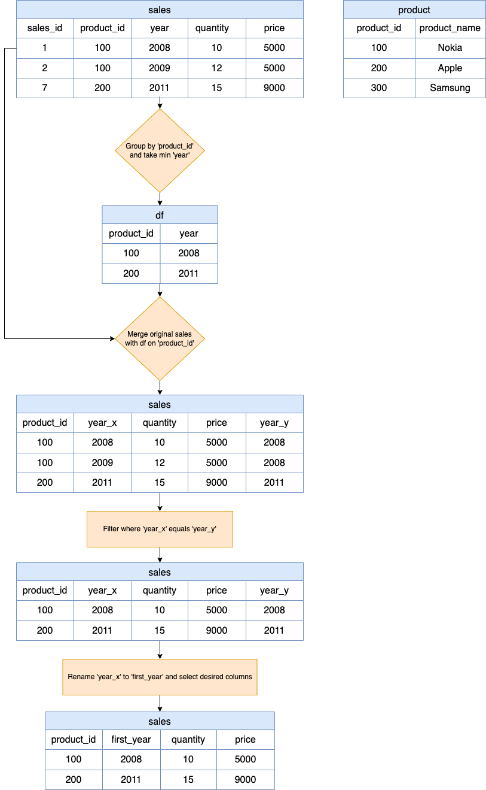

# Solution

---

## pandas
### Approach: Group-Merge-Filter

**Visualization of general idea**


#### Intuition

Let's break down this approach step by step using the following input DataFrames:

`sales`:

<table>
  <tr>
    <th>sale_id</th>
    <th>product_id</th>
    <th>year</th>
    <th>quantity</th>
    <th>price</th>
  </tr>
  <tr>
    <td>1</td>
    <td>100</td>
    <td>2008</td>
    <td>10</td>
    <td>5000</td>
  </tr>
  <tr>
    <td>2</td>
    <td>100</td>
    <td>2009</td>
    <td>12</td>
    <td>5000</td>
  </tr>
  <tr>
    <td>7</td>
    <td>200</td>
    <td>2011</td>
    <td>15</td>
    <td>9000</td>
  </tr>
</table>
<br>

`product`:

<table>
  <tr>
    <th>product_id</th>
    <th>product_name</th>
  </tr>
  <tr>
    <td>100</td>
    <td>Nokia</td>
  </tr>
  <tr>
    <td>200</td>
    <td>Apple</td>
  </tr>
  <tr>
    <td>300</td>
    <td>Samsung</td>
  </tr>
</table>
<br>

1. **Group By & Min**
   We start with grouping because it allows us to efficiently aggregate our sales data by product. By obtaining the minimum `year` for each $\text{product}_{id}$, we can swiftly pinpoint the debut sale year for each product.

   ```python
   df = sales.groupby('product_id', as_index=False)['year'].min()
   ```
   - This line groups the `sales` DataFrame by $\text{product}_{id}$ and selects the minimum `year` for each group, which signifies the first year a product was sold.
   - The resulting DataFrame `df` has columns $\text{product}_{id}$ and `year`.

`df` will be as follows:

<table>
  <tr>
    <th>product_id</th>
    <th>year</th>
  </tr>
  <tr>
    <td>100</td>
    <td>2008</td>
  </tr>
  <tr>
    <td>200</td>
    <td>2011</td>
  </tr>
</table>
<br>

2. **Merge DataFrames**
   Merging is a natural step after grouping, especially when you need to fetch related data based on the aggregated result. By merging on $\text{product}_{id}$, we ensure that we capture the entire sales record for the debut year.

   ```python
   sales.merge(df, on='product_id', how='inner')
   ```
   - This line merges the original `sales` DataFrame with the `df` DataFrame (containing the first year of sale for each product) based on the $\text{product}_{id}$ column.
   - Since an inner join is used, only the rows with matching $\text{product}_{id}$s in both DataFrames will be retained.

`sales` will look like:

<table>
  <tr>
    <th>product_id</th>
    <th>year_x</th>
    <th>quantity</th>
    <th>price</th>
    <th>year_y</th>
  </tr>
  <tr>
    <td>100</td>
    <td>2008</td>
    <td>10</td>
    <td>5000</td>
    <td>2008</td>
  </tr>
  <tr>
    <td>100</td>
    <td>2009</td>
    <td>12</td>
    <td>5000</td>
    <td>2008</td>
  </tr>
  <tr>
    <td>200</td>
    <td>2011</td>
    <td>15</td>
    <td>9000</td>
    <td>2011</td>
  </tr>
</table>
<br>

3. **Filter Rows**
  This is essential to eliminate any extraneous data, ensuring we only get the records from the debut year of the product. Without this step, we might get sales data from non-debut years, defeating the approach's purpose.

   ```python
   .query('year_x == year_y')
   ```
   - After the merge, the DataFrame will have two `year` columns, one from each of the original DataFrames, renamed as $\text{year}_{x}$ and $\text{year}_{y}$ by pandas.
   - This line filters the rows where $\text{year}_{x}$ (the original sale year) is equal to $\text{year}_{y}$ (the first year of sale), retaining only the sales information for the first year each product was sold.

`sales` will look like:

<table>
  <tr>
    <th>product_id</th>
    <th>year_x</th>
    <th>quantity</th>
    <th>price</th>
    <th>year_y</th>
  </tr>
  <tr>
    <td>100</td>
    <td>2008</td>
    <td>10</td>
    <td>5000</td>
    <td>2008</td>
  </tr>
  <tr>
    <td>200</td>
    <td>2011</td>
    <td>15</td>
    <td>9000</td>
    <td>2011</td>
  </tr>
</table>
<br>

4. **Rename Column & Select Columns**
   ```python
   .rename(columns={'year_x': 'first_year'})[['product_id', 'first_year', 'quantity', 'price']]
   ```
   - This line renames the $\text{year}_{x}$ column to $\text{first}_{year}$, making the DataFrame more understandable.
   - Finally, it selects only the desired columns, resulting in a DataFrame with columns: $\text{product}_{id}$, $\text{first}_{year}$, `quantity`, and `price`.

`sales` will be as follows:

<table>
  <tr>
    <th>product_id</th>
    <th>first_year</th>
    <th>quantity</th>
    <th>price</th>
  </tr>
  <tr>
    <td>100</td>
    <td>2008</td>
    <td>10</td>
    <td>5000</td>
  </tr>
  <tr>
    <td>200</td>
    <td>2011</td>
    <td>15</td>
    <td>9000</td>
  </tr>
</table>
<br>

5. **Return Result**
   - The final DataFrame, after all the transformations, is returned from the function.

Intuitively, this function is finding the first year of sale for each product and then fetching the corresponding sales information for those years.

#### Implementation

```python
import pandas as pd

def sales_analysis(sales: pd.DataFrame, product: pd.DataFrame) -> pd.DataFrame:
  df = sales.groupby('product_id', as_index=False)['year'].min()
  return sales.merge(df, on='product_id', how='inner')\
    .query('year_x == year_y')\
    .rename(columns={'year_x': 'first_year'})\
    [['product_id', 'first_year', 'quantity', 'price']]

```

---

## Database
### Approach: Filtering from Minimum Value Subquery

#### Intuition

Let's break down this approach step by step:

1. **Inner Subquery**:
   ```sql
   SELECT
     product_id,
     MIN(year) AS year
   FROM
     Sales
   GROUP BY
     product_id
   ```
   - The inner subquery is grouping the `Sales` table by $\text{product}_{id}$.
   - For each $\text{product}_{id}$, it's finding the minimum `year`, i.e., the first year a product was sold.
   - This subquery returns a list of $\text{product}_{id}$s along with the corresponding first year they were sold.

2. **Main Query**:
   ```sql
   SELECT
     product_id,
     year AS first_year,
     quantity,
     price
   FROM
     Sales
   WHERE
     (product_id, year) IN (subquery)
   ```
   - The main query is selecting $\text{product}_{id}$, `year`, `quantity`, and `price` from the `Sales` table.
   - The `WHERE` clause is using a condition $(\text{product}_{id}, year) IN (subquery)$. This means it's filtering the rows from the `Sales` table where the combination of $\text{product}_{id}$ and `year` is present in the list generated by the subquery.
   - Essentially, this condition ensures that only the rows corresponding to the first year of sale for each product are returned.

3. **Result**:
   - The final result of this query is a table containing the $\text{product}_{id}$, the $\text{first}_{year}$ a product was sold, the `quantity` sold, and the `price` per unit for that year.

Intuitively, what the query does is that it first identifies the first year each product was sold using the inner subquery, and then it fetches the corresponding $\text{product}_{id}$, `year`, `quantity`, and `price` for those identified years from the main `Sales` table using the main query.

#### Implementation

```mysql []
SELECT
  product_id,
  year AS first_year,
  quantity,
  price
FROM
  Sales
WHERE
  (product_id, year) IN (
    SELECT
      product_id,
      MIN(year) AS year
    FROM
      Sales
    GROUP BY
      product_id
  );
```