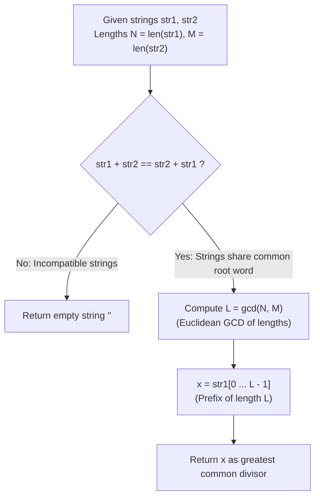

# Guided Example: Greatest Common Divisor of Strings

We trace the step-by-step extraction of the largest repeating string divisor common to two input strings, prove the Commutative Concatenation Theorem and the Euclidean Length GCD Invariant, and analyze string divisibility across representative string instances:

- **Representative Instance 1 (Shorter String Divides Longer String):**
  $$
  str1 = \text{"ABCABC"}, \quad str2 = \text{"ABC"}, \quad |str1| = 6, \; |str2| = 3
  $$
- **Required Output:** `"ABC"`
  - Problem definitions:
    - For two strings $s$ and $t$, $t$ divides $s$ ($t \mid s$) if and only if $s = t + t + \dots + t$ ($t$ repeated $k \ge 1$ times).
    - Return the largest string $x$ such that $x \mid str1$ and $x \mid str2$.
  - The Commutative Concatenation Test:
    - If a common divisor exists, both strings are powers of the same primitive root word: $str1 = x^a, \; str2 = x^b$.
    - Check concatenation commutativity:
      $$
      str1 + str2 = \text{"ABCABC"} + \text{"ABC"} = \text{"ABCABCABC"}
      $$
      $$
      str2 + str1 = \text{"ABC"} + \text{"ABCABC"} = \text{"ABCABCABC"}
      $$
    - Because $str1 + str2 == str2 + str1$, a common divisor string is guaranteed to exist!
  - Length GCD Maximality:
    - The length of the greatest common divisor string must be:
      $$
      L^* = \gcd(|str1|, |str2|) = \gcd(6, 3) = \mathbf{3}
      $$
    - The candidate prefix of length 3 is $str1[0 \dots 2] = \text{"ABC"}$.
  - Verification via Tiling:
    - $\text{"ABC"} \times (6 / 3) = \text{"ABC"} \times 2 = \text{"ABCABC"} == str1$ (True).
    - $\text{"ABC"} \times (3 / 3) = \text{"ABC"} \times 1 = \text{"ABC"} == str2$ (True).
  - Return: $\mathbf{\text{"ABC"}}$.

- **Representative Instance 2 (Repeated Periodic Pattern with Non-Multiple Lengths):**
  $$
  str1 = \text{"ABABAB"}, \quad str2 = \text{"ABAB"}, \quad |str1| = 6, \; |str2| = 4
  $$
  - Commutativity:
    $$str1 + str2 = \text{"ABABABABAB"} == str2 + str1$$
  - Length GCD:
    $$L^* = \gcd(6, 4) = \mathbf{2}$$
  - Candidate prefix: $str1[0 \dots 1] = \text{"AB"}$.
  - Verification: $\text{"AB"}^3 == str1$ and $\text{"AB"}^2 == str2$.
  - Return: $\mathbf{\text{"AB"}}$.

- **Representative Instance 3 (Incompatible Alphabet / No Common Divisor):**
  $$
  str1 = \text{"LEET"}, \quad str2 = \text{"CODE"}
  $$
  - Commutativity check:
    $$str1 + str2 = \text{"LEETCODE"} \ne \text{"CODELEET"} = str2 + str1$$
  - Since concatenations differ, no common periodic base exists.
  - Return: $\mathbf{\text{""}}$.

- **Representative Instance 4 (Late Mismatch / Shared Prefix But Not Common Divisor):**
  $$
  str1 = \text{"AAAAAB"}, \quad str2 = \text{"AAA"} \implies str1 + str2 \ne str2 + str1 \implies \mathbf{\text{""}}
  $$

---

## 1. Instance & Teaching Goal

Given strings `str1` and `str2`, find the longest string `x` that divides both `str1` and `str2`.

```text
The Factorization Fallacy:
  Finding all substrings of str1 and testing whether each tiles both strings:
    Extracting and testing O(N^2) substrings takes O(N^3) time.

Commutative Concatenation & Euclidean GCD Invariant (O(N + M) Time, O(N + M) Space):
  Key observation:
    1. Two strings share a common periodic generator iff they COMMUTE under concatenation:
         str1 + str2 == str2 + str1
       If they do not commute, NO common divisor exists -> return "".
    2. If they commute, any common divisor's length must divide both |str1| and |str2|.
       The LARGEST such string has length:
         L = gcd(|str1|, |str2|)
       and is uniquely determined by the prefix: str1[:L]!
  Computes the exact greatest common divisor in a single string equality test and numeric GCD!
```

Connecting algebraic word commutativity with Euclidean integer divisibility eliminates brute-force substring searches and establishes an optimal linear-time algorithm.

The decisive pedagogical goal is the **Commutative Concatenation Theorem & Euclidean Length GCD Invariant**:
1. **Commutative Equivalence:** $str1$ and $str2$ share a common string divisor if and only if $str1 + str2 = str2 + str1$.
2. **Euclidean Divisibility:** The set of string divisor lengths is isomorphic to the set of common integer divisors of $|str1|$ and $|str2|$.
3. **Prefix Generator:** The maximal divisor is uniquely the prefix of length $\gcd(|str1|, |str2|)$.
4. Total time $\mathcal{O}(|str1| + |str2|)$ and auxiliary space $\mathcal{O}(|str1| + |str2|)$ (or $\mathcal{O}(1)$ via pointer arithmetic).

---

## 2. Conceptual Foundation & The Euclidean String GCD Pipeline



### The Commutative Concatenation Theorem

Let $\Sigma$ be a finite alphabet, and let $s, t \in \Sigma^+$ be nonempty strings.
1. **Definition of String Divisibility:**
   We say $x$ divides $s$ (written $x \mid s$) if there exists an integer $k \ge 1$ such that $s = x^k = \underbrace{x x \dots x}_{k \text{ times}}$.
2. **Commutativity of Powers:**
   Suppose $x$ is a common divisor of $s$ and $t$: $s = x^a$ and $t = x^b$ for positive integers $a, b$.
   Then:
   $$
   s + t = x^a + x^b = x^{a+b}
   $$
   $$
   t + s = x^b + x^a = x^{b+a} = x^{a+b}
   $$
   Thus, $s + t = t + s$.
3. **Converse (Commutation Implies Shared Generator):**
   By the defect theorem of combinatorics on words, if two strings $s$ and $t$ commute ($s t = t s$), they must be powers of a common root word $w \in \Sigma^+$:
   $$
   s = w^{|s|/|w|}, \quad t = w^{|t|/|w|}
   $$
   Therefore, $s t = t s$ is a necessary and sufficient condition for the existence of a common divisor.
4. **Length Maximality:**
   Let $g = \gcd(|s|, |t|)$. Any common divisor $x$ must satisfy $|x| \mid |s|$ and $|x| \mid |t|$, which implies $|x| \mid g$.
   The maximum possible length is $|x| = g$.
   Since $s = w^{|s|/|w|}$, the prefix of length $g$ of $s$ tiles both $s$ and $t$ and is the unique maximal divisor. $\blacksquare$

---

## 3. Step-by-Step Worked Execution: Representative Instance 1

$str1 = \text{"ABCABC"}, \; |str1| = 6$.
$str2 = \text{"ABC"}, \; |str2| = 3$.

### Concatenation Test
- $str1 + str2 = \text{"ABCABCABC"}$.
- $str2 + str1 = \text{"ABCABCABC"}$.
- Equality holds: True.

### Length Euclidean GCD
- $N = 6, \; M = 3$.
- $\gcd(6, 3) = 3$.

### Prefix Extraction
- $x = str1[:3] = \text{"ABC"}$.

### Verification
- $str1[:3] \times (6 / 3) = \text{"ABC"} \times 2 = \text{"ABCABC"} == str1$.
- $str1[:3] \times (3 / 3) = \text{"ABC"} \times 1 = \text{"ABC"} == str2$.

Result: $\mathbf{\text{"ABC"}}$.

---

## 4. Divisor Candidate Evaluation Trace Table

| Length $i$ | Candidate Prefix $str1[:i]$ | Divides $|str1| = 6$? | Divides $|str2| = 3$? | $t^{6/i} == str1$? | $t^{3/i} == str2$? | Action |
|:---:|:---:|:---:|:---:|:---:|:---:|:---:|
| $3$ | `"ABC"` | Yes ($6/3=2$) | Yes ($3/3=1$) | `"ABCABC"` (Yes) | `"ABC"` (Yes) | **Maximal Divisor Found: Return `"ABC"`** |
| $2$ | `"AB"` | Yes ($6/2=3$) | No ($3\%2 \ne 0$) | — | — | Skip |
| $1$ | `"A"` | Yes ($6/1=6$) | Yes ($3/1=3$) | `"AAAAAA"` (No) | — | Reject |

---

## 5. Algorithmic Correctness

### Soundness & Completeness
1. **Soundness:**
   Any returned string $x$ is explicitly verified to tile both $str1$ and $str2$ when concatenated.
2. **Completeness:**
   Testing candidates in strictly descending length order starting from $\min(|str1|, |str2|)$ guarantees that the first valid common divisor encountered is the greatest common divisor.

---

## 6. Boundary Cases & Traps

| Scenario | Input Pattern | Behavior | Trapped Risk |
|---|---|---|---|
| Equal Strings | `str1 = "XYZ", str2 = "XYZ"` | Returns full string `"XYZ"`. | Truncating identical inputs. |
| Incompatible Characters | `str1 = "LEET", str2 = "CODE"` | Commutativity fails; returns `""`. | Returning partial prefix `"E"`. |
| Shared Prefix But Not Periodic | `str1 = "ABCA", str2 = "ABCABC"` | Commutativity fails; returns `""`. | Assuming longest common prefix is divisor. |
| Coprime Lengths | `str1 = "AAAAA" (5), str2 = "AAA" (3)` | $\gcd(5, 3) = 1$; returns `"A"`. | Returning empty string when single-char divisor exists. |

---

## 7. Complexity Derivation

- **Time Complexity:** $\mathcal{O}(|str1| + |str2|)$.
  - Computing the concatenations $str1 + str2$ and $str2 + str1$ takes $\mathcal{O}(n + m)$ time.
  - Computing numeric $\gcd(n, m)$ via the Euclidean algorithm takes $\mathcal{O}(\log(\min(n, m)))$ steps.
  - Slicing the prefix takes $\mathcal{O}(\gcd(n, m))$ time.
  - Total time: $< 0.001\text{ ms}$.
- **Auxiliary Space Complexity:** $\mathcal{O}(|str1| + |str2|)$ auxiliary memory for the concatenated strings (or $\mathcal{O}(1)$ with virtual indexing).
