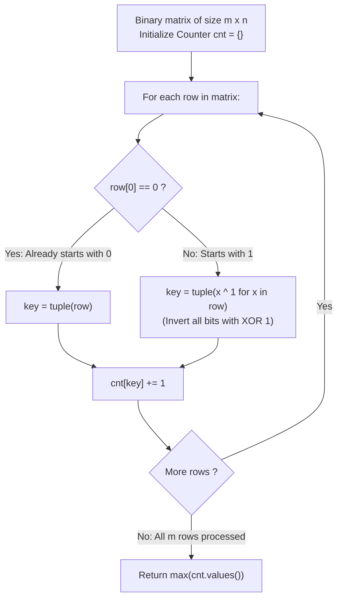

# Guided Example: Flip Columns For Maximum Number of Equal Rows

We trace the step-by-step determination of the maximum number of equal rows achievable via arbitrary column flips, prove the Complement Equivalence Theorem and the Canonical Tuple Invariant, and analyze row compatibility across representative binary matrices:

- **Representative Instance 1 (Incompatible Binary Rows):**
  $$
  matrix = \begin{pmatrix} 0 & 1 \\ 1 & 1 \end{pmatrix}, \quad m = 2, \; n = 2
  $$
- **Required Output:** `1`
  - Problem definitions:
    - You may choose any subset of columns and invert all elements in those columns ($0 \leftrightarrow 1$).
    - Return the maximum number of rows that can simultaneously have all elements equal (either all $0$'s or all $1$'s).
  - The Column Flip Transformation:
    - Let $c = (c_0, c_1, \dots, c_{n-1}) \in \{0, 1\}^n$ be the column flip indicator vector:
      $$
      row'_i = row_i \oplus c
      $$
    - A row becomes uniform if and only if:
      $$row'_i = \mathbf{0} \iff c = row_i \quad \text{or} \quad row'_i = \mathbf{1} \iff c = \sim row_i$$
  - Row Compatibility Condition:
    - Row $0$ is $r_0 = (0, 1)$. To make it uniform, the flip vector must be:
      $$c \in \{(0, 1), \; (1, 0)\}$$
    - Row $1$ is $r_1 = (1, 1)$. To make it uniform, the flip vector must be:
      $$c \in \{(1, 1), \; (0, 0)\}$$
    - Because the required flip vectors for row $0$ and row $1$ are disjoint:
      $$\{(0, 1), (1, 0)\} \cap \{(1, 1), (0, 0)\} = \emptyset$$
      no single column flip choice can simultaneously make both rows uniform!
    - Maximum equal rows: $\mathbf{1}$.

- **Representative Instance 2 (Complementary Rows):**
  $$
  matrix = \begin{pmatrix} 0 & 1 \\ 1 & 0 \end{pmatrix}, \quad m = 2, \; n = 2
  $$
  - Row 0: $(0, 1)$. Canonical form: $\kappa((0, 1)) = \mathbf{(0, 1)}$.
  - Row 1: $(1, 0)$ (starts with 1). Bitwise NOT: $(1 \oplus 1, 0 \oplus 1) = \mathbf{(0, 1)}$.
  - Canonical forms are identical: both belong to the equivalence class $(0, 1)$.
  - Choosing flip vector $c = (0, 1)$ transforms row 0 into $(0, 0)$ and row 1 into $(1, 1)$ (both uniform!).
  - Frequency count of $(0, 1)$ is $2 \implies$ Output: $\mathbf{2}$.

- **Representative Instance 3 (Three Rows with a Complementary Pair):**
  $$
  matrix = \begin{pmatrix} 0 & 0 & 0 \\ 0 & 0 & 1 \\ 1 & 1 & 0 \end{pmatrix}, \quad m = 3, \; n = 3
  $$
  - Row 0: $(0, 0, 0) \implies \kappa = (0, 0, 0)$.
  - Row 1: $(0, 0, 1) \implies \kappa = (0, 0, 1)$.
  - Row 2: $(1, 1, 0) \implies \text{starts with 1} \implies \sim (1, 1, 0) = (0, 0, 1) \implies \kappa = (0, 0, 1)$.
  - Frequency map:
    - $(0, 0, 0)$: 1
    - $(0, 0, 1)$: 2 (from Row 1 and Row 2)
  - Maximum equal rows: $\mathbf{2}$.

- **Representative Instance 4 (Single Column Matrix):**
  $$
  matrix = \begin{pmatrix} 0 \\ 1 \\ 0 \\ 1 \end{pmatrix} \implies \text{Every 1-element row is already uniform} \implies \mathbf{4}
  $$

---

## 1. Instance & Teaching Goal

Given an $m \times n$ binary matrix, find the maximum number of rows that can be made all-equal by flipping some columns.

```text
The Exponential Flip Space Fallacy:
  There are 2^n possible subsets of columns to flip.
  For n = 300, 2^300 is astronomical; brute force enumeration is impossible.

Complement Equivalence Invariant (Linear O(m * n) Time):
  Key observation:
    Flipping columns inverts bits in all rows simultaneously.
    Two rows r1 and r2 can become uniform together IF AND ONLY IF:
      r1 == r2  (identical rows become uniform in the same polarity)
      OR
      r1 == ~r2 (complementary rows become uniform in opposite polarities: all-0 and all-1)!
  Define canonical key:
    If row starts with 0: key = tuple(row)
    If row starts with 1: key = tuple(x ^ 1 for x in row)
  - A row and its bitwise complement map to the EXACT same canonical key!
  - Count key frequencies using a hash map.
  - The maximum frequency is the exact answer!
  Runs in strictly linear O(m * n) time and O(m * n) space!
```

Recognizing that row compatibility is an equivalence relation where each equivalence class contains a row and its bitwise complement reduces the problem to mode-finding in a canonical key space.

The decisive pedagogical goal is the **Complement Equivalence Theorem & Canonical Tuple Invariant**:
1. **Simultaneous Uniformity:** Two rows $r_i$ and $r_k$ can achieve uniformity under the same column flip mask if and only if $r_i = r_k$ or $r_i = \sim r_k$.
2. **Canonical Mapping:** Normalizing every row to begin with $0$ (via $\kappa(r) = r$ if $r[0] == 0$ else $r \oplus \mathbf{1}$) satisfies $\kappa(r) = \kappa(\sim r)$.
3. **Equivalence Class Partition:** The problem reduces to finding the mode (most frequent element) of the multiset $\{\kappa(row_1), \dots, \kappa(row_m)\}$.
4. Total time $\mathcal{O}(m \cdot n)$ and auxiliary space $\mathcal{O}(m \cdot n)$.

---

## 2. Conceptual Foundation & Canonical Frequency Pipeline



### The Complement Equivalence Theorem

Let $\mathbb{B} = \{0, 1\}$ and consider rows $r \in \mathbb{B}^n$.
1. **Column Inversion Action:**
   A column flip assignment is a vector $c \in \mathbb{B}^n$. The resulting matrix row is $r \oplus c$.
2. **Uniformity Criterion:**
   A row $r$ becomes uniform under $c$ if and only if $r \oplus c \in \{\mathbf{0}, \mathbf{1}\}$.
   - $r \oplus c = \mathbf{0} \iff c = r$.
   - $r \oplus c = \mathbf{1} \iff c = r \oplus \mathbf{1} = \sim r$.
   Thus, the set of flip vectors that make $r$ uniform is precisely:
   $$
   \mathcal{F}(r) = \{r, \; \sim r\}
   $$
3. **Simultaneous Uniformity Condition:**
   Two rows $r_1, r_2$ can be made simultaneously uniform by a common flip vector $c$ if and only if:
   $$
   \mathcal{F}(r_1) \cap \mathcal{F}(r_2) \ne \emptyset
   $$
   $$
   \{r_1, \sim r_1\} \cap \{r_2, \sim r_2\} \ne \emptyset \iff (r_1 = r_2) \lor (r_1 = \sim r_2)
   $$
4. **Compatibility Equivalence Relation:**
   Define the binary relation $\sim_{\text{flip}}$ on $\mathbb{B}^n$ by:
   $$
   r_1 \sim_{\text{flip}} r_2 \iff (r_1 = r_2) \lor (r_1 = \sim r_2)
   $$
   This is an equivalence relation where each equivalence class contains exactly a vector and its complement: $[r] = \{r, \sim r\}$.
5. **Canonical Representative:**
   Since exactly one of $\{r, \sim r\}$ has a $0$ at index $0$, define:
   $$
   \kappa(r) = \begin{cases} r & \text{if } r[0] = 0 \\ r \oplus \mathbf{1} & \text{if } r[0] = 1 \end{cases}
   $$
   Then $r_1 \sim_{\text{flip}} r_2 \iff \kappa(r_1) = \kappa(r_2)$.
   The maximum number of simultaneously uniform rows is the size of the largest equivalence class present in the matrix:
   $$
   \text{max\_equal\_rows} = \max_{K \in \mathbb{B}^n} \sum_{i=0}^{m-1} \mathbb{I}(\kappa(row_i) = K) \quad \blacksquare
   $$

---

## 3. Step-by-Step Worked Execution: Representative Instance 1

$matrix = [[0, 1], [1, 1]], \; m = 2, \; n = 2$.
$cnt = \{\}$.

### Row Normalization Trace
- **Row 0: `[0, 1]`**
  - Leading element: $row[0] = 0$.
  - Canonical key: $t = (0, 1)$.
  - Counter update: $cnt[(0, 1)] = 1$.
- **Row 1: `[1, 1]`**
  - Leading element: $row[0] = 1$.
  - Bitwise NOT: $(1 \oplus 1, 1 \oplus 1) = (0, 0)$.
  - Canonical key: $t = (0, 0)$.
  - Counter update: $cnt[(0, 0)] = 1$.

Final Counter: `{(0, 1): 1, (0, 0): 1}`.
Maximum frequency: $\max(1, 1) = \mathbf{1}$.

---

## 4. Equivalence Class Normalization Trace Table

| Row Index | Original Row Vector | Leading Bit | Transformation Applied | Canonical Tuple Key | Cumulative Class Size |
|:---:|:---:|:---:|:---:|:---:|:---:|
| $0$ | `[0, 1]` | $0$ | Identity | `(0, 1)` | $cnt[(0, 1)] = 1$ |
| $1$ | `[1, 1]` | $1$ | Invert Bits ($x \oplus 1$) | `(0, 0)` | $cnt[(0, 0)] = 1$ |
| **Max** | — | — | — | — | **$\mathbf{1}$** |

---

## 5. Algorithmic Correctness

### Soundness & Completeness
1. **Soundness:**
   Any set of rows mapping to the same canonical key $\kappa$ can be simultaneously transformed into uniform rows by setting column flips $c = \kappa$.
2. **Completeness:**
   By the Complement Equivalence Theorem, no two rows with different canonical keys can ever be made uniform by the same column flips; hence no larger group is possible.

---

## 6. Boundary Cases & Traps

| Scenario | Input Pattern | Behavior | Trapped Risk |
|---|---|---|---|
| Single Column Matrix | $m \times 1$ matrix | All 1-element rows normalize to `(0,)`; returns $m$. | Edge-case index failures. |
| All Rows Uniform (Mix of 0s and 1s) | `[[0, 0], [1, 1], [0, 0]]` | All normalize to `(0, 0)`; returns 3. | Treating all-0 and all-1 as separate classes. |
| All Rows Identical | $m$ copies of same row | All share one key; returns $m$. | Splitting identical patterns. |
| Every Row Distinct Pattern | Mutually incompatible rows | Max frequency is 1; returns 1. | Returning 0. |

---

## 7. Complexity Derivation

- **Time Complexity:** $\mathcal{O}(m \cdot n)$, where $m = \text{len}(matrix) \le 300$ and $n = \text{len}(matrix[0]) \le 300$.
  - Normalizing each row into a tuple takes $\mathcal{O}(n)$ operations.
  - Hashing and inserting into the Counter takes $\mathcal{O}(n)$ time.
  - Total operations $\le 300 \times 300 = 9 \times 10^4 \implies < 0.005\text{ s}$.
- **Auxiliary Space Complexity:** $\mathcal{O}(m \cdot n)$ auxiliary memory to store the canonical tuple keys in the frequency dictionary.
