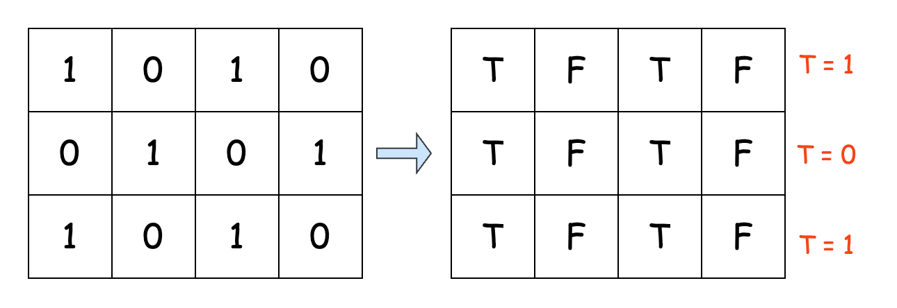

## Solution

---

### Approach 1: Brute Force

#### Intuition

Our task is to make as many rows as possible in the matrix consist of identical values (either all 0s or all 1s) using only one type of move: flipping entire columns.

On closer inspection, you will see there are only two possible scenarios to look out for:

For the first, let's consider a 3 x 3 grid:
```
+---+---+---+
| 0 | 1 | 0 |
+---+---+---+
| 0 | 1 | 0 |
+---+---+---+
| 1 | 1 | 0 |
+---+---+---+
```

We can see from this grid that flipping columns to make the first row uniform will make the second row uniform, as well. However, the third row remains non-uniform since it does not match the first row.

Now, let's look at our second scenario:
```
+---+---+---+---+
| 0 | 1 | 0 | 0 |
+---+---+---+---+
| 1 | 0 | 1 | 1 |
+---+---+---+---+
| 0 | 1 | 0 | 0 |
+---+---+---+---+
| 0 | 1 | 1 | 0 |
+---+---+---+---+
```

The first two rows are perfect opposites. Flipping the second column to make the first row uniform will have the positive side effect of making the values in the second row uniform, as well. Additionally, as in the first scenario, the third row will now become uniform. However, the fourth row remains non-uniform since it is neither identical nor exactly opposite.

This means that our answer boils down to this: the rows that can be made uniform (all values in the row are the same) after flipping will be the combined total of rows that are identical and rows that are exactly opposite.

We'll loop over each row in the given matrix to determine which approach is best. For each row, we count the number of other rows in the matrix that are exactly the same and that are exactly opposite. The highest count across all rows will be our answer.

#### Algorithm

- Initialize a variable:
  - `numCols` to store the number of columns in the matrix by accessing the length of the first row.
  - `maxIdenticalRows` to track the maximum count of identical rows found so far.
- Iterate through each row `currentRow` of the matrix:
  - Initialize:
- an array `flippedRow` of size `numCols` to store the flipped version of the current row.
- a counter `identicalRowCount` to track rows matching either the current pattern or its flipped version.
  - Create the flipped version by iterating through each column:
- Set each element of `flippedRow` to the complement (1 - value) of the corresponding element in `currentRow`.
  - Iterate through each row of the matrix again as `compareRow`:
- Compare `compareRow` with both `currentRow` and `flippedRow`.
- If `compareRow` matches either pattern, increment `identicalRowCount`.
  - Update `maxIdenticalRows` to the larger value between itself and `identicalRowCount`.
- Return `maxIdenticalRows` as the final result.

#### Implementation

```python
class Solution:
    def maxEqualRowsAfterFlips(self, matrix: List[List[int]]) -> int:
        num_cols = len(matrix[0])
        max_identical_rows = 0

        for current_row in matrix:
            # Create flipped version using list comprehension
            flipped_row = [1 - x for x in current_row]

            # Count matching rows using list comprehension and sum
            identical_row_count = sum(
                1
                for compare_row in matrix
                if compare_row == current_row or compare_row == flipped_row
            )

            max_identical_rows = max(max_identical_rows, identical_row_count)

        return max_identical_rows
```

#### Complexity Analysis

Let $n$ be the number of rows and $m$ be the number of columns in the matrix.

- Time complexity: $O(n^2 \cdot m)$

    The outer loop iterates through each row of the matrix. For each row, the algorithm creates its flipped version ($m$ operations) and then compares it with every other row in the matrix ($n$ comparisons, each requiring $m$ operations for array comparison).

    Thus, the total time complexity of the algorithm is $O(n \cdot n \cdot m) = O(n^2 \cdot m)$.

- Space complexity: $O(m)$

    The only additional space used is for storing the `flippedRow` array, which has a length equal to $m$.

    Thus, the space complexity is $O(m)$.

---

### Approach 2: Hash Map

#### Intuition

Notice that a row and its complement actually form the same pattern, just with opposite digits. To illustrate this, let's take the 2 x 2 grid again:

```
+---+---+
| 0 | 1 |
+---+---+
| 1 | 0 |
+---+---+
```

To represent the pattern in a more abstract way, let's use 'T' for the first digit in each row and 'F' for its opposite. In the first row, 'T' stands for 0, while in the second row, 'T' stands for 1. Essentially, we are replacing every number in a row with a symbol signifying whether the number is equal to the first number in the grid. If we rewrite our grid using these symbols, it becomes a bit easier to see the underlying structure.

```
+---+---+
| T | F |   // T = 0
+---+---+
| T | F |   // T = 1
+---+---+
```

This means that if we replace each row with a unique pattern that represents it, then identical and even complementary rows will share the same pattern. The below illustration visualizes this concept:



So, our task simplifies to just finding the pattern that shows up the most often. To do this, we’ll go through each row in the matrix, converting it into its pattern string. Then, we’ll use a map called `patternFrequency` to keep track of how many times each pattern appears. Once we’ve done that, we’ll just look through all the values in the map, find the highest frequency, and return that as our answer.

#### Algorithm

- Initialize a map `patternFrequency` to store patterns and their frequencies.
- Iterate through each row `currentRow` of the matrix:
  - Initialize a string `patternBuilder` to construct the pattern.
  - For each element in the row:
- Compare it with the first element of the row.
- Append 'T' to the pattern if the current element matches the first element.
- Append 'F' to the pattern if the current element differs from the first element.
  - Convert the constructed pattern to a string `rowPattern`.
  - Update the frequency of `rowPattern` in the map.
- Initialize a variable `maxFrequency` to track the highest frequency found.
- Iterate through all frequencies in the map:
  - Update `maxFrequency` to the larger value between itself and current frequency.
- Return `maxFrequency` as the final result.

#### Implementation

```python
class Solution:
    def maxEqualRowsAfterFlips(self, matrix: List[List[int]]) -> int:
        # Dictionary to store frequency of each pattern
        pattern_frequency = {}

        for current_row in matrix:
            # Convert row to pattern using list comprehension and join
            # 'T' if element matches first element, 'F' otherwise
            row_pattern = "".join(
                "T" if num == current_row[0] else "F" for num in current_row
            )

            # Update pattern frequency using dict.get() with default value
            pattern_frequency[row_pattern] = (
                pattern_frequency.get(row_pattern, 0) + 1
            )

        # Return maximum frequency using max() with default of 0
        return max(pattern_frequency.values(), default=0)
```

#### Complexity Analysis

Let $n$ be the number of rows and $m$ be the number of columns in the matrix.

* Time complexity: $O(n \cdot m)$

    The outer loop iterates through each of the $n$ rows in the matrix. For each row, we create a pattern by examining each element of the row, which takes $m$ operations.

    The final loop through the map is bounded by $n$ as there cannot be more unique patterns than rows.

    Thus, the total time complexity is $O(n \cdot m + n)$ = $O(n \cdot m)$.

* Space complexity: $O(n \cdot m)$

    The `patternFrequency` map stores the patterns as keys and their frequencies as values. The length of each pattern is $m$ and there can be at most $n$ unique patterns (equal to the number of rows).

    Thus, the space complexity is $O(n \cdot m)$.

---