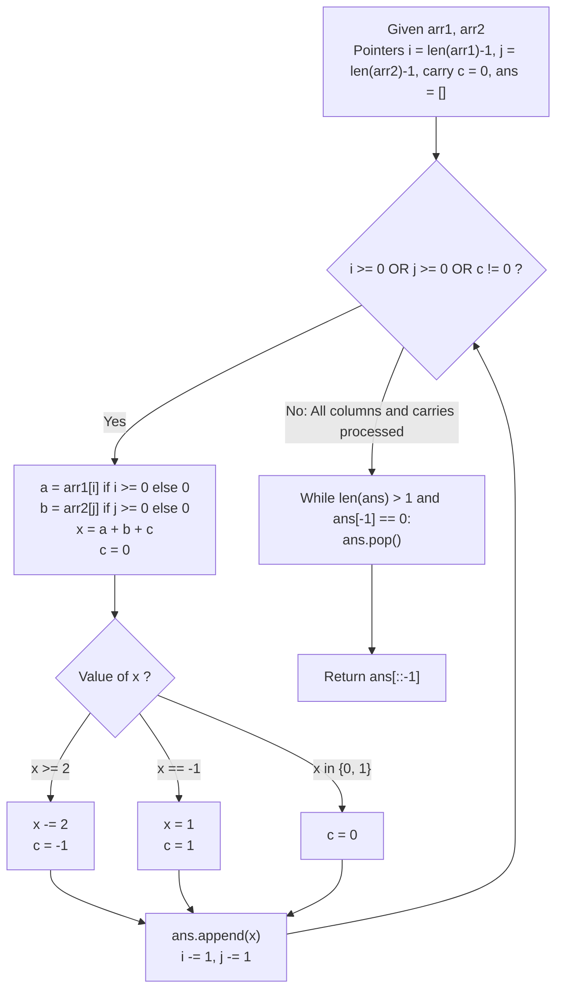

# Guided Example: Adding Two Negabinary Numbers

We trace the column-by-column addition of two numbers in base $-2$ (negabinary), prove the Alternating Base-2 Carry Theorem and the Quotient-Remainder Canonical Normalization Lemma, and evaluate arithmetic propagation across representative negabinary inputs:

- **Representative Instance 1 (Mixed Positive and Negative Base Carries):**
  $$
  arr1 = [1, 1, 1, 1, 1], \quad arr2 = [1, 0, 1]
  $$
- **Required Output:** `[1, 0, 0, 0, 0]`
  - Problem definitions:
    - In base $-2$, an array $A = (a_{L-1}, \dots, a_1, a_0)$ represents the integer:
      $$
      V(A) = \sum_{k=0}^{L-1} a_k (-2)^k, \quad a_k \in \{0, 1\}
      $$
    - Compute $arr1 + arr2$ in base $-2$ without leading zeros (except for $[0]$).
  - Decimal Verification of Operands:
    - $V(arr1) = 1(-2)^4 + 1(-2)^3 + 1(-2)^2 + 1(-2)^1 + 1(-2)^0 = 16 - 8 + 4 - 2 + 1 = \mathbf{11}$
    - $V(arr2) = 1(-2)^2 + 0(-2)^1 + 1(-2)^0 = 4 - 0 + 1 = \mathbf{5}$
    - Target Sum: $11 + 5 = \mathbf{16}$
    - In base $-2$: $16 = 1 \cdot (-2)^4 + 0 \cdot (-2)^3 + 0 \cdot (-2)^2 + 0 \cdot (-2)^1 + 0 \cdot (-2)^0 = \mathbf{[1, 0, 0, 0, 0]}$.
  - The Inverted Base $-2$ Carry Principle:
    - At column $k$, the weight is $(-2)^k$. At column $k+1$, the weight is $(-2)^{k+1} = -2 \cdot (-2)^k$.
    - Therefore, an excess of $+2$ units at column $k$ requires carrying **$-1$** to column $k+1$:
      $$
      +2 \cdot (-2)^k = (-1) \cdot (-2)^{k+1}
      $$
    - Conversely, a deficit of $-1$ at column $k$ is resolved by:
      $$
      -1 \cdot (-2)^k = 1 \cdot (-2)^k + 1 \cdot (-2)^{k+1}
      $$
      leaving digit $1$ at column $k$ and carrying **$+1$** to column $k+1$!
  - Column Addition Trace (from Least Significant Bit $k = 0$):
    1. **Column $k = 0$:**
       - $a_0 = 1, \; b_0 = 1, \; c_0 = 0$.
       - Sum: $x = 1 + 1 + 0 = 2$.
       - $x \ge 2 \implies d_0 = x - 2 = \mathbf{0}, \; c_1 = -\mathbf{1}$.
    2. **Column $k = 1$:**
       - $a_1 = 1, \; b_1 = 0, \; c_1 = -1$.
       - Sum: $x = 1 + 0 + (-1) = 0$.
       - $x \in \{0, 1\} \implies d_1 = \mathbf{0}, \; c_2 = \mathbf{0}$.
    3. **Column $k = 2$:**
       - $a_2 = 1, \; b_2 = 1, \; c_2 = 0$.
       - Sum: $x = 1 + 1 + 0 = 2$.
       - $x \ge 2 \implies d_2 = x - 2 = \mathbf{0}, \; c_3 = -\mathbf{1}$.
    4. **Column $k = 3$:**
       - $a_3 = 1, \; b_3 = 0, \; c_3 = -1$.
       - Sum: $x = 1 + 0 + (-1) = 0$.
       - $x \in \{0, 1\} \implies d_3 = \mathbf{0}, \; c_4 = \mathbf{0}$.
    5. **Column $k = 4$:**
       - $a_4 = 1, \; b_4 = 0, \; c_4 = 0$.
       - Sum: $x = 1 + 0 + 0 = 1$.
       - $x \in \{0, 1\} \implies d_4 = \mathbf{1}, \; c_5 = \mathbf{0}$.
    6. **Termination:**
       - Both arrays exhausted, $c_5 = 0$.
  - Reversing accumulated digits $[d_0, d_1, d_2, d_3, d_4] = [0, 0, 0, 0, 1]$ yields:
    $$
    [\mathbf{1, 0, 0, 0, 0}]
    $$

- **Representative Instance 2 (Single Bit Carry Ripple $1 + 1$):**
  $$
  arr1 = [1], \quad arr2 = [1]
  $$
  - $k = 0$: $x = 1 + 1 = 2 \implies d_0 = 0, \; c_1 = -1$.
  - $k = 1$: $x = 0 + 0 + (-1) = -1 \implies d_1 = 1, \; c_2 = +1$.
  - $k = 2$: $x = 0 + 0 + 1 = 1 \implies d_2 = 1, \; c_3 = 0$.
  - Output: `[1, 1, 0]` ($1(-2)^2 + 1(-2)^1 + 0 = 4 - 2 = 2$).

- **Representative Instance 3 (Zero Plus Zero):**
  $$
  arr1 = [0], \quad arr2 = [0] \implies \mathbf{[0]}
  $$

- **Representative Instance 4 (Negative Two Plus One):**
  $$
  arr1 = [1, 0] \; (-2), \quad arr2 = [1] \; (1) \implies \text{Sum } -1 \implies \mathbf{[1, 1]} \; ((-2)^1 + (-2)^0 = -2 + 1 = -1)
  $$

---

## 1. Instance & Teaching Goal

Given two binary arrays representing integers in base $-2$, compute their sum in base $-2$.

```text
The Decimal Conversion Fallacy:
  Converting base -2 arrays to arbitrary-precision integers and re-encoding:
    Negabinary string parsing and sign tracking adds large memory allocation.
    Array lengths up to 1000 can produce numbers with hundreds of digits.

Direct Column-Wise Negabinary Arithmetic Invariant:
  In base B = -2, the column multiplier is negative: (-2)^(k+1) = -2 * (-2)^k.
  Therefore:
    Every excess +2 at position k carries -1 to position k + 1.
    Every deficit -1 at position k produces a digit 1 and carries +1 to position k + 1.
  Unified State Transition for x = a_k + b_k + c_k:
    if x >= 2:  d = x - 2, c = -1
    elif x == -1: d = 1,   c = +1
    else:       d = x,     c = 0
  Processes the addition in a single linear O(N) sweep directly on the arrays!
```

Understanding that negative bases invert carry polarity ($+2 \to -1$ and $-1 \to +1$) enables a clean, single-pass simulation without global integer conversions.

The decisive pedagogical goal is the **Alternating Base-2 Carry Theorem & Quotient-Remainder Normalization Lemma**:
1. **Negabinary Decomposition:** Any integer $x = a_k + b_k + c_k \in [-1, 3]$ can be uniquely factored as $x = d_k + (-2) \cdot c_{k+1}$ with $d_k \in \{0, 1\}$.
2. **Alternating Carry Sign:** When $x \ge 2$, the carry is negative ($c_{k+1} = -1$); when $x = -1$, the carry is positive ($c_{k+1} = +1$).
3. **Leading Zero Removal:** After reversing the output, high-order zeros are stripped while preserving a single $[0]$ if the sum is zero.
4. Total time $\mathcal{O}(\max(L_1, L_2))$ and auxiliary space $\mathcal{O}(\max(L_1, L_2))$.

---

## 2. Conceptual Foundation & The Negabinary State Pipeline



### The Alternating Base-2 Carry Theorem

Let $B = -2$. An integer $S$ represented in base $B$ has positional value:
$$
S = \sum_{k=0}^M d_k (-2)^k, \quad d_k \in \{0, 1\}
$$
1. **Positional Weight Relation:**
   For any position $k \ge 0$:
   $$
   (-2)^{k+1} = -2 \cdot (-2)^k
   $$
2. **Column Invariant Equation:**
   At column $k$, let $a_k, b_k \in \{0, 1\}$ be the input bits and $c_k \in \{-1, 0, 1\}$ be the incoming carry.
   The column total is:
   $$
   x = a_k + b_k + c_k \in \{-1, 0, 1, 2, 3\}
   $$
   We require an output bit $d_k \in \{0, 1\}$ and an outgoing carry $c_{k+1} \in \{-1, 0, 1\}$ satisfying:
   $$
   x \cdot (-2)^k = d_k \cdot (-2)^k + c_{k+1} \cdot (-2)^{k+1}
   $$
   Dividing by $(-2)^k$:
   $$
   x = d_k - 2 c_{k+1} \iff d_k = x + 2 c_{k+1}
   $$
3. **Exhaustive Case Resolution:**
   - **Case $x \in \{0, 1\}$:** Setting $c_{k+1} = 0 \implies d_k = x \in \{0, 1\}$.
   - **Case $x \ge 2$ ($x \in \{2, 3\}$):**
     Setting $c_{k+1} = -1 \implies d_k = x + 2(-1) = x - 2 \in \{0, 1\}$.
   - **Case $x = -1$:**
     Setting $c_{k+1} = +1 \implies d_k = -1 + 2(1) = 1 \in \{0, 1\}$.
   In every case, $d_k \in \{0, 1\}$ and $c_{k+1} \in \{-1, 0, 1\}$.
   Thus the state transitions preserve bit validity and bounded carry size for all $k \ge 0$. $\blacksquare$

---

## 3. Step-by-Step Worked Execution: Representative Instance 1

$arr1 = [1, 1, 1, 1, 1], \; arr2 = [1, 0, 1]$.

### Trace Table
- $k = 0$: $a_0 = 1, b_0 = 1, c = 0 \implies x = 2 \implies x = 0, c = -1 \implies ans = [0]$.
- $k = 1$: $a_1 = 1, b_1 = 0, c = -1 \implies x = 0 \implies x = 0, c = 0 \implies ans = [0, 0]$.
- $k = 2$: $a_2 = 1, b_2 = 1, c = 0 \implies x = 2 \implies x = 0, c = -1 \implies ans = [0, 0, 0]$.
- $k = 3$: $a_3 = 1, b_3 = 0, c = -1 \implies x = 0 \implies x = 0, c = 0 \implies ans = [0, 0, 0, 0]$.
- $k = 4$: $a_4 = 1, b_4 = 0, c = 0 \implies x = 1 \implies x = 1, c = 0 \implies ans = [0, 0, 0, 0, 1]$.
- Loop ends ($i < 0, j < 0, c = 0$).

Reversal: $[0, 0, 0, 0, 1] \to [\mathbf{1, 0, 0, 0, 0}]$.

---

## 4. Column Evaluation Trace Table

| Position $k$ | Bit $a_k$ | Bit $b_k$ | Carry In $c_k$ | Total $x$ | Branch Applied | Emitted Bit $d_k$ | Carry Out $c_{k+1}$ |
|:---:|:---:|:---:|:---:|:---:|:---:|:---:|:---:|
| $0$ | $1$ | $1$ | $0$ | $2$ | $x \ge 2 \implies x -= 2, c = -1$ | **$0$** | **$-1$** |
| $1$ | $1$ | $0$ | $-1$ | $0$ | $x \in \{0, 1\} \implies c = 0$ | **$0$** | **$0$** |
| $2$ | $1$ | $1$ | $0$ | $2$ | $x \ge 2 \implies x -= 2, c = -1$ | **$0$** | **$-1$** |
| $3$ | $1$ | $0$ | $-1$ | $0$ | $x \in \{0, 1\} \implies c = 0$ | **$0$** | **$0$** |
| $4$ | $1$ | $0$ | $0$ | $1$ | $x \in \{0, 1\} \implies c = 0$ | **$1$** | **$0$** |
| **Reversed** | — | — | — | — | — | **$[1, 0, 0, 0, 0]$** | — |

---

## 5. Algorithmic Correctness

### Soundness & Completeness
1. **Soundness:**
   Every emitted bit is strictly binary ($0$ or $1$) and preserves the exact value identity $x = d_k - 2 c_{k+1}$.
2. **Completeness:**
   The while loop continues as long as either operand has remaining digits or a nonzero carry remains, guaranteeing all carry ripples terminate completely.

---

## 6. Boundary Cases & Traps

| Scenario | Input Pattern | Behavior | Trapped Risk |
|---|---|---|---|
| Both Operands Zero | `arr1 = [0], arr2 = [0]` | Produces `[0]`; cleanup preserves single `0`. | Trimming all zeros to empty array `[]`. |
| Positive Overflow | $1 + 1 = 2$ | Emits $0$, carries $-1$, which ripples into `[1, 1, 0]`. | Assuming positive carry like base $+2$. |
| Consecutive Carries | Long sequence of alternating carries | Carry bounded in $[-1, 1]$, loop terminates in $\le N + 3$ steps. | Infinite carry loop. |
| Opposite Values Cancel | $2 + (-2) = 0$ | Produces `[0]`. | Extra phantom high bits. |

---

## 7. Complexity Derivation

- **Time Complexity:** $\mathcal{O}(\max(L_1, L_2))$, where $L_1 = \text{len}(arr1)$ and $L_2 = \text{len}(arr2) \le 1000$.
  - The loop executes at most $\max(L_1, L_2) + 3$ iterations.
  - Each iteration performs $\mathcal{O}(1)$ arithmetic and branch operations.
  - Trimming and reversing takes $\mathcal{O}(\max(L_1, L_2))$ time.
  - Total time: $< 0.001\text{ s}$.
- **Auxiliary Space Complexity:** $\mathcal{O}(\max(L_1, L_2))$ auxiliary memory to store the result array.
