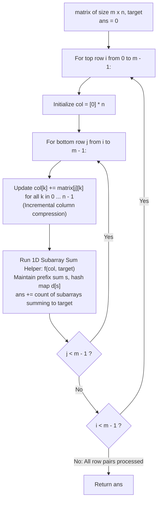

# Guided Example: Number of Submatrices That Sum to Target

We trace the step-by-step counting of 2D submatrices whose elements sum to a specified target, prove the 2D-to-1D Dimension Reduction Theorem and the Prefix Sum Frequency Invariant, and determine exact submatrix counts across representative matrix configurations:

- **Representative Instance 1 (Isolated Zero Cells in 2D Binary Grid):**
  $$
  matrix = \begin{pmatrix} 0 & 1 & 0 \\ 1 & 1 & 1 \\ 0 & 1 & 0 \end{pmatrix}, \quad target = 0, \quad m = 3, \; n = 3
  $$
- **Required Output:** `4`
  - Problem definitions:
    - A submatrix is determined by top-left $(i, c_1)$ and bottom-right $(j, c_2)$ with $0 \le i \le j < m$ and $0 \le c_1 \le c_2 < n$.
    - Return the total number of non-empty submatrices whose entries sum to $target$.
  - The 2D-to-1D Dimension Reduction Principle:
    - For any fixed row interval $[i, j]$, define the compressed column sum vector:
      $$
      col[k] = \sum_{r=i}^j matrix[r][k] \quad \text{for } k \in [0, n - 1]
      $$
    - The sum of a submatrix bounded by rows $[i, j]$ and columns $[c_1, c_2]$ is:
      $$
      \sum_{r=i}^j \sum_{k=c_1}^{c_2} matrix[r][k] = \sum_{k=c_1}^{c_2} col[k]
      $$
    - For fixed $(i, j)$, finding valid submatrices reduces identically to finding contiguous 1D subarrays in $col$ that sum to $target$.
  - Row Pair Iteration and Incremental Compression Trace:
    1. **Top Row $i = 0$:**
       - **$j = 0$ (Row band $[0, 0]$):**
         - $col = [0, 1, 0]$.
         - 1D Subarray Sum ($target = 0$):
           - Initial hash map: $d = \{0: 1\}$.
           - $k = 0$ ($x = 0$): $s = 0, \; s - target = 0 \implies cnt += d[0] = 1$. $d[0] = 2$.
           - $k = 1$ ($x = 1$): $s = 1, \; s - target = 1 \implies d[1] = 0$. $d[1] = 1$.
           - $k = 2$ ($x = 0$): $s = 1, \; s - target = 1 \implies cnt += d[1] = 1$. $d[1] = 2$.
           - Contributes: $1 + 1 = \mathbf{2}$ (submatrices at $[0, 0 \dots 0]$ and $[0, 2 \dots 2]$).
       - **$j = 1$ (Row band $[0, 1]$):**
         - $col = [0+1, 1+1, 0+1] = [1, 2, 1]$.
         - All entries positive; no subarray sums to $0 \implies \mathbf{0}$.
       - **$j = 2$ (Row band $[0, 2]$):**
         - $col = [1+0, 2+1, 1+0] = [1, 3, 1]$.
         - All entries positive; no subarray sums to $0 \implies \mathbf{0}$.
    2. **Top Row $i = 1$:**
       - **$j = 1$ (Row band $[1, 1]$):**
         - $col = [1, 1, 1] \implies \mathbf{0}$.
       - **$j = 2$ (Row band $[1, 2]$):**
         - $col = [1+0, 1+1, 1+0] = [1, 2, 1] \implies \mathbf{0}$.
    3. **Top Row $i = 2$:**
       - **$j = 2$ (Row band $[2, 2]$):**
         - $col = [0, 1, 0]$.
         - Symmetrically identical to row $0 \implies$ Contributes $\mathbf{2}$ (cells at $[2, 0]$ and $[2, 2]$).
  - Total Target Submatrices:
    $$
    ans = 2 + 0 + 0 + 0 + 0 + 2 = \mathbf{4}
    $$
    (The four isolated corner cells `(0, 0)`, `(0, 2)`, `(2, 0)`, `(2, 2)`).

- **Representative Instance 2 (Zero-Sum Cancellation Grid):**
  $$
  matrix = \begin{pmatrix} 1 & -1 \\ -1 & 1 \end{pmatrix}, \quad target = 0
  $$
  - Row $[0, 0]$: $col = [1, -1] \implies$ subarray $[0 \dots 1]$ sums to $0$ (1).
  - Row $[1, 1]$: $col = [-1, 1] \implies$ subarray $[0 \dots 1]$ sums to $0$ (1).
  - Row $[0, 1]$: $col = [0, 0] \implies$ $col[0]=0$ (1), $col[1]=0$ (1), $col[0 \dots 1]=0$ (1) $\implies 3$.
  - Total: $1 + 1 + 3 = \mathbf{5}$.

- **Representative Instance 3 (Single Cell Misses Target):**
  $$
  matrix = [[904]], \quad target = 0 \implies \mathbf{0}
  $$

- **Representative Instance 4 (Single Cell Hits Target):**
  $$
  matrix = [[-7]], \quad target = -7 \implies \mathbf{1}
  $$

---

## 1. Instance & Teaching Goal

Given an $m \times n$ matrix and a target, find the number of non-empty submatrices whose sum equals target.

```text
The Naive Boundary Enumeration Fallacy:
  Choosing 4 boundaries (top, bottom, left, right):
    Number of submatrices is O(m^2 * n^2).
    For m = 100, n = 100: (100 * 101 / 2)^2 approx 2.5 * 10^7 combinations.
    Evaluating each in O(1) still requires tens of millions of iterations.

2D-to-1D Dimension Reduction Invariant (O(m^2 * n) Time, O(n) Space):
  Key observation:
    Fix top row i and bottom row j.
    Compress column values: col[k] = sum_{r=i}^j matrix[r][k].
    Submatrix sum between row i, j and columns c1, c2 is sum_{k=c1}^{c2} col[k]!
  This is the 1D "Subarray Sum Equals K" problem:
    - Running prefix sum s.
    - Hash map d[prefix] counts prior occurrences.
    - cnt += d[s - target].
  Total operations: (m * (m + 1) / 2) * n <= 5 * 10^5, executing in < 0.05 seconds!
```

Compressing the 2D vertical dimension into a single cumulative vector maps the problem directly to the classic 1D prefix difference frequency algorithm.

The decisive pedagogical goal is the **2D-to-1D Dimension Reduction Theorem & Prefix Sum Frequency Invariant**:
1. **Incremental Compression:** Extending bottom row $j$ updates $col[k] \leftarrow col[k] + matrix[j][k]$ in $\mathcal{O}(n)$ time without recomputing from row $i$.
2. **Algebraic Isomorphism:** A 2D submatrix with fixed horizontal boundaries is mathematically identical to a 1D contiguous segment in the column projection vector.
3. **Prefix Difference Target Matching:** A segment $col[c_1 \dots c_2]$ sums to $target$ iff $P_{c_2} - P_{c_1 - 1} = target \iff P_{c_1 - 1} = P_{c_2} - target$.
4. Total time $\mathcal{O}(m^2 \cdot n)$ and auxiliary space $\mathcal{O}(n)$.

---

## 2. Conceptual Foundation & The Dimension Reduction Pipeline



### The 2D-to-1D Dimension Reduction Theorem

Let $M$ be an $m \times n$ matrix with entries in $\mathbb{Z}$.
1. **Submatrix Sum Definition:**
   A submatrix defined by row interval $[i, j]$ ($0 \le i \le j < m$) and column interval $[c_1, c_2]$ ($0 \le c_1 \le c_2 < n$) has sum:
   $$
   S(i, j, c_1, c_2) = \sum_{r=i}^j \sum_{k=c_1}^{c_2} M[r][k]
   $$
2. **Summation Interchange:**
   By Fubini's theorem on finite sums:
   $$
   S(i, j, c_1, c_2) = \sum_{k=c_1}^{c_2} \left( \sum_{r=i}^j M[r][k] \right)
   $$
   Define the 1D column projection vector $\mathbf{v}^{(i, j)} \in \mathbb{Z}^n$ by $v_k^{(i, j)} = \sum_{r=i}^j M[r][k]$.
   Then:
   $$
   S(i, j, c_1, c_2) = \sum_{k=c_1}^{c_2} v_k^{(i, j)}
   $$
3. **Prefix Difference Matching:**
   For the 1D sequence $\mathbf{v}^{(i, j)}$, define prefix sums $P_c = \sum_{k=0}^c v_k^{(i, j)}$ with $P_{-1} = 0$.
   The subarray sum condition is:
   $$
   \sum_{k=c_1}^{c_2} v_k^{(i, j)} = P_{c_2} - P_{c_1 - 1} = target \iff P_{c_1 - 1} = P_{c_2} - target
   $$
   Iterating $c_2$ from $0$ to $n - 1$ while querying and updating a frequency map $d[P]$ counts all matching pairs $(c_1, c_2)$ in $\mathcal{O}(n)$ time.
4. **Exhaustive Partition:**
   Since every submatrix has a unique pair of horizontal boundaries $(i, j)$, summing the 1D counts over all $\frac{m(m+1)}{2}$ row pairs partitions the entire 2D search space without omission or double-counting. $\blacksquare$

---

## 3. Step-by-Step Worked Execution: Representative Instance 1

$matrix = [[0, 1, 0], [1, 1, 1], [0, 1, 0]], \; target = 0, \; m = 3, \; n = 3$.

### Iteration Highlights
- **Pair $(i=0, j=0)$:**
  - $col = [0, 1, 0]$.
  - $k=0: s=0 \implies d[0]=1 \implies cnt += 1$. $d[0]=2$.
  - $k=1: s=1 \implies d[1]=0$. $d[1]=1$.
  - $k=2: s=1 \implies d[1]=1 \implies cnt += 1$. $d[1]=2$.
  - Subtotal: $\mathbf{2}$.
- **Pair $(i=0, j=1)$:** $col = [1, 2, 1] \implies$ Subtotal: $\mathbf{0}$.
- **Pair $(i=0, j=2)$:** $col = [1, 3, 1] \implies$ Subtotal: $\mathbf{0}$.
- **Pair $(i=1, j=1)$:** $col = [1, 1, 1] \implies$ Subtotal: $\mathbf{0}$.
- **Pair $(i=1, j=2)$:** $col = [1, 2, 1] \implies$ Subtotal: $\mathbf{0}$.
- **Pair $(i=2, j=2)$:**
  - $col = [0, 1, 0] \implies$ Subtotal: $\mathbf{2}$.

Global Sum: $2 + 0 + 0 + 0 + 0 + 2 = \mathbf{4}$.

---

## 4. Row Band Compression & 1D Prefix Evaluation Trace Table

| Top Row $i$ | Bottom Row $j$ | Compressed Column Vector $col$ | Prefix Sum Sequence $P$ | 1D Matches Found | Cumulative Total |
|:---:|:---:|:---:|:---:|:---:|:---:|
| $0$ | $0$ | `[0, 1, 0]` | `[0, 1, 1]` | **$2$** (`[0]`, `[2]`) | **$2$** |
| $0$ | $1$ | `[1, 2, 1]` | `[1, 3, 4]` | $0$ | $2$ |
| $0$ | $2$ | `[1, 3, 1]` | `[1, 4, 5]` | $0$ | $2$ |
| $1$ | $1$ | `[1, 1, 1]` | `[1, 2, 3]` | $0$ | $2$ |
| $1$ | $2$ | `[1, 2, 1]` | `[1, 3, 4]` | $0$ | $2$ |
| $2$ | $2$ | `[0, 1, 0]` | `[0, 1, 1]` | **$2$** (`[0]`, `[2]`) | **$4$** |
| **Output** | — | — | — | — | **$\mathbf{4}$** |

---

## 5. Algorithmic Correctness

### Soundness & Completeness
1. **Soundness:**
   Every match registered corresponds to an exact 2D submatrix whose entries sum to $target$.
2. **Completeness:**
   Every possible 2D submatrix is uniquely defined by its row span $[i, j]$ and column span $[c_1, c_2]$; all row pairs and all column pairs are evaluated.

---

## 6. Boundary Cases & Traps

| Scenario | Input Pattern | Behavior | Trapped Risk |
|---|---|---|---|
| Target Zero with All Zeros | $2 \times 3$ matrix of $0$'s | Every submatrix matches; returns $18$. | Skipping zero-sum intervals. |
| Negative Matrix Entries | Mixed signs cancel to zero | Prefix difference handles non-monotonic sums. | Two-pointer sliding window failure. |
| Single Cell Grid | $1 \times 1$ matrix | Direct comparison; returns $1$ if $M[0][0] == target$, else $0$. | Off-by-one loop crashes. |
| Rectangular Dimensions | $m \ll n$ or $n \ll m$ | Algorithm runs in $\mathcal{O}(m^2 \cdot n)$ without requiring square matrices. | Out-of-bounds column indices. |

---

## 7. Complexity Derivation

- **Time Complexity:** $\mathcal{O}(m^2 \cdot n)$, where $m = \text{len}(matrix) \le 100$ and $n = \text{len}(matrix[0]) \le 100$.
  - Number of row pairs is $\frac{m(m + 1)}{2} \le 5050$.
  - Each 1D prefix scan runs in $\mathcal{O}(n) \le 100$ operations.
  - Total operations $\approx 5050 \times 100 \approx 5.05 \times 10^5 \implies < 0.05\text{ s}$.
- **Auxiliary Space Complexity:** $\mathcal{O}(n)$ auxiliary memory for the compressed column array $col$ and the prefix sum hash map $d$.
