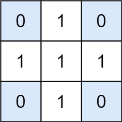

### 1. Description

Given a `matrix` and a `target`, return the number of non-empty submatrices that sum to target.

A submatrix `x1, y1, x2, y2` is the set of all cells $\text{matrix}[x][y]$ with $x1 \le x \le x2$ and $y1 \le y \le y2$.

Two submatrices `(x1, y1, x2, y2)` and `(x1', y1', x2', y2')` are different if they have some coordinate that is different: for example, if $x1 \neq x1'$.

### 2. Function Contract

- `n`: Input parameter.
- Returns expected result.

### 3. Examples

#### Example 1

- **Input:** $matrix = [[0,1,0],[1,1,1],[0,1,0]], target = 0$
- **Output:** `4`
- **Explanation:** The four 1x1 submatrices that only contain 0.
#### Example 2

- **Input:** $matrix = [[1,-1],[-1,1]], target = 0$
- **Output:** `5`
- **Explanation:** The two 1x2 submatrices, plus the two 2x1 submatrices, plus the 2x2 submatrix.
#### Example 3

- **Input:** $matrix = [[904]], target = 0$
- **Output:** `0`

### 4. Constraints

- $1 \le \text{matrix.length} \le 100$

- $1 \le \text{matrix}[0].length \le 100$

- $-1000 \le \text{matrix}[i][j] \le 1000$

- $-10^{8} \le target \le 10^{8}$