[TOC]

## Solution

---

### Prerequisites

In this section, we list some problems and concepts that could help with the resolution of this particular problem.

**[Optional] Number of Subarrays that Sum to Target**

In this solution, we're going to reduce this 2D problem to a 1D one [Subarray Sum Equals k](https://leetcode.com/problems/subarray-sum-equals-k/).

One of the best solutions for this 1D problem is to use a hashmap with the key as prefix sum and value as the number of subarrays starting from index zero and having this particular sum value.

If you don't remember this idea well, you may want to check Approach 4 in the above article to make reading this article easier.

**[Required] 2D Prefix Sum**

Many problems could be solved using the so-called [prefix sum](https://en.wikipedia.org/wiki/Prefix_sum).

In one dimension it's simple: there is an array of numbers $x_0, x_1, x_2, ..., x_n$ and we're building a second array which is a sum of prefixes of the input array:

$$
P_0 = x_0 \\
P_1 = x_0 + x_1 \\
... \\
P_n = x_0 + x_1 + x_2 + ... + x_n
$$

Here is how it looks like, we sum up the current value with all values on the left:

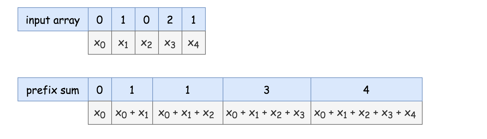

> In 2D the idea is basically the same: prefix sum $P_{mn}$ is a sum of the current value with the integers above or on the left.

$P_{mn} = \sum\limits_{i = 0}^{i = m}\sum\limits_{j = 0}^{j = n}{x_{ij}}$

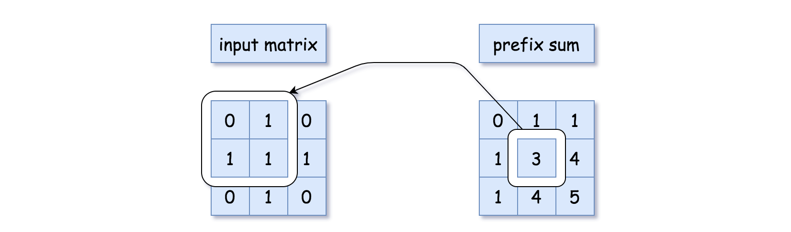

Prefix sum could be computed in $\mathcal{O}(R \times C)$ time, where $R$ is the number of rows and $C$ is the number of columns.

```python
# compute 2D prefix sum
for i in range(1, r + 1):
    for j in range(1, c + 1):
        ps[i][j] = ps[i - 1][j] + ps[i][j - 1] - ps[i - 1][j - 1] + matrix[i - 1][j - 1]
```

Using a 2D prefix sum, we can now query the sum of any submatrix in $\mathcal{O}(1)$ time.
<br />
<br />

---
### Overview: Reduce 2D Problem to 1D

Let's fix two rows: $r_1$ and $r_2$, and consider all "prefix" matrices that are using all rows from $r_1$ to $r_2$.

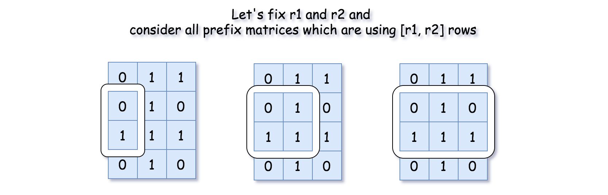

Using 2D prefix sum `ps`, one could easily get the sum of each prefix matrix: $\text{curr}_{sum} = \text{ps}[r2][col] - ps[r1 - 1][col]$.

This sum itself could be considered as a 1D prefix sum because when rows are fixed, there is just one parameter to play with: the column `col`.

The job is done! The problem is reduced to the 1D problem [Number of Subarrays that Sum to Target](https://leetcode.com/problems/subarray-sum-equals-k/), and to underline the similarity, let's reuse the code from Approach 4 of this 1D problem.

```python
h = defaultdict(int)
h[0] = 1

for col in range(1, c + 1):
    # current 1D prefix sum
    curr_sum = ps[r2][col] - ps[r1 - 1][col]

    # add subarrays which sum up to (curr_sum - target)
    count += h[curr_sum - target]

    # save current prefix sum
    h[curr_sum] += 1
```

We've got a pretty nice combination here:

- Use 2D prefix sum to reduce the problem to lots of smaller 1D problems.

- Use 1D prefix sum to solve these 1D problems.
<br />
<br />

---
### Approach 1: Number of Subarrays that Sum to Target: Horizontal 1D Prefix Sum


**Algorithm**

- Initialize the result: $count = 0$.

- Compute the number of rows: $r = len(matrix)$ and number of columns: $c = len(\text{matrix}[0])$.

- Compute 2D prefix sum `ps`. To simplify the code, we allocate one more row and one more column, reserving row 0 and column 0 for zero values. This way, we avoid computing the first row and the first column separately.

- Iterate over the rows: r1 from 1 to r, and r2 from r1 to r:

- Inside this double loop, the left and right row boundaries are fixed. Now it's time to initialize a hashmap: 1D prefix sum -> number of matrices which use `[r1, r2]` rows and sum to this prefix sum. The sum of the empty matrix is equal to zero: $h[0] = 1$.

- Iterate over the columns from 1 to c + 1. At each step:

- Compute current 1D prefix sum $\text{curr}_{sum}$ using previously computed 2D prefix sum `ps`: $\text{curr}_{sum} = \text{ps}[r2][col] - ps[r1 - 1][col]$.

- The number of times the sum $\text{curr}_{sum} - target$ occurred, defines the number of matrices that use `r1 ... r2` rows and sum to target. Increment the count: $count += h[\text{curr}_{sum} - target]$.

- Add the current 1D prefix sum into the hashmap.

- Return `count`.

**Implementation**

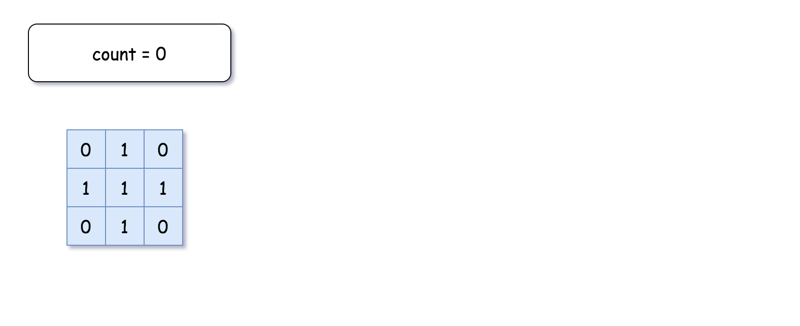

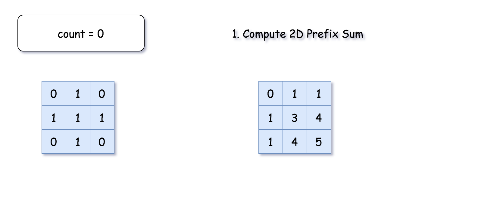

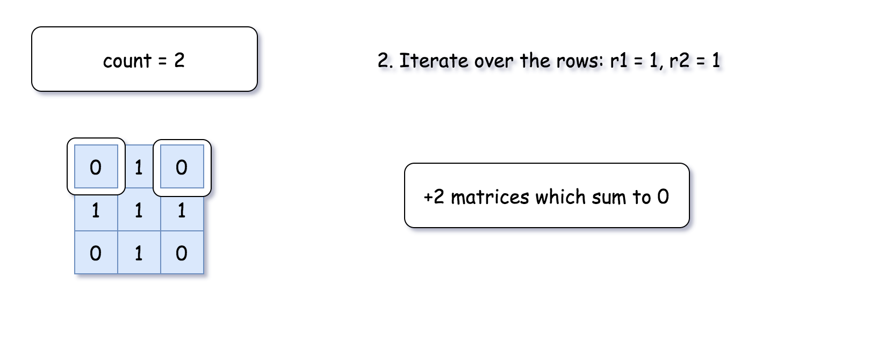

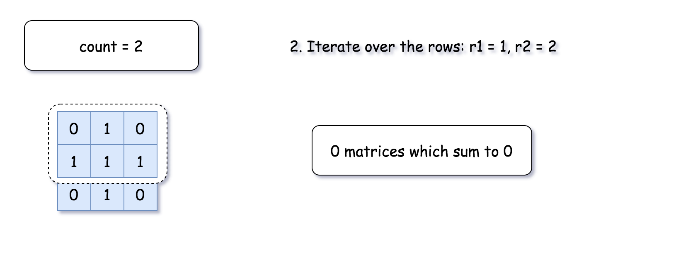


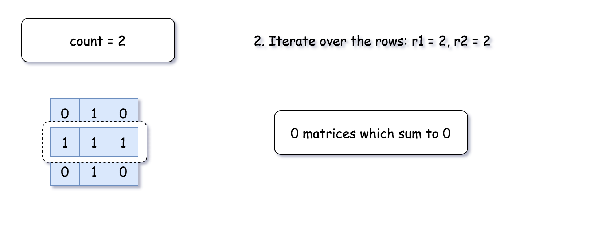

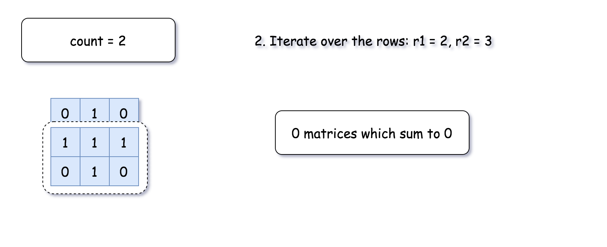

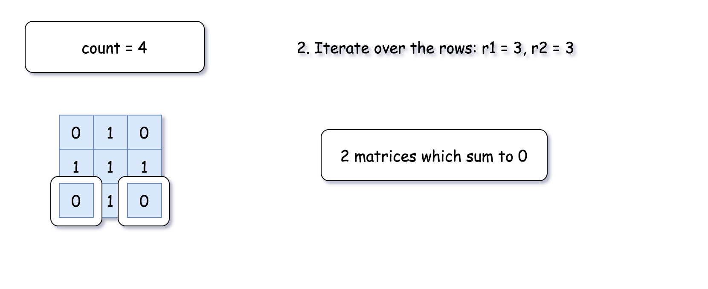

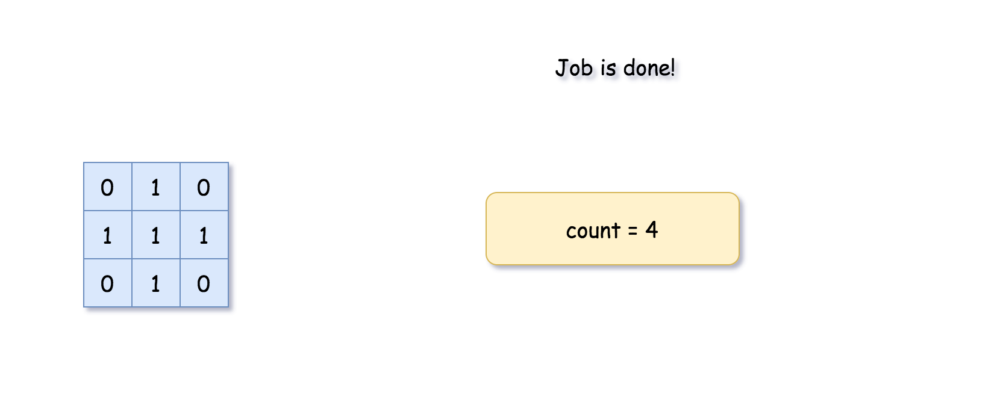

```python
from collections import defaultdict
class Solution:
    def numSubmatrixSumTarget(self, matrix: List[List[int]], target: int) -> int:
        r, c = len(matrix), len(matrix[0])

        # compute 2D prefix sum
        ps = [[0] * (c + 1) for _ in range(r + 1)]
        for i in range(1, r + 1):
            for j in range(1, c + 1):
                ps[i][j] = ps[i - 1][j] + ps[i][j - 1] - ps[i - 1][j - 1] + matrix[i - 1][j - 1]

        count = 0
        # reduce 2D problem to 1D one
        # by fixing two rows r1 and r2 and
        # computing 1D prefix sum for all matrices using [r1..r2] rows
        for r1 in range(1, r + 1):
            for r2 in range(r1, r + 1):
                h = defaultdict(int)
                h[0] = 1

                for col in range(1, c + 1):
                    # current 1D prefix sum
                    curr_sum = ps[r2][col] - ps[r1 - 1][col]

                    # add subarrays which sum up to (curr_sum - target)
                    count += h[curr_sum - target]

                    # save current prefix sum
                    h[curr_sum] += 1

        return count
```

**Complexity Analysis**

* Time complexity: $\mathcal{O}(R^2 C)$, where $R$ is the number of rows and $C$ is the number of columns.

* Space complexity: $\mathcal{O}(RC)$ to store 2D prefix sum.
<br />
<br />

---
### Approach 2: Number of Subarrays that Sum to Target: Vertical 1D Prefix Sum

In Approach 1, we were fixing two rows, and computing the "horizontal" 1D prefix sum. One could follow the same logic by fixing two **_columns_**, and computing the "vertical" 1D prefix sum.

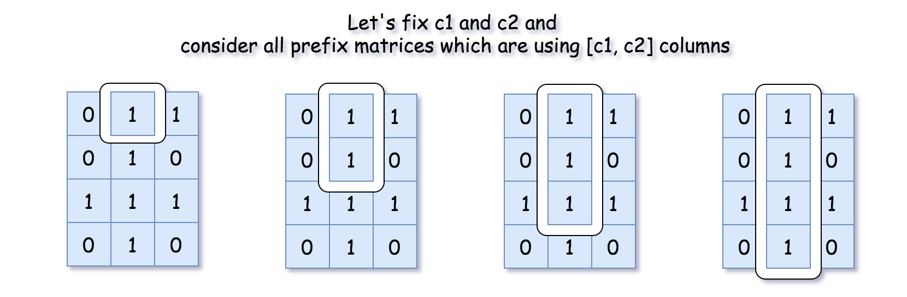

**Algorithm**

- Initialize the result: $count = 0$.

- Compute the number of rows: $r = len(matrix)$ and the number of columns:
$c = len(\text{matrix}[0])$.

- Compute 2D prefix sum `ps`. To simplify the code,
we allocate one more row and one more column, reserving row 0 and column 0 for zero values.

- Iterate over the columns: c1 from 1 to c, and c2 from c1 to c:

- Inside this double loop, the upper and lower column boundaries are fixed. Now it's time to initialize a hashmap: 1D prefix sum -> number of matrices that use `[c1, c2]` columns and sum to this prefix sum. The sum of the empty matrix is equal to zero: $h[0] = 1$.

- Iterate over the rows from 1 to r + 1. At each step:

- Compute current 1D prefix sum $\text{curr}_{sum}$ using previously computed 2D prefix sum `ps`: $\text{curr}_{sum} = \text{ps}[row][c2] - \text{ps}[row][c1 - 1]$.

- The number of times the sum $\text{curr}_{sum} - target$ occurred, defines the number of matrices that use `c1 ... c2` rows and sum to target. Increment the count: $count += h[\text{curr}_{sum} - target]$.

- Add the current 1D prefix sum into the hashmap.

- Return `count`.

**Implementation**

```python
from collections import defaultdict
class Solution:
    def numSubmatrixSumTarget(self, matrix: List[List[int]], target: int) -> int:
        r, c = len(matrix), len(matrix[0])

        # compute 2D prefix sum
        ps = [[0] * (c + 1) for _ in range(r + 1)]
        for i in range(1, r + 1):
            for j in range(1, c + 1):
                ps[i][j] = ps[i - 1][j] + ps[i][j - 1] - ps[i - 1][j - 1] + matrix[i - 1][j - 1]

        count = 0
        # reduce 2D problem to 1D one
        # by fixing two columns c1 and c2 and
        # computing 1D prefix sum for all matrices using [c1..c2] columns
        for c1 in range(1, c + 1):
            for c2 in range(c1, c + 1):
                h = defaultdict(int)
                h[0] = 1

                for row in range(1, r + 1):
                    # current 1D prefix sum
                    curr_sum = ps[row][c2] - ps[row][c1 - 1]

                    # add subarrays which sum up to (curr_sum - target)
                    count += h[curr_sum - target]

                    # save current prefix sum
                    h[curr_sum] += 1

        return count
```

**Complexity Analysis**

* Time complexity: $\mathcal{O}(R C^2)$, where $R$ is the number of rows and $C$ is the number of columns.

* Space complexity: $\mathcal{O}(RC)$ to store 2D prefix sum.
<br />
<br />