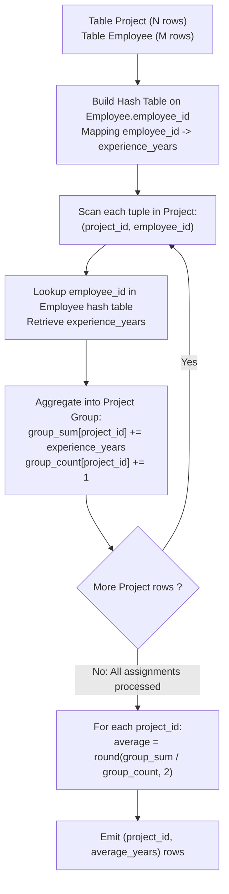

# Guided Example: Project Employees I

We trace the step-by-step relational evaluation of joining project assignments with employee records to compute the rounded average experience per project, prove the Equi-Join Uniqueness Theorem and the Grouped Mean Invariant, and analyze query calculations across representative database instances:

- **Representative Instance 1 (Two Projects with Shared Personnel):**
  - Table `Project`:
    $$
    \begin{array}{|c|c|}
    \hline
    \textbf{project\_id} & \textbf{employee\_id} \\
    \hline
    1 & 1 \\
    1 & 2 \\
    1 & 3 \\
    2 & 1 \\
    2 & 4 \\
    \hline
    \end{array}
    $$
  - Table `Employee`:
    $$
    \begin{array}{|c|c|c|}
    \hline
    \textbf{employee\_id} & \textbf{name} & \textbf{experience\_years} \\
    \hline
    1 & \text{"Khaled"} & 3 \\
    2 & \text{"Ali"} & 2 \\
    3 & \text{"John"} & 1 \\
    4 & \text{"Doe"} & 2 \\
    \hline
    \end{array}
    $$
- **Required Output:**
  $$
  \begin{array}{|c|c|}
  \hline
  \textbf{project\_id} & \textbf{average\_years} \\
  \hline
  1 & 2.0 \\
  2 & 2.5 \\
  \hline
  \end{array}
  $$
  - Relational Schema Contracts:
    - In `Project`, `(project_id, employee_id)` is the primary key. `employee_id` is a foreign key referencing `Employee`.
    - In `Employee`, `employee_id` is the primary key, and `experience_years` is guaranteed non-null.
    - An employee may be assigned to multiple projects, but can appear at most once per project.
  - Natural Equi-Join Step ($\text{Project} \bowtie_{\text{employee\_id}} \text{Employee}$):
    1. $(project\_id = 1, employee\_id = 1) \to experience = \mathbf{3}$
    2. $(project\_id = 1, employee\_id = 2) \to experience = \mathbf{2}$
    3. $(project\_id = 1, employee\_id = 3) \to experience = \mathbf{1}$
    4. $(project\_id = 2, employee\_id = 1) \to experience = \mathbf{3}$
    5. $(project\_id = 2, employee\_id = 4) \to experience = \mathbf{2}$
  - Group-By Aggregation Step:
    - **Project 1:**
      - Experience values: $\{3, 2, 1\}$.
      - Mean: $\mu(1) = \frac{3 + 2 + 1}{3} = \frac{6}{3} = 2.0$.
      - Rounded to 2 digits: $\mathbf{2.0}$.
    - **Project 2:**
      - Experience values: $\{3, 2\}$.
      - Mean: $\mu(2) = \frac{3 + 2}{2} = \frac{5}{2} = 2.5$.
      - Rounded to 2 digits: $\mathbf{2.5}$.
  - Final Output Table:
    $$
    [[\mathbf{1, 2.0}], \; [\mathbf{2, 2.5}]]
    $$

- **Representative Instance 2 (Non-Terminating Fraction Rounding):**
  - Project 2 with employees having experience $\{1, 2, 2\}$:
    $$\mu = \frac{1 + 2 + 2}{3} = \frac{5}{3} \approx 1.6666... \implies \text{round}(5/3, 2) = \mathbf{1.67}$$

- **Representative Instance 3 (Single Employee Project):**
  - Project 8 with one employee of 7 years experience:
    $$\mu = \frac{7}{1} = \mathbf{7.0}$$

---

## 1. Instance & Teaching Goal

Given tables `Project` and `Employee`, report the average experience years of all employees for each project, rounded to 2 decimal places.

```text
The Double-Counting / Null Exclusion Fallacy:
  Fallacy 1: Assuming employees working on multiple projects skew project counts.
    Since (project_id, employee_id) is the primary key of Project, each employee
    has at most one row per project, guaranteeing unit weight (weight = 1).

  Fallacy 2: Overlooking rounding specification.
    AVG() returns high-precision floats (e.g. 1.6666667).
    Explicit ROUND(AVG(experience_years), 2) is mandatory.

Equi-Join & Grouped Mean Invariant:
  1. Inner join Project and Employee on employee_id:
       Attaches experience_years to each valid project assignment.
  2. Group by project_id:
       Partitions the joined tuples into distinct project cohorts.
  3. Aggregate via ROUND(AVG(experience_years), 2):
       Evaluates arithmetic mean over each cohort in O(|Project| + |Employee|) time!
```

Joining assignments with employee profiles on their shared primary-foreign key relationship provides a direct foundation for grouped arithmetic aggregation.

The decisive pedagogical goal is the **Equi-Join Uniqueness Theorem & Grouped Mean Invariant**:
1. **Assignment Integrity:** Because `(project_id, employee_id)` is unique in `Project` and `employee_id` is unique in `Employee`, each joined row represents a unique team member.
2. **Relational Aggregation:** $\mathcal{R}_{\text{Out}} = \gamma_{\text{project\_id}, \; \text{ROUND}(\text{AVG}(\text{experience\_years}), 2) \to \text{average\_years}}(\mathcal{R}_{\text{Project}} \bowtie \mathcal{R}_{\text{Employee}})$.
3. **Deterministic Rounding:** Non-terminating rational numbers are rounded half-up to two decimal digits.
4. Total time $\mathcal{O}(|\text{Project}| + |\text{Employee}|)$ and auxiliary space $\mathcal{O}(|\text{Employee}|)$.

---

## 2. Conceptual Foundation & The Join-Aggregate Pipeline



### The Equi-Join Uniqueness Theorem

Let $\mathcal{P}$ denote `Project` and $\mathcal{E}$ denote `Employee`.
1. **Uniqueness and Multiplicity:**
   - In $\mathcal{P}$, the primary key is $(\text{project\_id}, \text{employee\_id})$.
   - In $\mathcal{E}$, the primary key is $\text{employee\_id}$.
   Consider the equi-join:
   $$
   \mathcal{J} = \mathcal{P} \bowtie_{\mathcal{P}.\text{employee\_id} = \mathcal{E}.\text{employee\_id}} \mathcal{E}
   $$
   For each tuple $p \in \mathcal{P}$, there exists exactly one tuple $e \in \mathcal{E}$ with $p[\text{employee\_id}] = e[\text{employee\_id}]$.
   Therefore:
   $$
   |\mathcal{J}| = |\mathcal{P}|
   $$
   The join preserves the exact number of project assignments without row duplication.
2. **Cohort Arithmetic Mean:**
   Partition $\mathcal{J}$ by $\text{project\_id}$. For a given project $k$, let:
   $$
   \mathcal{J}_k = \{ t \in \mathcal{J} : t[\text{project\_id}] = k \}
   $$
   Since each employee appears at most once in $\mathcal{J}_k$, the average experience is:
   $$
   \mu(k) = \frac{1}{|\mathcal{J}_k|} \sum_{t \in \mathcal{J}_k} t[\text{experience\_years}]
   $$
   This is the exact, unweighted arithmetic mean of the team members' experience.
3. **Precision Rounding:**
   The output attribute $\text{average\_years} = \text{round}(\mu(k), 2)$ rounds the mean to two fractional decimal places. $\blacksquare$

---

## 3. Step-by-Step Worked Execution: Representative Instance 1

### Joined Tuples Trace
- $(p=1, e=1) \implies \text{exp} = 3$
- $(p=1, e=2) \implies \text{exp} = 2$
- $(p=1, e=3) \implies \text{exp} = 1$
- $(p=2, e=1) \implies \text{exp} = 3$
- $(p=2, e=4) \implies \text{exp} = 2$

### Aggregations
- **Project 1:**
  - Sum $= 3 + 2 + 1 = 6$.
  - Count $= 3$.
  - $\text{Avg} = 6 / 3 = 2.0$.
  - $\text{Round}(2.0, 2) = \mathbf{2.0}$.
- **Project 2:**
  - Sum $= 3 + 2 = 5$.
  - Count $= 2$.
  - $\text{Avg} = 5 / 2 = 2.5$.
  - $\text{Round}(2.5, 2) = \mathbf{2.5}$.

Result: `[[1, 2.0], [2, 2.5]]`.

---

## 4. Group Aggregation Trace Table

| `project_id` | Assigned Employees | Individual Experience Values | Sum of Experience | Member Count | Raw Average | Rounded Output (`average_years`) |
|:---:|:---:|:---:|:---:|:---:|:---:|:---:|
| $1$ | $\{1, 2, 3\}$ | $\{3, 2, 1\}$ | $6$ | $3$ | $2.0000$ | **$2.0$** |
| $2$ | $\{1, 4\}$ | $\{3, 2\}$ | $5$ | $2$ | $2.5000$ | **$2.5$** |

---

## 5. Algorithmic Correctness

### Soundness & Completeness
1. **Soundness:**
   Every project group calculates the exact arithmetic mean of its assigned employees' experience years and rounds to two decimal places.
2. **Completeness:**
   Every project present in `Project` is grouped and reported; no project assignment is omitted.

---

## 6. Boundary Cases & Traps

| Scenario | Input Pattern | Behavior | Trapped Risk |
|---|---|---|---|
| Non-Terminating Decimal Fraction | $5 / 3 = 1.6666...$ | `ROUND(..., 2)` rounds half-up to $1.67$. | Truncation or floating point precision loss. |
| Single Employee Project | Team size 1 | Average equals individual experience; e.g. $7.0$. | Division by zero. |
| Shared Employees Across Projects | Employee 1 works on projects 1 and 2 | Employee contributes independently to both projects. | Deduplicating across projects. |
| Unassigned Employees in Catalog | Employee with no project | Omitted by inner join; does not create phantom project. | Emitting null projects. |

---

## 7. Complexity Derivation

- **Time Complexity:** $\mathcal{O}(|\mathcal{P}| + |\mathcal{E}|)$, where $|\mathcal{P}|$ is the number of rows in `Project` and $|\mathcal{E}|$ is the number of rows in `Employee`.
  - Building the hash index over `Employee` takes $\mathcal{O}(|\mathcal{E}|)$ time.
  - Probing the hash index and accumulating group sums takes $\mathcal{O}(|\mathcal{P}|)$ time.
  - Final averaging over distinct projects takes $\mathcal{O}(|\text{Projects}|)$ time.
  - Total time: strictly linear in database input size.
- **Auxiliary Space Complexity:** $\mathcal{O}(|\mathcal{E}| + |\text{Projects}|)$ auxiliary memory for the employee lookup table and project group accumulators.
