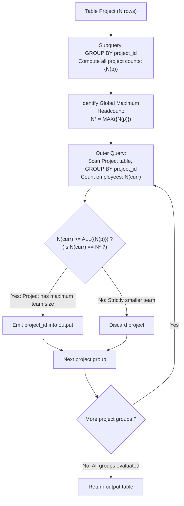

# Guided Example: Project Employees II

We trace the step-by-step identification of projects with the largest headcount, prove the Group Cardinality Mapping Theorem and the Tie-Preserving Maximal Filter Invariant, and evaluate relational queries across representative database instances:

- **Representative Instance 1 (Unique Maximum Project Headcount):**
  - Table `Project`:
    $$
    \begin{array}{|c|c|}
    \hline
    \textbf{project\_id} & \textbf{employee\_id} \\
    \hline
    1 & 1 \\
    1 & 2 \\
    1 & 3 \\
    2 & 1 \\
    2 & 4 \\
    \hline
    \end{array}
    $$
  - Table `Employee` (Catalog):
    $$
    \begin{array}{|c|c|c|}
    \hline
    \textbf{employee\_id} & \textbf{name} & \textbf{experience\_years} \\
    \hline
    1 & \text{"Khaled"} & 3 \\
    2 & \text{"Ali"} & 2 \\
    3 & \text{"John"} & 1 \\
    4 & \text{"Doe"} & 2 \\
    \hline
    \end{array}
    $$
- **Required Output:**
  $$
  \begin{array}{|c|}
  \hline
  \textbf{project\_id} \\
  \hline
  1 \\
  \hline
  \end{array}
  $$
  - Problem definitions:
    - Report all projects that have the **most employees**.
    - If multiple projects tie for the maximum number of employees, report all of them.
  - The Catalog Join Elimination Lemma:
    - The question concerns only headcounts per project.
    - Because $(project\_id, employee\_id)$ is the primary key of `Project`, every row represents a distinct employee assignment.
    - Counting employees per project is simply counting rows in `Project` grouped by `project_id`.
    - No employee attributes (`name`, `experience_years`) are queried; joining `Employee` is strictly redundant and eliminated.
  - Group Cardinality Trace:
    - Group by `project_id`:
      - Project 1: assignments $\{1, 2, 3\} \implies N(1) = \mathbf{3}$
      - Project 2: assignments $\{1, 4\} \implies N(2) = \mathbf{2}$
    - Global Maximum Headcount:
      $$
      N^* = \max(3, 2) = \mathbf{3}
      $$
    - Relational Comparison:
      - Project 1: $N(1) = 3 \ge \text{ALL}(\{3, 2\}) \implies$ **Retained**.
      - Project 2: $N(2) = 2 \ge \text{ALL}(\{3, 2\}) \implies$ Rejected ($2 < 3$).
  - Final Output Table:
    $$
    [[\mathbf{1}]]
    $$

- **Representative Instance 2 (All Represented Projects Tie at Maximum):**
  - Table `Project`:
    $$
    \begin{array}{|c|c|}
    \hline
    \textbf{project\_id} & \textbf{employee\_id} \\
    \hline
    1 & 1 \\
    1 & 2 \\
    3 & 1 \\
    3 & 3 \\
    \hline
    \end{array}
    $$
  - Counts: $N(1) = 2, \; N(3) = 2$.
  - Maximum count: $N^* = 2$.
  - Both projects achieve the maximum:
    $$
    [[\mathbf{1}], \; [\mathbf{3}]]
    $$
  - Any query using `LIMIT 1` arbitrarily drops Project 3 and fails the contract!

- **Representative Instance 3 (Multiple Tied Winners Exclude Lower Count):**
  - Projects: Project 7 ($3$ employees), Project 2 ($3$ employees), Project 9 ($1$ employee).
  - Maximum count: $3$.
  - Result contains both winners: `[[2], [7]]`.

---

## 1. Instance & Teaching Goal

Given tables `Project` and `Employee`, report all `project_id` values that have the maximum number of employees.

```text
The Single-Winner / LIMIT Fallacy:
  Fallacy 1: SELECT project_id FROM Project GROUP BY project_id ORDER BY COUNT(*) DESC LIMIT 1;
    Fails completely whenever two or more projects tie for the largest team size!

  Fallacy 2: Joining Employee table.
    Employee attributes are unused; joining Employee adds pointless table-scan overhead.

Tie-Preserving Maximal Filter Invariant:
  1. Compute headcount per project directly on Project:
       N(p) = COUNT(1) GROUP BY project_id.
  2. Filter groups using universal quantification:
       HAVING COUNT(1) >= ALL (SELECT COUNT(1) FROM Project GROUP BY project_id)
     (Equivalently: WHERE count = (SELECT MAX(cnt) FROM ...))
  - Guarantees ALL projects achieving the maximum headcount are reported.
  - Zero row loss on ties.
  - Runs in linear O(|Project|) time without scanning Employee!
```

Separating group aggregation from global maximum qualification guarantees that ties are preserved while avoiding unnecessary joins.

The decisive pedagogical goal is the **Group Cardinality Mapping Theorem & Tie-Preserving Maximal Filter Invariant**:
1. **Catalog Elimination:** Every project assignment is fully identified by `Project(project_id, employee_id)`.
2. **Cardinality Mapping:** For each project $p$, the team size is $N(p) = |\sigma_{project\_id = p}(\mathcal{R}_{\text{Project}})|$.
3. **Universal Quantification Filter:** The condition $N(p) \ge \text{ALL}(\{N(q) : q \in \mathcal{P}\})$ holds if and only if $N(p) = \max_q N(q)$.
4. Total time $\mathcal{O}(|\text{Project}|)$ and auxiliary space $\mathcal{O}(|\text{Projects}|)$.

---

## 2. Conceptual Foundation & The Maximal Filter Pipeline



### The Group Cardinality Mapping Theorem

Let $\mathcal{P}$ denote the `Project` relation with schema $(project\_id, employee\_id)$.
1. **Assignment Cardinality:**
   Because $(\text{project\_id}, \text{employee\_id})$ is the primary key of $\mathcal{P}$, all tuples in $\mathcal{P}$ are pairwise distinct.
   For each project $p \in \pi_{\text{project\_id}}(\mathcal{P})$, define the team size:
   $$
   N(p) = |\sigma_{\text{project\_id} = p}(\mathcal{P})|
   $$
2. **Maximum Headcount:**
   Define the set of all project team sizes:
   $$
   \mathcal{S}_N = \{ N(p) : p \in \pi_{\text{project\_id}}(\mathcal{P}) \}
   $$
   The global maximum is $N^* = \max \mathcal{S}_N$.
3. **Universal Quantification Equivalence:**
   Consider the SQL predicate `N(p) >= ALL (SELECT COUNT(1) FROM Project GROUP BY project_id)`.
   In first-order logic:
   $$
   N(p) \ge \text{ALL}(\mathcal{S}_N) \iff \forall s \in \mathcal{S}_N, \; N(p) \ge s
   $$
   Since $N^* \in \mathcal{S}_N$, $N(p) \ge N^*$.
   Combined with the fact that $N(p) \le N^*$ by definition of maximum:
   $$
   N(p) \ge \text{ALL}(\mathcal{S}_N) \iff N(p) = N^*
   $$
4. **Tie Preservation:**
   If multiple projects $p_1, \dots, p_k$ satisfy $N(p_i) = N^*$, every $p_i$ satisfies the predicate and is included in the output. $\blacksquare$

---

## 3. Step-by-Step Worked Execution: Representative Instance 1

### Outer Grouping and Subquery Counts
- Project $1$: $3$ employees.
- Project $2$: $2$ employees.
- Subquery set of counts: $\{3, 2\}$.

### Evaluation of `HAVING COUNT(1) >= ALL(...)`
- **Project 1:**
  - $\text{Count} = 3$.
  - $3 \ge 3$ (True), $3 \ge 2$ (True).
  - Predicate holds: **Retained**.
- **Project 2:**
  - $\text{Count} = 2$.
  - $2 \ge 3$ (False).
  - Predicate fails: **Discarded**.

Result: `[[1]]`.

---

## 4. Group Headcount and Filtering Trace Table

| `project_id` | Assigned Employee Set | Headcount $N(p)$ | Comparison $N(p) \ge \text{ALL}(\{3, 2\})$ | Evaluation Result | Output Emitted |
|:---:|:---:|:---:|:---:|:---:|:---:|
| $1$ | $\{1, 2, 3\}$ | $3$ | $3 \ge 3 \land 3 \ge 2$ | **True** | **`[1]`** |
| $2$ | $\{1, 4\}$ | $2$ | $2 \ge 3 \land 2 \ge 2$ | False | — |

---

## 5. Algorithmic Correctness

### Soundness & Completeness
1. **Soundness:**
   Every returned `project_id` has an employee count equal to the global maximum headcount.
2. **Completeness:**
   Every project with the maximum headcount satisfies $N(p) \ge \text{ALL}(\dots)$ and is returned; all ties are preserved.

---

## 6. Boundary Cases & Traps

| Scenario | Input Pattern | Behavior | Trapped Risk |
|---|---|---|---|
| Multiple Projects Tie for Maximum | Projects 1 and 3 both have 2 employees | Both projects satisfy $N(p) \ge \text{ALL}$; returns `[[1], [3]]`. | Using `LIMIT 1` and losing ties. |
| Single Project | Only one project exists | Count trivially $\ge$ all; returns that project. | Empty subquery comparisons. |
| Shared Employees Across Projects | Employee 1 on multiple projects | Contributes 1 to each assigned project independently. | Deduplicating employee assignments globally. |
| Empty Project Table | Zero project rows | Returns empty table `[]`. | Null aggregation errors. |

---

## 7. Complexity Derivation

- **Time Complexity:** $\mathcal{O}(|\mathcal{P}|)$, where $|\mathcal{P}|$ is the number of rows in `Project`.
  - Computing the subquery headcounts takes a single pass of $\mathcal{O}(|\mathcal{P}|)$ time using a hash map.
  - Finding the maximum headcount $N^*$ takes $\mathcal{O}(G)$ time where $G$ is the number of distinct projects.
  - Filtering outer groups takes $\mathcal{O}(G)$ time.
  - Total time: strictly linear in the size of `Project`.
- **Auxiliary Space Complexity:** $\mathcal{O}(G)$ auxiliary memory to store project counts in the hash aggregation table.
