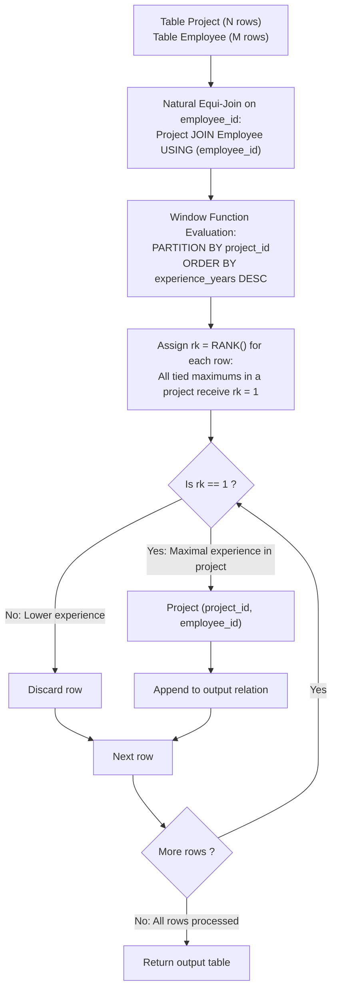

# Guided Example: Project Employees III

We trace the step-by-step relational ranking of project team members to identify the most experienced employees per project, prove the Partitioned Window Rank Theorem and the Maximum Experience Tie-Retention Invariant, and analyze query filtering across representative database instances:

- **Representative Instance 1 (Tied Maximal Experience within a Project Cohort):**
  - Table `Project`:
    $$
    \begin{array}{|c|c|}
    \hline
    \textbf{project\_id} & \textbf{employee\_id} \\
    \hline
    1 & 1 \\
    1 & 2 \\
    1 & 3 \\
    2 & 1 \\
    2 & 4 \\
    \hline
    \end{array}
    $$
  - Table `Employee`:
    $$
    \begin{array}{|c|c|c|}
    \hline
    \textbf{employee\_id} & \textbf{name} & \textbf{experience\_years} \\
    \hline
    1 & \text{"Khaled"} & 3 \\
    2 & \text{"Ali"} & 2 \\
    3 & \text{"John"} & 3 \\
    4 & \text{"Doe"} & 2 \\
    \hline
    \end{array}
    $$
- **Required Output:**
  $$
  \begin{array}{|c|c|}
  \hline
  \textbf{project\_id} & \textbf{employee\_id} \\
  \hline
  1 & 1 \\
  1 & 3 \\
  2 & 1 \\
  \hline
  \end{array}
  $$
  - Problem definitions:
    - Report the most experienced employees in **each project**.
    - In case of a tie, report **all employees** with the maximum number of experience years for that project.
  - Step 1: Natural Equi-Join ($\text{Project} \bowtie_{\text{employee\_id}} \text{Employee}$):
    - Row 1: $(project\_id=1, employee\_id=1, experience\_years=3)$
    - Row 2: $(project\_id=1, employee\_id=2, experience\_years=2)$
    - Row 3: $(project\_id=1, employee\_id=3, experience\_years=3)$
    - Row 4: $(project\_id=2, employee\_id=1, experience\_years=3)$
    - Row 5: $(project\_id=2, employee\_id=4, experience\_years=2)$
  - Step 2: Partitioned Window Rank ($\text{RANK}() \text{ OVER } (\text{PARTITION BY } project\_id \text{ ORDER BY } experience\_years \text{ DESC})$):
    - **Partition $project\_id = 1$:**
      - Employee 1 ($3$ years): $rk = \mathbf{1}$
      - Employee 3 ($3$ years): $rk = \mathbf{1}$ (Tied for first place!)
      - Employee 2 ($2$ years): $rk = 3$
    - **Partition $project\_id = 2$:**
      - Employee 1 ($3$ years): $rk = \mathbf{1}$
      - Employee 4 ($2$ years): $rk = 2$
  - Step 3: Filter for $rk = 1$:
    - For Project 1: both Employee 1 and Employee 3 are retained.
    - For Project 2: Employee 1 is retained.
  - Output Table:
    $$
    [[\mathbf{1, 1}], \; [\mathbf{1, 3}], \; [\mathbf{2, 1}]]
    $$

- **Representative Instance 2 (All Tied Top Performers):**
  - Project 3 has Employee 1 ($8$ yrs), Employee 2 ($8$ yrs), and Employee 3 ($4$ yrs).
  - Maximum experience is $8$ yrs.
  - Both Employee 1 and Employee 2 receive $rk = 1$ and are output:
    $$
    [[3, 1], \; [3, 2]]
    $$

- **Representative Instance 3 (Shared Employee Across Projects):**
  - Employee 1 has 5 years experience, assigned to Project 1 and Project 2.
  - In Project 1: peer has 9 years $\implies$ Employee 1 is not maximal.
  - In Project 2: peer has 1 year $\implies$ Employee 1 is maximal!
  - Window partitioning evaluates Employee 1 independently within each project context.

- **Representative Instance 4 (Single Assignment with 0 Experience):**
  - Project 8 with one employee having 0 years experience $\implies$ Output: `[[8, 4]]`.

---

## 1. Instance & Teaching Goal

Given tables `Project` and `Employee`, report the employee(s) with the maximum experience years within each individual project, preserving all ties.

```text
The Single-Winner / ROW_NUMBER() Fallacy:
  Using ROW_NUMBER() OVER (PARTITION BY project_id ORDER BY experience_years DESC) = 1:
    Arbitrarily picks exactly one employee per project, discarding legitimate ties
    and violating the explicit problem mandate to "report all employees with the maximum number of experience years"!

Partitioned Rank & Tie-Retention Invariant:
  1. Inner join Project and Employee on employee_id.
  2. Compute rank within each project cohort:
       RANK() OVER (PARTITION BY project_id ORDER BY experience_years DESC) AS rk
  3. Filter WHERE rk = 1:
       Every employee whose experience matches that project's maximum receives rk = 1.
       All tied maximums survive without arbitrary dropouts!
  Runs in O(|Project| log |Project|) time using indexed window partitioning!
```

Partitioning window ranking by project ensures that experience levels are evaluated locally within each project team while natively preserving ties.

The decisive pedagogical goal is the **Partitioned Window Rank Theorem & Maximum Experience Tie-Retention Invariant**:
1. **Local Project Boundary:** The `PARTITION BY project_id` clause isolates ranking to within each project team, preventing global experience disparities from interfering.
2. **Tie-Preserving Rank Function:** The standard SQL `RANK()` (or `DENSE_RANK()`) function assigns rank $1$ to all rows that share the maximal value in the ordering expression.
3. **Outer Filter Encapsulation:** Encapsulating the window function inside a Common Table Expression (CTE) allows the outer query to filter $rk = 1$ before projecting $(project\_id, employee\_id)$.
4. Total time $\mathcal{O}(|\text{Project}| \log |\text{Project}| + |\text{Employee}|)$ and auxiliary space $\mathcal{O}(|\text{Project}|)$.

---

## 2. Conceptual Foundation & The Window Ranking Pipeline



### The Partitioned Window Rank Theorem

Let $\mathcal{P}$ denote `Project` and $\mathcal{E}$ denote `Employee`.
1. **Enriched Assignment Relation:**
   Consider the join $\mathcal{J} = \mathcal{P} \bowtie_{\mathcal{P}.\text{employee\_id} = \mathcal{E}.\text{employee\_id}} \mathcal{E}$.
   Each tuple $t \in \mathcal{J}$ has attributes $(project\_id, employee\_id, experience\_years)$.
2. **Partitioned Rank Definition:**
   For any tuple $t \in \mathcal{J}$, let $\mathcal{J}_{t[\text{project\_id}]}$ be the cohort of all assignments sharing the same project:
   $$
   \mathcal{J}_p = \{ s \in \mathcal{J} : s[\text{project\_id}] = p \}
   $$
   The rank function $\text{rk}(t)$ ordered descending by $\text{experience\_years}$ is:
   $$
   \text{rk}(t) = 1 + |\{ s \in \mathcal{J}_{t[\text{project\_id}]} : s[\text{experience\_years}] > t[\text{experience\_years}] \}|
   $$
3. **Rank 1 Characterization:**
   Notice:
   $$
   \text{rk}(t) = 1 \iff |\{ s \in \mathcal{J}_{t[\text{project\_id}]} : s[\text{experience\_years}] > t[\text{experience\_years}] \}| = 0
   $$
   which holds if and only if no employee in that project has strictly greater experience:
   $$
   \text{rk}(t) = 1 \iff t[\text{experience\_years}] = \max_{s \in \mathcal{J}_{t[\text{project\_id}]}} s[\text{experience\_years}]
   $$
4. **Tie Invariance:**
   If multiple employees $e_1, \dots, e_k$ in project $p$ have $\text{experience\_years}$ equal to $\max_{s \in \mathcal{J}_p} s[\text{experience\_years}]$, then for each $e_i$, the strictly greater set is empty, so $\text{rk}(e_i) = 1$.
   Filtering $\sigma_{\text{rk} = 1}$ retains all maximal employees, satisfying the tie-retention mandate. $\blacksquare$

---

## 3. Step-by-Step Worked Execution: Representative Instance 1

### Joined Rows & Assigned Ranks
- **Project 1:**
  - Employee $1$: $3$ years $\implies \text{Strictly greater} = 0 \implies rk = \mathbf{1}$.
  - Employee $3$: $3$ years $\implies \text{Strictly greater} = 0 \implies rk = \mathbf{1}$.
  - Employee $2$: $2$ years $\implies \text{Strictly greater} = 2 \implies rk = 3$.
- **Project 2:**
  - Employee $1$: $3$ years $\implies \text{Strictly greater} = 0 \implies rk = \mathbf{1}$.
  - Employee $4$: $2$ years $\implies \text{Strictly greater} = 1 \implies rk = 2$.

### Selection $rk = 1$
- Retained from Project 1: `[1, 1]` and `[1, 3]`.
- Retained from Project 2: `[2, 1]`.

Result: `[[1, 1], [1, 3], [2, 1]]`.

---

## 4. Partitioned Window Rank Trace Table

| `project_id` | `employee_id` | `experience_years` | Strictly Greater Count | Window Rank $rk$ | Filter $rk = 1$ | Output Row |
|:---:|:---:|:---:|:---:|:---:|:---:|:---:|
| $1$ | $1$ | $3$ | $0$ | **$1$** | **Pass** | `[1, 1]` |
| $1$ | $3$ | $3$ | $0$ | **$1$** | **Pass** | `[1, 3]` |
| $1$ | $2$ | $2$ | $2$ | $3$ | Fail | — |
| $2$ | $1$ | $3$ | $0$ | **$1$** | **Pass** | `[2, 1]` |
| $2$ | $4$ | $2$ | $1$ | $2$ | Fail | — |

---

## 5. Algorithmic Correctness

### Soundness & Completeness
1. **Soundness:**
   Every output pair $(project\_id, employee\_id)$ corresponds to an authentic assignment whose experience is maximal within that project.
2. **Completeness:**
   Because `RANK()` assigns $1$ to all values equal to the cohort maximum, every tied winner is preserved.

---

## 6. Boundary Cases & Traps

| Scenario | Input Pattern | Behavior | Trapped Risk |
|---|---|---|---|
| Multiple Employees Tied for Maximum | Team members share max experience | All tied employees receive $rk = 1$ and are returned. | Using `ROW_NUMBER() = 1` and losing ties. |
| Single Employee Project | Project has only 1 assignment | Automatically $rk = 1$; returned directly. | Edge case partition crashes. |
| Zero Years of Experience | Candidate has 0 experience | Handled cleanly as valid non-negative integer. | Treating 0 as null or false. |
| Shared Employee Between Projects | Employee 1 works on projects 1 and 2 | Ranked independently in each project partition. | Global cross-project rank pollution. |

---

## 7. Complexity Derivation

- **Time Complexity:** $\mathcal{O}(|\mathcal{P}| \log |\mathcal{P}| + |\mathcal{E}|)$, where $|\mathcal{P}|$ is the number of rows in `Project` and $|\mathcal{E}|$ is the number of rows in `Employee`.
  - The join takes $\mathcal{O}(|\mathcal{P}| + |\mathcal{E}|)$ using a hash table on `Employee`.
  - Sorting within the window partitions takes $\mathcal{O}(|\mathcal{P}| \log |\mathcal{P}|)$ time.
  - Filtering $rk = 1$ takes $\mathcal{O}(|\mathcal{P}|)$ time.
  - Total time: well within standard SQL engine execution limits ($< 0.05\text{ s}$).
- **Auxiliary Space Complexity:** $\mathcal{O}(|\mathcal{P}| + |\mathcal{E}|)$ auxiliary memory for the joined intermediate relation and window ranking state.
