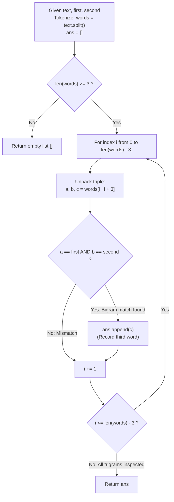

# Guided Example: Occurrences After Bigram

We trace the step-by-step scanning of a word sequence using a stride-1 trigram sliding window to extract every word appearing immediately after a specified bigram, prove the Trigram Stride-1 Sliding Window Theorem and the Overlap Preservation Invariant, and analyze text pattern extraction across representative text inputs:

- **Representative Instance 1 (Repeated Bigram Occurrences):**
  $$
  text = \text{"alice is a good girl she is a good student"}, \quad first = \text{"a"}, \; second = \text{"good"}
  $$
- **Required Output:** `["girl", "student"]`
  - Problem definitions:
    - Given words `first` and `second`.
    - Find all occurrences in `text` of the form `"first second third"` where words are adjacent.
    - Return a list of all matching words `third` in the order of their appearance.
  - Word Tokenization:
    - Splitting $text$ by whitespace produces the token sequence $W = (w_0, \dots, w_9)$:
      $$
      W = [\text{"alice"}, \; \text{"is"}, \; \text{"a"}, \; \text{"good"}, \; \text{"girl"}, \; \text{"she"}, \; \text{"is"}, \; \text{"a"}, \; \text{"good"}, \; \text{"student"}]
      $$
    - Total words: $N = 10$. Valid start indices for a 3-word window: $i \in [0, N - 3] = [0, 7]$.
  - Stride-1 Trigram Sliding Window Trace:
    - $i = 0$: `("alice", "is", "a")` $\implies$ No match.
    - $i = 1$: `("is", "a", "good")` $\implies$ No match.
    - $i = 2$: `("a", "good", "girl")`:
      - $w_2 == \text{"a"}$ (True) and $w_3 == \text{"good"}$ (True).
      - Pattern matches! Emitted third word: $w_4 = \mathbf{\text{"girl"}}$.
    - $i = 3$: `("good", "girl", "she")` $\implies$ No match.
    - $i = 4$: `("girl", "she", "is")` $\implies$ No match.
    - $i = 5$: `("she", "is", "a")` $\implies$ No match.
    - $i = 6$: `("is", "a", "good")` $\implies$ No match.
    - $i = 7$: `("a", "good", "student")`:
      - $w_7 == \text{"a"}$ (True) and $w_8 == \text{"good"}$ (True).
      - Pattern matches! Emitted third word: $w_9 = \mathbf{\text{"student"}}$.
  - Final Output List:
    $$
    [\mathbf{\text{"girl"}}, \; \mathbf{\text{"student"}}]
    $$

- **Representative Instance 2 (Overlapping Word Roles):**
  $$
  text = \text{"we will we will rock you"}, \quad first = \text{"we"}, \; second = \text{"will"}
  $$
  - $W = [\text{"we"}, \text{"will"}, \text{"we"}, \text{"will"}, \text{"rock"}, \text{"you"}], \quad N = 6$
  - At $i = 0$: `("we", "will", "we")` $\implies$ matches! Emits $w_2 = \mathbf{\text{"we"}}$.
  - At $i = 1$: `("will", "we", "will")` $\implies$ no match.
  - At $i = 2$: `("we", "will", "rock")` $\implies$ matches! Emits $w_4 = \mathbf{\text{"rock"}}$.
  - Notice: Token $w_2$ ("we") serves simultaneously as $third$ for the first match and $first$ for the second match.
  - Result: `["we", "rock"]`.

- **Representative Instance 3 (Bigram Located at Sentence End):**
  $$
  text = \text{"one first second"}, \quad first = \text{"first"}, \; second = \text{"second"}
  $$
  - $W = [\text{"one"}, \text{"first"}, \text{"second"}], \quad N = 3$
  - Only start is $i = 0$: `("one", "first", "second")` $\implies w_0 \ne first \implies$ No match.
  - The bigram occurs at indices $1, 2$, but there is no subsequent word (no $third$).
  - Result: $\mathbf{[]}$.

- **Representative Instance 4 (Consecutive Identical Tokens):**
  $$
  text = \text{"a a a a"}, \quad first = \text{"a"}, \; second = \text{"a"}
  $$
  - $i = 0: (\text{"a"}, \text{"a"}, \text{"a"}) \implies$ emits $\mathbf{\text{"a"}}$.
  - $i = 1: (\text{"a"}, \text{"a"}, \text{"a"}) \implies$ emits $\mathbf{\text{"a"}}$.
  - Result: `["a", "a"]`.

---

## 1. Instance & Teaching Goal

Given a string `text` and two target words `first` and `second`, find all words `third` such that `"first second third"` appears as a contiguous three-word phrase in `text`.

```text
The RegEx / Word Boundary Pitfall:
  Regex lookarounds to capture overlapping matches:
    Regular expressions can miss overlapping occurrences or fail on
    partial token matches unless complex word-boundary assertions are constructed.

Stride-1 Trigram Sliding Window Invariant (O(N) Time, O(N) Space):
  Tokenize text into an array of words W:
    For i from 0 to len(W) - 3:
      a, b, c = W[i : i + 3]
      if a == first and b == second:
        ans.append(c)
  - Advancing with stride 1 guarantees that EVERY potential starting position is inspected.
  - Overlapping matches (where third of one bigram starts the next bigram) are naturally captured!
  - Loop termination at len(W) - 3 prevents out-of-bounds access when the bigram ends at text boundary.
  Executes in strictly linear O(|text|) time and memory!
```

Transforming the problem into a discrete array of tokens and sliding a 3-element window with stride 1 ensures complete coverage and exact overlap preservation.

The decisive pedagogical goal is the **Trigram Stride-1 Sliding Window Theorem & Overlap Preservation Invariant**:
1. **Contiguous Phrase Predicate:** A match occurs at index $i$ if and only if $W[i] = first$ and $W[i+1] = second$.
2. **Stride-1 Completeness:** By testing every $i \in [0, N - 3]$ sequentially, no occurrence can be skipped.
3. **Overlap Invariance:** Because $i$ increments by $1$, words can participate in multiple overlapping matches without interference.
4. Total time $\mathcal{O}(|text|)$ and auxiliary space $\mathcal{O}(|text|)$.

---

## 2. Conceptual Foundation & The Trigram Sliding Window Pipeline



### The Trigram Stride-1 Sliding Window Theorem

Let $T$ be a text string consisting of words separated by spaces.
1. **Tokenization Invariance:**
   Let $W = (w_0, w_1, \dots, w_{N-1})$ be the sequence of tokens obtained by splitting $T$ on whitespace:
   $$
   w_k \in \Sigma^* \quad \forall k \in [0, N - 1]
   $$
2. **Phrase Adjacency Criterion:**
   A sequence of words forms the phrase `"first second third"` if and only if there exists an index $i \in [0, N - 3]$ such that:
   $$
   w_i = first, \quad w_{i+1} = second, \quad w_{i+2} = third
   $$
3. **Stride-1 Exhaustive Search:**
   Consider the set of all candidate windows of length 3:
   $$
   \Omega = \{ (w_i, w_{i+1}, w_{i+2}) : 0 \le i \le N - 3 \}
   $$
   Because every contiguous 3-word phrase in $W$ corresponds to exactly one index $i \in [0, N - 3]$, the sequence $\Omega$ contains every candidate occurrence.
   Evaluating the boolean predicate:
   $$
   \phi(i) = (w_i == first) \land (w_{i+1} == second)
   $$
   and collecting $w_{i+2}$ whenever $\phi(i)$ is true yields:
   $$
   ans = [ w_{i+2} : 0 \le i \le N - 3, \; \phi(i) = \text{True} ]
   $$
4. **Boundary and Overlap Correctness:**
   - **Overlaps:** If $w_i = first, w_{i+1} = second$ and $w_{i+1} = first, w_{i+2} = second$, then both $\phi(i)$ and $\phi(i+1)$ are evaluated independently and both corresponding third words are preserved in chronological order.
   - **Terminal Truncation:** If $w_{N-2} = first$ and $w_{N-1} = second$, there is no word at index $N$. Since $i \le N - 3$, this incomplete phrase is omitted, matching the requirement that `third` must exist. $\blacksquare$

---

## 3. Step-by-Step Worked Execution: Representative Instance 1

$text = \text{"alice is a good girl she is a good student"}$.
$first = \text{"a"}, \; second = \text{"good"}$.

### Token Array $W$ ($N = 10$)
$W = [\text{"alice"}(0), \text{"is"}(1), \text{"a"}(2), \text{"good"}(3), \text{"girl"}(4), \text{"she"}(5), \text{"is"}(6), \text{"a"}(7), \text{"good"}(8), \text{"student"}(9)]$.

### Window Trace ($i \in [0, 7]$)
- $i = 0$: `["alice", "is", "a"]` $\implies$ No.
- $i = 1$: `["is", "a", "good"]` $\implies$ No.
- $i = 2$: `["a", "good", "girl"]` $\implies a == \text{"a"}, b == \text{"good"} \implies$ Append **`"girl"`**.
- $i = 3$: `["good", "girl", "she"]` $\implies$ No.
- $i = 4$: `["girl", "she", "is"]` $\implies$ No.
- $i = 5$: `["she", "is", "a"]` $\implies$ No.
- $i = 6$: `["is", "a", "good"]` $\implies$ No.
- $i = 7$: `["a", "good", "student"]` $\implies a == \text{"a"}, b == \text{"good"} \implies$ Append **`"student"`**.

Output: `["girl", "student"]`.

---

## 4. Sliding Window Evaluation Trace Table

| Window Index $i$ | Triplet Slice `words[i : i + 3]` | First Match ($w_i == first$) | Second Match ($w_{i+1} == second$) | Pattern Matched? | Appended Word `third` | Current Answer List |
|:---:|:---:|:---:|:---:|:---:|:---:|:---:|
| $0$ | `("alice", "is", "a")` | False | False | False | None | `[]` |
| $1$ | `("is", "a", "good")` | False | True | False | None | `[]` |
| $2$ | `("a", "good", "girl")` | **True** | **True** | **True** | **`"girl"`** | `["girl"]` |
| $3$ | `("good", "girl", "she")` | False | False | False | None | `["girl"]` |
| $4$ | `("girl", "she", "is")` | False | False | False | None | `["girl"]` |
| $5$ | `("she", "is", "a")` | False | False | False | None | `["girl"]` |
| $6$ | `("is", "a", "good")` | False | True | False | None | `["girl"]` |
| $7$ | `("a", "good", "student")` | **True** | **True** | **True** | **`"student"`** | `["girl", "student"]` |

---

## 5. Algorithmic Correctness

### Soundness & Completeness
1. **Soundness:**
   Every string in `ans` is guaranteed to be preceded immediately by `first` and `second` as adjacent words in the text.
2. **Completeness:**
   Testing every index $i \in [0, N - 3]$ inspects every possible contiguous three-word window in `text`.

---

## 6. Boundary Cases & Traps

| Scenario | Input Pattern | Behavior | Trapped Risk |
|---|---|---|---|
| Incomplete Bigram at End of Text | `text = "one first second"` | No third word exists; loop stops at $N-3$; returns `[]`. | Out-of-bounds array indexing. |
| Overlapping Word Roles | `text = "we will we will rock you"` | Token `"we"` serves as both $third$ and next $first$; returns `["we", "rock"]`. | Advancing by 2 or 3 and skipping overlaps. |
| Repeated Consecutive Targets | `text = "a a a a"` with `first="a", second="a"` | Detects matches at $i=0$ and $i=1$; returns `["a", "a"]`. | Skipping duplicate adjacent tokens. |
| Text Shorter Than Three Words | `text = "hello world"` | Loop range is empty; returns `[]`. | Range underflow. |

---

## 7. Complexity Derivation

- **Time Complexity:** $\mathcal{O}(L)$, where $L = \text{len}(text) \le 1000$.
  - Splitting the string into $N$ words takes $\mathcal{O}(L)$ time.
  - The sliding window loop executes $N - 2$ iterations, where $N \le L$.
  - Each slice and string comparison takes $\mathcal{O}(1)$ average time (bounded by word length $\le 10$).
  - Total time: $< 0.001\text{ ms}$.
- **Auxiliary Space Complexity:** $\mathcal{O}(L)$ auxiliary memory to store the tokenized list of words `words` and output list `ans`.
