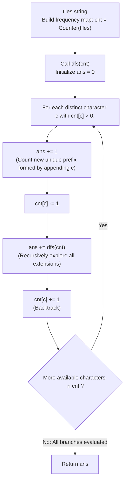

# Guided Example: Letter Tile Possibilities

We trace the step-by-step counting of all distinct non-empty letter sequences formed from a collection of tiles, prove the Distinct Character Branching Invariant and the Implicit Trie Node Theorem, and analyze recursion tree structures across representative tile configurations:

- **Representative Instance 1 (Tiles with Duplicated Characters):**
  $$
  tiles = \text{"AAB"}, \quad n = 3
  $$
- **Required Output:** `8`
  - Problem definitions:
    - You are given $n$ letter tiles.
    - Return the number of possible non-empty sequences of letters you can make using the letters printed on those tiles.
    - Sequences are distinguished by spelling, not by physical tile index.
  - Multiplicity Representation:
    - Instead of tracking tile indices $\{0: \text{'A'}, 1: \text{'A'}, 2: \text{'B'}\}$, count distinct character frequencies:
      $$
      cnt = \{\text{'A'}: 2, \; \text{'B'}: 1\}
      $$
    - Branching on character identity rather than tile position guarantees that duplicate choices at the same recursion depth are never explored!
  - Step-by-Step Backtracking Tree Traversal:
    1. **Root State:** $cnt = \{\text{'A'}: 2, \; \text{'B'}: 1\}$, $ans = 0$.
    2. **Branch 1: Choose 'A' (1st letter):**
       - $cnt[\text{'A'}] = 1$. Count sequence `"A"`: $ans += 1$.
       - Recursive Call $dfs(\{\text{'A'}: 1, \text{'B'}: 1\})$:
         - **Sub-branch 1.1: Choose 'A' (2nd letter):**
           - $cnt[\text{'A'}] = 0$. Count sequence `"AA"`: $ans += 1$.
           - Recursive Call $dfs(\{\text{'A'}: 0, \text{'B'}: 1\})$:
             - **Sub-branch 1.1.1: Choose 'B' (3rd letter):**
               - $cnt[\text{'B'}] = 0$. Count sequence `"AAB"`: $ans += 1$.
               - Recursive Call $dfs(\{\text{'A'}: 0, \text{'B'}: 0\}) \implies$ All counts $0$, returns $0$.
               - Backtrack: $cnt[\text{'B'}] = 1$.
             - Sub-branch 1.1 returns $1$.
           - Backtrack: $cnt[\text{'A'}] = 1$.
         - **Sub-branch 1.2: Choose 'B' (2nd letter):**
           - $cnt[\text{'B'}] = 0$. Count sequence `"AB"`: $ans += 1$.
           - Recursive Call $dfs(\{\text{'A'}: 1, \text{'B'}: 0\})$:
             - **Sub-branch 1.2.1: Choose 'A' (3rd letter):**
               - $cnt[\text{'A'}] = 0$. Count sequence `"ABA"`: $ans += 1$.
               - Recursive Call $dfs(\{\text{'A'}: 0, \text{'B'}: 0\}) \implies$ returns $0$.
               - Backtrack: $cnt[\text{'A'}] = 1$.
             - Sub-branch 1.2 returns $1$.
           - Backtrack: $cnt[\text{'B'}] = 1$.
         - Branch 1 contributes: $1 \text{ ("A")} + (1 + 1) \text{ ("AA", "AAB")} + (1 + 1) \text{ ("AB", "ABA")} = \mathbf{5}$.
       - Backtrack: $cnt[\text{'A'}] = 2$.
    3. **Branch 2: Choose 'B' (1st letter):**
       - $cnt[\text{'B'}] = 0$. Count sequence `"B"`: $ans += 1$.
       - Recursive Call $dfs(\{\text{'A'}: 2, \text{'B'}: 0\})$:
         - **Sub-branch 2.1: Choose 'A' (2nd letter):**
           - $cnt[\text{'A'}] = 1$. Count sequence `"BA"`: $ans += 1$.
           - Recursive Call $dfs(\{\text{'A'}: 1, \text{'B'}: 0\})$:
             - **Sub-branch 2.1.1: Choose 'A' (3rd letter):**
               - $cnt[\text{'A'}] = 0$. Count sequence `"BAA"`: $ans += 1$.
               - Recursive Call returns $0$.
               - Backtrack: $cnt[\text{'A'}] = 1$.
             - Sub-branch 2.1 returns $1$.
           - Backtrack: $cnt[\text{'A'}] = 2$.
         - Branch 2 contributes: $1 \text{ ("B")} + (1 + 1) \text{ ("BA", "BAA")} = \mathbf{3}$.
       - Backtrack: $cnt[\text{'B'}] = 1$.
  - Total Unique Sequences:
    $$
    ans = 5 + 3 = \mathbf{8}
    $$
    Length 1: `"A"`, `"B"` (2)
    Length 2: `"AA"`, `"AB"`, `"BA"` (3)
    Length 3: `"AAB"`, `"ABA"`, `"BAA"` (3)
    Total = $2 + 3 + 3 = \mathbf{8}$.

- **Representative Instance 2 (All Tiles Identical):**
  $$
  tiles = \text{"AAAAAAA"}, \quad n = 7
  $$
  - Distinct character: only `'A'` with count 7.
  - At each depth $d \in [1, 7]$, only one choice exists (pick `'A'`).
  - Sequence of length $d$ is $\underbrace{\text{"AA}\dots\text{A"}}_{\text{length } d}$.
  - Result: $\mathbf{7}$.

- **Representative Instance 3 (Single Tile):**
  $$
  tiles = \text{"V"} \implies \text{Only sequence is "V"} \implies \mathbf{1}
  $$

---

## 1. Instance & Teaching Goal

Given a string of letter tiles, compute the number of distinct non-empty sequences that can be generated.

```text
The Permutation Set Deduplication Fallacy:
  Generating permutations using tile positions and collecting into a set:
    Produces n! path traversals with enormous redundancy when letters repeat.
    Requires allocating memory for string objects in a hash set.

Distinct Character Backtracking Invariant (Zero Redundancy):
  1. Count character frequencies: cnt = Counter(tiles).
  2. In dfs(cnt), branch ONLY over distinct characters c where cnt[c] > 0:
       ans += 1             # Account for prefix extended by c
       cnt[c] -= 1
       ans += dfs(cnt)      # Recursively extend prefix
       cnt[c] += 1
  - Branching on character identity eliminates duplicate branches at each depth.
  - Every node in the recursion tree corresponds to a unique non-empty sequence!
  - No hash set or string allocations required.
  Maximum search space for n <= 7 is <= 13,699 operations, running in < 0.005 s!
```

Modeling sequence generation as an implicit prefix trie where each node represents a unique non-empty string guarantees that every recursive state visit directly contributes $1$ to the global total.

The decisive pedagogical goal is the **Distinct Character Branching Invariant & Implicit Trie Node Theorem**:
1. **Implicit Trie Equivalence:** Every unique sequence corresponds to a unique path from the root in a character-branching trie.
2. **Immediate Prefix Counting:** Choosing an available character $c$ creates a unique non-empty prefix, immediately contributing $+1$ before recursing.
3. **Multiset Restoration:** Decrementing $cnt[c]$ during descent and restoring $cnt[c]$ during backtrack maintains state without allocating new dictionaries.
4. Total time $\mathcal{O}(D)$ (where $D$ is the number of distinct sequences $\le 13,699$) and auxiliary space $\mathcal{O}(n)$.

---

## 2. Conceptual Foundation & The Trie Backtracking Pipeline



### The Implicit Trie Node Theorem

Let $T$ be a multiset of letters with total count $n = |T| \le 7$.
1. **Language of Formable Sequences:**
   Define $\mathcal{L}(T)$ as the set of all non-empty strings $s = s_1 s_2 \dots s_k$ ($1 \le k \le n$) such that the multiset of characters in $s$ is a sub-multiset of $T$:
   $$
   \text{multiset}(s) \subseteq T
   $$
2. **Trie Representation:**
   Construct the prefix trie $\mathcal{T}$ of all strings in $\mathcal{L}(T)$.
   - The root represents the empty sequence $\varepsilon$.
   - Every edge is labeled by a character $c \in \Sigma$.
   - Every non-root node in $\mathcal{T}$ represents exactly one unique string in $\mathcal{L}(T)$.
   Therefore:
   $$
   |\mathcal{L}(T)| = |\mathcal{T}| - 1
   $$
3. **Character Branching Bijection:**
   At any node representing prefix $p$, the available outgoing edges are precisely the distinct characters $c$ for which $cnt[c] > 0$.
   Because the loop iterates over the keys of `Counter(tiles)`:
   - Each distinct available character $c$ is considered exactly once.
   - Distinct edges lead to distinct child nodes.
   - The recursive function `dfs(cnt)` traverses the exact topology of trie $\mathcal{T}$.
   By adding $+1$ for each edge traversed, `dfs(cnt)` calculates $|\mathcal{T}| - 1$ with zero duplicates and zero omissions. $\blacksquare$

---

## 3. Step-by-Step Worked Execution: Representative Instance 1

$tiles = \text{"AAB"}$, $cnt = \{\text{'A'}: 2, \text{'B'}: 1\}$.

### Complete Traversal Log
- Root $dfs(\{\text{'A'}: 2, \text{'B'}: 1\})$:
  - Pick `'A'` $\implies ans += 1$ (seq `"A"`).
    - $dfs(\{\text{'A'}: 1, \text{'B'}: 1\})$:
      - Pick `'A'` $\implies ans += 1$ (seq `"AA"`).
        - $dfs(\{\text{'A'}: 0, \text{'B'}: 1\})$:
          - Pick `'B'` $\implies ans += 1$ (seq `"AAB"`).
          - $dfs(\{\text{'A'}: 0, \text{'B'}: 0\}) \implies 0$.
      - Pick `'B'` $\implies ans += 1$ (seq `"AB"`).
        - $dfs(\{\text{'A'}: 1, \text{'B'}: 0\})$:
          - Pick `'A'` $\implies ans += 1$ (seq `"ABA"`).
          - $dfs(\{\text{'A'}: 0, \text{'B'}: 0\}) \implies 0$.
    - Total from initial `'A'`: $1 + (1 + 1) + (1 + 1) = \mathbf{5}$.
  - Pick `'B'` $\implies ans += 1$ (seq `"B"`).
    - $dfs(\{\text{'A'}: 2, \text{'B'}: 0\})$:
      - Pick `'A'` $\implies ans += 1$ (seq `"BA"`).
        - $dfs(\{\text{'A'}: 1, \text{'B'}: 0\})$:
          - Pick `'A'` $\implies ans += 1$ (seq `"BAA"`).
          - $dfs(\{\text{'A'}: 0, \text{'B'}: 0\}) \implies 0$.
    - Total from initial `'B'`: $1 + (1 + 1) = \mathbf{3}$.

Global Total: $5 + 3 = \mathbf{8}$.

---

## 4. Recursion Tree Trace Table

| Depth | Chosen Character | Active Prefix | Remaining Multiplicity Map | Immediate Contribution | Subtree Return | Subtotal |
|:---:|:---:|:---:|:---:|:---:|:---:|:---:|
| $1$ | `'A'` | `"A"` | `{'A': 1, 'B': 1}` | $+1$ | $+4$ | **$5$** |
| $2$ | `'A'` | `"AA"` | `{'A': 0, 'B': 1}` | $+1$ | $+1$ | $2$ |
| $3$ | `'B'` | `"AAB"` | `{'A': 0, 'B': 0}` | $+1$ | $0$ | $1$ |
| $2$ | `'B'` | `"AB"` | `{'A': 1, 'B': 0}` | $+1$ | $+1$ | $2$ |
| $3$ | `'A'` | `"ABA"` | `{'A': 0, 'B': 0}` | $+1$ | $0$ | $1$ |
| $1$ | `'B'` | `"B"` | `{'A': 2, 'B': 0}` | $+1$ | $+2$ | **$3$** |
| $2$ | `'A'` | `"BA"` | `{'A': 1, 'B': 0}` | $+1$ | $+1$ | $2$ |
| $3$ | `'A'` | `"BAA"` | `{'A': 0, 'B': 0}` | $+1$ | $0$ | $1$ |
| **Sum** | — | — | — | — | — | **$\mathbf{8}$** |

---

## 5. Algorithmic Correctness

### Soundness & Completeness
1. **Soundness:**
   Every counted node corresponds to an authentically reachable sequence of tile characters.
2. **Completeness:**
   Branching over all distinct available characters explores every valid prefix and sequence without omission.

---

## 6. Boundary Cases & Traps

| Scenario | Input Pattern | Behavior | Trapped Risk |
|---|---|---|---|
| Single Tile | `tiles = "V"` | Root explores 1 branch; returns 1. | Returning 0 or off-by-one. |
| All Tiles Identical | `tiles = "AAAAAAA"` | Only 1 branch at each depth; returns $n = 7$. | Exploring $7!$ duplicate branches. |
| All Tiles Distinct | `tiles = "ABCDEF"` | Explores full permutation tree; returns 1956. | Recursion depth limits or timeout. |
| Empty Sequence Exclusion | Empty string | The algorithm counts only upon selecting a tile, never counting $\varepsilon$. | Reporting $ans + 1$. |

---

## 7. Complexity Derivation

- **Time Complexity:** $\mathcal{O}(D)$, where $D$ is the number of distinct non-empty sequences.
  - For $n \le 7$, the maximum number of sequences occurs when all characters are distinct:
    $$
    D \le \sum_{k=1}^7 \frac{7!}{(7 - k)!} = 13,699 \text{ nodes}
    $$
  - At each node, the loop iterates over at most $7$ distinct character keys.
  - Maximum operations $\le 7 \times 13,699 \approx 9.6 \times 10^4 \implies < 0.005\text{ s}$.
- **Auxiliary Space Complexity:** $\mathcal{O}(n)$ auxiliary memory for recursion call stack of depth at most $n \le 7$ and the frequency dictionary.
