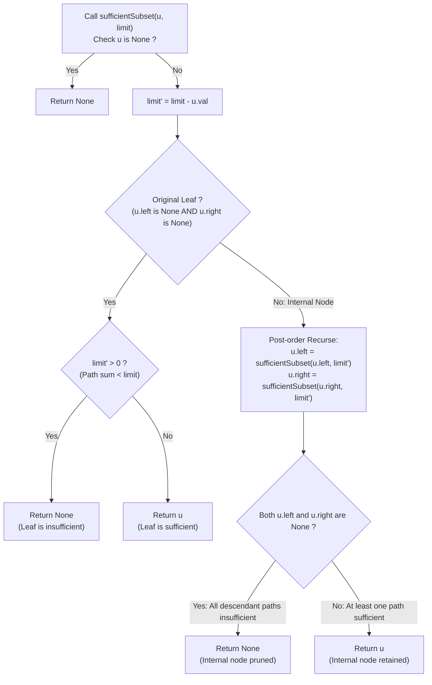

# Guided Example: Insufficient Nodes in Root to Leaf Paths

We trace the step-by-step post-order pruning of insufficient binary tree nodes, prove the Path Sufficiency Criterion and the Internal Node Orphan Pruning Lemma, and analyze tree transformations across representative configurations:

- **Representative Instance 1 (Pruning Large Negative Branches):**
  - Binary Tree:
    - Root: $1$, `limit = 1`
    - Left subtree of 1: node $2$, with children $4$ and $-99$.
      - Node $4$ has children $8$ and $9$.
      - Node $-99$ has children $-99$ and $-99$.
    - Right subtree of 1: node $3$, with children $-99$ and $7$.
      - Node $-99$ has children $12$ and $13$.
      - Node $7$ has children $-99$ and $14$.
- **Required Output:** `[1, 2, 3, 4, null, null, 7, 8, 9, null, 14]`
  - Problem definitions:
    - A node is **insufficient** if every root-to-leaf path passing through it has a total sum strictly less than `limit`.
    - Delete all insufficient nodes simultaneously.
    - A leaf is a node with no children in the original tree.
  - Path Sum Evaluation for Every Root-to-Leaf Path:
    - **Through Node 2 (Left of 1):**
      - Path $1 \to 2 \to 4 \to 8$: $\text{Sum} = 15 \ge 1 \implies$ **Sufficient** (Nodes $1, 2, 4, 8$ kept).
      - Path $1 \to 2 \to 4 \to 9$: $\text{Sum} = 16 \ge 1 \implies$ **Sufficient** (Node $9$ kept).
      - Path $1 \to 2 \to -99 \to -99$: $\text{Sum} = -195 < 1 \implies$ **Insufficient**.
      - Path $1 \to 2 \to -99 \to -99$: $\text{Sum} = -195 < 1 \implies$ **Insufficient**.
      - Because all paths through the $-99$ child of $2$ are insufficient, that entire $-99$ subtree is pruned. Node $2$ retains child $4$.
    - **Through Node 3 (Right of 1):**
      - Path $1 \to 3 \to -99 \to 12$: $\text{Sum} = -83 < 1 \implies$ **Insufficient**.
      - Path $1 \to 3 \to -99 \to 13$: $\text{Sum} = -82 < 1 \implies$ **Insufficient**.
      - Both paths through the $-99$ child of $3$ fail the limit; that node and its children are pruned.
      - Path $1 \to 3 \to 7 \to -99$: $\text{Sum} = -88 < 1 \implies$ **Insufficient** (Child $-99$ of $7$ pruned).
      - Path $1 \to 3 \to 7 \to 14$: $\text{Sum} = 25 \ge 1 \implies$ **Sufficient** (Child $14$ of $7$ kept).
  - Pruned Result:
    - Subtree at node 2 preserves only child 4 (with leaves 8, 9).
    - Subtree at node 3 preserves only child 7 (with leaf 14).
    - Root 1 retains both children 2 and 3.

- **Representative Instance 2 (The "New Leaf" Trap):**
  $$
  root = [5, -10], \quad limit = 0
  $$
  - Original tree: Root $5$ with only left child $-10$.
  - Path sum: $5 + (-10) = -5 < 0$.
  - Leaf $-10$ is insufficient and pruned.
  - Now Node $5$ has both left and right children equal to `None`.
  - **Critical Invariant:** Does $5$ become a new leaf with sum $5 \ge 0$? **NO!**
    Node $5$ was an internal node in the original tree. Every root-to-leaf path through $5$ had to continue through $-10$. Since that path was insufficient, node $5$ itself is insufficient!
  - Node $5$ is pruned $\implies$ Output: $\mathbf{[]}$ (empty tree).

- **Representative Instance 3 (All Paths Insufficient):**
  $$
  root = [1, 2, -3], \quad limit = 5
  $$
  - Paths: $1 + 2 = 3 < 5$, $1 + (-3) = -2 < 5$.
  - Both leaves pruned; root has no surviving children; root is pruned $\implies \mathbf{[]}$.

- **Representative Instance 4 (Single Sufficient Root):**
  $$
  root = [-4], \quad limit = -4 \implies \text{Leaf with sum } -4 \ge -4 \implies \mathbf{[-4]}
  $$

---

## 1. Instance & Teaching Goal

Given the root of a binary tree and an integer `limit`, simultaneously delete all nodes for which every root-to-leaf path passing through them has a sum strictly less than `limit`.

```text
The "New Leaf" Semantic Trap:
  If a parent's children are both pruned, treating the parent as a "surviving leaf":
    In root = [5, -10], limit = 0: path sum is -5.
    Pruning -10 leaves 5 with no children. If 5 is kept because "5 >= 0",
    an invalid path (5 alone) is invented that never existed in the original tree!

Post-Order Pruning & Orphan Deletion Invariant (O(N) Time, O(H) Space):
  At node u with remaining required sum limit' = limit - u.val:
    1. Base Case (Original Leaf: u.left is None and u.right is None):
         return None if limit' > 0 else u
    2. Recursive Post-Order Subtree Pruning:
         u.left = sufficientSubset(u.left, limit')
         u.right = sufficientSubset(u.right, limit')
    3. Orphan Deletion Rule:
         If BOTH u.left is None and u.right is None:
           u has no remaining valid path extensions!
           return None
         Else:
           return u
  Correctly prunes internal nodes whose descendant paths have all vanished!
```

Traversing in post-order and parameterizing the recursive call by the remaining required path sum cleanly decouples ancestor path accumulation from bottom-up subtree pruning.

The decisive pedagogical goal is the **Path Sufficiency Criterion & Internal Node Orphan Pruning Lemma**:
1. **Top-Down Parameterization:** At node $u$, decrement $limit' = limit - u.val$ to represent the remaining sum needed by descendants.
2. **Original Leaf Decidability:** An original leaf has no descendants; its path sum is sufficient if and only if $limit' \le 0$.
3. **Internal Node Pruning:** An internal node is kept if and only if at least one of its subtrees contains a sufficient root-to-leaf path. If both children become `None`, the internal node must be pruned.
4. Total time $\mathcal{O}(N)$ and auxiliary space $\mathcal{O}(H)$.

---

## 2. Conceptual Foundation & The Tree Pruning Pipeline



### The Internal Node Orphan Pruning Lemma

Let $T$ be a binary tree, and let $\mathcal{P}(u)$ denote the set of all root-to-leaf paths in $T$ that pass through node $u$.
1. **Sufficiency Formalization:**
   Node $u$ is sufficient with respect to $limit$ if and only if:
   $$
   \exists p \in \mathcal{P}(u) \quad \text{such that} \quad \sum_{v \in p} v.val \ge limit
   $$
2. **Path Decomposition at Internal Nodes:**
   If $u$ is an internal node in $T$, every path $p \in \mathcal{P}(u)$ must extend to at least one child:
   $$
   \mathcal{P}(u) = \mathcal{P}(u.left) \cup \mathcal{P}(u.right)
   $$
   (where $\mathcal{P}(\text{None}) = \emptyset$).
3. **Maximal Path Sum Equivalence:**
   $$
   \max_{p \in \mathcal{P}(u)} \sum_{v \in p} v.val = \max \left( \max_{p \in \mathcal{P}(u.left)} \sum_{v \in p} v.val, \; \max_{p \in \mathcal{P}(u.right)} \sum_{v \in p} v.val \right)
   $$
4. **Pruning Consequence:**
   - If all paths through $u.left$ are insufficient, the left subtree returns `None` ($u.left = \text{None}$).
   - If all paths through $u.right$ are insufficient, the right subtree returns `None` ($u.right = \text{None}$).
   - If both $u.left$ and $u.right$ become `None`, then:
     $$
     \max_{p \in \mathcal{P}(u)} \sum_{v \in p} v.val < limit
     $$
     Every path passing through $u$ is insufficient. Therefore $u$ must be pruned.
   - Conversely, if at least one child survives ($u.left \ne \text{None}$ or $u.right \ne \text{None}$), there exists a sufficient path passing through that child and therefore through $u$, so $u$ must be retained. $\blacksquare$

---

## 3. Step-by-Step Worked Execution: Representative Instance 2

$root = [5, -10], \quad limit = 0$.

### Execution Steps
1. Enter `sufficientSubset(node=5, limit=0)`:
   - $limit' = 0 - 5 = -5$.
   - Node $5$ has left child $-10$ (not an original leaf).
2. Recurse on Left Child: `sufficientSubset(node=-10, limit=-5)`:
   - $limit' = -5 - (-10) = +5$.
   - Node $-10$ has no children (is an original leaf).
   - Check leaf condition: $limit' = 5 > 0 \implies$ Path sum is strictly less than limit.
   - Returns `None`.
3. Back to Node $5$:
   - Left child rewires to: $5.left = \text{None}$.
   - Right child rewires to: $5.right = \text{None}$.
   - Node $5$ now has both children equal to `None`.
   - Orphan rule applies: `return None if 5.left is None and 5.right is None else 5`.
   - Node $5$ returns `None`.

Final Tree: `None` (empty `[]`).

---

## 4. Post-Order Node Pruning Trace Table

| Node Visited | Node Value | Incoming `limit` | Child `limit'` | Original Leaf? | Subtree Returns (`left`, `right`) | Pruning Decision | Emitted Pointer |
|:---:|:---:|:---:|:---:|:---:|:---:|:---:|:---:|
| Leaf $-10$ | $-10$ | $-5$ | $+5$ | **Yes** | — | $limit' = 5 > 0 \implies$ Insufficient | `None` |
| Root $5$ | $5$ | $0$ | $-5$ | No | (`None`, `None`) | Both children pruned $\implies$ Orphan | `None` |

---

## 5. Algorithmic Correctness

### Soundness & Completeness
1. **Soundness:**
   A node is preserved in the tree if and only if it lies on at least one valid path from root to original leaf with sum $\ge limit$.
2. **Completeness:**
   Post-order traversal ensures all descendant branches are evaluated before deciding the fate of any ancestor node.

---

## 6. Boundary Cases & Traps

| Scenario | Input Pattern | Behavior | Trapped Risk |
|---|---|---|---|
| New Leaf Creation | Parent loses all children | Both children `None` $\implies$ parent deleted. | Keeping parent as a new leaf. |
| Path Sum Equals Limit | Sum exactly equals `limit` | $limit' = 0 \ngtr 0 \implies$ retained. | Strict inequality errors ($<$ vs $\le$). |
| Single Node Root | $root = [-4], limit = -4$ | Evaluated as leaf; $limit' = 0 \implies$ retained. | Null pointer dereference on children. |
| Negative Limits and Nodes | Tree with mixed negative numbers | Exact arithmetic handles sign inversions cleanly. | Assuming monotonic increasing sums. |

---

## 7. Complexity Derivation

- **Time Complexity:** $\mathcal{O}(N)$, where $N$ is the number of nodes in the binary tree.
  - Every node is visited exactly once in the post-order depth-first traversal.
  - Each node visit performs $\mathcal{O}(1)$ arithmetic subtraction, null checks, and pointer assignments.
  - Total time: $< 0.002\text{ s}$ for $N \le 5000$.
- **Auxiliary Space Complexity:** $\mathcal{O}(H)$, where $H$ is the height of the tree.
  - Auxiliary memory is consumed exclusively by the recursion call stack.
  - For balanced trees: $\mathcal{O}(\log N)$; for skewed trees: $\mathcal{O}(N)$.
