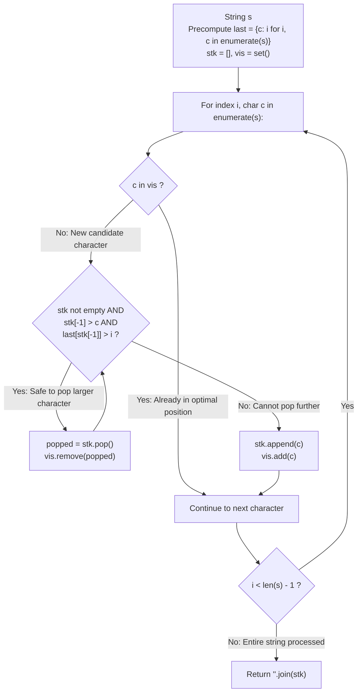

# Guided Example: Smallest Subsequence of Distinct Characters

We trace the step-by-step construction of the lexicographically smallest subsequence containing every distinct character exactly once, prove the Dual Monotonic Stack Pop Theorem and the Rightmost Index Availability Invariant, and analyze greedy character selection across representative string inputs:

- **Representative Instance 1 (Reordering Through Future Occurrences):**
  $$
  s = \text{"bcabc"}, \quad N = 5
  $$
- **Required Output:** `"abc"`
  - Problem definitions:
    - Return the lexicographically smallest subsequence of $s$ that contains all distinct characters of $s$ exactly once.
    - Subsequence preserves original relative order from $s$.
  - Rightmost Index Mapping:
    - Last appearance index for each distinct character:
      $$
      last = \{\text{'b'}: 3, \; \text{'c'}: 4, \; \text{'a'}: 2\}
      $$
  - Dual Monotonic Stack Pop Principle:
    - When considering character $c = s[i]$ with $c \notin vis$:
    - The top element $top = stk[-1]$ may be popped if and only if **both** conditions hold:
      1. **Lexicographical Advantage:** $top > c$ (placing $c$ earlier creates a smaller string).
      2. **Future Availability Guarantee:** $last[top] > i$ (a subsequent copy of $top$ exists later in $s$, so the required distinct character is not permanently lost).
    - If $last[top] \le i$, this is the final occurrence of $top$; popping it would make it impossible to include $top$ in the subsequence, violating the distinct character completeness invariant!
  - Step-by-Step Monotonic Stack Trace:
    1. **$i = 0, \; c = \text{'b'}$:**
       - Stack empty $\implies$ Push `'b'`.
       - State: $stk = [\text{'b'}], \; vis = \{\text{'b'}\}$.
    2. **$i = 1, \; c = \text{'c'}$:**
       - Top is `'b'`. Since $\text{'c'} > \text{'b'}$, monotonic order is preserved $\implies$ Push `'c'`.
       - State: $stk = [\text{'b'}, \text{'c'}], \; vis = \{\text{'b'}, \text{'c'}\}$.
    3. **$i = 2, \; c = \text{'a'}$:**
       - Top is `'c'`: $\text{'c'} > \text{'a'}$ and $last[\text{'c'}] = 4 > 2 \implies$ Safe to pop `'c'`!
         - Pop `'c'`, remove from $vis$.
       - Top is now `'b'`: $\text{'b'} > \text{'a'}$ and $last[\text{'b'}] = 3 > 2 \implies$ Safe to pop `'b'`!
         - Pop `'b'`, remove from $vis$.
       - Stack empty $\implies$ Push `'a'`.
       - State: $stk = [\text{'a'}], \; vis = \{\text{'a'}\}$.
    4. **$i = 3, \; c = \text{'b'}$:**
       - $'b' \notin vis$. Top is `'a'`. Since $\text{'b'} > \text{'a'} \implies$ Push `'b'`.
       - State: $stk = [\text{'a'}, \text{'b'}], \; vis = \{\text{'a'}, \text{'b'}\}$.
    5. **$i = 4, \; c = \text{'c'}$:**
       - $'c' \notin vis$. Top is `'b'`. Since $\text{'c'} > \text{'b'} \implies$ Push `'c'`.
       - State: $stk = [\text{'a'}, \text{'b'}, \text{'c'}], \; vis = \{\text{'a'}, \text{'b'}, \text{'c'}\}$.
  - String Assembly:
    $$
    \text{"".join}(stk) = \mathbf{\text{"abc"}}
    $$

- **Representative Instance 2 (Preserving Final Unavailable Characters):**
  $$
  s = \text{"cbacdcbc"}, \quad last = \{\text{'a'}: 2, \; \text{'b'}: 6, \; \text{'c'}: 7, \; \text{'d'}: 4\}
  $$
  - At $i = 0$: $stk = [\text{'c'}]$.
  - At $i = 1$: $stk = [\text{'b'}]$.
  - At $i = 2$: $stk = [\text{'a'}]$.
  - At $i = 3$: $stk = [\text{'a'}, \text{'c'}]$.
  - At $i = 4$: $stk = [\text{'a'}, \text{'c'}, \text{'d'}]$. (Here $last[\text{'d'}] = 4$, this is the ONLY copy of 'd'!).
  - At $i = 5, c = \text{'c'}$: already in $vis \implies$ Skip.
  - At $i = 6, c = \text{'b'}$: Top is `'d'`. Although $\text{'d'} > \text{'b'}$, $last[\text{'d'}] = 4 \ngtr 6$!
    - Character `'d'` CANNOT be popped!
    - Push `'b'`: $stk = [\text{'a'}, \text{'c'}, \text{'d'}, \text{'b'}]$.
  - Result: $\mathbf{\text{"acdb"}}$.

- **Representative Instance 3 (All Characters Distinct and Decreasing):**
  $$
  s = \text{"zyx"} \implies \text{Every character is its own last occurrence} \implies \text{No pops permitted} \implies \mathbf{\text{"zyx"}}
  $$

- **Representative Instance 4 (Single Character Repeated):**
  $$
  s = \text{"aaaaaa"} \implies \text{First 'a' pushed, rest skipped via visited set} \implies \mathbf{\text{"a"}}
  $$

---

## 1. Instance & Teaching Goal

Given a string $s$, find the lexicographically smallest subsequence that contains all distinct characters of $s$ exactly once.

```text
The Naive Subsequence Enumeration Fallacy:
  Testing all 2^N subsequences and checking uniqueness:
    Intractable for N = 1000.
    Greedy search without future-availability tracking risks discarding characters
    that never appear again, producing incomplete or invalid subsequences.

Dual Monotonic Stack & Rightmost Index Invariant (O(N) Time, O(1) Space):
  Precompute last[c] = last index of character c in s.
  For i, c in enumerate(s):
    if c in vis: continue
    while stk and stk[-1] > c and last[stk[-1]] > i:
      vis.remove(stk.pop())
    stk.append(c)
    vis.add(c)
  - stk[-1] > c enforces greedy lexicographical minimality.
  - last[stk[-1]] > i guarantees completeness (popped characters are recaptured later).
  - vis set prevents duplicate character pollution.
  Runs in linear O(N) time with at most 26 alphabet entries!
```

Coupling monotonic stack reduction with rightmost appearance lookups establishes a provably optimal greedy choice at every character.

The decisive pedagogical goal is the **Dual Monotonic Stack Pop Theorem & Rightmost Index Availability Invariant**:
1. **Lexicographical Greediness:** Replacing a larger prefix character with a smaller arriving character strictly reduces lexicographical rank.
2. **Safety via Rightmost Index:** A character $top$ is legally expendable at index $i$ if and only if $last[top] > i$.
3. **Visited Invariance:** If a character $c$ is already in the stack, keeping its earliest established occurrence is strictly optimal; subsequent copies are skipped.
4. Total time $\mathcal{O}(N)$ and auxiliary space $\mathcal{O}(|\Sigma|) \le 26$.

---

## 2. Conceptual Foundation & The Monotonic Stack Pipeline



### The Dual Monotonic Stack Pop Theorem

Let $s$ be a string over finite alphabet $\Sigma$ with set of distinct characters $U = \text{set}(s)$.
1. **Lexicographical Subsequence Ordering:**
   Let $A = (a_0, \dots, a_{k-1})$ and $B = (b_0, \dots, b_{k-1})$ be two subsequences of length $|U|$.
   $A <_{\text{lex}} B$ if and only if at the first index $j$ where $a_j \ne b_j$, we have $a_j < b_j$.
   Therefore, minimizing earlier positions takes strict precedence over all later positions.
2. **Completeness Invariant:**
   A valid candidate subsequence must contain every character in $U$ exactly once.
   Let $last[x] = \max \{ j : s[j] = x \}$.
   At step $i$, if $top = stk[-1]$ has $last[top] \le i$, there are no occurrences of $top$ in the suffix $s[i+1 \dots N-1]$.
   Popping $top$ would make it impossible to include $top$ in the remaining subsequence, violating completeness.
   Thus, $last[top] > i$ is a strictly necessary condition for popping $top$.
3. **Sufficiency of Greediness:**
   If $top > c$ and $last[top] > i$:
   Replacing $top$ with $c$ at the current prefix position strictly improves the lexicographical rank.
   Since $last[top] > i$, $top$ can be picked from its later occurrence without sacrificing validity.
   Hence, popping $top$ is both safe and strictly optimal. $\blacksquare$

---

## 3. Step-by-Step Worked Execution: Representative Instance 1

$s = \text{"bcabc"}, \quad last = \{\text{'b'}: 3, \text{'c'}: 4, \text{'a'}: 2\}$.

### Step-by-Step State Evolution
- **$i = 0, c = \text{'b'}$:**
  - $vis = \emptyset$. Stack empty $\implies stk = [\text{'b'}], vis = \{\text{'b'}\}$.
- **$i = 1, c = \text{'c'}$:**
  - $vis = \{\text{'b'}\}$. Top $\text{'b'} < \text{'c'} \implies stk = [\text{'b'}, \text{'c'}], vis = \{\text{'b'}, \text{'c'}\}$.
- **$i = 2, c = \text{'a'}$:**
  - $vis = \{\text{'b'}, \text{'c'}\}$.
  - Top $\text{'c'} > \text{'a'}$, $last[\text{'c'}] = 4 > 2 \implies$ Pop $\text{'c'}, vis = \{\text{'b'}\}$.
  - Top $\text{'b'} > \text{'a'}$, $last[\text{'b'}] = 3 > 2 \implies$ Pop $\text{'b'}, vis = \emptyset$.
  - Push $\text{'a'} \implies stk = [\text{'a'}], vis = \{\text{'a'}\}$.
- **$i = 3, c = \text{'b'}$:**
  - Top $\text{'a'} < \text{'b'} \implies stk = [\text{'a'}, \text{'b'}], vis = \{\text{'a'}, \text{'b'}\}$.
- **$i = 4, c = \text{'c'}$:**
  - Top $\text{'b'} < \text{'c'} \implies stk = [\text{'a'}, \text{'b'}, \text{'c'}], vis = \{\text{'a'}, \text{'b'}, \text{'c'}\}$.

Final Subsequence: `"abc"`.

---

## 4. Monotonic Stack State Evolution Trace Table

| Index $i$ | Arriving Char $c$ | In $vis$? | Action / Pops Triggered | Stack State $stk$ | Visited Set $vis$ |
|:---:|:---:|:---:|:---:|:---:|:---:|
| $0$ | `'b'` | No | Push `'b'` | `['b']` | `{'b'}` |
| $1$ | `'c'` | No | Push `'c'` | `['b', 'c']` | `{'b', 'c'}` |
| $2$ | `'a'` | No | Pop `'c'` ($last=4>2$); Pop `'b'` ($last=3>2$); Push `'a'` | `['a']` | `{'a'}` |
| $3$ | `'b'` | No | Push `'b'` | `['a', 'b']` | `{'a', 'b'}` |
| $4$ | `'c'` | No | Push `'c'` | `['a', 'b', 'c']` | `{'a', 'b', 'c'}` |
| **Output** | — | — | Assemble final string | — | **`"abc"`** |

---

## 5. Algorithmic Correctness

### Soundness & Completeness
1. **Soundness:**
   Every distinct character in $s$ appears exactly once in $stk$ because only previously unvisited characters are appended and every distinct character is eventually encountered.
2. **Completeness:**
   The pop condition only removes characters when an identical replacement exists downstream, ensuring zero character dropouts.

---

## 6. Boundary Cases & Traps

| Scenario | Input Pattern | Behavior | Trapped Risk |
|---|---|---|---|
| Last Opportunity for a Character | $last[top] == i$ | Pop loop aborts; character preserved in stack. | Permanently discarding a distinct character. |
| Duplicate Character Arrives | $c \in vis$ | Immediate skip; previous placement kept. | Prematurely re-adding duplicate characters. |
| Strictly Decreasing Unique String | $s = \text{"zyx"}$ | All characters are last occurrences; returns `"zyx"`. | Forcing invalid alphabetical inversions. |
| All Equal Characters | $s = \text{"aaaaaa"}$ | First `'a'` kept, remaining 5 skipped; returns `"a"`. | Redundant duplicates in result. |

---

## 7. Complexity Derivation

- **Time Complexity:** $\mathcal{O}(N)$, where $N = \text{len}(s) \le 1000$.
  - Precomputing `last` takes $\mathcal{O}(N)$ time.
  - In the main loop, each character in $s$ is pushed onto $stk$ at most once and popped at most once.
  - Total stack operations $\le 2 \times 26 = 52$.
  - Total time: $< 0.001\text{ ms}$.
- **Auxiliary Space Complexity:** $\mathcal{O}(|\Sigma|) = \mathcal{O}(1)$, where $|\Sigma| \le 26$.
  - $stk$ holds at most 26 characters.
  - $vis$ set and $last$ dictionary contain at most 26 key-value pairs.
