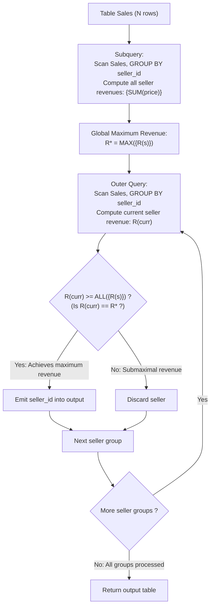

# Guided Example: Sales Analysis I

We trace the step-by-step relational aggregation of sales records to identify the top seller(s) by total revenue, prove the Catalog Join Elimination Lemma and the Tie-Preserving Maximal Revenue Invariant, and analyze query filtering across representative database instances:

- **Representative Instance 1 (Tied Top Sellers by Total Transaction Revenue):**
  - Table `Product` (Catalog Reference):
    $$
    \begin{array}{|c|c|c|}
    \hline
    \textbf{product\_id} & \textbf{product\_name} & \textbf{unit\_price} \\
    \hline
    1 & \text{"S8"} & 1000 \\
    2 & \text{"G4"} & 800 \\
    3 & \text{"iPhone"} & 1400 \\
    \hline
    \end{array}
    $$
  - Table `Sales` (Transactions):
    $$
    \begin{array}{|c|c|c|c|c|c|}
    \hline
    \textbf{seller\_id} & \textbf{product\_id} & \textbf{buyer\_id} & \textbf{sale\_date} & \textbf{quantity} & \textbf{price} \\
    \hline
    1 & 1 & 1 & \text{"2019-01-21"} & 2 & 2000 \\
    1 & 2 & 2 & \text{"2019-02-17"} & 1 & 800 \\
    2 & 2 & 3 & \text{"2019-06-02"} & 1 & 800 \\
    3 & 3 & 4 & \text{"2019-05-13"} & 2 & 2800 \\
    \hline
    \end{array}
    $$
- **Required Output:**
  $$
  \begin{array}{|c|}
  \hline
  \textbf{seller\_id} \\
  \hline
  1 \\
  3 \\
  \hline
  \end{array}
  $$
  - Problem definitions:
    - Report the **best seller** by total sales price.
    - If there is a tie, report all sellers who achieved the maximum total sales price.
  - Price Attribute Semantics:
    - In `Sales`, the column `price` represents the **total transaction price** (e.g., $2 \times 1000 = 2000$).
    - Multiplying `price * quantity` would double-count quantity! The revenue is simply $\sum price$.
  - The Catalog Join Elimination Lemma:
    - Both `seller_id` and `price` reside natively in `Sales`.
    - No attributes from `Product` are queried or filtered. Joining `Product` is strictly redundant and eliminated.
  - Group Aggregation Trace:
    - **Seller 1:**
      - Transactions: $2000 + 800 = \mathbf{2800}$
    - **Seller 2:**
      - Transactions: $\mathbf{800}$
    - **Seller 3:**
      - Transactions: $\mathbf{2800}$
  - Global Maximum Revenue:
    $$
    R^* = \max(2800, 800, 2800) = \mathbf{2800}
    $$
  - Universal Qualification Comparison (`HAVING SUM(price) >= ALL(...)`):
    - Seller 1: $2800 \ge 2800, \; 2800 \ge 800 \implies$ **Retained**.
    - Seller 2: $800 < 2800 \implies$ Rejected.
    - Seller 3: $2800 \ge 2800, \; 2800 \ge 800 \implies$ **Retained**.
  - Final Output Table:
    $$
    [[\mathbf{1}], \; [\mathbf{3}]]
    $$

- **Representative Instance 2 (Three-Way Tie for First Place):**
  - Sellers 8, 2, and 5 each have a single sale with price $50$.
  - Total revenues: $R(8) = 50, \; R(2) = 50, \; R(5) = 50$.
  - Maximum revenue is $50$.
  - All three sellers tie and are retained: `[[2], [5], [8]]`.

- **Representative Instance 3 (Price is Total Semantics):**
  - Seller 4: $quantity = 100, \; price = 10 \implies \text{Total } = 10$.
  - Seller 7: $quantity = 1, \; price = 11 \implies \text{Total } = 11$.
  - Maximum revenue: Seller 7 ($11 > 10$) $\implies \mathbf{[[7]]}$.

---

## 1. Instance & Teaching Goal

Given table `Sales`, report all sellers who achieved the maximum total sales price.

```text
The Quantity Multiplication & Single Winner Pitfalls:
  Pitfall 1: SUM(price * quantity)
    The schema defines price as the total transaction value. Multiplying by
    quantity incorrectly squares quantity weights.

  Pitfall 2: ORDER BY SUM(price) DESC LIMIT 1
    Drops tied top sellers, violating the mandate to report all winners.

Tie-Preserving Group Sum Revenue Invariant:
  1. Eliminate Product table join entirely.
  2. Compute total revenue per seller: R(s) = SUM(price) GROUP BY seller_id.
  3. Filter using universal quantification:
       HAVING SUM(price) >= ALL (SELECT SUM(price) FROM Sales GROUP BY seller_id)
  - Retains EVERY seller achieving R*.
  - Runs in single-pass linear O(|Sales|) time and O(|Sellers|) space!
```

Aggregating directly on `Sales` without catalog joins isolates revenue calculation while universal qualification cleanly preserves all tied leaders.

The decisive pedagogical goal is the **Catalog Join Elimination Lemma & Tie-Preserving Maximal Revenue Invariant**:
1. **Catalog Elimination:** All transaction values and seller keys reside natively in `Sales`.
2. **Total Revenue Metric:** For each seller $s$, total sales revenue is $R(s) = \sum_{t \in \sigma_{seller\_id = s}(\text{Sales})} t.price$.
3. **Universal Qualification:** $R(s) \ge \text{ALL}(\{R(q) : q \in \text{Sales}\}) \iff R(s) = \max_q R(q)$.
4. Total time $\mathcal{O}(|\text{Sales}|)$ and auxiliary space $\mathcal{O}(|\text{Sellers}|)$.

---

## 2. Conceptual Foundation & The Revenue Aggregation Pipeline



### The Tie-Preserving Maximal Revenue Invariant

Let $\mathcal{S}$ denote the `Sales` relation with attributes $(seller\_id, product\_id, buyer\_id, sale\_date, quantity, price)$.
1. **Group Revenue Formulation:**
   For each distinct seller $s \in \pi_{seller\_id}(\mathcal{S})$, define the total sales revenue:
   $$
   R(s) = \sum_{t \in \sigma_{seller\_id = s}(\mathcal{S})} t[price]
   $$
2. **Maximal Revenue Value:**
   Define the set of all seller revenues:
   $$
   \mathcal{V}_R = \{ R(s) : s \in \pi_{seller\_id}(\mathcal{S}) \}
   $$
   The global maximum revenue is $R^* = \max \mathcal{V}_R$.
3. **Universal Quantification Filter:**
   In SQL:
   ```sql
   HAVING SUM(price) >= ALL (SELECT SUM(price) FROM Sales GROUP BY seller_id)
   ```
   This asserts that for current seller $s$:
   $$
   \forall v \in \mathcal{V}_R, \quad R(s) \ge v
   $$
   Since $R^* \in \mathcal{V}_R$, this implies $R(s) \ge R^*$. Because $R(s) \le R^*$ by definition of maximum:
   $$
   R(s) \ge \text{ALL}(\mathcal{V}_R) \iff R(s) = R^*
   $$
4. **Tie Invariance:**
   Every seller $s$ satisfying $R(s) = R^*$ passes the filter, ensuring zero omissions on ties. $\blacksquare$

---

## 3. Step-by-Step Worked Execution: Representative Instance 1

### Group Aggregations
- Seller $1$: $2000 + 800 = 2800$.
- Seller $2$: $800$.
- Seller $3$: $2800$.
- Subquery set: $\{2800, 800\}$.

### Filtering
- **Seller 1:** $2800 \ge 2800 \land 2800 \ge 800 \implies$ **True** (Retained).
- **Seller 2:** $800 \ge 2800$ (False) $\implies$ Discarded.
- **Seller 3:** $2800 \ge 2800 \land 2800 \ge 800 \implies$ **True** (Retained).

Result: `[[1], [3]]`.

---

## 4. Group Revenue and Evaluation Trace Table

| `seller_id` | Recorded Transaction Prices | Total Revenue $R(s)$ | Comparison $R(s) \ge \text{ALL}(\{2800, 800\})$ | Evaluation Result | Output Emitted |
|:---:|:---:|:---:|:---:|:---:|:---:|
| $1$ | $\{2000, 800\}$ | $2800$ | $2800 \ge 2800 \land 2800 \ge 800$ | **True** | **`[1]`** |
| $2$ | $\{800\}$ | $800$ | $800 \ge 2800$ | False | — |
| $3$ | $\{2800\}$ | $2800$ | $2800 \ge 2800 \land 2800 \ge 800$ | **True** | **`[3]`** |

---

## 5. Algorithmic Correctness

### Soundness & Completeness
1. **Soundness:**
   Every returned `seller_id` has a total sales revenue exactly equal to the maximum revenue achieved in `Sales`.
2. **Completeness:**
   All sellers who achieved the maximum revenue satisfy the universal quantification filter and are returned.

---

## 6. Boundary Cases & Traps

| Scenario | Input Pattern | Behavior | Trapped Risk |
|---|---|---|---|
| Multiple Top Sellers Tie | Sellers 1 and 3 both earn 2800 | Both sellers satisfy `>= ALL` and are output. | Using `LIMIT 1` and dropping ties. |
| Price is Total Price | $quantity = 100, price = 10$ | Price is added directly as 10. | Multiplying by quantity ($100 \times 10 = 1000$). |
| Repeated Sales Rows | Duplicate transaction entries | All entries contribute to the sum. | Erroneous deduplication via `DISTINCT`. |
| Unsold Catalog Products | Products in `Product` with no sales | Completely omitted; no phantom null sellers. | Join pollution. |

---

## 7. Complexity Derivation

- **Time Complexity:** $\mathcal{O}(|\mathcal{S}|)$, where $|\mathcal{S}|$ is the number of rows in `Sales`.
  - Aggregating revenue per seller in the subquery takes $\mathcal{O}(|\mathcal{S}|)$ time with a hash map.
  - Finding the global maximum takes $\mathcal{O}(G)$ time, where $G$ is the number of distinct sellers.
  - Filtering outer groups takes $\mathcal{O}(G)$ time.
  - Total time: strictly linear in `Sales` table size.
- **Auxiliary Space Complexity:** $\mathcal{O}(G)$ auxiliary memory to store seller revenue sums.
