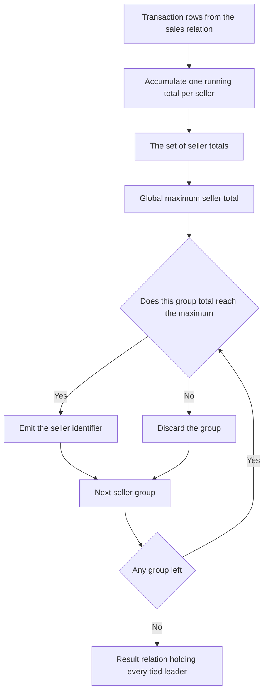

# Guided Example: Sales Analysis I

We aggregate one sales relation into per-seller revenue totals, and show that the requirement to return *every* tied leader is exactly a universal quantification over those totals — not a truncation of a ranking.

**Representative instance (the official sample).** Two relations are involved. The catalog describes each product:

| `product_id` | `product_name` | `unit_price` |
|:---:|:---:|:---:|
| $1$ | `S8` | $1000$ |
| $2$ | `G4` | $800$ |
| $3$ | `iPhone` | $1400$ |

and `Sales` records four transactions:

| `seller_id` | `product_id` | `buyer_id` | `sale_date` | `quantity` | `price` |
|:---:|:---:|:---:|:---:|:---:|:---:|
| $1$ | $1$ | $1$ | `2019-01-21` | $2$ | $2000$ |
| $1$ | $2$ | $2$ | `2019-02-17` | $1$ | $800$ |
| $2$ | $2$ | $3$ | `2019-06-02` | $1$ | $800$ |
| $3$ | $3$ | $4$ | `2019-05-13` | $2$ | $2800$ |

**Required outcome.** The single column `seller_id`, holding every best seller:

| `seller_id` |
|:---:|
| $1$ |
| $3$ |

The sample's own arithmetic fixes the metric. The row with `quantity = 2` has `price = 2000`, which is $2 \times 1000$ — the recorded `price` is the total for the whole sale, not a per-unit figure. Revenue is therefore a plain sum of the stored values, and `quantity` must not appear in it. The concrete statement belongs to the Reference workflow; this lesson derives the reasoning.

---

## 1. The Revenue Aggregate and the Tie-Inclusive Contract

Let $\mathcal{S}$ be the `Sales` relation with attributes $(seller\_id, product\_id, buyer\_id, sale\_date, quantity, price)$. For a seller $s$, define the group of that seller's transactions by a selection on the grouping key:

$$
\mathcal{S}_s = \sigma_{seller\_id = s}(\mathcal{S}),
$$

and define the seller's total revenue as the sum of the recorded prices in that group:

$$
R(s) = \sum_{t \in \mathcal{S}_s} t[price].
$$

The set of sellers is $\Pi = \pi_{seller\_id}(\mathcal{S})$, and the maximum revenue actually achieved is

$$
R^\star = \max_{s \in \Pi} R(s).
$$

The contract asks for

$$
\{\, s \in \Pi : R(s) = R^\star \,\},
$$

which is the whole maximiser set, not one representative of it. The difference matters here, because the sample itself is a tie: two different sellers reach the same total.

| Seller $s$ | Transactions $t[price]$ | $R(s)$ | Tied for maximum? |
|:---:|:---|:---:|:---:|
| $1$ | $2000 + 800$ | $2800$ | **Yes** |
| $2$ | $800$ | $800$ | No |
| $3$ | $2800$ | $2800$ | **Yes** |

Three properties of the aggregate deserve to be stated explicitly, because each one is a trap if violated.

- **Additivity over rows.** $R$ sums *rows*, so a seller with several transactions accumulates several terms. Repeated identical rows are permitted in this schema and each stored row contributes separately; collapsing them would understate the total.
- **No quantity factor.** Because `price` already covers the whole sale, the metric is $\sum t[price]$ and not $\sum t[price] \cdot t[quantity]$. Multiplying would weight the $2000$ row as $4000$ and change the winner in other instances.
- **Tie preservation.** The output set is defined by an equality against the maximum, so its cardinality is the number of sellers attaining $R^\star$; it may be one, several, or — if all sellers coincide in revenue — all of them.

---

## 2. Join Elimination: Why the Catalog Is Never Needed

The natural first instinct is to join `Sales` to the catalog on `product_id`. That join is unnecessary here, and it is worth proving why rather than simply omitting it.

Every attribute the answer touches lives in `Sales`: the grouping key `seller_id` and the summed attribute `price`. No predicate in the problem references `product_name` or `unit_price`, and the projection returns only `seller_id`. Formally, the requested result depends on $\mathcal{S}$ alone:

$$
\pi_{seller\_id}\Bigl(\text{group}_{seller\_id,\ \text{sum}(price)}(\mathcal{S})\Bigr).
$$

The join would also be *row-preserving*, which is what makes its removal safe rather than merely convenient: `product_id` is the primary key of the catalog, so each `Sales` row matches **at most one** catalog row. The equi-join therefore cannot duplicate a transaction, cannot inflate a sum, and cannot drop a transaction. Since it also contributes nothing that is projected, grouped, or filtered, it is a genuine join-elimination case: the redundant operand contributes no attribute that survives the projection.

| Attribute | Native relation | Needed by the answer? | Consequence |
|:---|:---:|:---:|:---|
| `seller_id` | `Sales` | Yes — grouping key and output column | Cannot be resolved from the catalog |
| `price` | `Sales` | Yes — the summed metric | Must be summed from `Sales` directly |
| `quantity` | `Sales` | No | Present, but must **not** multiply `price` |
| `product_id` | `Sales` | No | Link to the catalog, unused here |
| `buyer_id`, `sale_date` | `Sales` | No | Do not affect the total |
| `product_name`, `unit_price` | catalog | No | Only reachable by the eliminated join |

Note the dependence of the argument on a schema fact: if the catalog were permitted to contain several rows per `product_id`, the join would no longer be row-preserving and could multiply `Sales` rows, inflating every sum. The primary-key guarantee is exactly what licenses dropping it.

---

## 3. Universal Quantification Is Exactly Maximisation

The tie-inclusive requirement is naturally written as a **universal test** over the multiset of group totals

$$
\mathcal{V}_R = \{\, R(s) : s \in \Pi \,\},
$$

namely: keep seller $s$ when its total is not less than *any* element of $\mathcal{V}_R$.

> **Equivalence lemma.** For every $s \in \Pi$, $\ R(s) \ge v$ for all $v \in \mathcal{V}_R \iff R(s) = R^\star$.

*Proof.*

- ($\Rightarrow$) The maximum $R^\star$ is attained by some seller in $\Pi$, so $R^\star \in \mathcal{V}_R$. The hypothesis applied to $v = R^\star$ gives $R(s) \ge R^\star$. On the other hand $R^\star$ is an upper bound for $\mathcal{V}_R$, so $R(s) \le R^\star$. Antisymmetry of $\le$ on the integers forces $R(s) = R^\star$.
- ($\Leftarrow$) If $R(s) = R^\star$, then for any $v \in \mathcal{V}_R$ we have $v \le R^\star = R(s)$, so $R(s) \ge v$.

$\blacksquare$

The lemma has a practical consequence: a single grouped pass that compares each total against the global maximum is *equivalent* to comparing it against every total. The universal form is conceptually transparent and tie-inclusive by construction, and it makes the failure of the truncating alternative obvious: keeping only one row of a total-order ranking discards other members of an equivalence class that the contract requires.

| Seller $s$ | $R(s)$ | Compare against $2800$ | Compare against $800$ | $\ge$ all of $\mathcal{V}_R$? | Emitted |
|:---:|:---:|:---:|:---:|:---:|:---:|
| $1$ | $2800$ | $2800 \ge 2800$ ✓ | $2800 \ge 800$ ✓ | **Yes** | `[1]` |
| $2$ | $800$ | $800 \ge 2800$ ✗ | — | No | — |
| $3$ | $2800$ | $2800 \ge 2800$ ✓ | $2800 \ge 800$ ✓ | **Yes** | `[3]` |

---

## 4. Worked Trace of the Instance

Grouping by `seller_id` partitions the four transaction rows into three groups and accumulates each group's total:

| Step | Row processed `(seller_id, price)` | Accumulator before | Accumulator after | Groups seen so far |
|:---:|:---|:---:|:---:|:---|
| 1 | $(1, 2000)$ | — | $R(1) = 2000$ | $\{1\}$ |
| 2 | $(1, 800)$ | $R(1) = 2000$ | $R(1) = 2800$ | $\{1\}$ |
| 3 | $(2, 800)$ | — | $R(2) = 800$ | $\{1, 2\}$ |
| 4 | $(3, 2800)$ | — | $R(3) = 2800$ | $\{1, 2, 3\}$ |

After the pass, $\mathcal{V}_R = \{2800, 800, 2800\}$ and $R^\star = 2800$. Applying the universal test to each group yields the tie-preserving answer:

| Seller $s$ | $R(s)$ | Universal test | Decision | Output after this group |
|:---:|:---:|:---|:---:|:---|
| $1$ | $2800$ | $2800 \ge 2800$ and $2800 \ge 800$ | Retained | `[[1]]` |
| $2$ | $800$ | $800 \ge 2800$ fails | Discarded | `[[1]]` |
| $3$ | $2800$ | $2800 \ge 2800$ and $2800 \ge 800$ | Retained | `[[1], [3]]` |

The output order happens to be ascending here, but the contract explicitly leaves the order unrestricted; only the *set* of returned sellers is compared.

---

## 5. Correctness of the Aggregation

**Soundness.** Suppose a seller $s$ is returned. The filter admits it only if its total is at least every element of $\mathcal{V}_R$; by the equivalence lemma of §3, $R(s) = R^\star$. Since $\mathcal{V}_R$ is built from exactly the sellers present in `Sales`, $s$ is genuinely a best seller by total sales price, and the single projected column matches the required schema.

**Completeness.** Suppose a seller $s$ attains $R^\star$. Then for every $v \in \mathcal{V}_R$ we have $v \le R^\star = R(s)$, so the universal test succeeds and $s$ is emitted. No maximiser can be omitted, so ties are returned in full — the property that a single-row truncation of a ranking would violate.

**Metric fidelity.** Each stored row contributes exactly its `price` once, and each group accumulates exactly the rows whose `seller_id` equals the group key. Consequently $R(s)$ equals the sum of prices of the transactions attributed to $s$: nothing is dropped, nothing is counted twice, `quantity` never multiplies, and duplicate rows each add their own term.

**Non-emptiness of the maximum.** If `Sales` is non-empty, then $\Pi \ne \varnothing$ and $\mathcal{V}_R$ is a non-empty finite multiset of integers, so $R^\star$ exists and at least one seller attains it: the answer is never empty for a non-empty input. If `Sales` is empty there are no groups at all, so no seller can pass the test and the result is correctly empty.

---

## 6. Boundary Cases and Alternatives

| Scenario | Input pattern | Correct behaviour | Trap it exposes |
|:---|:---|:---|:---|
| Tie for first place | Sellers $1$ and $3$ both total $2800$ | Both are returned | Reporting one arbitrary winner |
| Every seller ties | Three sellers each with a single sale priced $50$ | All three are returned | Treating the maximum as unique |
| Single seller | One seller only | That seller is returned | Requiring a comparison partner |
| Repeated identical rows | The same transaction stored twice | Both rows contribute; the total doubles for that seller | De-duplicating rows with a `DISTINCT`-style step |
| Whole-sale price semantics | `quantity = 100`, `price = 10` versus `quantity = 1`, `price = 11` | Totals are $10$ and $11$; the second seller wins | Multiplying by `quantity`, which would reverse the comparison to $1000$ versus $11$ |
| Unsold catalog products | Catalog entries with no transactions | Irrelevant: they are not sellers, and no group exists for them | Join pollution producing phantom or null sellers |
| Empty `Sales` | No transaction rows | Empty result | Emitting a null row instead of an empty relation |

Alternative formulations of the same decision, with their tradeoffs:

| Alternative | Mechanism | Tradeoff |
|:---|:---|:---|
| **Two grouped passes** | Compute every seller total, take the maximum, then keep groups equal to it | Correct and tie-inclusive; visits the data twice, but each pass is linear |
| **Universal comparison of totals** | Keep each group whose total is not less than every group total | Correct and tie-inclusive; needs the set of totals, and is the most explicit statement of the requirement |
| **Rank with a tie-aware rank** | Rank groups by total descending and keep rank $1$, where equal totals share a rank | Correct **only** if the ranking is tie-aware; a plain row-number ranking silently drops ties |
| **Sort descending with a single-row truncation** | Order groups by total and keep the first row | Rejected: discards tied leaders whenever ties exist, contradicting the contract |
| **Window maximum over the group totals** | Attach the global maximum to every group and compare | Correct and tie-inclusive; adds a window pass over the grouped rows |

---

## 7. Complexity Derivation

Let $N = \lvert \mathcal{S} \rvert$ be the number of transaction rows and let $G = \lvert \Pi \rvert$ be the number of distinct sellers, with $G \le N$.

**Time.** The aggregation visits each transaction row once and performs one expected-constant hash lookup plus one addition on its group's accumulator, so the grouping phase costs $\Theta(N)$. Computing $R^\star$ from the $G$ group totals costs $\Theta(G)$, and testing all $G$ groups against it costs $\Theta(G)$. Hence

$$
T(N, G) = \Theta(N) + \Theta(G) + \Theta(G) = \Theta(N + G) = \Theta(N),
$$

because $G \le N$. No sort, join, or nested re-scan is required; a sort-based equivalent would instead cost $\Theta(N \log N)$ for grouping alone, and the eliminated catalog join would have added $\Theta(\lvert Product \rvert)$ work while changing nothing about the answer.

**Auxiliary space.** The method holds one accumulator per distinct seller and one value for the running maximum:

$$
S_{\text{aux}} = \Theta(G),
$$

since each accumulator is a single integer. The returned relation is the required output, not auxiliary state, and it grows with the number of tied leaders. No copy of the sales relation is materialised, and the catalog is never loaded.