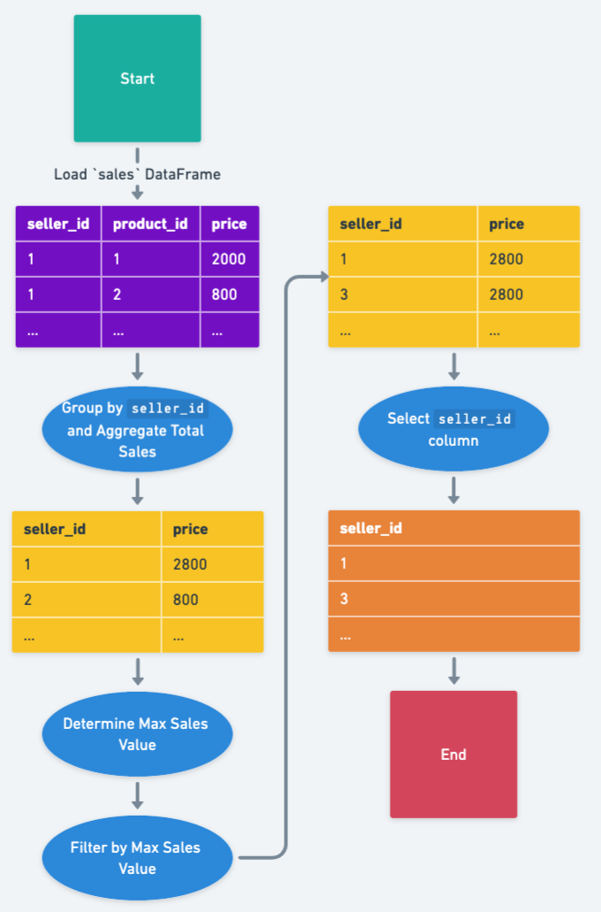

# Solution

---

### Overview

Given data on products and their respective sales across various sellers, the aim is to identify the top-selling individual or entities. The data is segmented into two tables: one detailing products and the other, their sales metrics.

---

## pandas
### Approach 1: Max Sales Filtering with Aggregation

#### Intuition

**Flowchart:**


Group data by $\text{seller}_{id}$ and sum their sales. Then, filter the sellers based on the maximum total sales price.

We'll break down the problem into a series of steps:

**Step 1 - Group by $\text{seller}_{id}$ and aggregate**:

We start by grouping the `sales` DataFrame by the $\text{seller}_{id}$ and then calculating the aggregation of the `price` column using the `sum` operation.

```python
aggregated_sales = sales.groupby('seller_id').agg({'price': 'sum'}).reset_index()
```

Input
<table>
  <tr>
    <th>seller_id</th>
    <th>product_id</th>
    <th>price</th>
  </tr>
  <tr>
    <td>1</td>
    <td>1</td>
    <td>2000</td>
  </tr>
  <tr>
    <td>1</td>
    <td>2</td>
    <td>800</td>
  </tr>
  <tr>
    <td>2</td>
    <td>2</td>
    <td>800</td>
  </tr>
  <tr>
    <td>3</td>
    <td>3</td>
    <td>2800</td>
  </tr>
</table>
<br>

After grouping and aggregation:

<table>
  <tr>
    <th>seller_id</th>
    <th>price</th>
  </tr>
  <tr>
    <td>1</td>
    <td>2800</td>
  </tr>
  <tr>
    <td>2</td>
    <td>800</td>
  </tr>
  <tr>
    <td>3</td>
    <td>2800</td>
  </tr>
</table>
<br>

**Step 2 - Filter Max Value**:

Once we have the total sales for each seller, we can then determine the highest sales amount. We then filter our aggregated DataFrame for sellers that have this maximum sales value.

```python
max_sales = aggregated_sales['price'].max()
best_sellers = aggregated_sales[aggregated_sales['price'] == max_sales]
```

Using the above table, we determine that the maximum sales value is 2800. Filtering by this amount, $\text{best}_{sellers}$ will now have:

<table>
  <tr>
    <th>seller_id</th>
    <th>price</th>
  </tr>
  <tr>
    <td>1</td>
    <td>2800</td>
  </tr>
  <tr>
    <td>3</td>
    <td>2800</td>
  </tr>
</table>
<br>

**Step 3 - Select Relevant Column**:

Lastly, we're only interested in the $\text{seller}_{id}$ column, so we can drop the `price` column to achieve our final result.

```python
result = best_sellers[['seller_id']]
```

Final Output:
<table>
  <tr>
    <th>seller_id</th>
  </tr>
  <tr>
    <td>1</td>
  </tr>
  <tr>
    <td>3</td>
  </tr>
</table>
<br>

#### Implementation

Based on the understanding above, the solution can be implemented as:

```python
import pandas as pd

def sales_analysis(product: pd.DataFrame, sales: pd.DataFrame) -> pd.DataFrame:
    # Calculate total sales price for each seller
    aggregated_sales = sales.groupby("seller_id").agg({"price": "sum"})

    # Filter the sellers with maximum total sales price
    best_sellers = aggregated_sales[
        aggregated_sales["price"] == aggregated_sales["price"].max()
    ].reset_index()

    return best_sellers[["seller_id"]]

```

<br>

---

## Database
### Approach 1: Max Sales Filtering with Aggregation

#### Intuition

First, calculate the total sales price for each seller. Then, identify the highest sales value. Finally, retrieve the seller(s) with the highest sales value.

Common Table Expressions can help in making the SQL cleaner and more modular. The approach remains the same - aggregate, identify the highest sales, and then retrieve the corresponding seller(s).

The idea is to:
1. **Aggregate**: Create a table with the sum of sales for each seller.
2. **Identify the Maximum**: Find the maximum sales value across all sellers.
3. **Filter:** Return the sellers who have sales equal to this maximum value.

We'll break down the problem into a series of steps:

**Step 1 - Create an Aggregated Sales Table:**

```sql
WITH aggregated_sales AS (
  SELECT
    seller_id,
    SUM(price) AS total_price
  FROM
    Sales
  GROUP BY
    seller_id
)
```

In this step, the $\text{aggregated}_{sales}$ table is created which contains the total sales ($\text{total}_{price}$) for each seller ($\text{seller}_{id}$). It's a representation of our sales table, but each seller is only represented once with their aggregated sales amount.

Input
<table>
  <tr>
    <th>seller_id</th>
    <th>product_id</th>
    <th>price</th>
  </tr>
  <tr>
    <td>1</td>
    <td>1</td>
    <td>2000</td>
  </tr>
  <tr>
    <td>1</td>
    <td>2</td>
    <td>800</td>
  </tr>
  <tr>
    <td>2</td>
    <td>2</td>
    <td>800</td>
  </tr>
  <tr>
    <td>3</td>
    <td>3</td>
    <td>2800</td>
  </tr>
</table>
<br>

Intermediate $\text{aggregated}_{sales}$ Table:
<table>
  <tr>
    <th>seller_id</th>
    <th>price</th>
  </tr>
  <tr>
    <td>1</td>
    <td>2800</td>
  </tr>
  <tr>
    <td>2</td>
    <td>800</td>
  </tr>
  <tr>
    <td>3</td>
    <td>2800</td>
  </tr>
</table>
<br>

**Step 2 - Identify the Maximum Sales Value:**

This step is embedded within the final query's WHERE clause:
```sql
SELECT
  MAX(total_price)
FROM
  aggregated_sales
```
Here, we're selecting the highest sales value ($\text{total}_{price}$) from the $\text{aggregated}_{sales}$ table. This subquery will return a single value, which is the maximum sales value (in our example, 2800).

**Step 3 - Filter Sellers Based on Maximum Sales Value:**

```sql
SELECT
  seller_id
FROM
  aggregated_sales
WHERE
  total_price = (
    SELECT
      MAX(total_price)
    FROM
      aggregated_sales
  );
```
This is the final selection step. Here, we're selecting all $\text{seller}_{ids}$ from the $\text{aggregated}_{sales}$ table that have a $\text{total}_{price}$ equal to the maximum sales value (which is determined by the subquery in the WHERE clause).

Final Output:

<table>
  <tr>
    <th>seller_id</th>
  </tr>
  <tr>
    <td>1</td>
  </tr>
  <tr>
    <td>3</td>
  </tr>
</table>
<br>

At each step of the SQL query, the data gets further refined until we get to our final desired result.

#### Implementation

Based on the understanding above, the solution can be implemented as:

```sql
WITH aggregated_sales AS (
  SELECT
    seller_id,
    SUM(price) AS total_price
  FROM
    Sales
  GROUP BY
    seller_id
)
SELECT
  seller_id
FROM
  aggregated_sales
WHERE
  total_price = (
    SELECT
      MAX(total_price)
    FROM
      aggregated_sales
  );
```