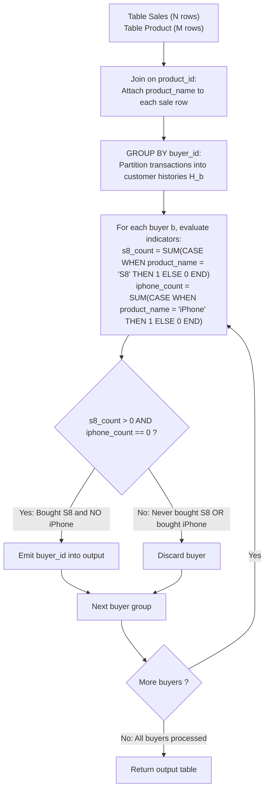

# Guided Example: Sales Analysis II

We trace the step-by-step relational filtering of buyer purchase histories using grouped indicator aggregation, prove the Grouped Inclusion-Exclusion Invariant and the Row-Filtering Inadequacy Lemma, and evaluate database queries across representative sales scenarios:

- **Representative Instance 1 (Disqualifying Buyers with iPhone Purchases):**
  - Table `Product` (Catalog):
    $$
    \begin{array}{|c|c|c|}
    \hline
    \textbf{product\_id} & \textbf{product\_name} & \textbf{unit\_price} \\
    \hline
    1 & \text{"S8"} & 1000 \\
    2 & \text{"G4"} & 800 \\
    3 & \text{"iPhone"} & 1400 \\
    \hline
    \end{array}
    $$
  - Table `Sales` (Purchase Transactions):
    $$
    \begin{array}{|c|c|c|c|c|c|}
    \hline
    \textbf{seller\_id} & \textbf{product\_id} & \textbf{buyer\_id} & \textbf{sale\_date} & \textbf{quantity} & \textbf{price} \\
    \hline
    1 & 1 & 1 & \text{"2019-01-21"} & 2 & 2000 \\
    1 & 2 & 2 & \text{"2019-02-17"} & 1 & 800 \\
    2 & 1 & 3 & \text{"2019-06-02"} & 1 & 800 \\
    3 & 3 & 3 & \text{"2019-05-13"} & 2 & 2800 \\
    \hline
    \end{array}
    $$
- **Required Output:**
  $$
  \begin{array}{|c|}
  \hline
  \textbf{buyer\_id} \\
  \hline
  1 \\
  \hline
  \end{array}
  $$
  - Problem definitions:
    - Report the buyers who have bought `S8` but **not** `iPhone`.
    - Return the resulting table in any order without duplicate buyer rows.
  - Natural Equi-Join ($\text{Sales} \bowtie_{\text{product\_id}} \text{Product}$):
    - Row 1: $(buyer\_id=1, product\_name=\text{"S8"})$
    - Row 2: $(buyer\_id=2, product\_name=\text{"G4"})$
    - Row 3: $(buyer\_id=3, product\_name=\text{"S8"})$
    - Row 4: $(buyer\_id=3, product\_name=\text{"iPhone"})$
  - Grouped Indicator Evaluation per Buyer:
    - **Buyer 1:**
      - Purchase History: $\{\text{"S8"}\}$
      - $N_{\text{S8}} = 1 > 0$ and $N_{\text{iPhone}} = 0 \implies$ **Qualified!**
    - **Buyer 2:**
      - Purchase History: $\{\text{"G4"}\}$
      - $N_{\text{S8}} = 0 \implies$ Disqualified (never bought S8).
    - **Buyer 3:**
      - Purchase History: $\{\text{"S8"}, \text{"iPhone"}\}$
      - $N_{\text{S8}} = 1 > 0$, but $N_{\text{iPhone}} = 1 > 0 \implies$ **Disqualified!** (Purchased an iPhone).
  - Final Output Table:
    $$
    [[\mathbf{1}]]
    $$

- **Representative Instance 2 (All S8 Buyers Disqualified by iPhone):**
  - Buyer 2 bought S8 on 2020-03-01 and iPhone on 2020-03-02.
  - $N_{\text{S8}} = 1$, but $N_{\text{iPhone}} = 1 \implies$ Disqualified.
  - Output: $\mathbf{[]}$ (empty table).

- **Representative Instance 3 (Multiple Purchases of S8):**
  - Buyer 4 bought S8 twice in two separate transactions.
  - $N_{\text{S8}} = 2 > 0$ and $N_{\text{iPhone}} = 0$.
  - Result contains Buyer 4 exactly once: $\mathbf{[[4]]}$.

- **Representative Instance 4 (Purchases of Other Products Allowed):**
  - Buyer 8 bought S8 and "Other".
  - $N_{\text{S8}} = 1 > 0$ and $N_{\text{iPhone}} = 0$.
  - "Other" products do not disqualify $\implies \mathbf{[[8]]}$.

---

## 1. Instance & Teaching Goal

Given tables `Sales` and `Product`, report all buyers who purchased at least one `S8` and zero `iPhone` products.

```text
The Row-Level Filtering Fallacy:
  Using a WHERE clause:
    SELECT DISTINCT buyer_id FROM Sales JOIN Product USING (product_id)
    WHERE product_name = 'S8' AND product_name != 'iPhone';
  FAILS COMPLETELY!
    If Buyer 3 buys S8 on Monday and iPhone on Tuesday, the Monday row matches
    (product_name == 'S8' and product_name != 'iPhone'), incorrectly returning Buyer 3!

Grouped Inclusion-Exclusion Invariant (O(|Sales| + |Product|) Time):
  1. Join Sales with Product on product_id to resolve product_name.
  2. Group by buyer_id to form each buyer's complete purchase history.
  3. Filter via HAVING:
       SUM(CASE WHEN product_name = 'S8' THEN 1 ELSE 0 END) > 0
       AND
       SUM(CASE WHEN product_name = 'iPhone' THEN 1 ELSE 0 END) = 0
  - Condition 1 ensures presence of S8 in buyer's lifetime transactions.
  - Condition 2 ensures absolute absence of iPhone across all buyer transactions!
  Runs in linear time with zero duplicate outputs.
```

Evaluating product existence conditions at the group level rather than the row level enables collective historical validation across multi-transaction accounts.

The decisive pedagogical goal is the **Grouped Inclusion-Exclusion Invariant & Row-Filtering Inadequacy Lemma**:
1. **History Partitioning:** Grouping by `buyer_id` aggregates all transaction rows belonging to that customer into a single cohort $\mathcal{H}_b$.
2. **Universal Indicator Sums:** $\sum \mathbb{I}(product\_name = \text{'S8'}) > 0$ asserts existential presence; $\sum \mathbb{I}(product\_name = \text{'iPhone'}) = 0$ asserts universal absence.
3. **Deduplication Invariance:** Grouping naturally produces at most one output row per customer, naturally handling repeated purchases without `SELECT DISTINCT`.
4. Total time $\mathcal{O}(|\text{Sales}| + |\text{Product}|)$ and auxiliary space $\mathcal{O}(|\text{Product}| + |\text{Buyers}|)$.

---

## 2. Conceptual Foundation & The Inclusion-Exclusion Pipeline



### The Grouped Inclusion-Exclusion Invariant

Let $\mathcal{S}$ denote `Sales` and $\mathcal{P}$ denote `Product`.
1. **Joined Purchase Relation:**
   Consider $\mathcal{J} = \mathcal{S} \bowtie_{\mathcal{S}.product\_id = \mathcal{P}.product\_id} \mathcal{P}$.
   For each customer $b \in \pi_{buyer\_id}(\mathcal{J})$, let:
   $$
   \mathcal{H}_b = \{ t \in \mathcal{J} : t[buyer\_id] = b \}
   $$
   denote customer $b$'s complete transaction history.
2. **Product Set Mapping:**
   Define the set of all distinct products purchased by customer $b$:
   $$
   \Pi(b) = \{ t[product\_name] : t \in \mathcal{H}_b \}
   $$
   The problem condition requires that:
   $$
   \text{"S8"} \in \Pi(b) \quad \land \quad \text{"iPhone"} \notin \Pi(b)
   $$
3. **Indicator Arithmetic Equivalence:**
   Using conditional indicator summation:
   $$
   N_{\text{S8}}(b) = \sum_{t \in \mathcal{H}_b} \mathbb{I}(t[product\_name] = \text{"S8"}) \ge 1 \iff \text{"S8"} \in \Pi(b)
   $$
   $$
   N_{\text{iPhone}}(b) = \sum_{t \in \mathcal{H}_b} \mathbb{I}(t[product\_name] = \text{"iPhone"}) = 0 \iff \text{"iPhone"} \notin \Pi(b)
   $$
   Therefore, the SQL clause:
   ```sql
   HAVING SUM(CASE WHEN product_name = 'S8' THEN 1 ELSE 0 END) > 0
      AND SUM(CASE WHEN product_name = 'iPhone' THEN 1 ELSE 0 END) = 0
   ```
   holds if and only if customer $b$ bought at least one S8 and zero iPhones. $\blacksquare$

---

## 3. Step-by-Step Worked Execution: Representative Instance 1

### Joined Tuples
- $b=1: \text{"S8"}$
- $b=2: \text{"G4"}$
- $b=3: \text{"S8"}$
- $b=3: \text{"iPhone"}$

### Group Aggregation Evaluation
- **Buyer 1:**
  - $N_{\text{S8}} = 1$, $N_{\text{iPhone}} = 0$.
  - Condition: $1 > 0 \land 0 = 0 \implies$ **True** (Retained).
- **Buyer 2:**
  - $N_{\text{S8}} = 0$, $N_{\text{iPhone}} = 0$.
  - Condition: $0 > 0$ (False) $\implies$ Discarded.
- **Buyer 3:**
  - $N_{\text{S8}} = 1$, $N_{\text{iPhone}} = 1$.
  - Condition: $1 > 0 \land 1 = 0$ (False) $\implies$ Discarded.

Output: `[[1]]`.

---

## 4. Buyer Transaction History Trace Table

| `buyer_id` | Products Purchased ($\Pi(b)$) | $N_{\text{S8}}(b)$ | $N_{\text{iPhone}}(b)$ | Filter Evaluation | Output Row |
|:---:|:---:|:---:|:---:|:---:|:---:|
| $1$ | $\{\text{"S8"}\}$ | $1$ | $0$ | **Pass** ($1 > 0 \land 0 = 0$) | **`[1]`** |
| $2$ | $\{\text{"G4"}\}$ | $0$ | $0$ | Fail ($0 \ngtr 0$) | — |
| $3$ | $\{\text{"S8"}, \text{"iPhone"}\}$ | $1$ | $1$ | Fail ($1 \ne 0$) | — |

---

## 5. Algorithmic Correctness

### Soundness & Completeness
1. **Soundness:**
   Every reported `buyer_id` has purchased an S8 and has never purchased an iPhone across their entire history.
2. **Completeness:**
   All customers whose history matches this exact criteria satisfy the `HAVING` predicate and are included.

---

## 6. Boundary Cases & Traps

| Scenario | Input Pattern | Behavior | Trapped Risk |
|---|---|---|---|
| Buyer Purchased Both S8 and iPhone | Separate transactions | $N_{\text{iPhone}} > 0 \implies$ buyer rejected. | `WHERE` clause per-row leakage. |
| Multiple S8 Purchases | Buyer bought S8 three times | $N_{\text{S8}} = 3 > 0 \implies$ buyer output once. | Output row duplication. |
| Other Products Purchased | Buyer bought S8 and Laptop | Laptop does not increment $N_{\text{iPhone}}$; buyer retained. | Over-aggressive exclusion. |
| iPhone-Only Buyer | Buyer only bought iPhone | $N_{\text{S8}} = 0 \implies$ buyer rejected. | False positives. |

---

## 7. Complexity Derivation

- **Time Complexity:** $\mathcal{O}(|\mathcal{S}| + |\mathcal{P}|)$, where $|\mathcal{S}|$ is the number of rows in `Sales` and $|\mathcal{P}|$ is the number of rows in `Product`.
  - Building a hash map over `Product` on `product_id` takes $\mathcal{O}(|\mathcal{P}|)$ time.
  - Scanning `Sales` and populating buyer indicator counts takes $\mathcal{O}(|\mathcal{S}|)$ time.
  - Filtering groups takes $\mathcal{O}(B)$ time where $B$ is the number of distinct buyers.
  - Total time: strictly linear in database input size.
- **Auxiliary Space Complexity:** $\mathcal{O}(|\mathcal{P}| + B)$ auxiliary memory for the product lookup table and buyer indicator accumulators.
